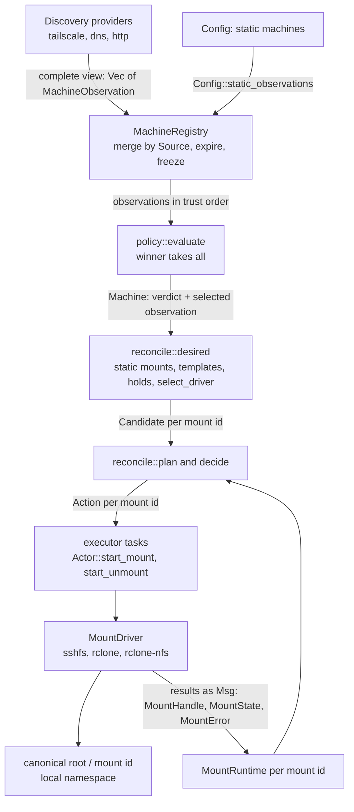
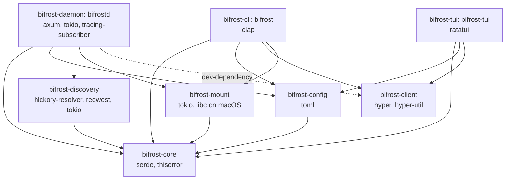
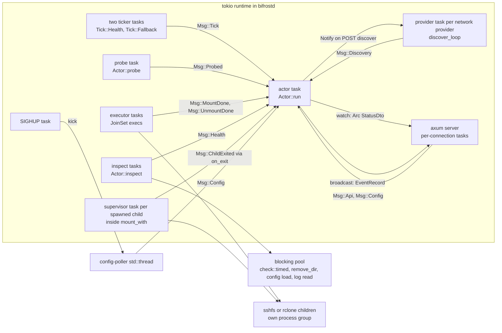
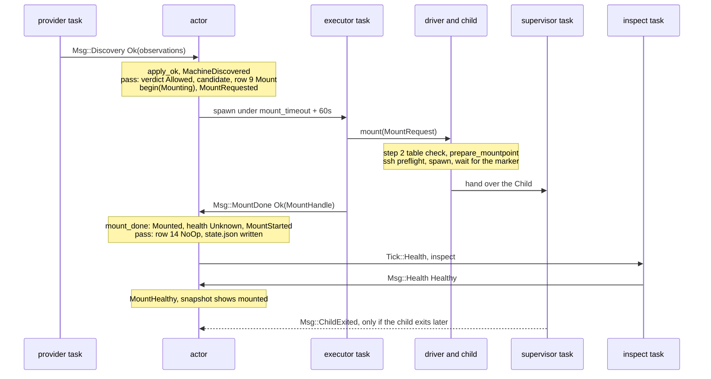
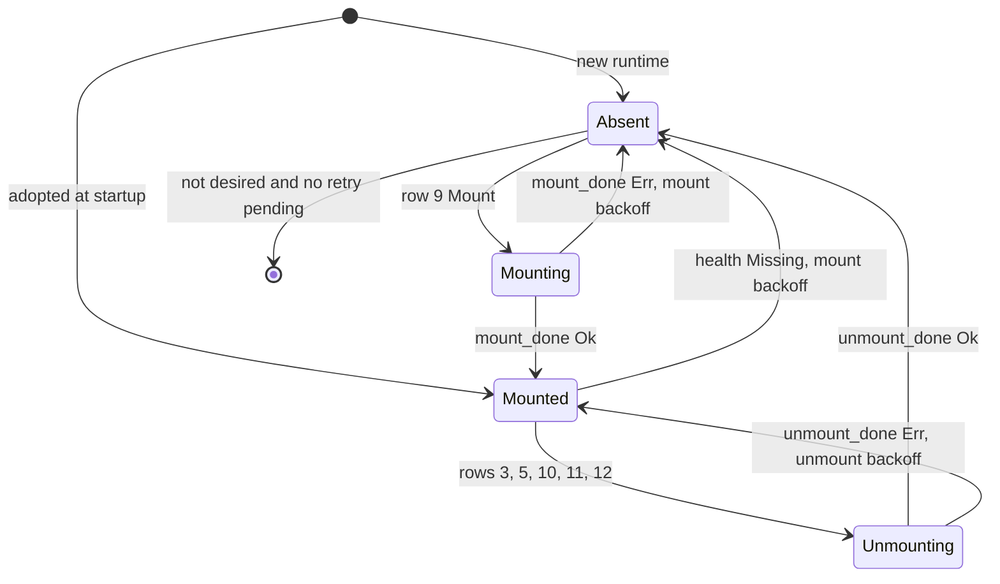

# Architecture

This guide describes Bifröst end to end: what the system is for, how data flows from discovery to a mounted
directory, which crate owns which part and why, which tasks and threads run inside `bifrostd` and how they talk,
the data model and its state machines, the daemon lifecycle (startup, adoption, warm-up, steady state, reload,
shutdown, crash), the local API, the files it keeps at runtime, and what differs between Linux and macOS. The code
is the source of truth. Where it differs from `docs/design/contract.md`, this guide follows the code and says so
([Where the code differs from the contract](#contract-vs-code)). Each crate has its own guide under
[crates/](crates/), and the reasons behind each choice are in [decisions.md](decisions.md).

## Contents

- [Goals and non-goals](#goals)
- [The pipeline](#pipeline)
- [Crates and their boundaries](#crates)
- [Process model](#process-model)
- [Message flow through one pass](#message-flow)
- [Data model](#data-model)
- [State machines](#state-machines): [mount phase](#mount-phase), [health](#health), [decision table](#decision-table), [availability](#availability)
- [Lifecycle](#lifecycle): [startup](#startup), [adoption](#adoption), [warm-up](#warm-up), [steady state](#steady-state), [reload](#reload), [shutdown](#shutdown), [crash and restart](#crash-restart)
- [Local API](#local-api)
- [Filesystem layout at runtime](#filesystem-layout)
- [Platform matrix](#platforms)
- [Where the code differs from the contract](#contract-vs-code)

<a id="goals"></a>
## Goals and non-goals

From the PRD (`bifrost_prd_and_implementation_plan.md` §1–§4, §33; the native-FUSE non-goal is §4 "Why Rust"):

| Goals | Non-goals |
|---|---|
| Remote files feel local: `~/machines/<id>/…` works with `cd`, `rg`, editors and `cp` | a VPN, a sync engine or an rsync replacement |
| No manual `scp`, SFTP remotes, remembered addresses or mount/unmount chores | a distributed filesystem or a native FUSE implementation (V1 orchestrates sshfs and rclone) |
| Several discovery mechanisms (static config, Tailscale, DNS TXT, HTTP inventory) | a replacement for Tailscale or SSH (it consumes connectivity that already exists) |
| Several mount mechanisms (sshfs, rclone FUSE, rclone NFS on macOS) | a remote shell manager, file versioning, cloud storage or a container orchestrator |
| Discovery and mounting are independent subsystems | |
| A continuous, idempotent reconcile of actual state towards desired state | |

The PRD §33 principles that the code enforces structurally:

| Principle | How the code holds it |
|---|---|
| Discovery never equals authorization | non-static machines are `DiscoverOnly` unless a rule allows them (`policy::evaluate`); only `Allowed` machines become candidates (`reconcile::desired`); `POST …/mount` returns 403 for anything else ([decisions.md#discover-is-not-mount](decisions.md#discover-is-not-mount)) |
| Drivers never know how machines were discovered, providers never know how filesystems are mounted | `bifrost-discovery` and `bifrost-mount` depend only on `bifrost-core`, never on each other; a driver sees a `MountSpec`, a provider emits `MachineObservation`s |
| The daemon owns lifecycle; CLI and TUI are clients | only `bifrostd` spawns mounts; `bifrost` and `bifrost-tui` talk to it over the Unix socket ([decisions.md#http-over-unix-socket](decisions.md#http-over-unix-socket)) |
| The core is independent of SSHFS, rclone, Tailscale and DNS | `bifrost-core` has no provider or driver names; kinds are strings with a numeric trust rank assigned in `bifrost-config` ([decisions.md#core-no-io](decisions.md#core-no-io)) |
| Reconciliation is idempotent | `reconcile::plan` is a pure function; every side-effect action changes the predicate that selected it (tests `plan_twice_second_all_noop`, `plan_is_deterministic`) ([decisions.md#pure-planner-decision-table](decisions.md#pure-planner-decision-table)) |

<a id="pipeline"></a>
## The pipeline



| Stage | What happens | Code |
|---|---|---|
| Discovery | Each network provider returns its **complete current view** or `Err` ("could not look"). A bad record is skipped with a warning, never an `Err`. Static machines are not a provider: every config apply replaces them in the registry | trait `DiscoveryProvider` (crates/bifrost-core/src/lib.rs); `TailscaleProvider`, `DnsProvider`, `HttpProvider` (crates/bifrost-discovery/src/); `Config::static_observations` (crates/bifrost-config/src/lib.rs) ([decisions.md#static-provider-is-config](decisions.md#static-provider-is-config)) |
| Registry | One entry per machine id holding one observation per `Source`. A successful refresh upserts with `expires_at = now + max(ttl, 3 × interval)`; absence never removes, it ages out; a failed refresh freezes that provider's observations | `MachineRegistry::{apply_ok, mark_failed, replace, remove_provider, expire, machines}` (crates/bifrost-core/src/registry.rs) |
| Policy | Drops observations excluded by their own provider's filter, selects the most trusted remaining one, and gives the machine a `Verdict` from it alone | `policy::evaluate` (crates/bifrost-core/src/policy.rs) ([decisions.md#winner-takes-all-trust](decisions.md#winner-takes-all-trust), [decisions.md#policy-semantics](decisions.md#policy-semantics)) |
| Desired mounts | For each `Allowed` machine: its static mounts (trust 0) or its provider's template, hints only with `honor_hints`, `local_path = root.join(id)`, a driver chosen from the probes, the hold flag | `reconcile::desired`, `reconcile::select_driver` (crates/bifrost-core/src/reconcile.rs) |
| Planner | One `Action` per id in candidates ∪ runtimes, from a 14-row first-match table | `reconcile::plan`, `reconcile::decide` ([decision table](#decision-table)) |
| Executor | `Mount`, `Unmount` and `Remount` start a task; everything else is only shown in status | `Actor::start_mount`, `Actor::start_unmount` (crates/bifrost-daemon/src/actor.rs) |
| Drivers | Preflight, spawn (`sshfs -f` stays a foreground child of the daemon, [decisions.md#sshfs-foreground-child](decisions.md#sshfs-foreground-child); rclone reaches hosts only through the system `ssh`, [decisions.md#rclone-via-system-ssh](decisions.md#rclone-via-system-ssh)), wait for the kernel mount table, supervise; inspect; unmount | trait `MountDriver` (crates/bifrost-core/src/lib.rs); `SshfsDriver`, `RcloneDriver`; shared `mount_with`, `inspect_path`, `unmount_path` (crates/bifrost-mount/src/lib.rs) |
| Local namespace | `<canonical mount.root>/<mount id>`, a directory the driver creates (0700) and removes when empty | `prepare_mountpoint` (crates/bifrost-mount/src/lib.rs); the `remove_dir` step in `Actor::start_unmount` |

Results flow back as messages and update the runtime through pure transitions (`MountRuntime::{mount_done,
unmount_done, health}`). The next pass recomputes everything from scratch; nothing is cached between passes
except the runtimes, the registry, the holds, the probe results and provider status.

<a id="crates"></a>
## Crates and their boundaries

Eight crates (contract §1: "Crates are split only for PRD layering or for dependencies"; [decisions.md#rust-and-8-crate-workspace](decisions.md#rust-and-8-crate-workspace)).



| Crate | Owns | Why it is a separate crate | Guide |
|---|---|---|---|
| `bifrost-core` | validated newtypes, `MachineObservation`/`MountSpec`/`MountHandle`, the two traits, policy, registry, the pure planner, events, wire DTOs (`api.rs`), always-compiled test fakes (`fake.rs`) | No I/O: its only dependencies are serde and thiserror, so every rule is unit-tested with `FakeDiscovery`, `FakeDriver` and a std-only `block_on`. It knows no provider or driver name (contract B8) | [crates/core.md](crates/core.md) |
| `bifrost-config` | TOML → `Config` (`parse`: pure except one read-only `mount.ssh_config` existence check; deterministic sorted errors), default paths (`paths.rs`), `TRUST` ranks, `DRIVER_NAMES`, `default_auto_order` | The lists that name concrete providers and drivers live here, so adding one never edits core. `parse` is shared by the daemon, the reload poller and `bifrost config check` | [crates/config.md](crates/config.md) |
| `bifrost-discovery` | `tailscale status --json`, DNS TXT `bf1`, HTTP inventory | Carries the heavy network dependencies (hickory, reqwest with rustls on ring). The CLI and TUI never link them | [crates/discovery.md](crates/discovery.md) |
| `bifrost-mount` | the sshfs and rclone drivers, the mount table reader, timed filesystem checks, `adopt`, `unmount_path` | All mount-related process, FUSE and OS-specific code sits here; the only other OS-specific code is `bifrost-config::paths`/`default_auto_order`, the tailscale provider (its own `tailscale status --json` spawn and binary lookup) and `doctor`'s FUSE check. The CLI reuses its probes and `check::which` for `doctor` and `drivers` when the daemon is down | [crates/mount.md](crates/mount.md) |
| `bifrost-client` | HTTP/1 over a Unix socket: `Client::{get, post}` | Generic over the response type and **does not depend on core** (it has its own one-field `ErrorDto` (`error`)). Shared by the CLI, the TUI and the daemon's tests (a dev-dependency) | [crates/client.md](crates/client.md) |
| `bifrost-daemon` (`bifrostd`) | the actor, the axum API, startup and shutdown, the config poller, state.json | The only owner of lifecycle. Besides the driver factory (and `DriverSettings`) it calls `bifrost_mount::table::read` and `bifrost_mount::adopt` in `main::run` (startup adoption), `bifrost_mount::unmount_path` (an adopted handle whose driver object is missing) and `bifrost_mount::table` (the empty-directory cleanup after an unmount) directly | [crates/daemon.md](crates/daemon.md) |
| `bifrost-cli` (`bifrost`) | commands, text and `--json` output, `doctor` | A daemon client; `config check` and the local driver probe work without a daemon | [crates/cli.md](crates/cli.md) |
| `bifrost-tui` (`bifrost-tui`) | the ratatui UI | A daemon client; uses `bifrost-config` only for `paths::socket_path` | [crates/tui.md](crates/tui.md) |

The traits (crates/bifrost-core/src/lib.rs) return `BoxFuture` instead of using `async-trait`
([decisions.md#boxfuture-not-async-trait](decisions.md#boxfuture-not-async-trait)) and carry these contracts:

| Trait method | Contract |
|---|---|
| `DiscoveryProvider::discover` | `Ok` = complete current view (invalid records skipped with `warn!`); `Err` = could not look: the registry freezes this provider until its next `Ok` |
| `MountDriver::probe` | availability from binaries and flags only, never from the settings (the CLI probes with placeholder settings) |
| `MountDriver::mount` | `Ok` only once the target is in the OS mount table; `Err` ⇒ nothing mounted and no process left |
| `MountDriver::inspect` | returns within about 5 s even on a hung FUSE mount; errors fold into `Degraded` |
| `MountDriver::unmount` | idempotent (absent from the mount table afterwards ⇒ `Ok`); `force = false` never detaches a busy mount; `force = true` never kills a process |

<a id="process-model"></a>
## Process model

`bifrostd` is one process with one tokio multi-thread runtime (`tokio::runtime::Runtime::new()` in
crates/bifrost-daemon/src/main.rs), its blocking pool, and one extra `std::thread`. A single **actor task** owns
all mutable domain state; everything else is a task that does I/O and reports back through the actor's inbox
([decisions.md#single-actor-daemon](decisions.md#single-actor-daemon)).



| Unit | Spawned by | Lifetime | Talks to the actor with |
|---|---|---|---|
| actor | `actor::spawn` → `tokio::spawn(a.run(rx, status))` | whole run; exits after `Msg::Shutdown` | owns the inbox receiver, the `watch::Sender<Arc<StatusDto>>` and the `broadcast::Sender<EventRecord>` |
| provider task (one per network provider) | `Actor::start_provider` → `discover_loop` | wrapped in `Task`, whose `Drop` aborts it: replacing or removing a `Provider` kills its task | `Msg::Discovery{provider, task_gen, result}`; loops discover → `select!{sleep(interval), notify.notified()}` (discover first, contract A7) |
| two tickers | `ticker()` in `Actor::apply`, recreated only when `health_interval` or `reconcile_interval` changes | `Task` (abort on drop); first tick one interval after (re)start | `Msg::Tick(Tick::Health)`, `Msg::Tick(Tick::Fallback)` |
| probe task | `Actor::probe` (startup, every config apply, fallback tick, `POST /v1/reconcile`) | one shot; runs every driver's `probe()` concurrently (`join_all`) | `Msg::Probed(map)` |
| executor tasks | `Actor::start_mount` / `start_unmount` into `execs: JoinSet` | one driver call under an outer timeout; the actor's `select!` reaps them | `Msg::MountDone` / `Msg::UnmountDone` |
| supervisor task | `mount_with` (crates/bifrost-mount/src/lib.rs), after readiness | owns the `Child` until it exits and reaps it; **not** in `execs`, so shutdown never waits for it | calls `on_exit(detail)`, which sends `Msg::ChildExited` |
| inspect tasks | `Actor::inspect` (health tick, child exit, adopted mounts at startup) | at most one per runtime (`MountRuntime.probing`); **not** in `execs` | `Msg::Health{id, generation, state}` |
| blocking work | `check::timed` (liveness probe), `start_unmount` (`remove_dir`), the reload and log routes | `check::timed` may leak one blocked thread per hung mount instance ([decisions.md#hung-fuse-guards](decisions.md#hung-fuse-guards)) | through its caller |
| inline sync fs calls | executor tasks: `mount_with`'s parent `canonicalize`, `table::read`, `prepare_mountpoint`, the child-log open and the failed-attempt `remove_dir` run directly on a tokio worker, not in `spawn_blocking` | short local-fs calls; none touches a live mount (the mountpoint is prepared or removed only once the mount table says nothing is mounted there) | — |
| config poller | `reload::spawn_poller` → `std::thread` named `config-poller` | until the inbox closes | `Msg::Config{result, reply: None}` |
| SIGHUP task | `reload::spawn_poller` (inside the runtime) | whole run | sends a kick on a std channel; the poller thread reads and sends |
| signal future | `main::signal()` (SIGTERM, SIGINT) | until the first signal | drives axum's graceful shutdown |
| axum server | `axum::serve(UnixListener, router)` | until shutdown | GET routes read the `watch`; POSTs send `Msg::Api` or `Msg::Config` with a `oneshot` reply |
| mount children (`sshfs -f`, `rclone mount`) | `mount_with` | outlive the daemon (`process_group(0)`, `kill_on_drop(false)`, output to a file) | none; the kernel mount table is the interface |

Channels: the inbox is an unbounded `mpsc` (`on_exit` is a sync callback that must never block); the snapshot is a
`watch<Arc<StatusDto>>` replaced after every pass; events go to a `broadcast` channel of capacity 256 plus a
200-entry ring kept in the snapshot; replies use `oneshot`; each provider has an `Arc<Notify>`; SIGHUP reaches the
poller over a `std::sync::mpsc` channel. The CLI uses a current-thread runtime; the TUI a multi-thread runtime
with one worker ([decisions.md#tui-inline-polling](decisions.md#tui-inline-polling)).

**The actor never awaits I/O and never touches a mount path.** It does two kinds of synchronous local I/O, neither on
a mount path: `Actor::persist` writes state.json (a few hundred bytes to the local state dir; `ponytail:` comment on
`persist`), and `Actor::start_provider` (from `Actor::apply` and the `Tick::Fallback` handler) runs
`deps.build_provider`, which for an http provider (`HttpProvider::new` → `reqwest::Client::builder().build()`, feature
`rustls-tls-native-roots`) loads the system root certificates from disk.

**Every await that touches the outside world is bounded:**

| Bound | Value | Where |
|---|---|---|
| one `discover()` call | 30 s | `discover_loop` |
| `tailscale status --json` | 10 s; stdout ≤ 16 MiB, stderr ≤ 64 KiB | crates/bifrost-discovery/src/tailscale.rs |
| HTTP inventory | 10 s; body ≤ 1 MiB; ≤ 1000 entries; no redirects | crates/bifrost-discovery/src/http.rs |
| DNS lookups | hickory's resolver options, no override (explicit nameservers: the default 5 s × 2 attempts, per the D1 comment in `DnsProvider::new`); the 30 s `discover()` cap applies on top | crates/bifrost-discovery/src/dns.rs |
| mount executor | `mount_timeout + 60s` (covers the 15 s preflight, the readiness wait and a 10 s lazy detach) | `Actor::start_mount` |
| ssh preflight | 15 s; stderr ≤ 64 KiB | `check::ssh_preflight` |
| readiness wait | `mount_timeout` (default 30 s, at most 5 m), polled every 100 ms | `mount_with` |
| unmount executor / each helper command | 30 s / 10 s | `Actor::start_unmount` / `unmount_path` |
| inspect | 30 s outer cap (guards a driver bug); the liveness probe itself 5 s | `Actor::inspect`, `check::liveness` |
| driver probe commands | 5 s each | `check::run` in each `probe_with` |
| shutdown | API 2 s, executors 5 s, main waits 7 s for the actor | `main::run`, `Actor::shutdown` |

<a id="message-flow"></a>
## Message flow through one pass

`Actor::run` loops over `select!` on three sources: the inbox, `sleep_until(self.deadline())`, and
`execs.join_next()` (which only reaps finished executor tasks and loops). When a message arrives or the deadline
fires, it drains every queued message, handles them all, then runs **exactly one** `pass`, publishes a new
snapshot, and answers any `POST /v1/reconcile` waiting in `answer`. A `Msg::Shutdown` in the batch is handled
after the rest of the batch, so a `MountDone` queued behind it still reaches state.json.

| `Msg` variant | Sent by | `Actor::handle` | Gate |
|---|---|---|---|
| `Discovery{provider, task_gen, result}` | provider task | `Ok`: `registry.apply_ok` (TTL floor `3 × interval`), `MachineDiscovered` for new ids, `reported` if non-empty. `Err`: `last_error`, `registry.mark_failed` (freeze) | dropped unless the provider exists and `task_gen` matches ([decisions.md#generations-for-stale-results](decisions.md#generations-for-stale-results)) |
| `MountDone{id, generation, result}` | executor task | `MountRuntime::mount_done` | `generation` equal and phase `Mounting` |
| `UnmountDone{id, generation, why, result}` | executor task | `MountRuntime::unmount_done` | `generation` equal and phase `Unmounting` |
| `Health{id, generation, state}` | inspect task | clears `probing`, then `MountRuntime::health` | `generation` equal and phase `Mounted` |
| `ChildExited{id, generation, detail}` | supervisor via `on_exit` | logs it and, if the runtime is `Mounted`, inspects it now | phase only: deliberately **not** generation-gated (a failed unmount leaves `Mounted` at a newer generation; a stale exit costs one harmless inspect) |
| `Probed(map)` | probe task | emits `DriverUnavailable` on Available → Unavailable, stores the probes, moves waiting reconcile replies to `answer` | — |
| `Config{result, reply}` | poller, `POST /v1/config/reload` | `Actor::apply` (the one config-apply path), replies with `ReloadDto` if asked | — |
| `Api(ApiCmd)` | API routes | `Mount` / `Unmount` answer at once; `Reconcile` queues its reply and re-probes; `Discover` notifies every provider task | — |
| `Tick(Health)` | ticker | `health_round`: inspect every `Mounted` runtime that has no inspect in flight | — |
| `Tick(Fallback)` | ticker | rebuilds providers whose build failed (`task_gen + 1`), re-probes drivers | — |
| `Shutdown(reply)` | `main::run` | see [shutdown](#shutdown) | — |

A pass (`Actor::pass`) is: `registry.expire(now)` → `MachineLost` for gone ids → `registry.machines(&policy)`
(verdicts) → `MachineEligible` for machines newly `Allowed` → `reconcile::desired` → `reconcile::plan` → start
every `Mount`, `Unmount` and `Remount` → drop `Absent` runtimes that are neither desired nor waiting on a retry →
`persist` (state.json only if `held` or a handle changed). Every side-effect action calls `MountRuntime::begin`
**before** its task is spawned, so a pass during the operation hits row 1 (`Waiting(InFlight)`).

A new runtime's generation starts at `created << 32` (one increment of `created` per runtime ever created), so a
late result for a dropped runtime can never match a later runtime of the same id.

A discovered machine going from first sight to a healthy mount:



<a id="data-model"></a>
## Data model

| Type | Defined in | Holds | Produced / kept |
|---|---|---|---|
| `Name` (= `MachineId` = `MountId`) | crates/bifrost-core/src/validate.rs | lowercase `^[a-z0-9][a-z0-9._-]{0,62}$`: an identity key **and** a single path component | parsed at every trust boundary ([decisions.md#validated-newtypes-at-trust-boundary](decisions.md#validated-newtypes-at-trust-boundary)) |
| `Host`, `User`, `RemotePath` | validate.rs | validated connect host (canonical IP or hostname, never starts with `-`), ssh user, `~`/`~/rel`/`/`/`/abs` remote path | idem |
| `MachineObservation` | crates/bifrost-core/src/model.rs | id, display name, `native_id`, `addresses` (≥ 1, `[0]` is the connect target), port, `online` (tailscale and HTTP only), `Metadata` (tags, values), `MountHints` (user, path), `ttl` (DNS only) | one per machine per refresh, by a provider or `Config::static_observations` |
| `Source` | crates/bifrost-core/src/registry.rs | `trust` (0 static, 1 tailscale, 2 http, 3 dns, from `bifrost_config::TRUST`), `kind`, `provider` name; `Ord` is trust order | `ProviderConfig::source`, `static_source` |
| `Observed` | registry.rs | `source`, `obs`, `expires_at` (`None` for static) | stored per (machine id, Source) in the registry |
| `Machine` | registry.rs | id, `observed` (trust order), `selected` index, `verdict` | rebuilt by `MachineRegistry::machines` every pass; the actor keeps the last pass's list for the snapshot and API targets |
| `Verdict` | crates/bifrost-core/src/policy.rs | `Allowed{by}`, `DiscoverOnly`, `Denied{by}` | `policy::evaluate` |
| `StaticMount`, `MountTemplate` | crates/bifrost-core/src/reconcile.rs | a static machine's mount (local id, remote, driver, read-only); a provider's template (user, remote, driver, read-only, `honor_hints`) | from `Config::static_mounts`, `Config::templates` |
| `MountSpec` | model.rs | id, machine, host, port, user, remote, `local_path`, `DriverSelector`, read-only; `fingerprint()`, `source()` | built only in `reconcile::desired` |
| `Candidate` | reconcile.rs | `spec`, `driver: Result<String, String>` (selected driver, or why none), `held`, `online` | recomputed every pass |
| `MountRuntime` | reconcile.rs | `phase`, `handle`, `health`, `degraded_since`, `generation`, `failures`, `mounted_at`, `mount_retry_at`, `unmount_retry_at`, `last_error`, `offline`, `force_requested`, `adopted`, `probing` | the actor's `runtimes` map; survives passes; dropped when `Absent`, not desired and no retry pending |
| `MountHandle` | model.rs | id, driver name, `local_path`, `fingerprint`, `pid` (informational, never signalled) | returned by `mount()` or `adopt()`; persisted in state.json |
| `MountState` | model.rs | `Missing`, `Healthy`, `Degraded(r)`, `Stale(r)` | `inspect()` |
| `DriverAvailability` | model.rs | `Available{binary, detail}`, `Unavailable(reason)` | probes |
| `Action`, `WaitReason`, `Reason` | reconcile.rs | the planner's output ([decision table](#decision-table)) | `reconcile::plan` |
| `Availability` | reconcile.rs | the nine PRD §12 states, derived, never stored | `mount_availability`, `machine_availability` |
| `StatusDto`, `MachineDto`, `MountDto`, `ProviderDto`, `DriverDto`, `ActionDto`, `LogDto`, `ReloadDto`, `UnmountReq`, `ErrorDto` | crates/bifrost-core/src/api.rs | wire shapes | `Actor::snapshot`, routes |
| `Event`, `EventRecord` | crates/bifrost-core/src/events.rs | PRD §20 events plus `MountDegraded`; `seq`, `ts_unix_ms` | `Actor::emit` |
| `State` | crates/bifrost-daemon/src/state.rs | `version: 1`, `held`, `mounts: MountId → MountHandle` | state.json |

Relations that matter:

- **Identity.** A discovered machine gets exactly one mount, whose id is the machine id. A static machine's mounts
  are named by their `local` (the shorthand form uses the machine name). Static locals are claimed first: a
  discovered id equal to a static local is skipped and reported in `StatusDto.conflicts`.
- **Change detection.** `MountSpec::fingerprint()` (FNV-1a 64 over every spec field, pinned by
  `fingerprint_stable_vector`) is written into the kernel mount table as the marker `bifrost:<id>@<fp16>` (sshfs
  `fsname=`, rclone `--devname=`). `MountHandle.fingerprint` comes back from the driver or from the marker at
  adoption. The planner compares the two: a difference is a spec change (row 11). The selector text is
  fingerprinted, so `auto` stays put when a probe flaps ([decisions.md#adoption-by-marker-and-fingerprint](decisions.md#adoption-by-marker-and-fingerprint)).
- **Address data comes only from the selected observation** (winner takes all). Lower-trust observations of the
  same id are listed in `MachineDto.shadowed` and never used.
- **Runtimes are keyed by mount id**, not machine id, and store no id themselves: the actor stamps the id into
  every event it publishes (`stamp` in actor.rs).

<a id="state-machines"></a>
## State machines

<a id="mount-phase"></a>
### Mount phase



`MountRuntime::begin` increments `generation` for **both** mount and unmount. Every transition into `Absent` goes
through `MountRuntime::absent`, which drops everything that belonged to the mount instance (handle, health,
`mounted_at`, `degraded_since`, `unmount_retry_at`, `last_error`, `force_requested`, `adopted`) but keeps
`failures`, `mount_retry_at` and `offline`. `Remount` is executed exactly like `Unmount`; the new mount comes
from row 9 on a later pass, so the offline and backoff gates still apply.

<a id="health"></a>
### Health

`Health` is `Unknown` after `mount_done(Ok)` and after adoption, until the first inspect. `MountRuntime::health`
(ignored unless the generation matches and the phase is `Mounted`) first drops an `unmount_retry_at` that has
passed, then:

| Inspect result | Effect | Event |
|---|---|---|
| `Healthy` | `Healthy`; clears `degraded_since`; clears `last_error` unless an unmount retry is pending; resets `failures` to 0 only when no unmount retry is pending **and** the mount has been up for at least `retry_max` (A15, sign-off S4a.10) | `MountHealthy` on change |
| `Degraded(r)` | `Degraded(r)`; `degraded_since` set on entry | `MountDegraded` on entry |
| `Stale(r)` | `Stale(r)`; on entry `failures + 1` and `mount_retry_at` = backoff | `MountDegraded("stale: r")` on entry |
| `Missing` | `Absent`, `failures + 1`, `mount_retry_at` = backoff, `last_error = "mount disappeared"` | `MountFailed` |

`check::liveness` produces these from one `symlink_metadata` of a unique, nonexistent name under the mount:
any server reply (`Ok`, `NotFound`, `PermissionDenied`) is `Healthy`, `ENOTCONN` (macOS also errno 6) is `Stale`,
another error is `Degraded(e)`, and no answer within 5 s is `Degraded("unresponsive")`. `inspect_path` returns
`Missing` when the mount table has no entry at the path, or (Linux) an entry without our marker
([decisions.md#mount-table-not-path-existence](decisions.md#mount-table-not-path-existence)).

<a id="decision-table"></a>
### Decision table

`reconcile::decide`, first match wins; row numbers are the contract's and appear in code comments. "Candidate"
means a candidate exists and is not held. Detail and rationale: [crates/core.md](crates/core.md),
[decisions.md#pure-planner-decision-table](decisions.md#pure-planner-decision-table).

| Row | Candidate | Phase | Condition | Action |
|---|---|---|---|---|
| 1 | any | Mounting, Unmounting | — | `Waiting(InFlight)` |
| 2 | no | Absent | — | `NoOp` (the runtime is dropped once no retry is pending) |
| 3 | no | Mounted | health `Stale` or `force_requested` | `Unmount{force: true}` ⊳U |
| 4 | no | Mounted | `!ready` and not held | `Waiting(WarmingUp)` |
| 5 | no | Mounted | — | `Unmount{force: false}` ⊳U (busy ⇒ backoff, never auto-forced) |
| 6 | yes | Absent | driver selection failed | `Waiting(NoDriver)` |
| 7 | yes | Absent | `online == Some(false)` | `Waiting(MachineOffline)` |
| 8 | yes | Absent | `mount_retry_at > now` | `Waiting(Backoff)` |
| 9 | yes | Absent | — | `Mount{driver}` |
| 10 | yes | Mounted | health `Stale` | `Remount{force: true, Stale}` ⊳U |
| 11 | yes | Mounted | fingerprint differs ∧ driver Ok ∧ `online != Some(false)` ∧ `ready` | `Remount{force: health is Degraded, SpecChanged}` ⊳U |
| 12 | yes | Mounted | `Degraded` for at least `offline_grace_period` | `Unmount{force: true, OfflineGrace}` ⊳U |
| 13 | yes | Mounted | `Degraded`, or fingerprint differs but row 11 is gated | `Degraded(reason)` or `Degraded("change pending: <driver error / machine offline / warming up>")` |
| 14 | yes | Mounted | — | `NoOp` (Healthy, Unknown, or offline but Healthy: a working mount is never removed) |

⊳U: while `unmount_retry_at > now`, rows 3 and 5 become `Waiting(Backoff(remaining))` and rows 10–12 become
`Degraded(last_error)`. `Reason` for rows 3 and 5 is `Manual` when held, else `NotDesired`. Only `Mount`,
`Unmount` and `Remount` have side effects. `reconcile::next_wakeup` returns the earliest deadline strictly after
`now` that a row could act on (`mount_retry_at` while Absent; `unmount_retry_at`, else `degraded_since + grace`,
while Mounted); `Actor::deadline` adds the end of warm-up.

Backoff is `validate::backoff`: base = `min(retry_max, retry_initial · 2^(failures − 1))`, result uniformly in
`[base/2, base]` ("equal jitter", whole milliseconds). One `failures` counter serves mount and unmount.

<a id="availability"></a>
### Availability

The PRD §12 states are derived for display, never stored. The enum order in `reconcile::Availability` is the
display severity: `Unknown < Discovered < Eligible < Mounted < Connecting < Unmounting < Offline < Degraded < Failed`.

| Mount phase | Condition | Mount availability (`mount_availability`) |
|---|---|---|
| Mounting | — | Connecting |
| Unmounting | — | Unmounting |
| Mounted | health `Degraded` or `Stale` | Degraded |
| Mounted | adopted, health `Healthy` or `Unknown`, and no candidate for this mount id (typically its machine is not in the registry or not allowed yet; also a static mount removed from config or a discovered id skipped as a conflict) | Unknown |
| Mounted | otherwise | Mounted |
| Absent | no candidate, or held | Eligible (`MountDto.held` says which) |
| Absent | `offline` flag, or the candidate is `online == Some(false)` | Offline |
| Absent | driver selection failed, or `last_error` set | Failed (`Actor::snapshot` shows Eligible with detail `probing drivers` until the first probe result) |
| Absent | otherwise | Eligible |

A machine (`machine_availability`) is `Discovered` unless its verdict is `Allowed`; an allowed machine is the
maximum of its mounts' states, or `Eligible` when it has none.

The PRD chain "Mounted → Degraded → Offline", and the ways out of it:

```text
Mounted     --probe unresponsive or I/O error-->              Degraded
Degraded    --probe healthy again (sshfs reconnect)-->        Mounted
Degraded    --degraded >= grace: row 12 lazy detach-->        Offline      (offline = true, backoff set)
Offline     --backoff over: row 9-->                          Connecting   --> Mounted, or Offline again on failure
```

`offline` is set only by an `OfflineGrace` unmount and cleared by a successful mount (`MountRuntime::mount_done`
Ok) or by `POST /v1/mounts/{target}/mount` (`Actor::api_mount`), so failed automatic attempts keep showing Offline. A mount whose provider reports the machine offline (`online == Some(false)`) but
still answers stays Mounted (row 14); an Absent one waits (row 7).

Stale recovery (verified in sign-off S1.4; contract §6 still says `auto_unmount` turns a killed sshfs into
`Missing`): a killed sshfs or rclone leaves the mount returning `ENOTCONN` → `Stale` → row 10 lazy detach →
`Absent` with backoff → row 9. `auto_unmount` stays in the sshfs argv; if a FUSE version does unmount, the result
is `Missing`, which recovers through row 9 as well (the docker test `sshfs_kill9_auto_unmount_missing` accepts
either).

<a id="lifecycle"></a>
## Lifecycle

<a id="startup"></a>
### Startup

`main` parses arguments (`--version`, `--help`, anything else exits 2), installs the tracing subscriber
([decisions.md#log-filter-allowlist](decisions.md#log-filter-allowlist)), builds the runtime and calls `run`,
which does, in this order:

| Step | What | Failure |
|---|---|---|
| 1 | create the state dir and `<state>/logs`, mode 0700 for the components created here only (`create_dirs`) | exit 1 |
| 2 | `File::try_lock` on `<state>/bifrostd.lock` (0600); the lock's owner uid becomes the reference for ownership checks; a lock file writable by group or others is refused | "already running", exit 1 |
| 3 | the state dir and `logs` must be owned by that uid and not world-writable (`private`) | exit 1 |
| 4 | config: a missing or 0-byte file runs the empty default (root `~/machines`) and is **not loaded**; otherwise `bifrost_config::load` | invalid ⇒ print the sorted errors, exit 2 (never a daemon that would unmount everything) |
| 5 | create `mount.root` (0700 when created), canonicalize it **once**, check it is private | exit 1 |
| 6 | `state::read`: missing ⇒ empty; unreadable or unparseable ⇒ renamed to `state.json.corrupt-<unix>`, then empty | — |
| 7 | `table::read` and `adopt(table, root, state.mounts)` | a table read error adopts nothing (warned) |
| 8 | `bind_socket`: absolute, ≤ 103 bytes, parent created or ownership-checked, a stale socket removed only if nothing answers on it, a non-socket refused, then 0600 | exit 1 |
| 9 | `actor::spawn`: builds the runtimes (adopted ones included), runs `apply` on the startup config (static observations, provider tasks, driver factory, first probe, tickers), inspects adopted mounts at t = 0, runs the first `pass`, builds the first snapshot, then spawns `Actor::run` | — |
| 10 | `reload::spawn_poller` (thread + SIGHUP handler) | a thread spawn failure only warns |
| 11 | `axum::serve` on the listener until SIGTERM or SIGINT | — |

The first pass runs before any probe has answered, so driver selection fails for every candidate (there are no
probe results yet) and it waits in row 6; the snapshot shows `probing drivers`. The pass after `Msg::Probed` mounts.

<a id="adoption"></a>
### Adoption

`bifrost_mount::adopt` (crates/bifrost-mount/src/lib.rs) is pure: it looks only at mount-table entries **directly
under this daemon's canonical root**, takes the topmost entry per mount point, and adopts an entry whose source is
our marker for the id equal to the directory name. The fingerprint comes from the marker, the driver from the
fstype (`fuse.sshfs`, `fuse.rclone`, else the state record, else `sshfs`), and the pid from the state record with
the same `local_path`. On macOS only, an entry without a marker is adopted when state.json has a record for that
path (FUSE-T and NFS may not show the marker). Everything else is foreign and never touched.

An adopted mount becomes `MountRuntime::adopted(handle)`: `Mounted`, health `Unknown`, `adopted = true`. It has
**no supervisor** (the daemon never had its `Child`), so its exit is noticed only by the health tick. The same is
true of a leftover adopted at mount time (`mount()` step 2 finds our marker with the same fingerprint and returns
`Ok(handle{pid: None})`). A different fingerprint is a spec change: row 11 remounts it once `ready`. No recorded or
adopted pid is ever signalled; the only processes Bifröst kills are its own spawn that timed out before it was ready
(`child.start_kill()` in `mount_with`) and timed-out helper commands (`kill_on_drop(true)`: `check::run`, `check::ssh_preflight`, the tailscale provider's `status_json`) ([decisions.md#no-pid-signalling-lazy-detach](decisions.md#no-pid-signalling-lazy-detach),
[decisions.md#state-json-is-a-hint](decisions.md#state-json-is-a-hint)).

<a id="warm-up"></a>
### Warm-up

After a restart the registry is empty, so a pass would see every adopted mount as "not desired". `Actor::ready`
prevents that ([decisions.md#warm-up-readiness](decisions.md#warm-up-readiness)):

- `ready` is false until a config file has loaded (`cfg_loaded_at` is set; the empty default of a missing file
  never sets it);
- then it becomes true when every network provider has returned a **non-empty** `Ok` at least once, or when
  `offline_grace_period` has passed since `cfg_loaded_at`. With no network providers it is true at once;
- it latches.

While not ready, row 4 (`Waiting(WarmingUp)`) holds back row 5's graceful unmount of an un-held, not-desired
mount, and row 11 (spec-change remount) is gated (`can_remount` includes `ready`; row 13 shows
`change pending: warming up`). Rows 3
(Stale or forced), 10, 12 and 9 still act, and so does a held (manual) unmount of a mount that has a candidate. A
held adopted mount whose machine has not been discovered yet has no candidate, so `decide` does not see it as held:
its graceful unmount waits for `ready`, and `--force` still goes through row 3 (sign-off S1.8). A provider whose build failed never reports,
so warm-up then waits for the grace period unless a reload or the fallback tick rebuilds it. Tests:
`warmup_protects_adopted_until_ok`, `missing_config_never_unmounts_adopted`.

<a id="steady-state"></a>
### Steady state

| Trigger | Default | Mechanism |
|---|---|---|
| provider refresh | `daemon.discovery_interval` 30 s, or the provider's own `interval` | provider task → `Msg::Discovery` → pass |
| health | `daemon.health_interval` 15 s | `Tick::Health` → inspect every Mounted runtime |
| fallback | `daemon.reconcile_interval` 60 s | `Tick::Fallback` → rebuild failed providers, re-probe drivers → pass |
| deadlines | — | `sleep_until(deadline())`: backoff expiry, unmount retry, `degraded_since + grace`, end of warm-up |
| child exit | — | `on_exit` → `Msg::ChildExited` → immediate inspect |
| API, config | — | `Msg::Api`, `Msg::Config` |

Registry expiry happens at the start of every pass; there is no expiry deadline (contract E3): passes run on every
provider result and expiry is `≥ 3 × interval`, so it is accurate to one interval. A provider whose last refresh
failed is frozen: its observations never expire until its next `Ok` (`ponytail:` on `MachineRegistry::mark_failed`).

<a id="reload"></a>
### Reload

Three entry points, one apply path ([decisions.md#config-polling-not-notify](decisions.md#config-polling-not-notify)):

| Entry | Behaviour |
|---|---|
| poller thread (crates/bifrost-daemon/src/reload.rs) | reads the file every 2 s; acts on a change once two consecutive reads are identical (half-written saves); sends each set of bytes once; a missing, unreadable or **empty** file keeps the active config and warns once |
| SIGHUP | wakes the poller thread, which reads, skips the debounce and sends even without a change; an empty file is applied, a read error is sent as an error |
| `POST /v1/config/reload` | `spawn_blocking(bifrost_config::load)` → `Msg::Config` with a reply → `ReloadDto` |

`Actor::apply` (also used at startup):

1. a changed `mount.root` is rejected ("mount.root change requires restart"): the actor does no I/O, so it can't
   create or canonicalize a new root;
2. an invalid config keeps the old one, sets `StatusDto.config_errors`, emits `ConfigurationReloaded{ok: false}`;
3. a valid config: `registry.replace(static_source(), static_observations())`; providers diffed by name (added →
   spawned; changed → respawned with `task_gen + 1`, observations kept until they expire; unchanged → kept, but
   rebuilt if it has no task; removed → task aborted and observations removed); drivers rebuilt through
   `Deps.drivers` only when `DriverSettings` changed, re-probed every time; tickers recreated only when an
   interval changed; the config swapped, `cfg_loaded_at` set if unset, `config_errors` cleared,
   `ConfigurationReloaded{ok: true}` (not at startup).

The pass that follows applies spec changes through the fingerprint (row 11, graceful). `vfs_cache_mode` and
`ssh_config` are not fingerprinted and apply to new mounts only (§15 #16).

<a id="shutdown"></a>
### Shutdown

SIGTERM or SIGINT **does not unmount** (`ponytail:` on `main::run`):

1. axum's graceful shutdown, raced against 2 s (open SSE streams never end on their own);
2. `Msg::Shutdown(reply)`: the actor drops its providers and tickers (aborting their tasks), waits up to 5 s for
   executor tasks, handles any queued `MountDone`/`UnmountDone`, writes state.json, replies; `main` waits up to 7 s;
3. the socket file is removed, the lock dropped, and the process exits with `std::process::exit` **without
   dropping the runtime**, so a blocking-pool thread stuck on a hung FUSE mount can't hold up the exit.

Mount children run in their own process groups and keep serving; the next start adopts them. Under systemd this
needs `KillMode=process` (README "Running under systemd").

<a id="crash-restart"></a>
### Crash and restart

A crash takes the same path as a restart:

- the lock is released by the kernel with the process;
- the socket file is left behind and replaced at the next start (only if nothing answers on it);
- state.json is always whole (tmp → `sync_all` → rename);
- mount children survive: own process group, `kill_on_drop(false)`, output to a log file rather than a pipe (no
  SIGPIPE when the reader dies);
- the next start adopts marker mounts under the root and warm-up protects them.

Driver, probe, inspect and provider panics are caught by `caught()` in actor.rs and become errors or `Degraded`,
so no runtime stays in flight (test `executor_panic_recovers`;
[decisions.md#panics-caught-at-driver-boundary](decisions.md#panics-caught-at-driver-boundary)). Nothing restarts
the actor task itself: a panic in actor code would drop its inbox, after which the process keeps running, GET
routes serve the last snapshot and POSTs return 503. The release profile keeps unwinding (no `panic = "abort"`)
so that a panicking task never kills the process.

Directory cleanup: after a successful unmount with reason `NotDesired`, `Manual` or `OfflineGrace`, and after a
failed mount attempt, the empty `<root>/<id>` is removed with `remove_dir` once the mount table shows no mount
there. Never after `Stale` or `SpecChanged` (a new mount follows), never recursively.

<a id="local-api"></a>
## Local API

HTTP/1 over a Unix socket, JSON bodies, served by axum (`api::router` in crates/bifrost-daemon/src/api.rs) and
consumed by `bifrost_client::Client` ([decisions.md#http-over-unix-socket](decisions.md#http-over-unix-socket)).
The only access control is the socket's file mode (0600) and the ownership-checked directories: the API is for
the user who runs the daemon.

| Method and path | Handler | Response | In-tree callers |
|---|---|---|---|
| GET `/v1/status` | reads the `watch` snapshot, never the actor | `StatusDto` | CLI `status`, `drivers`, `daemon status`, `discover`, `doctor`; TUI every 1 s |
| GET `/v1/machines` | snapshot | `Vec<MachineDto>` | CLI `machines`, `machines show` (there is no `/v1/machines/{id}`, E1) |
| GET `/v1/mounts` | snapshot | `Vec<MountDto>` | CLI `mounts`; `mount`/`unmount` poll it every 250 ms for up to 60 s |
| GET `/v1/drivers` | snapshot | `Vec<DriverDto>` | none (curl) |
| GET `/v1/mounts/{id}/log` | `Name::parse(id)` (400 otherwise), then the last 64 KiB of `<state>/logs/<id>.log`, each line `clean`ed to 512 | `LogDto`; 404 if no log | TUI Logs view every 2 s |
| POST `/v1/mounts/{target}/mount` | `ApiCmd::Mount`: clears the hold, both retry timers, `offline`, `failures`, `force_requested` | 202 `Vec<String>`; 404 unknown; **403** with the verdict when not a candidate | CLI `mount`, TUI `m` |
| POST `/v1/mounts/{target}/unmount` | body `UnmountReq{force}`; `ApiCmd::Unmount`: adds a persisted hold, sets `force_requested` if forced, clears `unmount_retry_at` | 202 `Vec<String>`; 404 | CLI `unmount`, TUI `u`/`U` |
| POST `/v1/discover` | `ApiCmd::Discover`: notify every provider task (no reply) | 202 `{}` | CLI `discover` (then polls `refreshes`), TUI `s` |
| POST `/v1/reconcile` | `ApiCmd::Reconcile`: re-probe, then answer after the next pass with its plan; does not clear backoff, so a second call has no side effects | 200 `Vec<ActionDto>` | CLI `reconcile`, TUI `r` |
| POST `/v1/config/reload` | `spawn_blocking(load)` → `Msg::Config{reply}` | 200 `ReloadDto` (`ok: false` when invalid) | CLI `config reload`, TUI `c` |
| GET `/v1/events` | SSE over the `broadcast` channel, keep-alive 15 s | stream | curl only (the E2E harness) |

- A `target` is a mount id or a machine id; a mount id (a known mount or a hold) wins, and a machine id means all
  of that machine's candidates.
- Every POST carries a JSON body: the clients send `{}` or `UnmountReq` (contract C6).
- Errors are `ErrorDto{error}`. When the actor's inbox or reply channel is closed the route returns 503
  "bifrostd is shutting down". The client maps ENOENT and ECONNREFUSED on connect to `ClientError::NotRunning`
  (CLI exit 3, [decisions.md#cli-exit-codes](decisions.md#cli-exit-codes)).
- SSE frames: `id: <seq>`, `event: <Event type>`, `data: <EventRecord JSON>`; a lagging subscriber gets
  `event: lagged` with `data: {"skipped":N}` and the stream continues. No in-tree client consumes SSE: the TUI
  polls ([decisions.md#sse-events-and-polling-clients](decisions.md#sse-events-and-polling-clients)).

<a id="filesystem-layout"></a>
## Filesystem layout at runtime

Defaults come from crates/bifrost-config/src/paths.rs; an empty variable counts as unset, a relative XDG value is
ignored, and a non-absolute `HOME` panics rather than resolve against the working directory.

| Path | Default | Mode and contents | Written by |
|---|---|---|---|
| config | `$BIFROST_CONFIG`, else `~/.config/bifrost/config.toml` (not `$XDG_CONFIG_HOME`) | user-owned TOML; only read | the user |
| state dir | `$BIFROST_STATE_DIR`, else `$XDG_STATE_HOME/bifrost`, else `~/.local/state/bifrost` | 0700 when created; must be owned by the daemon's user and not world-writable | `main::run` |
| `<state>/bifrostd.lock` | — | 0600; `File::try_lock`, one daemon per state dir | `main::lock` |
| `<state>/state.json` | — | 0600, `{version: 1, held, mounts}`; written tmp → `sync_all` → rename whenever `held` or a handle changes | `Actor::persist` |
| `<state>/state.json.tmp`, `state.json.corrupt-<unix>` | — | transient write file; quarantined unreadable or unparseable state | crates/bifrost-daemon/src/state.rs |
| `<state>/logs/<id>.log` | — | 0600; one per mount id; first line `# bifrost exec: <argv>`, then the child's stdout and stderr; truncated at every spawn | `mount_with` |
| `<state>/rclone/<id>/` | — | rclone's `--cache-dir`, one VFS cache per mount (A23) | rclone |
| socket | `$BIFROST_SOCKET`; macOS `~/Library/Caches/bifrost/bifrost.sock`; Linux `$XDG_RUNTIME_DIR/bifrost/bifrost.sock`, else `~/.cache/bifrost/bifrost.sock` | 0600, ≤ 103 bytes (`sun_path`); parent 0700 when created; never under `/tmp` by default | `main::bind_socket` |
| mount root | `mount.root`, default `~/machines` | 0700 when created; canonicalized once at startup; must be private; can't be `/` or `$HOME` | `main::run` |
| `<root>/<mount id>` | — | 0700 directory created by `prepare_mountpoint` (refuses a symlink, a non-directory, a non-empty directory); removed when empty after an unmount or a failed mount | drivers, executor |
| `<mount>/.bifrost-probe-<16 hex>` | — | **never created**: the liveness probe looks it up so the answer can't come from a cache | `check::liveness` |

The daemon's own log goes to stderr (journald under systemd). `BIFROST_LOG` sets the level for `bifrost*` targets
only; every other crate is capped at `warn`.

<a id="platforms"></a>
## Platform matrix

All OS-specific code is in `bifrost-mount`, `bifrost-config::paths` and `bifrost-config::default_auto_order`, plus
runtime `cfg!` checks in the tailscale provider and `doctor`.

| Concern | Linux | macOS |
|---|---|---|
| mount table | parse `/proc/self/mountinfo` (`table::parse_mountinfo`, octal unescape) | `libc::getmntinfo(MNT_NOWAIT)` under a static `Mutex` |
| FUSE flavour (`flavor()`) | `Flavor::Linux` | `MacFuse` if `/Library/Filesystems/macfuse.fs`; `FuseT` if `/Library/Application Support/fuse-t` or `/usr/local/lib/libfuse-t.dylib`; else none |
| drivers | `sshfs`, `rclone`; `rclone-nfs` probes `Unavailable("macOS only")` | `sshfs`, `rclone`, `rclone-nfs` (`rclone nfsmount`, needs `/sbin/mount_nfs`, `vfs_cache_mode` raised to at least `writes`) |
| default `auto_order` | `sshfs`, `rclone` | `rclone-nfs`, `rclone`, `sshfs` |
| sshfs flavour option | `-o auto_unmount` | `-o volname=<id>,noappledouble` (macFUSE), `-o volname=<id>` (FUSE-T) |
| rclone extra flag | — | `--volname=<id>` for FUSE `mount` |
| driver probe needs | `fusermount3` or `fusermount`, and `/dev/fuse` | macFUSE or FUSE-T (sshfs, rclone); `/sbin/mount_nfs` (rclone-nfs) |
| graceful unmount | `fusermount3 -u` (falls back to `fusermount`) | `/sbin/umount` |
| forced unmount (lazy detach, never a kill) | `fusermount3 -u -z` | `/usr/sbin/diskutil unmount force`, then `/sbin/umount -f` |
| readiness and inspect | the entry at the path must carry our marker | any entry at the path (FUSE-T and NFS may not show the marker) |
| adoption without a marker | never (foreign) | adopted when state.json has a record for the path |
| `Stale` detection | `ENOTCONN` | `ENOTCONN` or raw errno 6 (`ENXIO`) |
| binary search path | `$PATH` + `/usr/local/bin:/usr/bin:/bin` | + `/opt/homebrew/bin`; tailscale also `/Applications/Tailscale.app/Contents/MacOS/Tailscale` |
| permission hint (B7) | — | a log tail matching `kernel extension`, `System Extension` or `not permitted` gets a System Settings hint |
| DNS system resolver | re-read from resolv.conf every refresh | re-read from the system configuration every refresh |
| socket default | `$XDG_RUNTIME_DIR/bifrost/…` or `~/.cache/bifrost/…` | `~/Library/Caches/bifrost/…` |
| verification | unit tests, docker-backed `#[ignore]` mount tests, the E2E harness | CI builds and unit-tests the whole workspace on `macos-15` (.github/workflows/ci.yml); release binaries for both Apple targets. Mounting on a real Mac (macFUSE, FUSE-T, nfsmount) has **not** been exercised (README "macOS notes"; `ponytail:` on `table::read`) |

Details: [crates/mount.md](crates/mount.md), [release-and-ci.md](release-and-ci.md),
[decisions.md#release-static-musl-and-darwin](decisions.md#release-static-musl-and-darwin).

<a id="contract-vs-code"></a>
## Where the code differs from the contract

`docs/design/contract.md` is the design as agreed during the build; its "Amendments", "Refinements" and
"Orchestrator sign-offs" sections override its earlier text. Where the body text lags the sign-offs or the code (the
last column names the sign-off that records the change or, where none does, the code or file):

| Topic | Contract text | Code | Source of the change |
|---|---|---|---|
| sshfs killed with `kill -9` | §6: `auto_unmount` unmounts it → `Missing` | the mount stays and returns `ENOTCONN` → `Stale` → row 10 | sign-off S1.4; comment in `sshfs_argv` |
| A10 fsname fallback (path + fstype) | §6 describes it | not implemented: the user `fsname=` marker was verified to work | sign-off S1.4 |
| `check::liveness` signature | `liveness(path)` | `liveness(path, key)`: the in-flight guard is keyed per mount instance (`<path>/.pid-<pid>`) | sign-off S4a.11 |
| SIGHUP | §8: a tokio task runs `spawn_blocking(load)` | wakes the poller thread, which reads, parses and sends | sign-off S4a.1 |
| logging | §8 step 1: `fmt().with_max_level(level)` | an allowlist: `BIFROST_LOG` applies to `bifrost*`, everything else capped at `warn` | sign-off S4a.2 |
| `failures` reset on Healthy | §5: once up for `retry_max` | also only when no unmount retry is pending | sign-off S4a.10 |
| stale socket at startup | §8 step 9: the lock makes any socket stale, remove it | removed only if nothing answers (the socket can belong to a daemon with another state dir) | `main::bind_socket` |
| `ChildExited` | §5 transition table lists it among generation-checked inputs | gated on phase `Mounted` only, not on generation | `Actor::handle` comment |
| darwin checks | §1 and §15 #31: bifrostd and discovery are never darwin-checked (the `ponytail:` on `main` still says so) | CI's `macos-15` job builds and tests the whole workspace | .github/workflows/ci.yml |
| CI | §15 #29: no CI yaml | `ci.yml`, `release.yml`, `pages.yml` exist | .github/workflows/ |
