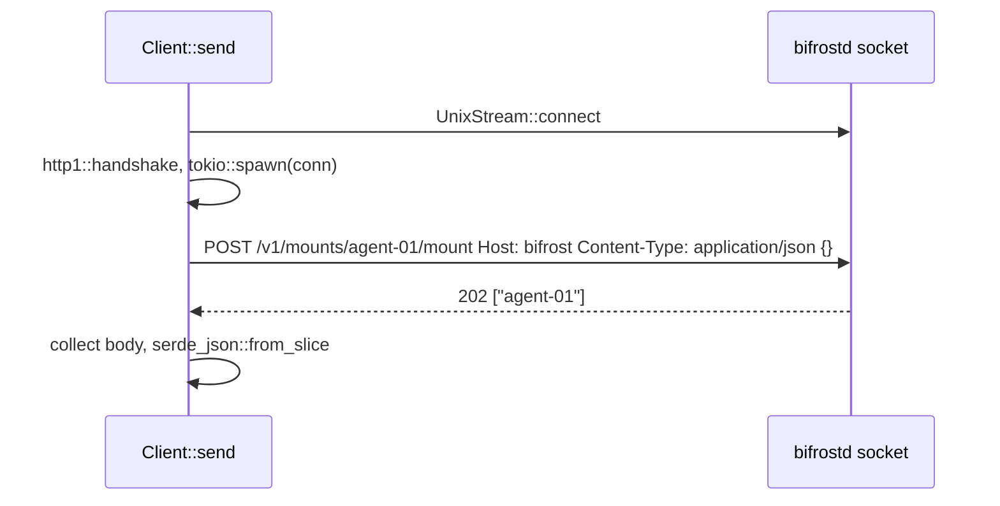

# bifrost-client

`bifrost-client` is the small HTTP/1 client that the CLI and the TUI use to talk to `bifrostd` over its Unix socket, and that the daemon's own tests use as a dev-dependency. It has one type, `Client`, with two calls, `get` and `post`, both generic over any `serde` response type. It opens a fresh connection per request, always sends JSON, and maps every failure into four error kinds that the CLI turns into exit codes. It deliberately has no Server-Sent Events consumer. This guide explains the request path, the error mapping and the reasons behind each choice.

## Contents

- [At a glance](#at-a-glance)
- [API](#api)
- [One request, step by step](#one-request-step-by-step)
- [Error mapping](#error-mapping)
- [Why these choices](#why-these-choices)
- [Why there is no SSE consumer](#why-there-is-no-sse-consumer)
- [Using it](#using-it)
- [Tests](#tests)
- [Where the code differs from the contract](#where-the-code-differs-from-the-contract)

## At a glance

| | |
|---|---|
| Path | `crates/bifrost-client/src/lib.rs` (the whole crate) |
| Dependencies | `hyper` (client, http1), `hyper-util` (tokio), `http-body-util`, `serde`, `serde_json`, `thiserror`, `tokio` (`net`, `rt`) |
| Does not depend on | `bifrost-core`: it is generic over the response type and carries its own copy of `ErrorDto` |
| Dev-dependencies | `axum`, `tokio` (`rt-multi-thread`, `macros`) for the in-process test server |
| Used by | `bifrost-cli`, `bifrost-tui`, and `bifrost-daemon`'s tests |
| Tests | 3: `cargo test -p bifrost-client` |
| Decisions | [http-over-unix-socket](../decisions.md#http-over-unix-socket), [sse-events-and-polling-clients](../decisions.md#sse-events-and-polling-clients), [tui-inline-polling](../decisions.md#tui-inline-polling) |

## API

```rust
pub struct Client { socket: PathBuf }

#[derive(Debug, thiserror::Error)]
pub enum ClientError {
    #[error("bifrostd is not running (socket {0})")] NotRunning(PathBuf),
    #[error("{status}: {error}")]                   Api { status: u16, error: String },
    #[error(transparent)]                           Io(#[from] std::io::Error),
    #[error("bad response: {0}")]                   Decode(String),
}

impl Client {
    pub fn new(socket: PathBuf) -> Self;
    pub async fn get<T: DeserializeOwned>(&self, path: &str) -> Result<T, ClientError>;
    pub async fn post<T: DeserializeOwned>(&self, path: &str, body: &impl Serialize) -> Result<T, ClientError>;
}
```

`path` is the request target, for example `/v1/status` or `/v1/mounts/agent-01/mount`. The client does not validate or escape it; callers put only validated `Name`s into a path ([cli.md](cli.md), [tui.md](tui.md)). The routes and their bodies are listed in [daemon.md](daemon.md); the DTOs are in core's `api.rs` ([core.md](core.md)).

## One request, step by step

`Client::send` does this for every call:

1. `tokio::net::UnixStream::connect(&socket)`.
2. `hyper::client::conn::http1::handshake(TokioIo::new(stream))` gives a `SendRequest` and a `Connection` future.
3. `tokio::spawn(conn)` drives the connection in the background.
4. Build the request: the method, `path` as the URI, `Host: bifrost`, `Content-Type: application/json`, and a `Full<Bytes>` body (empty for `get`, the `serde_json` bytes for `post`).
5. `send_request`, then `BodyExt::collect` the whole response body.
6. Non-2xx: return `Api` (below). 2xx: `serde_json::from_slice` into `T`, or `Decode`.

When the call returns, the `SendRequest` is dropped and the spawned connection task finishes. Nothing is pooled or reused.



## Error mapping

| Where it fails | Condition | Error | CLI exit ([cli.md](cli.md)) |
|---|---|---|---|
| connect | `ENOENT` (no socket file) or `ECONNREFUSED` (a stale socket file with no listener) | `NotRunning(socket)` | 3 |
| connect | anything else: `EACCES`, `ENOTDIR`, a path longer than `sun_path` | `Io` | 3 |
| handshake, send, reading the body | hyper errors, wrapped with `io::Error::other` | `Io` | 3 |
| building the request | an invalid URI, wrapped as `ErrorKind::InvalidInput` | `Io` | 3 |
| response | status not 2xx | `Api { status, error }` | 1 |
| response | 2xx whose body isn't valid JSON for `T` | `Decode` | 1 |
| request | serializing the `post` body fails | `Decode` | 1 |

**`Api.error`.** The daemon answers every error with `ErrorDto { error }` (`crates/bifrost-daemon/src/api.rs`), so `error` is normally that string; displayed, the error reads for example `403: agent-07: discover-only` (a mount request for a machine policy doesn't allow). axum's own rejections (an unknown route's empty 404, 405, 415) don't carry an `ErrorDto`; for those the raw body is kept as lossy UTF-8, possibly empty (test `api_error_maps_status_and_body`).

**Callers must re-clean.** Error strings and every string in a response come from the daemon. The client passes them through unchanged. The CLI and TUI run each one through core's `clean(s, 512)` before printing it ([security.md](../security.md)).

## Why these choices

| Choice | Why | Alternatives rejected | Consequence |
|---|---|---|---|
| HTTP/1 over a Unix socket | PRD §17: "HTTP over UDS is preferable because it keeps debugging trivial" (`curl --unix-socket`). The daemon makes the socket 0600, so only its owner can connect ([http-over-unix-socket](../decisions.md#http-over-unix-socket)) | PRD §17's other option, a lightweight framed JSON protocol | Unix-only; socket paths are limited by `sun_path` |
| hyper's connection-level `client::conn::http1` | hyper, hyper-util and http-body-util were already compiled as dependencies of axum and reqwest, so the client adds no new compiled crate (contract §1); the connection API takes any stream, including a `UnixStream`, and was verified against hyper 1.11.1 before the build (contract, Verified facts) | none recorded | About 40 lines of request code, no pooling |
| A new connection per request | Frozen in contract §9. The busiest caller is the TUI at one status poll per second, a Unix connect is cheap, and without a pool there is no stale-connection state to handle | none recorded | One connect per request. The connection task must be spawned, so a tokio runtime with `spawn` is required |
| `Content-Type: application/json` on every request, `Host: bifrost` | Both are fixed in contract §9. HTTP/1.1 requires a `Host` header; the value is never checked by the daemon | Setting the header only when there is a body | Only `POST /v1/mounts/{target}/unmount` needs a valid JSON body: its handler takes `Json<UnmountReq>`, which rejects `null` (what `post(path, &())` sends) or an empty body, so the CLI and TUI always send `UnmountReq { force }`. The body-less routes (`mount`, `reconcile`, `discover`, `config/reload`) take no body extractor and ignore the body; sending `{}` there is the C6 convention (`crates/bifrost-daemon/src/api.rs`) |
| No dependency on `bifrost-core` | The client is generic over `T`; it only needs the one field of `ErrorDto`, so it keeps a private two-line copy | Importing core's `ErrorDto` | The crate builds without core; if core's `ErrorDto` ever gains a field the copy still decodes (serde ignores unknown fields), but a renamed `error` field would silently fall back to the raw body |
| `NotRunning` only for `ENOENT`/`ECONNREFUSED` | Those two mean "no daemon is listening", the common case, and get the friendly message | Mapping every connect error to `NotRunning` | Other connect errors keep their real cause (permission denied, not a directory). The CLI still exits 3 for them ([cli-exit-codes](../decisions.md#cli-exit-codes)) |

There are no timeouts in the client. A caller that must not hang wraps the future: the TUI uses `tokio::time::timeout` with 500 ms for polls and 5 s for commands ([tui.md](tui.md)); the CLI sets no request timeout. Most routes answer at once: the read routes, `discover` (202 straight away) and `mount`/`unmount` (202 after one actor round trip). `POST /v1/reconcile` waits for the actor to re-probe the drivers and run a pass, and `POST /v1/config/reload` waits for the file load and the actor's apply, so a wedged actor hangs the CLI on those calls ([cli.md](cli.md#runtime)).

## Why there is no SSE consumer

The daemon serves `GET /v1/events` as Server-Sent Events. The client has no method for it, and no CLI command or TUI view consumes it. This is recorded as a deliberate simplification (contract §15 #12; `ponytail:` comment at the top of `src/lib.rs`):

- The TUI polls `GET /v1/status` every second, and `StatusDto.events` already carries the last 200 events. Event latency is at most one second ([tui-inline-polling](../decisions.md#tui-inline-polling), amendment E6).
- `bifrost mount`, `unmount` and `discover` poll `GET /v1/mounts` or `/v1/status` until the result settles ([cli.md](cli.md)).
- A streaming consumer would need a long-lived connection, reconnect logic and a line parser, for no visible gain at one-second latency.

Ceiling: debugging the event stream needs `curl -sN --unix-socket "$BIFROST_SOCKET" http://bifrost/v1/events`, which is exactly what the E2E phase `tests/e2e/p05_api.sh` does. Upgrade path: a `Client::events()` returning a stream plus a `bifrost events` command ([sse-events-and-polling-clients](../decisions.md#sse-events-and-polling-clients), [simplifications.md](../simplifications.md)).

## Using it

```rust
use bifrost_client::{Client, ClientError};
use bifrost_core::api::{StatusDto, UnmountReq};

let c = Client::new(bifrost_config::paths::socket_path());
let s: StatusDto = c.get("/v1/status").await?;
let ids: Vec<String> = c.post("/v1/mounts/agent-01/unmount", &UnmountReq { force: false }).await?;
let _: serde_json::Value = c.post("/v1/discover", &serde_json::json!({})).await?;
```

Runtime requirements: the calls must run inside a tokio runtime that can `spawn` (step 3). The CLI's current-thread runtime works because `block_on` also drives spawned tasks; the TUI uses a multi-thread runtime with one worker ([tui.md](tui.md)).

To add a call for a new route, don't add a method here: callers use `get`/`post` with the route's DTO. Add a method only for something `get`/`post` can't express, such as a stream.

## Tests

In `src/lib.rs`. Each test binds an axum router on a unique socket path under the system temp dir and talks to it with a real `Client`.

| Test | Pins |
|---|---|
| `uds_roundtrip` | GET and POST over the socket; `Host: bifrost` arrives; `Content-Type: application/json` is set (the `Json<Value>` extractor would answer 415 otherwise); `{}` and `{"force": true}` bodies round-trip |
| `not_running_enoent_and_econnrefused` | a missing socket and a stale socket file both give `NotRunning` carrying the path |
| `api_error_maps_status_and_body` | a 403 `ErrorDto` becomes `Api { 403, "discover-only (tailscale)" }`; axum's empty 404 becomes `Api { 404, "" }`; a 2xx non-JSON body is `Decode` |

The CLI's integration tests (`crates/bifrost-cli/tests/config_check.rs`) add wire-level checks through a hand-written HTTP stub: exact request lines and bodies, including `{"force":false}` and `{}` ([cli.md](cli.md)).

## Where the code differs from the contract

| Contract §9 says | Code does |
|---|---|
| `Api`: "non-2xx; body is ErrorDto" | falls back to the raw body when it isn't an `ErrorDto` (axum's own 404, 405, 415) |
| (not stated) | a request-body serialization failure is reported as `Decode` ("bad response: …"), although it happens before sending. The CLI and TUI only send `{}` and `UnmountReq`, which can't fail |
