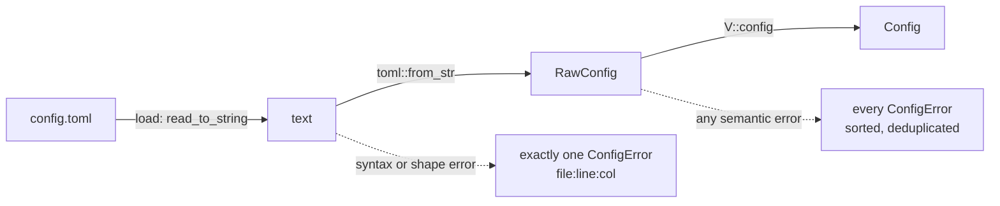

# bifrost-config

`bifrost-config` turns the user's TOML file into a validated `Config`, and knows where Bifröst's files live by default. It has three jobs: mirror the TOML with `serde` (`raw.rs`), validate every value into core's trusted types while collecting every error in a stable order (`lib.rs`), and resolve the config, state and socket paths per OS (`paths.rs`). It also owns the lists that name concrete providers and drivers (`TRUST`, `DRIVER_NAMES`, `default_auto_order`), so that core never has to. The daemon, the reload poller, `bifrost config check`, `bifrost doctor` and the daemon-less `bifrost drivers` all go through the same `parse`. Read this guide before you add a config key, a provider kind or a driver.

## Contents

- [At a glance](#at-a-glance)
- [Module map](#module-map)
- [From text to `Config`](#from-text-to-config)
- [Raw structs: the serde mirror](#raw-structs-the-serde-mirror)
- [Validated output types](#validated-output-types)
- [Errors: two kinds, one stable order](#errors-two-kinds-one-stable-order)
- [Defaults](#defaults)
- [Validation rules](#validation-rules)
- [Expansion: `~`, `$VAR`, `${VAR}`, `$$`](#expansion--var-var-)
- [Static machines: two forms](#static-machines-two-forms)
- [Discovery providers and templates](#discovery-providers-and-templates)
- [Trust ranks, driver names and the auto order live here](#trust-ranks-driver-names-and-the-auto-order-live-here)
- [`paths`: default locations](#paths-default-locations)
- [`Secret` and secret hygiene](#secret-and-secret-hygiene)
- [Who calls what](#who-calls-what)
- [Tests](#tests)
- [Where the code differs from the contract](#where-the-code-differs-from-the-contract)
- [Changing this crate](#changing-this-crate)
- [Deliberate simplifications](#deliberate-simplifications)

## At a glance

| | |
|---|---|
| Path | `crates/bifrost-config/` |
| Files | `src/lib.rs` (types, `parse`, `load`, validation, expansion), `src/raw.rs` (serde mirror), `src/paths.rs` (default locations) |
| Dependencies | `bifrost-core`, `serde`, `toml` (features `std`, `serde`, `parse`). No tokio, no I/O crate. |
| I/O | `load` reads the file. `parse` does one read-only `Path::exists` for `mount.ssh_config`. `paths` reads environment variables and `std::env::home_dir()`. |
| OS-specific code | `paths::socket_path` and `default_auto_order` (`cfg!(target_os = "macos")`). CI's `macos-15` job builds and tests the workspace, so the macOS branches run there ([release-and-ci.md](../release-and-ci.md)). |
| Tests | 28 unit tests in `src/lib.rs`: `cargo test -p bifrost-config`. The CLI's `crates/bifrost-cli/tests/config_check.rs` runs the built binary against it. |
| Decisions | [config-deterministic-validation](../decisions.md#config-deterministic-validation), [validated-newtypes-at-trust-boundary](../decisions.md#validated-newtypes-at-trust-boundary), [winner-takes-all-trust](../decisions.md#winner-takes-all-trust), [static-provider-is-config](../decisions.md#static-provider-is-config), [config-polling-not-notify](../decisions.md#config-polling-not-notify), [missing-config-empty-default](../decisions.md#missing-config-empty-default), [http-over-unix-socket](../decisions.md#http-over-unix-socket) |

## Module map

| Item | Kind | Purpose |
|---|---|---|
| `parse(text, path, env)` | fn | Pure TOML → `Config`. `env` supplies variables, including `HOME`. |
| `load(path)` | fn | `std::fs::read_to_string`, then `parse` with the process environment. |
| `Config`, `Timings`, `ProviderConfig`, `ProviderSpec`, `StaticMachine` | structs/enum | The validated result. |
| `ConfigError { path, message }` | struct | One error. `Display` is `error: {path}: {message}`. Derives `Ord`. |
| `Secret(pub String)` | struct | An HTTP header value. `Debug` prints `***`. |
| `TRUST`, `static_source()`, `ProviderConfig::source()` | const/fn | Trust ranks per provider kind, turned into core's `Source`. |
| `DRIVER_NAMES`, `default_auto_order()` | const/fn | The known driver names and the per-OS default `auto_order`. |
| `Config::{static_observations, static_mounts, templates}` | methods | Hand the config to core's registry and reconciler. |
| `raw::Raw*` | `pub(crate)` structs | The serde mirror of the file. |
| `V` | private struct | The error collector that runs validation. |
| `expand`, `url_allowed`, `is_token` | private fns | Variable expansion, the HTTP URL rule, the RFC 7230 header-name rule. |
| `paths::{config_path, state_dir, socket_path}` | fns | Default locations with `BIFROST_*` and XDG overrides. |

## From text to `Config`



1. `toml::from_str::<RawConfig>` does the syntax and shape check. `deny_unknown_fields` rejects any unknown key here, so a typo or a `password = …` key is a shape error.
2. `V::config` validates every section in a fixed order and pushes each problem onto `V.errs`. A value that fails becomes `None` and is left out, but validation carries on, so one run reports every independent problem.
3. If `errs` is empty the `Config` is returned. Otherwise the whole `Config` is discarded and the errors are returned sorted and deduplicated.

`parse("", …)` is the default config (test `empty_text_is_default_config`). The daemon relies on that for a missing or 0-byte file ([daemon.md](daemon.md), [decisions.md#missing-config-empty-default](../decisions.md#missing-config-empty-default)).

Why `env` is a parameter: `parse` stays pure and testable. Tests pass a closure instead of changing the process environment, which edition 2024 makes `unsafe` (`std::env::set_var`, critique B14). The daemon's reload poller calls `parse` directly on the bytes it read (`crates/bifrost-daemon/src/reload.rs`), with `&|k| std::env::var(k).ok()`.

The one I/O inside `parse` is `Path::exists` on the expanded `mount.ssh_config`. The rules table requires the file to exist, and because the poller calls `parse` rather than `load`, the check has to live in `parse` (orchestrator sign-off after S1, item 6).

## Raw structs: the serde mirror

`src/raw.rs` mirrors the file one struct per table. Every struct derives `Deserialize` with `#[serde(deny_unknown_fields)]`. Everything the user may omit is an `Option` or has `#[serde(default)]`, so absence is decided in validation, where the default is written down once.

| Raw struct | TOML | Validated into |
|---|---|---|
| `RawConfig` | the file: `version`, `[mount]`, `[daemon]`, `[reconciliation]`, `[policy]`, `[[discovery]]`, `[[machines]]` | `Config` |
| `RawMount` | `[mount]`: `root`, `default_driver`, `ssh_config`, `vfs_cache_mode`, `auto_order` | `Config.{root, default_driver, ssh_config, vfs_cache_mode, auto_order}` |
| `RawDaemon` | `[daemon]`: `discovery_interval`, `health_interval`, `reconcile_interval`, `mount_timeout` | `Timings` |
| `RawRecon` | `[reconciliation]`: `offline_grace_period`, `retry_initial`, `retry_max` | `Timings` |
| `RawPolicy`, `RawMatch` | `[policy.allow]`, `[policy.deny]`: `ids`, `names`, `cidrs`, `tags`, `providers`, `metadata` | core `Policy { allow, deny }` |
| `RawDiscovery` | `[[discovery]]`: `type`, `name`, `interval`, `domain`, `nameservers`, `url`, `headers`, `filter`, `mount` | `ProviderConfig` |
| `RawFilter` | `[discovery.filter]`: `include_*` and `exclude_*` for `ids`, `names`, `cidrs`, `tags`, `metadata` | core `ProviderFilter`, stored in `Policy.filters[name]` |
| `RawTemplate` | `[discovery.mount]`: `user`, `remote`, `driver`, `read_only`, `honor_hints` | core `MountTemplate` |
| `RawMachine` | `[[machines]]`: `name`, `host`, `port`, `user`, `tags`, `metadata`, `remote`, `driver`, `read_only`, `mounts` | `StaticMachine` |
| `RawMount1` | `[[machines.mounts]]`: `remote`, `local`, `driver`, `read_only` | core `StaticMount` |

Choices in the mirror and why:

| Choice | Why | Consequence |
|---|---|---|
| `deny_unknown_fields` on every struct | A typo must not be silently ignored, and there is no key for a password or for weakening host keys, so one can't be smuggled in ([host-keys-never-weakened](../decisions.md#host-keys-never-weakened)) | Adding a key means editing `raw.rs` and the validation, never only one of them |
| `RawDiscovery` is one flat struct, not a `#[serde(tag = "type")]` enum | An internally tagged enum makes serde buffer the table before choosing a variant, and the unknown-key error then loses toml's line and column (contract §3). Flat keeps `<file>:<line>:<col>` (test `unknown_field_has_line_col`) | Per-type keys (`domain` only for dns, and so on) are checked in validation instead |
| `type`, `name`, `host` and `remote` stay `String` | Every grammar check runs in validation so that it is collected with the others and reported on its key path | serde never sees core's newtypes here |
| `RawMachine.port` is `Option<i64>` | TOML integers are i64. A `u16` field would turn `port = 65536` into a single shape error; as i64 it becomes a collected `machines[i].port: 65536 is not in 1..=65535` | The range check is explicit in `V::config` |
| `version: Option<u32>` | Only `1` is accepted; absent means 1 | `version = "1"` is a shape error, `version = 2` a semantic one |

## Validated output types

All derive `Clone, Debug, PartialEq` (`ConfigError` also `Eq, PartialOrd, Ord`).

| Type | Fields and notes |
|---|---|
| `Config` | `path` (the file it came from), `root` (expanded and absolute; the daemon canonicalizes it), `default_driver: DriverSelector`, `auto_order: Vec<String>`, `ssh_config: Option<PathBuf>`, `vfs_cache_mode: String`, `timings: Timings`, `policy: Policy` (core type, filters included), `providers: Vec<ProviderConfig>` (file order), `machines: Vec<StaticMachine>` (file order) |
| `Timings` | `discovery_interval`, `health_interval`, `reconcile_interval`, `mount_timeout`, `offline_grace_period`, `retry_initial`, `retry_max`, all `Duration` |
| `ProviderConfig` | `name`, `kind` (`"tailscale"`, `"dns"` or `"http"`), `interval`, `template: MountTemplate`, `spec: ProviderSpec`. `source()` builds core's `Source` |
| `ProviderSpec` | `Tailscale`, `Dns { domain: Host, nameservers: Vec<SocketAddr> }`, `Http { url: String, headers: Vec<(String, Secret)> }` (headers sorted by name, since the raw map is a `BTreeMap`) |
| `StaticMachine` | `id: MachineId`, `host: Host`, `port: Option<u16>`, `user: Option<User>`, `tags: BTreeSet<String>`, `metadata: BTreeMap<String, String>`, `mounts: Vec<StaticMount>` |
| `Secret` | `pub String`; `Debug` prints `***`; no `Display`, no `Serialize` |
| `ConfigError` | `path: String`, `message: String` |

Three methods hand the config to core ([core.md](core.md)):

| Method | Returns | Used by |
|---|---|---|
| `static_observations()` | One `MachineObservation` per static machine: `id`, `name` = the id, `native_id: None`, `addresses: [host]`, `port`, `online: None`, `metadata { tags, values }`, `hints { user, path: None }`, `ttl: None` | The actor's `registry.replace(&static_source(), …)` ([static-provider-is-config](../decisions.md#static-provider-is-config)) |
| `static_mounts()` | `BTreeMap<MachineId, Vec<StaticMount>>` | `reconcile::desired` |
| `templates()` | `BTreeMap<String, MountTemplate>`, keyed by provider name | `reconcile::desired` |

## Errors: two kinds, one stable order

| Kind | When | Count | `path` | `message` |
|---|---|---|---|---|
| Unreadable file | `load` can't read it (missing, permission, not UTF-8) | exactly 1 | the file path | `cannot read: <io error>` |
| TOML syntax or shape | `toml::from_str` fails: bad syntax, unknown key, wrong type | exactly 1 | `<file>:<line>:<col>` (1-based, column in chars), or `<file>` when toml gives no span | toml's message, one line, cleaned |
| Semantic | anything `V::config` rejects | all of them | the key path | the reason |

A TOML error stops at the first problem because the raw structs can't be built. Semantic errors are all collected because each value is checked on its own.

**Key path format.**

| Shape | Example |
|---|---|
| table key | `mount.root`, `daemon.mount_timeout`, `reconciliation.retry_initial` |
| array entry | `machines[0].host`, `discovery[2].nameservers[1]`, `mount.auto_order[1]` |
| nested array | `machines[1].mounts[0].local` |
| map key (Debug-quoted) | `policy.allow.metadata."Bad Key"`, `discovery[0].headers."Authorization"` |
| filter key | `discovery[0].filter.include_ids[1]`, `discovery[0].filter.exclude_metadata."k"` |
| a whole entry | `machines[1]` (`has no mounts …`, `has both remote and mounts`) |
| shorthand keys | reported on the machine: `machines[0].remote`, `machines[0].driver`; a shorthand's local collision on `machines[0].name` (commit 1d96faf) |

Indices are positions in the file, counted per array from 0.

**Deterministic order.** `V.errs` is sorted with `ConfigError`'s derived `Ord`, which compares `path` then `message` as strings, and then deduplicated. So `bifrost config check` prints the same bytes every run, whatever order the checks ran in ([config-deterministic-validation](../decisions.md#config-deterministic-validation); tests `errors_sorted_deterministic`, `config_check_output_deterministic`). The order is byte order on the path, not file order: `daemon.*` sorts before `discovery[…]`, which sorts before `machines[…]` and `mount.*`.

**Hygiene.** Every message `parse` produces goes through core's `clean(msg, 512)` (`V::err` and the TOML error branch): control characters and bidi or zero-width characters become `?`, and the text is cut at 512 characters (A8). A config file can't inject terminal escapes into `config check`, the daemon's `config_errors` or the TUI. For TOML shape errors the parser also rewrites `invalid type: string "…", expected …` to `invalid type: string, expected …`, because the string could be a header secret (`headers = "Bearer …"`), and it turns newlines into spaces. Two things are not cleaned: the unreadable-file message from `load` is `cannot read: <io::Error>` as is, and `path` (the file path or key path) never goes through `clean`; map keys in a key path are only Debug-quoted (`metadata."k"`). The CLI's `config check` prints each `ConfigError` as is.

Validation messages never echo an HTTP `url` or a header value. They do echo two expanded values: `mount.root` and `mount.ssh_config` errors quote the expanded path (Debug-quoted), for example `error: mount.root: "/home/sami/../x" must not contain a '..' component`. Don't put secrets in those two keys.

A real run (scratch config, trimmed):

```text
$ bifrost config check bad.toml
error: daemon.health_interval: "500ms" is shorter than 1s
error: discovery[0].headers."Authorization": undefined variable $NOPE
error: discovery[0].url: must be https://, or http:// only to 127.0.0.1, [::1] or localhost
error: machines[0].host: invalid host "-oProxyCommand=x": not an IP literal or hostname
error: machines[0].name: "Zed": use lowercase ("zed")
error: machines[0].remote: invalid remote path "rel": must be ~, ~/<rel>, / or /<abs>
error: mount.auto_order[1]: duplicate driver "sshfs"
error: mount.root: "/" must not be /
$ echo $?
1
$ bifrost config check syntax.toml
error: /path/syntax.toml:2:1: unknown field `pasword`, expected one of `root`, `default_driver`, `ssh_config`, `vfs_cache_mode`, `auto_order`
```

Messages that come from core's validators have the form `invalid <what> "<value>": <why>` (core's `Invalid`). Those values are identities (names, hosts, users, paths), never secrets.

## Defaults

| Key | Default |
|---|---|
| `version` | 1 |
| `mount.root` | `~/machines` (expanded) |
| `mount.default_driver` | `auto` |
| `mount.auto_order` | `default_auto_order()`: Linux `["sshfs", "rclone"]`, macOS `["rclone-nfs", "rclone", "sshfs"]` |
| `mount.ssh_config` | none (ssh reads the user's own config) |
| `mount.vfs_cache_mode` | `writes` |
| `daemon.discovery_interval` | `30s` |
| `daemon.health_interval` | `15s` |
| `daemon.reconcile_interval` | `60s` |
| `daemon.mount_timeout` | `30s` |
| `reconciliation.offline_grace_period` | `5m` |
| `reconciliation.retry_initial` | `2s` |
| `reconciliation.retry_max` | `1m` |
| `discovery[i].name` | the `type` |
| `discovery[i].interval` | `daemon.discovery_interval` (as validated) |
| `discovery[i].mount.user` | none (ssh_config or the local user decides) |
| `discovery[i].mount.remote` | `~` (the remote login directory) |
| `discovery[i].mount.driver` | `mount.default_driver` |
| `discovery[i].mount.read_only`, `.honor_hints` | `false` |
| `machines[i].port`, `.user` | none |
| `machines[i].mounts[j].local` | the machine name, only when the machine has exactly one mount |
| `…driver` on a static mount | `mount.default_driver` |
| `…read_only` on a static mount | `false` |

## Validation rules

Rules are listed per key in the order `V::config` checks them. "Grammar" names a validator in `crates/bifrost-core/src/validate.rs`; the grammars are summarised after the table and fully covered in [core.md](core.md).

**Top level and `[mount]`**

| Key | Rule | Message (excerpt) |
|---|---|---|
| `version` | absent or `1` | `unsupported version 2 (only 1 is accepted)` |
| any key | known key only (`deny_unknown_fields`) | TOML error `unknown field …` |
| `mount.root` | expanded; then, in this order: no control characters; absolute; no `..` component; not `/` (a path with no parent, so `//` too); not equal to `$HOME` (path equality, so `/home/u/.` counts) | `"/" must not be /`, `… must be an absolute path`, `… must not be $HOME` |
| `mount.default_driver` | `auto` or a member of `DRIVER_NAMES`, case-sensitive. On error the default falls back to `auto` so later checks still run | `unknown driver "fuse" (expected "auto" or one of ["sshfs", "rclone", "rclone-nfs"])` |
| `mount.auto_order` | not empty; every entry in `DRIVER_NAMES`; no duplicates. Any known name is accepted on any OS | `must not be empty`, `unknown driver …`, `duplicate driver "sshfs"` |
| `mount.ssh_config` | expanded; no `"` (it is quoted inside rclone's `--sftp-ssh`); no control characters; absolute; exists | `… must not contain '"' (it is quoted inside --sftp-ssh)`, `… does not exist` |
| `mount.vfs_cache_mode` | `off`, `minimal`, `writes` or `full` | `"most" is not off, minimal, writes or full` |

**Durations: `[daemon]`, `[reconciliation]`, `discovery[i].interval`**

| Rule | Message |
|---|---|
| `parse_duration`: `^[0-9]+(ms\|s\|m\|h)$`, greater than 0, at most 366 days. One unit only: `1m30s`, `5 m`, `5` and `1d` are rejected | `invalid duration "5 m": must be <n>ms\|s\|m\|h, > 0 and <= 366d` |
| every duration is at least 1 s (`V::dur`) | `"500ms" is shorter than 1s` |
| `daemon.mount_timeout` at most 5 m | `must be at most 5m` |
| `reconciliation.retry_initial` ≤ `retry_max`, including the default `retry_max` of 1 m. Skipped when `retry_max` itself failed to parse (it is then zero and already reported) | `must be <= reconciliation.retry_max` |

The PRD §13 sample `reconcile_interval = "30s"` is accepted.

**`[policy.allow]` and `[policy.deny]`** ([policy-semantics](../decisions.md#policy-semantics))

| Key | Rule |
|---|---|
| `ids[j]` | `Name::parse`, which lowercases: `"Agent-07"` is accepted as `agent-07`. Global ids match the machine id only, never a native id (A19) |
| `names[j]` | `Glob::parse`: `[a-z0-9*?._-]{1,63}`, not lowercased (`"Prod-*"` is rejected) |
| `cidrs[j]` | `Cidr::parse`: `addr/prefix` or a bare IP (= /32 or /128); an IPv4-mapped IPv6 address is rejected (write the v4 form) |
| `tags[j]` | `tag`: lowercased, `[a-z0-9][a-z0-9_.:-]{0,62}` |
| `metadata."k"` | key passes `meta_key` (`[a-z0-9_.-]{1,64}`); value at most 256 characters with no control characters (the value is not echoed) |
| `providers[j]` | a configured provider name, or any kind in `TRUST` (`static`, `tailscale`, `http`, `dns`). Checked after every `[[discovery]]` is read. Naming a kind you haven't configured is harmless, so it isn't flagged as a typo |

**`[[discovery]]` entry `i`**

| Key | Rule |
|---|---|
| `type` | `tailscale`, `dns` or `http` |
| `name` | default: the type. `Name::parse` (lowercases). `static` is reserved. Unique across providers: a second provider of one type needs a `name` |
| `interval` | a duration as above; default `daemon.discovery_interval` |
| `domain`, `nameservers` | only for `type = "dns"` |
| `url`, `headers` | only for `type = "http"` |
| `domain` (dns) | required; `Host::parse`; not an IP literal |
| `nameservers[j]` (dns) | `ip:port` (`SocketAddr`) or a bare IP, which gets port 53. `::1` and `[::1]:53` both work |
| `url` (http) | required; expanded; `https://…` with anything after it, or `http://` only when the authority is exactly `127.0.0.1`, `[::1]` or `localhost` (ASCII case-insensitive) with an optional digits-only port: no userinfo (`http://127.0.0.1@evil`), no suffix (`localhost.evil`). The url is never echoed, since it may carry a token ([http-inventory-limits](../decisions.md#http-inventory-limits)) |
| `headers."Name"` (http) | the name is an RFC 7230 token (`1*tchar`); the value is expanded, then must contain no CR, LF or NUL; stored as a `Secret`, never echoed |
| `filter.{include,exclude}_ids[j]` | `native_id`: `[A-Za-z0-9._:-]{1,128}`, kept verbatim (case-sensitive) |
| `filter.{include,exclude}_{names,cidrs,tags,metadata}` | as in `[policy]` |
| `mount.user` | `User::parse` |
| `mount.remote` | `RemotePath::parse`, default `~` |
| `mount.driver` | as `mount.default_driver`, default `mount.default_driver` |
| `mount.read_only`, `mount.honor_hints` | booleans, default `false` |

A filter has no `providers` key: it already belongs to one provider. Every valid provider gets an entry in `Policy.filters`, an empty one when there is no `[discovery.filter]` (test `trust_ranks_and_sources`).

**`[[machines]]` entry `i`**

| Key | Rule |
|---|---|
| `name` | `Name::parse`, and it must already be lowercase: `"Zed": use lowercase ("zed")`. Unique: `duplicate machine "a"` |
| `host` | `Host::parse`; never expanded |
| `port` | 1..=65535 |
| `user` | `User::parse` |
| `tags`, `metadata` | as in `[policy]`; tags are lowercased into a set |
| `remote` vs `[[machines.mounts]]` | exactly one of them: `has no mounts (set remote, or add [[machines.mounts]])` / `has both remote and mounts` |
| `driver`, `read_only` | only together with `remote`: `only allowed together with remote` |
| `mounts[j].local` | `Name::parse`. Optional only when the machine has exactly one mount (it is then the machine name); otherwise `required when a machine has more than one mount`. Unique across all static mounts, shorthand included: `duplicate local "a"` on the later entry |
| `mounts[j].remote` | `RemotePath::parse`; never expanded (`~` is the remote home) |
| `mounts[j].driver` | as `mount.default_driver` |

A static local that equals a *discovered* machine id is not a config error. At runtime static locals are claimed first and the discovered machine is reported in `conflicts` ([core.md](core.md)).

**Grammars used above** (from core; [validated-newtypes-at-trust-boundary](../decisions.md#validated-newtypes-at-trust-boundary)):

| Validator | Accepts |
|---|---|
| `Name::parse` | ASCII-lowercases, then `[a-z0-9][a-z0-9._-]{0,62}`: one safe path component |
| `Host::parse` | an IP literal (no brackets, no zone id, not `0.0.0.0` or `::`; stored canonical, v4-mapped → v4) or a hostname of at most 253 bytes, labels `[A-Za-z0-9_-]{1,63}` not starting with `-`; one trailing dot stripped; lowercased |
| `User::parse` | `[A-Za-z0-9_][A-Za-z0-9_.-]{0,31}` |
| `RemotePath::parse` | `~`, `~/<rel>`, `/` or `/<abs>`; at most 1024 bytes; no control characters, no `:`, no `..` component; spaces allowed |

## Expansion: `~`, `$VAR`, `${VAR}`, `$$`

`expand(s, env)` in `src/lib.rs`, applied **only** to four values:

| Value | Why it is expanded |
|---|---|
| `mount.root` | a local path |
| `mount.ssh_config` | a local path |
| `discovery[i].url` (http) | may carry a token from the environment |
| `discovery[i].headers` values (http) | secrets belong in the environment, not the file: `Authorization = "Bearer ${BIFROST_INVENTORY_TOKEN}"` |

Names, hosts, users, tags and remote paths are never expanded. They are identities checked against a grammar, so `host = "$XROOT"` is a validation error, and in a remote path `~` means the remote home, not the local one (test `tilde_and_vars_expanded`).

Rules:

| Input | Result |
|---|---|
| `~` or `~/…` at the very start | `$HOME` + the rest. `~user/…` is not expanded (so `root = "~user/m"` fails as not absolute). A `~` anywhere else is literal |
| `$NAME` | the variable; `NAME` is the longest run of `[A-Za-z0-9_]` and must start with a letter or `_` |
| `${NAME}` | the variable; lets text follow directly: `${XROOT}x/m` → `/datax/m` |
| `$$` | a literal `$`: `/x/a$$b` → `/x/a$b`, `/x/$$$XROOT` → `/x/$/data` |
| undefined **or empty** variable | error `undefined variable $NAME`, never an empty string |
| `$` at the end, `${`, `${}`, `${A-B}`, `$-` | error `bad $ reference: use $NAME, ${NAME}, or $$ for a literal $` |

Why an empty variable is an error: `HOME=""` must not turn `~/machines` into `/machines`, and `TOK=""` must not produce the header `Bearer ` (commit a665a12; test `undefined_var_error`). Errors never echo the input, because the input may be a header value.

`HOME` comes from the same `env` closure, not from `std::env::home_dir()`. With `HOME` unset, `~` is an error even where `paths` would still find a home directory.

The expander is hand-rolled on purpose ([simplifications](../simplifications.md), contract §15 #4): no `~user`, no `${VAR:-default}`. Add them only if real configs need them.

## Static machines: two forms

A static machine needs one or more mounts. There are two equivalent ways to write them; `shorthand_equals_mounts_form` asserts they produce equal `Config`s.

```toml
# PRD §31 shorthand: exactly one mount, local = name
[[machines]]
name = "agent-01"
host = "agent-01"
user = "sami"
remote = "/home/sami"      # optional here: driver, read_only

# PRD §13 form: any number of mounts
[[machines]]
name = "build"
host = "10.0.0.18"
port = 22

[[machines.mounts]]
remote = "/home/sami"
local = "build"
driver = "sshfs"

[[machines.mounts]]
remote = "/srv/artifacts"
local = "build-artifacts"
read_only = true
```

How validation treats them:
- The shorthand is rewritten into one `RawMount1 { remote, local: None, driver, read_only }` whose key-path prefix is the machine itself, so its errors read `machines[i].remote` and `machines[i].driver`, and its local collision reads `machines[i].name`.
- `remote` together with `[[machines.mounts]]` is an error rather than an extra mount, so a half-converted entry can't silently mount twice.
- `driver` or `read_only` on a machine without `remote` is an error: at machine level they would otherwise look like a default for its mounts, which they are not.
- A machine is dropped from `machines` if its name, host, port or user fails; its mounts are dropped individually. Any error discards the whole `Config` anyway, so partial results never escape.

`local` is the mount id and the directory name under `mount.root`. `Name::parse` makes it a single lowercase path component, so `../x`, `a/b`, `.`, `..`, `.x`, `-x` and `a b` are all rejected (test `local_traversal_rejected`).

## Discovery providers and templates

Each valid `[[discovery]]` entry becomes a `ProviderConfig` plus an entry in `Policy.filters`. An entry with any failed part (name, spec, template user, remote or driver) is left out, and its errors fail the config.

The `[discovery.mount]` template becomes core's `MountTemplate { user, remote, driver, read_only, honor_hints }`. It builds the one mount of every allowed machine that this provider supplies ([core.md](core.md), `reconcile::desired`). `honor_hints = true` lets a record's `user=` and `path=` win over the template's `user` and `remote`; there is no driver hint (E2). Discovery alone never mounts anything: a machine needs an allow ([discover-is-not-mount](../decisions.md#discover-is-not-mount)).

The default `remote = "~"` mounts the remote login directory. PRD §2 sketched a deeper `~/machines/agent-01/home/sami/project` shape; the contract chose the home directory (B2) and recorded it as a `ponytail:` comment in `V::config`.

Providers are built by the daemon, not here (`build_provider` in `crates/bifrost-daemon/src/main.rs`). `config check` therefore accepts a URL or header value that `reqwest` later rejects; the daemon then marks that provider failing (orchestrator sign-off after S4a, item 9).

## Trust ranks, driver names and the auto order live here

```rust
pub const TRUST: [(&str, u8); 4] = [("static", 0), ("tailscale", 1), ("http", 2), ("dns", 3)];
pub const DRIVER_NAMES: [&str; 3] = ["sshfs", "rclone", "rclone-nfs"];
pub fn default_auto_order() -> Vec<String>; // macOS [rclone-nfs, rclone, sshfs]; else [sshfs, rclone]
```

**Why here and not in core (B8).** Core compares numbers and checks grammars; it never names a concrete provider or driver. Core's `Source` is `{ trust: u8, kind: String, provider: String }`, its policy treats `trust == 0` as static, and `DriverSelector::Named` checks only the name grammar. The lists that do name them live in this crate, so adding a provider or driver never edits `bifrost-core` (PRD §33 principle 10; [core-no-io](../decisions.md#core-no-io), [rust-and-8-crate-workspace](../decisions.md#rust-and-8-crate-workspace)).

| Item | Used for |
|---|---|
| `TRUST` | `ProviderConfig::source()` looks up the rank of its kind (`u8::MAX` is unreachable, since the kind is validated); `policy.*.providers` accepts any kind listed here |
| `static_source()` | `Source { trust: 0, kind: "static", provider: "static" }`, the source of every static observation |
| `DRIVER_NAMES` | membership check for every `driver` key and `auto_order` entry. It is OS-agnostic: `rclone-nfs` validates on Linux and, if selected there, fails at runtime instead: the planned action reads `waiting (no driver: rclone-nfs unavailable: macOS only)` and the mount shows Failed with that detail (B15) |
| `default_auto_order()` | the default `mount.auto_order`, and the CLI's local driver probe when no config file loads ([cli.md](cli.md)) |

The ranks decide which observation wins when several sources report one machine id: lower is more trusted, and the winner supplies host, port, hints and metadata ([winner-takes-all-trust](../decisions.md#winner-takes-all-trust)). Static is what the user wrote. DNS is last because its answers are unauthenticated: DNSSEC is not validated (contract §15 #21).

The auto order comes from PRD §9's suggested preference ("rclone nfsmount, rclone mount, sshfs" on macOS; "sshfs, rclone" on Linux), made configurable through `mount.auto_order` as the PRD asks.

## `paths`: default locations

`src/paths.rs`, used by the daemon (`bifrost-daemon/src/main.rs`), the CLI and the TUI.

| Function | Resolution order |
|---|---|
| `config_path()` | `$BIFROST_CONFIG` → `~/.config/bifrost/config.toml` (both OSes) |
| `state_dir()` | `$BIFROST_STATE_DIR` → `$XDG_STATE_HOME/bifrost` → `~/.local/state/bifrost` (both OSes) |
| `socket_path()` | `$BIFROST_SOCKET` → macOS `~/Library/Caches/bifrost/bifrost.sock` → Linux `$XDG_RUNTIME_DIR/bifrost/bifrost.sock` → `~/.cache/bifrost/bifrost.sock` |

Rules:
- An empty variable counts as unset (`var()`). This is why the CLI doesn't use clap's `env` attribute: clap rejects an empty value, while `BIFROST_CONFIG=` should mean "the default" (commit a665a12; test `config_check_output_deterministic`).
- An XDG value must be absolute, or it is ignored, as the XDG Base Directory spec says (`xdg()`).
- The `BIFROST_*` overrides are used as given. A relative override resolves against the process's working directory.
- `home()` panics with `HOME is not an absolute path` if `std::env::home_dir()` is not absolute. It is called only when a default under the home directory is actually needed. Resolving a default against the working directory would put the socket or state wherever the daemon or client happened to start (a daemon started in `/tmp`, a client in a hostile directory); failing loudly is safer. The CLI integration test pins it.
- `XDG_CONFIG_HOME` is not consulted for the config file: the contract fixes one location on both OSes. The state and socket paths follow XDG where it exists.
- The default socket is never under `/tmp` (contract §11, C5). On macOS it goes under `~/Library/Caches`, and `XDG_RUNTIME_DIR` is not consulted ([decisions.md#http-over-unix-socket](../decisions.md#http-over-unix-socket)).
- A socket path must be at most 103 bytes (`sun_path` is 104 on macOS, including the NUL). `bifrostd` refuses a longer one at startup with `socket path is <n> bytes, over the 103-byte limit` and exits 1 ([daemon.md#socket](daemon.md#socket)). A client given a longer path fails at connect with `path must be shorter than SUN_LEN`, a `ClientError::Io`, which the CLI prints as `error: …` and exits 3 like any unreachable daemon.

Directory creation, modes and ownership checks are the daemon's job ([daemon.md](daemon.md), [security.md](../security.md), [decisions.md#private-state-and-socket-dirs](../decisions.md#private-state-and-socket-dirs)).

## `Secret` and secret hygiene

`Secret(pub String)` wraps each HTTP header value. Its `Debug` prints `***`, so `{:?}` of a `Config`, a `ProviderConfig` or a `ProviderSpec` never shows a token (asserted in `parses_full_example`). It has no `Display` and no `Serialize`. Outside tests, the only place that reads `.0` is `build_provider` in `crates/bifrost-daemon/src/main.rs`, which hands the values to the HTTP provider.

Other places secrets could leak, and how each is closed:

| Leak path | Guard |
|---|---|
| a TOML shape error quoting a string value | the quoted value is removed from the message |
| an expansion error | `expand` errors name the variable, never the input |
| a CR/LF/NUL error on a header | the message names the character class, not the value |
| an http `url` with a token | url errors never echo it |
| `mount.root`, `mount.ssh_config` | not guarded: their errors echo the expanded path, Debug-quoted |
| `config check` output | only the error lines, or the `ok:` line (path, counts, cleaned root) |

The `url` itself is a plain `String`, so it does appear in `Debug` output of `ProviderSpec`. Put tokens in headers, not in the URL.

## Who calls what

| Caller | Call | Notes |
|---|---|---|
| `bifrost-daemon/src/main.rs` `config()` | `load`, or `parse("", …)` for a missing or 0-byte file | the empty default runs until a file appears ([daemon.md](daemon.md)) |
| `bifrost-daemon/src/reload.rs` | `parse(bytes, …)` | every 2 s and on SIGHUP ([config-polling-not-notify](../decisions.md#config-polling-not-notify)) |
| `bifrost-daemon/src/api.rs` `reload` | `spawn_blocking(load)` | `POST /v1/config/reload` |
| `bifrost-daemon/src/actor.rs` | `static_source`, `Config::{static_observations, static_mounts, templates}`, `ProviderConfig::source` | the actor never parses |
| `bifrost-cli` | `load`, `paths::{config_path, socket_path}`, `default_auto_order` | `config check`, `doctor`, the local driver probe ([cli.md](cli.md)) |
| `bifrost-tui` | `paths::socket_path` only | ([tui.md](tui.md)) |

## Tests

All in `crates/bifrost-config/src/lib.rs`. They use a fake `env` closure with `HOME=/home/t` and `XROOT=/data`; tests that need a real `ssh_config` file create one under the system temp dir.

| Test | Pins |
|---|---|
| `parses_full_example` | the contract §3 sample parses to the expected `Config`, `static_observations`, `static_mounts` and `templates`; `Secret` never Debug-prints |
| `parses_prd_s6_s7_s13_s31_snippets` | the PRD's own snippets parse (`remote = "/"`, `reconcile_interval = "30s"`, the shorthand) |
| `shorthand_equals_mounts_form` | the two static forms are equal |
| `empty_text_is_default_config` | `""` and a comment-only file give the default config |
| `errors_sorted_deterministic` | two runs give identical, sorted output |
| `unknown_field_has_line_col` | one error with `file:line:col` for unknown keys (also inside `[[discovery]]`), syntax and type errors; no string value echoed; escapes cleaned; 512-char cap |
| `per_type_keys_enforced` | dns/http-only keys, required `domain`/`url`, IP-literal domain, nameserver forms, unknown type |
| `remote_xor_mounts` | none / both / `driver` and `read_only` without `remote` |
| `local_traversal_rejected` | unsafe `local` values; `local` required with two mounts |
| `duplicate_local_rejected`, `duplicate_machine_rejected` | uniqueness, including the shorthand reported on `name` |
| `uppercase_name_hint` | `use lowercase` |
| `unknown_driver_rejected` | every `driver` key and `auto_order` rule |
| `bad_duration_rejected`, `retry_initial_gt_max_rejected` | duration grammar, 1 s floor, 5 m cap, retry ordering against the default `retry_max` |
| `root_slash_home_relative_rejected` | `/`, `//`, `~`, `$HOME`, relative, `~user`, `..`, control characters |
| `tilde_and_vars_expanded`, `undefined_var_error`, `dollar_dollar_literal` | expansion rules and where they apply |
| `http_plaintext_non_loopback_rejected` | the url rule against userinfo, suffix, port and scheme tricks |
| `header_crlf_rejected` | CR/LF/NUL, also arriving through a variable; header-name tokens |
| `discovery_names_default_unique_static_reserved` | provider naming |
| `policy_unknown_provider_rejected` | `providers` names and the rest of the policy and filter grammar, including native ids in filters |
| `ssh_config_with_quote_rejected` | `"`, control characters, missing, relative |
| `remote_slash_root_ok` | `remote = "/"` works (B2) |
| `trust_ranks_and_sources` | `TRUST`, `static_source`, `source()`, `DRIVER_NAMES`, `default_auto_order`, a default filter per provider |
| `machine_fields_validated` | host, port, user, tags, metadata, `vfs_cache_mode`, `version` |
| `load_reads_file_and_reports_missing` | `load` reads a file; a missing file is one `cannot read` error |

`paths.rs` has no unit tests: they would need to change the process environment. The CLI integration test `config_check_output_deterministic` covers an empty `BIFROST_CONFIG` and a relative `HOME` by running the binary with a controlled environment ([cli.md](cli.md)).

## Where the code differs from the contract

| Contract §3 says | Code does | Matters because |
|---|---|---|
| filter `*_ids` pass `native_id` "(or `Name`)" | `native_id` only, kept verbatim | every Name-shaped id also passes `native_id`, but it is not lowercased: an upper-case filter id can only ever match a native id, never a machine id |
| names pass `Name::parse` | `Name::parse` lowercases; only `machines[i].name` additionally must already be lowercase | `discovery[i].name = "Infra"`, `policy.*.ids = ["Agent-07"]` and `local = "Build"` are accepted and lowercased; a machine name is not |
| `mount.root` / `mount.ssh_config` rules | also reject control characters | a root with an OSC escape can't reach argv or the `ok:` line (commit a665a12) |
| "An undefined variable is an error" | an empty variable is an error too | as above |
| error `path` is the key path, or `file:line:col` | also the bare file path for an unreadable file, and `<file>` for a TOML error without a span | sign-off after S1, item 6 |
| (not stated) | TOML shape messages drop quoted string values; every message from `parse` is `clean(…, 512)` | secret and escape hygiene |

## Changing this crate

**Adding a config key.** Add the field to the raw struct (it is then accepted by `deny_unknown_fields`), validate it in `V::config` with a key path that matches the TOML, add it to the output type, add a default to [Defaults](#defaults), and add a test that checks the error path. Expand it only if it is a local path or a secret. If the daemon must react to it on reload, see [daemon.md](daemon.md) for the config-apply path. Update the user docs in `site/` and the README.

**Adding a provider kind.** Add the kind to the `type` check (`matches!(kind.as_str(), "tailscale" | "dns" | "http")`) and to its `unknown type … (expected tailscale, dns or http)` message, to `TRUST` with a rank, and to `ProviderSpec`. Give it its own arm in the `spec` match in `V::config`: the `_` arm yields `ProviderSpec::Tailscale`, so a kind without an arm silently validates as a Tailscale provider. Add its per-type keys to `RawDiscovery` and to the per-type key loop; build it in the daemon's `build_provider`. Core needs no change. See [extending.md](../extending.md).

**Adding a driver.** Add its name to `DRIVER_NAMES` and, if it should be tried by default, to `default_auto_order`; implement it in `bifrost-mount` and return it from `bifrost_mount::drivers` ([mount.md](mount.md), [extending.md](../extending.md)).

Keep `parse` pure apart from the `ssh_config` existence check, and keep errors collected, never early-returned: `config check`'s all-errors-at-once output depends on it.

## Deliberate simplifications

The `ponytail:` comments in this crate ([ponytail-style](../decisions.md#ponytail-style), [simplifications.md](../simplifications.md)):

| Where | Simplification | Ceiling | Upgrade |
|---|---|---|---|
| `expand` in `src/lib.rs` (§15 #4) | hand-rolled `~`/`$VAR` expansion | no `~user`, no `${VAR:-default}` | add them if configs need them |
| `V::config`, discovery template (§15 #28, B2) | a discovered machine mounts `remote = "~"` by default | discovered machines mount their home unless the template sets `remote` | a per-provider default in docs or a smarter template |
