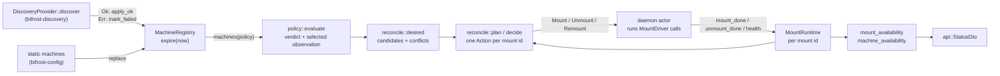
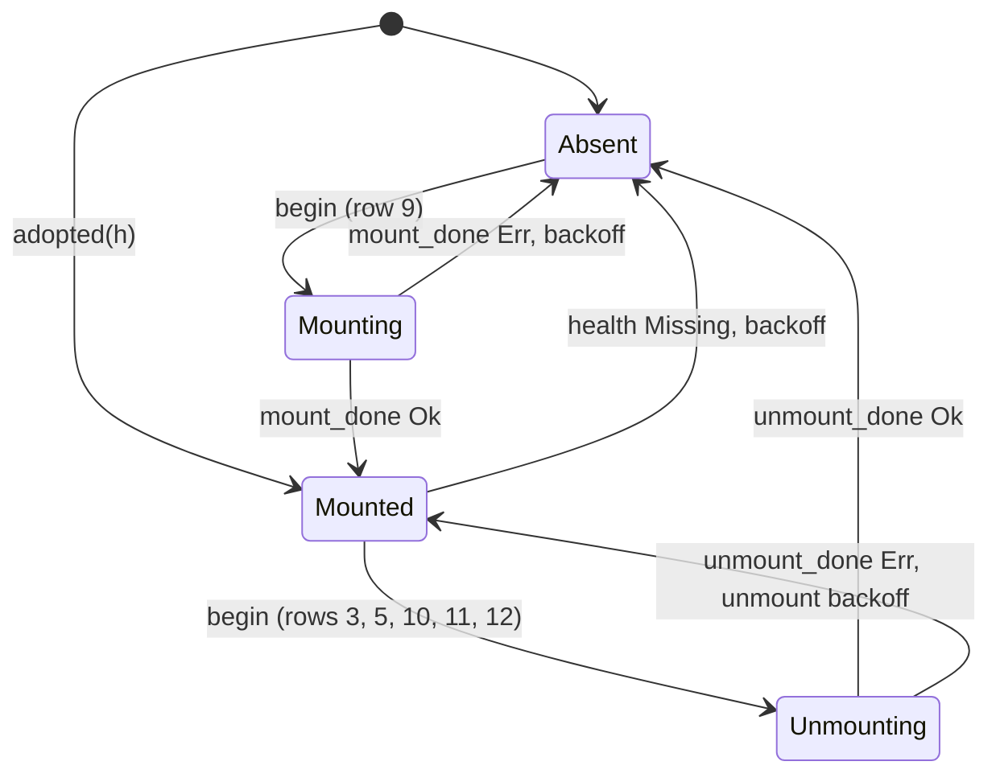

# bifrost-core

`bifrost-core` is the I/O-free centre of Bifröst. It contains the validated types that every untrusted string must become, the machine and mount model, the policy evaluator, the machine registry, and the pure reconciler (desired state, decision table, runtime transitions, availability). It also holds the event vocabulary, the wire DTOs shared by the daemon, CLI and TUI, and the test fakes. Every crate except `bifrost-client` depends on it, and it depends only on `serde` and `thiserror`. This guide covers each module: its rules, the contracts of the two plugin traits, and the reasons behind them. Read it before you change anything under `crates/bifrost-core/src/`.

## Contents

- [At a glance](#at-a-glance)
- [Module map](#module-map)
- [How the modules fit together](#how-the-modules-fit-together)
- [lib.rs: `BoxFuture` and the plugin traits](#librs-boxfuture-and-the-plugin-traits)
- [validate.rs: the trust boundary](#validaters-the-trust-boundary)
- [model.rs: the domain model](#modelrs-the-domain-model)
- [policy.rs: who may be mounted](#policyrs-who-may-be-mounted)
- [registry.rs: merging observations](#registryrs-merging-observations)
- [reconcile.rs: the pure reconciler](#reconcilers-the-pure-reconciler)
- [events.rs](#eventsrs)
- [api.rs: wire DTOs](#apirs-wire-dtos)
- [fake.rs: test fakes](#fakers-test-fakes)
- [Test inventory](#test-inventory)
- [Changing core: what else moves](#changing-core-what-else-moves)
- [Where the code differs from the contract](#where-the-code-differs-from-the-contract)

## At a glance

| | |
|---|---|
| Path | `crates/bifrost-core/` |
| Dependencies | `serde` (derive) and `thiserror`. No tokio, filesystem, network, process or clock access. |
| Time and randomness | Passed in: `now: Instant` and `rand: u64`. The daemon passes `validate::random_u64()`. |
| Tests | 85 unit tests: `cargo test -p bifrost-core` (about 0.01 s once built) |
| Design contract | `docs/design/contract.md` §2 (API), §4 (policy), §5 (reconciliation), plus the amendments and sign-offs |

Core does no I/O ([decisions.md#core-no-io](../decisions.md#core-no-io)). As a result, every rule in it is a pure function that tests can drive with synthetic `Instant`s, nothing in core can block on a hung FUSE mount, and the daemon actor ([daemon.md](daemon.md)) owns every side effect. Core is also provider- and driver-agnostic (amendment B8). It has no list of provider kinds, driver names or trust ranks. Those live in `bifrost-config` (`TRUST`, `DRIVER_NAMES`, `default_auto_order`), so adding a provider or driver never edits core ([extending.md](../extending.md)).

**Who uses what** (checked against the `use bifrost_core::…` lines and inline `bifrost_core::…` paths in each crate):

| Crate | Core items it uses |
|---|---|
| `bifrost-config` | Validators (`Name`/`MachineId`, `Host`, `User`, `RemotePath`, `tag`, `meta_key`, `native_id`, `parse_duration`, `Glob`, `Cidr`, `clean`), `DriverSelector`, `Metadata`, `MountHints`, `MachineObservation`, `policy::{Policy, Match, ProviderFilter}`, `registry::Source`, `reconcile::{MountTemplate, StaticMount}` |
| `bifrost-discovery` | `DiscoveryProvider`, `BoxFuture`, `MachineObservation`, `Metadata`, `MountHints`, `DiscoveryError`, `Invalid`, `Host`, `Name`, `User`, `RemotePath`, `tag`, `meta_key`, `native_id`, `clean`, `tail` |
| `bifrost-mount` | `MountDriver`, `BoxFuture`, `MountSpec`, `MountRequest`, `MountHandle`, `MountId`, `MountState`, `MountError`, `DriverAvailability`, `marker`, `parse_marker`, `LOG_HEADER`, `tail`, `clean`, `random_u64`; `DriverSelector` only in its `#[cfg(test)]` modules |
| `bifrost-daemon` | Nearly everything: the registry, `Verdict` (`evaluate` itself runs inside `MachineRegistry::machines`), `desired`, `plan`, `next_wakeup`, `MountRuntime`, availability, events, every DTO, `random_u64`, and `fake` in its tests |
| `bifrost-cli` | DTOs, `Availability`, `Verdict`, `Action`/`Reason`/`WaitReason` (golden tests), `select_driver`, `DriverSelector` and `DriverAvailability` (doctor), `Name`, `MountError::Busy`, `clean` |
| `bifrost-tui` | DTOs, `Event`/`EventRecord`, `Availability`, `Name`, `clean` |
| `bifrost-client` | Nothing: it is generic over any `serde` type ([client.md](client.md)) |

## Module map

| Module | Responsibility | Main items |
|---|---|---|
| `lib.rs` | Crate root: module list, re-exports (`pub use model::*` and the `validate` newtypes), the plugin boundary | `BoxFuture`, `DiscoveryProvider`, `MountDriver` |
| `validate.rs` | The trust boundary. Every untrusted string becomes one of these types or is rejected. Also the small hand-rolled utilities (glob, CIDR, durations, hash, jitter). | `Invalid`, `Name` (= `MachineId` = `MountId`), `Host`, `User`, `RemotePath`, `tag`, `meta_key`, `native_id`, `clean`, `tail`, `LOG_HEADER`, `parse_duration`, `Glob`, `Cidr`, `fnv64`, `random_u64`, `backoff` |
| `model.rs` | Data passed between providers, the reconciler and drivers | `Metadata`, `MountHints`, `MachineObservation`, `DriverSelector`, `MountSpec` (`fingerprint`, `source`), `marker`, `parse_marker`, `OnExit`, `MountRequest`, `MountHandle`, `MountState`, `DriverAvailability`, `DiscoveryError`, `MountError` |
| `policy.rs` | Decides whether a machine is Allowed, DiscoverOnly or Denied, and which observation speaks for it | `Match`, `ProviderFilter`, `Policy`, `Verdict`, `evaluate` |
| `registry.rs` | Merges every provider's observations per machine id, orders them by trust and ages them out | `Source`, `Observed`, `Machine`, `MachineRegistry` |
| `reconcile.rs` | The pure reconciler: desired mounts, driver selection, per-mount runtime state machine, decision table, wake-up deadline, availability | `MountTemplate`, `StaticMount`, `DesiredInput`, `Candidate`, `Desired`, `desired`, `select_driver`, `Phase`, `Health`, `Reason`, `Timing`, `MountRuntime`, `WaitReason`, `Action`, `PlanInput`, `decide`, `plan`, `next_wakeup`, `Availability`, `mount_availability`, `machine_availability` |
| `events.rs` | The event vocabulary (PRD §20 plus `MountDegraded`) | `Event`, `EventRecord` |
| `api.rs` | JSON DTOs sent over the Unix socket | `StatusDto`, `ProviderDto`, `DriverDto`, `MachineDto`, `MountDto`, `ActionDto`, `LogDto`, `ReloadDto`, `UnmountReq`, `ErrorDto` |
| `fake.rs` | Test fakes. Always compiled, `#[doc(hidden)]`, std only. | `FakeDiscovery`, `FakeDriver`, `obs`, `block_on` |

Imports inside core: `validate` depends on nothing, `model` on `validate`, and `policy` and `registry` on each other (`evaluate` takes `registry::Observed`, and `MachineRegistry::machines` calls `evaluate`). `reconcile` depends on `model`, `registry`, `events` and `validate`, and `api` on `events` and `reconcile::Availability`.

## How the modules fit together

One reconciliation pass in the daemon calls core in this order. Every box except the two sources on the left and the actor is a pure core function.



The actor's side of this loop is in [daemon.md](daemon.md), and the cross-crate picture is in [architecture.md](../architecture.md). The terms (observation, candidate, verdict, runtime, held, ready) are defined in [glossary.md](../glossary.md).

## lib.rs: `BoxFuture` and the plugin traits

```rust
pub type BoxFuture<'a, T> = Pin<Box<dyn Future<Output = T> + Send + 'a>>;
```

The daemon holds plugins as trait objects (`Arc<dyn DiscoveryProvider>`, `Arc<dyn MountDriver>`), and an `async fn` in a trait is not dyn-compatible. The alternative was the `async-trait` crate, which was rejected to keep the dependency count down ([decisions.md#boxfuture-not-async-trait](../decisions.md#boxfuture-not-async-trait)). The price is that implementations write `Box::pin(async move { … })`. The `ctx` parameters of PRD §5 were dropped because nothing needed them. The `// ponytail:` comment above `BoxFuture` names the upgrade path: add a `DiscoveryContext`/`DriverContext` when a plugin needs runtime context.

```rust
fn discover(&self) -> BoxFuture<'_, Result<Vec<MachineObservation>, DiscoveryError>> {
    Box::pin(async move { /* … */ })
}
```

Both traits are `Send + Sync`: the daemon shares one instance across its executor tasks.

### `DiscoveryProvider`

| Method | Contract |
|---|---|
| `name()` | The provider's name. The daemon keys providers by their configured name, which is also `Source.provider` and the key of the provider's filter and template. |
| `discover()` → `Ok(v)` | `v` is the provider's **complete current view**. A record that fails validation is skipped with `tracing::warn!`; it never turns the whole call into `Err`. `Ok(vec![])` is legal (a DNS NXDOMAIN on the index, for example), but it never counts toward warm-up `ready` (A18). An id missing from `v` is **not** removed from the registry; it ages out. If `v` repeats an id, the first entry wins. |
| `discover()` → `Err(Unavailable(_))` | The provider can't run at all: binary missing, backend stopped, not implemented. |
| `discover()` → `Err(Failed(_))` | Transport, protocol or timeout error, or the whole response was unusable. |
| Either `Err` | Means "could not look", never "no machines". The daemon calls `MachineRegistry::mark_failed`, which freezes this provider's observations until its next `Ok`. |

The daemon adds its own guards. Each call runs under a 30 s timeout, and a panic becomes `Err(Failed("provider panicked: …"))` ([decisions.md#panics-caught-at-driver-boundary](../decisions.md#panics-caught-at-driver-boundary)). The three implementations (tailscale, dns, http) are described in [discovery.md](discovery.md).

### `MountDriver`

| Method | Contract |
|---|---|
| `name()` | The driver name: one of `bifrost-config`'s `DRIVER_NAMES` (`sshfs`, `rclone`, `rclone-nfs`). This is the string `select_driver` returns and that `MountHandle.driver` records. |
| `probe()` | Returns `DriverAvailability` and never fails: `Available { binary, detail }` or `Unavailable(reason)`. The daemon re-probes at startup, on config apply, on the fallback tick and on `POST /v1/reconcile`. |
| `mount(req)` | Returns `Ok(handle)` **only once the target is in the OS mount table**. `Err` means nothing is mounted and no process is left. The call must be safe to repeat after an outer timeout dropped it: our marker with the same fingerprint is adopted, our marker with a different fingerprint is lazily detached, and a foreign entry is `Refused` (A9). `req.on_exit` is called **at most once**, and only for a mount that returned `Ok` with a spawned child, when that child later exits. Every `Err` path (preflight failure, a child that exits before readiness, readiness timeout) and the adopt path drop it uncalled (`mount_with` in `crates/bifrost-mount/src/lib.rs`). |
| `inspect(h)` | Returns within about 5 s even on a hung FUSE mount, and never fails, because errors fold into `Degraded`. Results: `Missing` (not in the mount table), `Stale(r)` (dead process or `ENOTCONN`), `Degraded(r)` (slow, unresponsive or another error), `Healthy` (the server answered). |
| `unmount(h, force)` | Idempotent: if the path is absent from the mount table afterwards, the result is `Ok`. `force = false` never detaches a busy mount; it returns `Err(MountError::Busy)`. `force = true` is a lazy detach and **never kills a process** ([decisions.md#busy-unmount-never-forced](../decisions.md#busy-unmount-never-forced), [decisions.md#no-pid-signalling-lazy-detach](../decisions.md#no-pid-signalling-lazy-detach)). |

The daemon enforces these guards:

- **Outer timeouts:** `mount_timeout + 60s` for `mount` (A9), 30 s for `unmount`, and 30 s for `inspect`. The inspect timeout only catches a driver bug, since `inspect` already bounds itself.
- **Panics:** a panic in `mount` or `unmount` becomes `Err(Failed("driver panicked: …"))`, in `inspect` it becomes `Degraded`, and in `probe` it becomes `Unavailable`.
- **One inspect at a time:** the `MountRuntime.probing` flag keeps at most one inspect in flight per runtime.

The "about 5 s" bound on `inspect` is a promise the drivers make, not something core checks. How `bifrost-mount` keeps it (`check::timed`, the per-instance in-flight set) is in [mount.md](mount.md) and [decisions.md#hung-fuse-guards](../decisions.md#hung-fuse-guards).

## validate.rs: the trust boundary

Discovery data (tailscale JSON, DNS TXT records, HTTP inventories), config text, `state.json`, API path parameters and driver log output are all untrusted. Every such string is parsed into a validated type here, or rejected with `Invalid`, before anything uses it as an identity, a path component, an argv element or display text ([decisions.md#validated-newtypes-at-trust-boundary](../decisions.md#validated-newtypes-at-trust-boundary), [security.md](../security.md)).

```rust
#[error("invalid {what} {value:?}: {why}")]
pub struct Invalid { pub what: &'static str, pub value: String, pub why: &'static str }
```

Every newtype (`Name`, `Host`, `User`, `RemotePath`, and `DriverSelector` in model.rs) uses `#[serde(try_from = "String", into = "String")]`, **never** `#[serde(transparent)]`. So deserialising `state.json`, a DTO or a TOML value runs the same validator as `parse()`. A transparent newtype would have let `state.json` inject an unvalidated id (contract "Changes from B" #13; test `serde_newtypes_validate_on_deserialize`).

Most grammars go through the private helper `gram(s, max, first, rest)`: one byte from class `first`, then any number from class `rest`, 1..=`max` bytes in total. Its users are `name_grammar` (behind `Name`, `DriverSelector::Named` and `parse_marker`), `User`, `tag`, `meta_key`, `native_id`, `Glob` and each `Host` label. Their classes are ASCII-only, so a non-ASCII byte fails there. `RemotePath`, `parse_duration`, `Cidr` and `Host` IP literals (via `IpAddr::parse`) have their own hand-written checks, and so does `Host`'s 253-byte total. `RemotePath` allows non-ASCII.

### Newtypes

| Type | Grammar | Normalised | Used for |
|---|---|---|---|
| `Name` (aliases `MachineId`, `MountId`) | `^[a-z0-9][a-z0-9._-]{0,62}$` | ASCII-lowercased **before** the check | Machine ids, mount ids, provider names; the directory name under `mount.root`; the log file stem `<state>/logs/<id>.log` |
| `Host` | IP literal, or hostname (below) | Lowercased; IPs canonical; one trailing `.` stripped | The ssh connect target |
| `User` | `^[A-Za-z0-9_][A-Za-z0-9_.-]{0,31}$` | none | The ssh login user |
| `RemotePath` | `~`, `~/<rel>`, `/` or `/<abs>` (below) | none | The remote directory |

**`Name`** is both the identity key and a single path component. The grammar rules out `""`, `.`, `..`, a leading `-` or `.`, `/`, NUL and whitespace, so `root.join(id)` can never escape the root, and an id can never start with `-` and be read as an option. Lowercasing first has two reasons:

- a tailscale peer whose id falls back to a capitalised `HostName` would otherwise be skipped (contract "Changes from B" #21);
- two ids differing only in case would collide as directories on a case-insensitive filesystem (macOS).

`bifrost-config` rejects an uppercase **static machine** name with a "use lowercase" hint, so a config author sees the problem instead of a silent rename. Provider names go through `Name::parse` and are lowercased silently. The tests are `name_rejects_traversal` and `name_lowercases`.

**`Host`** accepts two forms:

- **IP literal:** anything `std::net::IpAddr` parses, so no brackets and no zone id (`%eth0`), and not the unspecified address (`0.0.0.0`, `::`, `::ffff:0.0.0.0`), which "connects to this machine". The one trailing `.` is stripped **before** the IP parse, so `0.0.0.0.` can't sneak past the unspecified check. The stored form is canonical: `to_canonical()` turns an IPv4-mapped v6 address into v4, and v6 is compressed and lowercased. This means a v4 `cidrs` deny can't be dodged by writing `::ffff:10.1.2.3`.
- **Hostname:** at most 253 bytes after the trailing-dot strip; labels of 1..=63 characters from `[A-Za-z0-9_-]`, and no label starts with `-`. Stored lowercase.

What the grammar guarantees: a host never starts with `-` (no `-oProxyCommand=…` option injection into ssh, sshfs or rclone argv), and it never contains whitespace, `"`, `'`, `,`, `@`, `/`, `=` or `%`. It contains `:` only inside a v6 literal. Those characters matter downstream:

- `,` separates sshfs `-o` lists;
- `@` separates the user from the host;
- `:` separates the host from the path in `source()`;
- quotes and spaces matter inside rclone's `--sftp-ssh` space-separated list.

`Host::ip()` returns `Some` only for IP literals. `Host::for_colon()` brackets v6 (`[fd7a::1]`) for the `host:path` form. One consequence: a numeric shorthand such as `10.1` is not an `IpAddr` in Rust, so it parses as a *hostname* (labels `10` and `1`). `ip()` is `None` for it, so a `cidrs` allow never matches it and a `cidrs` deny treats it as "no IP address" (fail closed for non-static sources; see [policy.rs](#policyrs-who-may-be-mounted)). The tests are `host_rejects_option_injection`, `host_accepts_ipv4_ipv6_fqdn_trailing_dot` and `host_for_colon_brackets_v6`.

**`User`**: the first character can't be `-` or `.`, and `@`, `:`, `/` and whitespace are excluded. This matches common Unix login names and keeps `user@host` unambiguous. The test is `user_rejects_dash_at_space`.

**`RemotePath`** checks these rules in order:

1. It must be `~`, start with `~/`, or start with `/`. `~user` is rejected, and so is anything relative or starting with `-`.
2. At most 1024 bytes.
3. No control character (`char::is_control`, which covers C0, DEL **and** C1 0x80–0x9f) and no `:`.
4. No `..` component (`/a/../b` and `~/..` fail; `~/a..b` is fine).

`/` itself parses, for root mounts (PRD §6.1, amendment B2). Spaces and non-ASCII characters are allowed: the path is always a single argv element and is never placed inside `--sftp-ssh`. Without `:`, `MountSpec::source()` has exactly one `:` outside a bracketed v6 literal. The `..` ban is defence in depth only; it does not confine the path, and `/etc` is valid. That is one reason a provider's path *hints* are ignored unless the template sets `honor_hints = true`.

`sftp_path()` maps the stored form to what sftp expects:

| `as_str()` | `sftp_path()` |
|---|---|
| `~` | `""` (the login directory) |
| `~/proj/x` | `proj/x` |
| `~//x` | `x` (still relative) |
| `/` | `/` |
| `/srv/data` | `/srv/data` |

The old form `""` for "login directory" was replaced by `~` (contract "Changes from B" #22). The tests are `remote_path_rules` and `sftp_path_mapping`.

### String validators that return `String`

| Function | Grammar | Notes |
|---|---|---|
| `tag(s)` | lowercased, then `^[a-z0-9][a-z0-9_.:-]{0,62}$` | `:` is allowed for namespaced tags such as `k8s:prod` |
| `meta_key(s)` | `^[a-z0-9_.-]{1,64}$` | Not lowercased: `Env` is rejected |
| `native_id(s)` | `^[A-Za-z0-9._:-]{1,128}$` | Case kept (tailscale node ids look like `nABC123CNTRL`) |

The test is `tag_meta_label_native_id_grammars`.

### `clean(s, max)`: display-only text

`clean` replaces every control character (`char::is_control`: C0, DEL and C1, including the 8-bit CSI `0x9b`) and every bidi or zero-width format character (`U+200B–200F`, `U+2028–202E`, `U+2066–2069`, `U+FEFF`) with `?`, and truncates to `max` **characters** (not bytes). The purpose is to stop hostile discovery data or remote log output from sending terminal escape sequences (ANSI CSI) or Trojan-Source-style bidi reordering to someone's terminal, whether through `bifrost status`, the TUI or the daemon log.

| Caller's `max` | For |
|---|---|
| 128 | display names (`MachineObservation.name`) |
| 256 | metadata values from providers (tailscale, http). `bifrost-config` enforces the same 256 limit on static values as an error, without `clean` |
| 512 | error strings and log lines (A8) |

`clean` is applied twice: where the data enters (providers, the config parser, the daemon), and again at render time in the CLI and TUI, which pass every daemon string through `clean(s, 512)`. The test is `clean_strips_escapes`.

### `tail(s, max)` and `LOG_HEADER`

Every driver log starts with `LOG_HEADER` (`"# bifrost exec: "`) followed by the argv. `tail` pulls the error text out of a log or stderr buffer:

1. Split on `\n` and trim one trailing `\r` from each line.
2. Skip blank (whitespace-only) lines and lines starting with `LOG_HEADER`.
3. Walking from the end, keep the **last** lines whose `clean(line, max)` forms fit in `max` characters in total, counting 3 for each `" | "` separator.
4. Return them in their original order, joined with `" | "`.

Why: the original contract design applied `clean(…, 128)` to the last 2 KiB of the log, keeping only its first 128 characters (the argv header) and cutting off the error, so an early sshfs exit would have shown the argv. Critique A8 caught it before implementation, and amendment A8 replaced it with `tail`. The test is `tail_skips_header`, pinned on the real host-key failure text.

### `parse_duration(s)`

The grammar is `^[0-9]+(ms|s|m|h)$`: a single unit, no sign, no spaces, no fractions, no `d`. The value must be greater than 0 and at most 366 days, and arithmetic overflow is checked. The 366-day cap exists so that `Instant + 3·d` can never overflow, because the registry's expiry floor is 3 × a provider interval and an `Instant` overflow panics. `bifrost-config` adds its own floor of ≥ 1 s for every configured duration (S1 sign-off 6). The test is `duration_units_rejects_zero_and_junk`.

### `Glob`

The grammar is `[a-z0-9*?._-]{1,63}`: `*` matches any run (including an empty one), `?` matches exactly one byte, and everything else matches literally. Matching is an iterative two-pointer algorithm with star backtracking: O(|pattern|·|input|) worst case, with no recursion and no exponential blow-up (the test tries `*a` repeated 30 times against 1000 `a`s). It matches byte-wise, which is fine because it is only ever applied to `Name`s, and those are ASCII. `Display` prints the pattern, which verdict reasons use (`names=prod-*`). The test is `glob_star_question`.

### `Cidr`

`Cidr` accepts `10.0.0.0/8`, `fd7a::/48`, or a bare IP (meaning `/32` or `/128`). The prefix must be all digits and at most the address family's width. An IPv4-mapped v6 address is rejected ("write the IPv4 form"): `Host` stores such an address as v4, so a mapped CIDR could never match. `contains(ip)` masks with `checked_shl`, so `/0` gives an all-zero mask. Address families **never** cross-match: `0.0.0.0/0` does not contain `::1`. The test is `cidr_v4_v6_no_cross_family`.

The hand-rolled glob, CIDR, duration, FNV-1a and jitter code is contract §15 #4 (the `// ponytail:` comment above `Glob`). The ceiling: no character classes, no brace globs, and durations with a single unit. The upgrade path is `globset` if rules ever need character classes.

### `fnv64`, `random_u64`, `backoff`

- **`fnv64(bytes)`** is FNV-1a 64 (offset `0xcbf29ce484222325`, prime `0x100000001b3`). It is used for fingerprints because its output is fixed by definition. std's `DefaultHasher` makes no stability promise across Rust versions, and a fingerprint is persisted in kernel mount tables and `state.json` across upgrades. The test `fnv64_known_vectors` pins published vectors.
- **`random_u64()`** is `RandomState::new().build_hasher().finish()`: a SipHash of nothing under std's `RandomState` keys, which are random once per thread and bumped on each `new()`. Each call gives a distinct value with no `rand` dependency. It is **not** cryptographic. It is used for backoff jitter, probe nonces (`.bifrost-probe-<16 hex>` in bifrost-mount) and similar non-security uniqueness.
- **`backoff(failures, initial, max, rand)`** uses "equal jitter":

```
exp  = min(failures.saturating_sub(1), 32)
base = min(max, initial · 2^exp)            // saturating multiply
half = base / 2
return half + (rand mod (half_in_ms + 1)) ms   // ∈ [base/2, base]
```

`failures = 0` behaves like 1 and never underflows (C3). The exponent cap of 32 and the saturating multiply make `Duration::MAX` inputs safe. The jitter is in whole milliseconds, so the `+ 1` keeps the result ≤ `base`. With the config defaults (`retry_initial = 2s`, `retry_max = 1m`), the bases are 2 s, 4 s, 8 s, 16 s, 32 s, then 60 s from the sixth failure on, and each actual delay is drawn from the upper half of its base. Equal jitter keeps a guaranteed minimum wait while stopping many mounts that failed together from retrying in lockstep. The tests are `backoff_bounds` and `backoff_no_overflow`.

## model.rs: the domain model

### Observations

A `MachineObservation` is one provider's view of one machine. Providers build it from already-validated parts. Static machines get theirs from `bifrost-config`'s `Config::static_observations()`, with `addresses = [host]`, `hints.user` = the config user, `online`/`ttl`/`native_id` = `None`, and the config's tags and metadata.

| Field | Meaning | Rules |
|---|---|---|
| `id: MachineId` | Identity key and default mount id | `Name::parse`. Each provider decides which source field becomes the id ([discovery.md](discovery.md)). |
| `name: String` | Display name | `clean(name, 128)` |
| `native_id: Option<String>` | The provider's own id: tailscale `ID`, TXT `id=`, HTTP `id` | `native_id()`. Never used as identity. Matched only by the **owning** provider's `include_ids`/`exclude_ids` (A19). |
| `addresses: Vec<Host>` | At least one; `[0]` is the connect target | Every IP literal counts for `cidrs` rules. `desired()` skips a machine with no address instead of indexing blindly. |
| `port: Option<u16>` | ssh port | `None` means ssh's default or `ssh_config` |
| `online: Option<bool>` | `Some` only when the provider knows (tailscale, http) | `Some(false)` drives row 7, the row 11 gate and `Offline` availability |
| `metadata: Metadata` | `tags: BTreeSet<String>`, `values: BTreeMap<String, String>` | Tags via `tag()`, keys via `meta_key()`. Values: the providers that publish them (tailscale, http) apply `clean(v, 256)`; `bifrost-config` rejects a static value over 256 characters or with a control character as a config error instead of cleaning it; DNS publishes none. Read only by policy. |
| `hints: MountHints` | `user: Option<User>`, `path: Option<RemotePath>` | Untrusted. Used for discovered machines only when the provider template has `honor_hints = true`. For static machines, `hints.user` is the trusted config user. There is **no driver hint** (E2): providers never choose the driver. |
| `ttl: Option<Duration>` | Record lifetime (DNS only) | The registry uses `max(ttl, floor)` |

### `DriverSelector`

`Auto | Named(String)`. It (de)serialises from and to a string: `"auto"` becomes `Auto`, and anything else must match the `Name` grammar **without lowercasing** to become `Named`. So `Auto` and `SSHFS` are errors, not aliases. Core checks only the grammar. Whether the name is a real driver is `bifrost-config`'s check against `DRIVER_NAMES` (B8). The test is `driver_selector_serde_rejects_bad_grammar`.

### `MountSpec`

`MountSpec` is the complete description of one mount. `reconcile::desired` is the only place that builds one.

| Field | Static mount | Discovered machine |
|---|---|---|
| `id: MountId` | `StaticMount.local` | the machine id |
| `machine: MachineId` | the machine id | the machine id |
| `host: Host` | `addresses[0]` of the selected observation | same |
| `port: Option<u16>` | selected observation | same |
| `user: Option<User>` | `hints.user` (the config user) | template `user`; with `honor_hints`, the hint user if present |
| `remote: RemotePath` | `StaticMount.remote` | template `remote`; with `honor_hints`, the hint path if present |
| `local_path: PathBuf` | `canonical_root.join(id)` | same |
| `driver: DriverSelector` | `StaticMount.driver` | template `driver` |
| `read_only: bool` | `StaticMount.read_only` | template `read_only` |

**`fingerprint()`** returns 16 lowercase hex characters:

```text
fnv64("{id}\0{machine}\0{host}\0{port}\0{user}\0{remote}\0{local_path}\0{driver}\0{ro}")
  port, user: "" when None      ro: "0" | "1"
  local_path: to_string_lossy() driver: the selector text ("auto" or the name)
```

It is used in three places:

- inside the marker (below), which becomes the mount source in the kernel mount table;
- in `MountHandle.fingerprint`, which is persisted in `state.json`;
- in `decide` row 11, which compares `handle.fingerprint` with `candidate.spec.fingerprint()`.

The tests are `fingerprint_changes_on_every_field` and `fingerprint_stable_vector`. The second pins `952d3037aea39f48` for its fixed spec, cross-checked against an independent FNV-1a.

| Property | Why |
|---|---|
| Covers `host` (and every other field) | A DNS IP move or a changed template is a spec change. It is detected even across a daemon restart, because the fingerprint comes back from the kernel mount table (contract "Changes from B" #23), and it causes a graceful remount (row 11). |
| Hashes the selector **text**, not the resolved driver | `auto` is sticky: if sshfs's probe flaps and `auto` resolves to rclone, the spec is unchanged, so a working mount is not remounted (test `auto_driver_sticky_fingerprint`). |
| Leaves out `vfs_cache_mode` and `ssh_config` | Contract §15 #16 (the `// ponytail:` comment on `fingerprint`): changes to these apply to new mounts only. Adding them to the fingerprint is the upgrade path. |
| Encoding is frozen | **Never change the byte encoding.** After an upgrade, every adopted mount's handle still carries the old fingerprint from its marker, so every mount would hit row 11 once `ready` is true and be remounted gracefully; busy ones would sit in `Degraded("unmount blocked: busy (files open)")` with backoff. If a field really must be added, treat it as a deliberate one-time remount of every mount. |

**`source()`** returns `[user@]<host.for_colon()>:<remote.sftp_path()>`. Examples: `100.64.0.1:` (no user, remote `~`), `sami@100.64.0.1:/srv/data`, `sami@[fd7a::1]:proj`. sshfs receives it as its source argument, and it is `MountDto.remote`. The test is `source_format`.

### Marker

```rust
pub fn marker(id: &MountId, fingerprint: &str) -> String      // "bifrost:<id>@<fp16>"
pub fn parse_marker(source: &str) -> Option<(MountId, String)>
```

The marker is the mount's fsname: sshfs gets `-o fsname=…` and rclone gets `--devname=…`. It shows up as the mount source in `/proc/self/mountinfo` (Linux) or `f_mntfromname` (macOS), which is how a restarted daemon recognises and adopts its own mounts without trusting `state.json` ([decisions.md#adoption-by-marker-and-fingerprint](../decisions.md#adoption-by-marker-and-fingerprint), [mount.md](mount.md)).

`parse_marker` uses an exact grammar:

1. The prefix is exactly `bifrost:`.
2. The id and fingerprint are split at the first `@`.
3. The fingerprint is exactly 16 **lowercase** hex characters.
4. The id passes `name_grammar` as it stands. `Name::parse` would lowercase it, and an uppercase id is not one of ours.

So `bifrost:agent-01@…` parses to id `agent-01`, which never equals `agent-01-home`: ids are compared after parsing, never by prefix. The test is `marker_roundtrip_exact`.

### Driver I/O types

| Type | Meaning |
|---|---|
| `OnExit = Box<dyn FnOnce(String) + Send + 'static>` | Called once, with an exit description, when the child of a mount that returned `Ok` exits; dropped uncalled on every `Err` and on adoption. It **must not block**: the daemon's closure only does an unbounded-channel send of `Msg::ChildExited { id, generation, detail }`. A child exit never changes state by itself; it triggers an immediate `inspect`. |
| `MountRequest { spec, log_path, on_exit }` | Input to `mount`. `log_path` is `<state>/logs/<id>.log`. |
| `MountHandle { id, driver, local_path, fingerprint, pid }` | Output of `mount` and of adoption. `Serialize`/`Deserialize`: the daemon persists the handles in `state.json`, and their `MountId`s are re-validated on load. `pid` is **informational and never signalled** ([decisions.md#no-pid-signalling-lazy-detach](../decisions.md#no-pid-signalling-lazy-detach), [decisions.md#state-json-is-a-hint](../decisions.md#state-json-is-a-hint)). |
| `MountState` | Result of `inspect`: `Missing` (not in the mount table), `Healthy` (the server answered, even with NotFound or PermissionDenied, A17), `Degraded(reason)` (slow, unresponsive or another error, left to sshfs `reconnect` until the grace period), `Stale(reason)` (dead process or `ENOTCONN`, acted on at once). See [Runtime transitions](#runtime-transitions). |
| `DriverAvailability` | `Available { binary, detail }` or `Unavailable(reason)`. The daemon and `doctor` turn it into `DriverDto`; it is never sent on the wire itself. |

### Errors

| Error | `Display` | Meaning |
|---|---|---|
| `DiscoveryError::Unavailable(s)` | `unavailable: {s}` | binary missing, backend stopped, not implemented |
| `DiscoveryError::Failed(s)` | `{s}` | transport, protocol or timeout error, or a whole response that can't be used |
| `MountError::Unavailable(s)` | `driver unavailable: {s}` | driver can't run |
| `MountError::Busy` | `unmount blocked: busy (files open)` | **The** busy string, used everywhere (C4). The decision table shows it verbatim, and the CLI matches on `MountError::Busy`. |
| `MountError::Refused(s)` | `refused: {s}` | occupied path, symlink, not a directory, not empty, invalid request |
| `MountError::Failed(s)` | `{s}` | preflight failure, driver log tail (`tail(…, 512)`), timeout |

## policy.rs: who may be mounted

Policy answers two questions per machine: which observation speaks for it (the **selected** one), and whether it may be mounted (the **verdict**). The full rationale is in [decisions.md#winner-takes-all-trust](../decisions.md#winner-takes-all-trust), [decisions.md#policy-semantics](../decisions.md#policy-semantics) and [decisions.md#discover-is-not-mount](../decisions.md#discover-is-not-mount). The user-facing rules are in contract §4.

### `Match`, `ProviderFilter`, `Policy`

```rust
pub struct Match { ids: Vec<String>, names: Vec<Glob>, cidrs: Vec<Cidr>,
                   tags: Vec<String>, providers: Vec<String>, metadata: BTreeMap<String, String> }
pub struct ProviderFilter { include: Match, exclude: Match }
pub struct Policy { allow: Match, deny: Match, filters: BTreeMap<String /* provider name */, ProviderFilter> }
```

| `Match` field | Global key (`[policy.allow]`, `[policy.deny]`) | Provider key (`[discovery.filter]`) |
|---|---|---|
| `ids` | `ids` | `include_ids` / `exclude_ids` |
| `names` | `names` | `include_names` / `exclude_names` |
| `cidrs` | `cidrs` | `include_cidrs` / `exclude_cidrs` |
| `tags` | `tags` | `include_tags` / `exclude_tags` |
| `providers` | `providers` | (none: global only) |
| `metadata` | `metadata` | `include_metadata` / `exclude_metadata` |

`bifrost-config` builds `Policy` ([config.md](config.md)). Static machines have no filter, and `static` is a reserved provider name.

### Matching primitives

| Primitive | `all()` (include / allow) holds when | `any()` (exclude / deny) returns |
|---|---|---|
| `ids` | the machine id equals an entry, or `own` and the observation's `native_id` equals one | `ids=<entry>` |
| `names` | the id glob-matches an entry | `names=<pattern>` |
| `cidrs` | some **IP-literal** address is inside some entry | `cidrs=<addr>/<prefix>`, **or**, for a non-static observation with no IP-literal address at all, `cidrs=<first entry> (no IP address)` |
| `tags` | some entry is in `metadata.tags` | `tags=<tag>` |
| `providers` | an entry equals the source's provider name **or** kind | `providers=<entry>` |
| `metadata` | **all** pairs are equal | the first equal pair, `metadata.<k>=<v>` |

- **`all()`**: every **non-empty** kind must match (AND), and any entry within a kind is enough (OR). Empty kinds are ignored, so an empty `Match` is vacuously true. That is why `evaluate` checks `is_empty()` first: an empty include or allow never allows.
- **`any()`**: returns the first hit, checking kinds in the order ids, names, cidrs, tags, providers, metadata. The returned string becomes the verdict reason.
- **`own`**: `true` only when the `Match` is the observation's own provider filter. Only then can `ids` match `native_id` (A19). A DNS or HTTP record that publishes `id=<a tailscale node id>` can't satisfy a global `allow ids=[…]` or tailscale's `include_ids` (tests `global_ids_match_machine_id_only`, `native_id_scoped_to_owning_provider`).
- **CIDR fails closed.** Hostnames are never resolved, since core does no I/O, so only IP literals can be inside a CIDR. An allow therefore needs an IP literal, and a deny matches any non-static observation that has none. Static observations (trust 0) are exempt from the no-IP rule, because a static hostname is trusted config (tests `cidr_deny_fails_closed_without_ip`, `cidr_deny_static_hostname_not_matched`, `cidr_allow_requires_ip`). Every IP-literal address counts, not only the connect target. The HTTP provider sets `addresses = [host]` when `host` is given, so a hostname connect target can't hide behind an in-range address (A20).

### `evaluate(policy, observed) -> (Verdict, usize)`

`observed` must be in trust order, which `MachineRegistry::machines` guarantees. The steps, as coded:

1. For each observation, compute `excluded` = its **own** provider's `filter.exclude.any(…, own = true)`. The first observation that is **not** excluded is selected. An exclude drops only its own observation; the next observation (possibly from a less trusted provider) is judged on its own merits.
   - If every observation is excluded, the result is `Denied { by: "<first provider>.filter.exclude <prim>" }` with index 0, citing the most trusted observation.
   - If `observed` is empty, the result is `(DiscoverOnly, 0)`. The registry never produces this, because it drops machines with no observations.
2. `policy.deny.any(sel, own = false)` gives `Denied { by: "policy.deny <prim>" }`. Deny wins over everything, static included.
3. `sel.source.trust == 0` gives `Allowed { by: <kind> }`, which is `"static"`: a static machine is an explicit allow (B8).
4. The selected provider's filter `include` is non-empty and `include.all(sel, own = true)`: `Allowed { by: "<provider>.filter.include" }`.
5. `policy.allow` is non-empty and `allow.all(sel, own = false)`: `Allowed { by: "policy.allow" }`.
6. Otherwise `DiscoverOnly`: discovered, never mounted (PRD §7).

Only the selected observation's data is used afterwards: host, port, hints, tags, metadata and `online`. `desired()` reads `Machine::obs()`.

| `Verdict` | `Display` (final, S1 sign-off 7) |
|---|---|
| `Allowed { by }` | `allowed (<by>)`, e.g. `allowed (static)`, `allowed (tailscale.filter.include)`, `allowed (policy.allow)` |
| `DiscoverOnly` | `discover-only` |
| `Denied { by }` | `denied (<by>)`, e.g. `denied (policy.deny names=prod-*)`, `denied (tailscale.filter.exclude names=x)`, `denied (policy.deny cidrs=10.0.0.0/8 (no IP address))` |

`Verdict::is_allowed()` is true only for `Allowed { .. }`. It is the single "may be mounted" test: `desired()` builds candidates only from machines whose verdict `is_allowed()`, `machine_availability` returns `Discovered` for any other verdict, and the daemon's `Actor::verdict_of` (crates/bifrost-daemon/src/actor.rs) uses it to find the non-allowed verdict it quotes in the 403 for a manual `mount` (or `not a candidate` when it finds none: the owning machine is allowed, or no longer in the registry).

**What this guarantees, and what it doesn't:**

- A lower-trust source (DNS, HTTP) can't set the connect host, port, user, tags or metadata of a machine that a more trusted source reports, even if its own filter would include it, **unless the more trusted provider's own `filter.exclude` drops its observation**. The next observation is then selected (step 1 of [`evaluate`](#evaluatepolicy-observed---verdict-usize)) and supplies host, port, hints, tags and metadata (test `provider_exclude_drops_only_that_observation`: the DNS observation's `10.0.0.9` is selected over tailscale's). The losing observations are listed in `Machine::shadowed()` and `MachineDto.shadowed` (test `dns_cannot_redirect_tailscale_machine`).
- A lower-trust source can't deny a more trusted machine either: a DNS record publishing `tags=prod` doesn't trigger a global `deny tags=[prod]` for a static machine (which has no filter to exclude it), or for a tailscale machine whose own exclude doesn't drop it (test `dns_tags_cannot_deny_static_machine`). If a provider exclude moves the selection to a lower-trust observation, a global deny is judged against that observation.
- **Trade-off** (contract §15 #11, the `// ponytail:` comment on `evaluate`): a DNS or HTTP include can't mount an id that a more trusted source also reports without allowing it there. The workaround is an `exclude_names` on the more trusted provider, or a global allow. The upgrade path is a per-id `prefer = "<provider>"` rule.
- Global allow rules on id, name, tag or metadata can be satisfied by **any** provider, including DNS and HTTP, which control their own names, tags and metadata. Scope such rules with `providers = [...]`, or use a provider-level include.
- A deny on a source-controlled attribute (tags, metadata, names) can only deny what that same source controls, so it is advisory. The real protection is the allow rules plus SSH host-key verification ([decisions.md#host-keys-never-weakened](../decisions.md#host-keys-never-weakened)).
- Manual mount never overrides policy. `POST …/mount` on a machine that isn't a candidate returns 403 with the verdict (daemon).

## registry.rs: merging observations

### `Source` and trust order

```rust
#[derive(PartialEq, Eq, PartialOrd, Ord, Hash)]
pub struct Source { pub trust: u8, pub kind: String, pub provider: String }
```

The derived `Ord` **is** the trust order: `trust` ascending (lower is more trusted, and 0 means static), then `kind`, then `provider` name. The ranks come from `bifrost_config::TRUST`: static 0, tailscale 1, http 2, dns 3. Core only compares the numbers (B8). The one core rule tied to a number is `trust == 0` ⇒ static: step 3 of `evaluate`, the CIDR no-IP exemption, and static mounts in `desired`. Two providers of the same kind tie-break by provider **name**, not by config order (contract §15 #10, the `// ponytail:` comment on `Source`). So when two DNS providers report the same id, the alphabetically first one wins. The upgrade path is to carry a config rank in `Source`.

| Type | Meaning |
|---|---|
| `Observed { source, obs, expires_at }` | One provider's observation plus its expiry (`None` = never, i.e. static) |
| `Machine { id, observed, selected, verdict }` | All observations for an id in trust order, the index `evaluate` selected, and the verdict. `obs()` and `source()` return the selected ones; `shadowed()` lists the other providers' names in trust order. |

### `MachineRegistry`

Internally it is `BTreeMap<MachineId, BTreeMap<Source, (MachineObservation, Option<Instant>)>>` plus `failing: BTreeSet<String>` (provider names). Because the inner map is keyed by `Source`, iterating it already gives trust order, and each (machine, source) pair holds at most one observation.

| Method | Daemon calls it when | Effect | Returns |
|---|---|---|---|
| `apply_ok(src, obs, now, floor)` | a provider returns `Ok`; `floor = 3 × provider interval` | Clears `failing` for `src.provider`. Upserts each observation with `expires_at = now + max(ttl.unwrap_or(0), floor)` (on `Instant` overflow, `now + floor`, so a hostile TTL can't panic the actor). A duplicate id inside `obs`: the first wins and the rest are dropped silently (providers warn). Ids this provider reported before but not now are **not** removed. | ids new to the registry (the daemon emits `MachineDiscovered`) |
| `mark_failed(provider)` | a provider returns `Err`, or its build fails | Adds it to `failing`; `expire` then skips its observations (freeze, not drop) | — |
| `replace(src, obs)` | every config apply, with `static_source()` and `static_observations()` | Drops every observation from `src.provider`, then upserts `obs` with no expiry. Authoritative. | `(new ids, gone ids)` |
| `remove_provider(name)` | a provider disappears from the config on apply | Drops its observations and clears its `failing` flag, so a provider re-added under the same name isn't frozen | gone ids (machines left with no observations) |
| `expire(now)` | the start of every pass | Drops observations with `expires_at <= now`, except those of a failing provider. Static (`None`) never expires. | gone ids (the daemon emits `MachineLost`) |
| `machines(policy)` | every pass | For each id in sorted order, builds the `Observed` list in trust order and runs `evaluate` | `Vec<Machine>`, sorted by id |

Why these rules:

- **Absence never removes; expiry does.** Removing ids on absence made every DNS machine flap to Lost on an NXDOMAIN that returned `Ok(vec![])` (contract "Changes from B" #9). Now a machine missing from successful refreshes disappears after the floor, which is 3 intervals: this is the removal hysteresis, followed by a graceful unmount.
- **The floor beats short TTLs.** A 5 s DNS TTL would otherwise expire between 30 s refreshes. A TTL longer than the floor is honoured (test `ttl_floor_three_intervals`).
- **A failing provider freezes.** "Could not look" must not unmount anything. On recovery, ids the provider no longer reports keep their old `expires_at`, which may already have passed, so they go in the very next `expire` (test `recovery_expires_long_absent`).
- **No expiry deadline** (E3). The daemon runs a pass on every provider result, and `expires_at ≥ 3 × interval`, so expiry is accurate to one interval without a `next_expiry` timer.

Known ceilings (contract §15, both `// ponytail:` comments in registry.rs):

- #9: no tombstones for `offline_grace_period` if inventories flap for longer than 3 intervals;
- #30: a provider that fails permanently keeps its last view, and its mounts, until it recovers or is removed from the config. The upgrade path is to expire frozen observations after a long cap.

All of these are in [simplifications.md](../simplifications.md).

## reconcile.rs: the pure reconciler

The reconciler turns "which machines are allowed" plus "what is mounted" into one action per mount id. It is recomputed from scratch on every pass, with no incremental state beyond the per-mount `MountRuntime` ([decisions.md#pure-planner-decision-table](../decisions.md#pure-planner-decision-table)). The daemon's pass calls, in order: `registry.expire(now)`, then `registry.machines(&policy)`, then `desired(…)`, then `plan(…)`, then the side effects. The actor side is in [daemon.md](daemon.md).

### Inputs: `MountTemplate`, `StaticMount`, `DesiredInput`

| Type | Meaning |
|---|---|
| `MountTemplate { user, remote, driver, read_only, honor_hints }` | Per-provider template for that provider's Allowed machines (config `[discovery.mount]`). The default `remote` is `~` (contract §15 #28), and `honor_hints` defaults to `false`. |
| `StaticMount { local, remote, driver, read_only }` | One mount of a static machine from the config. `local` is the mount id and directory name. |
| `DesiredInput` | `root` (canonical, resolved once at daemon start), `machines` (from `registry.machines`), `static_mounts` (by machine id), `templates` (by provider name), `held` (persisted manual-unmount holds), `auto_order`, `probes` |

### `desired(&DesiredInput) -> Desired`

`Desired` holds `candidates: BTreeMap<MountId, Candidate>` and `conflicts: Vec<String>`. `desired` builds them like this:

1. **Claim static locals first.** Every `StaticMount.local` of every static machine is claimed, **whatever that machine's verdict** is.
2. For each machine whose verdict is **Allowed**, in id order, take the selected observation. If it has no address, skip the machine. Otherwise, handle the first case that applies:
   - **Selected source is static (`trust == 0`):** one candidate per `StaticMount` of that machine. The user is `hints.user` (the config user); the remote, driver and `read_only` come from the `StaticMount`.
   - **The machine id is a claimed static local:** skip it and add the conflict `"<id>: local name taken by static machine <owner>"` (shown in `StatusDto.conflicts`).
   - **Otherwise, if the selected provider has a template:** one candidate with `id` = machine id, following the `honor_hints` table below.
   - **No template:** no candidate.
3. Each candidate gets:
   - `driver = select_driver(&spec.driver, auto_order, probes)`;
   - `held = held.contains(id)`;
   - `online` = the selected observation's `online`.

| `honor_hints` | `user` | `remote` |
|---|---|---|
| `false` (default) | template `user` | template `remote` |
| `true` | hint user, else template `user` | hint path, else template `remote` |

Address data (host, port) always comes from the selected observation only: winner takes all. A **held** candidate stays in `candidates`: *desired* means `!held`. That lets `decide` pick the `Manual` reason and lets the DTO show `held: true`. `held` (a manual unmount) is the only user override that is persisted. An earlier design also persisted "mounted" overrides; they were removed because they could mount a DiscoverOnly machine at an untrusted address (contract "Changes from B" #8). `POST …/mount` only clears a hold, and returns 403 for anything that isn't a candidate. `Candidate` has no `fingerprint` field (E5); callers use `spec.fingerprint()`. The tests are `hints_ignored_unless_honor_hints` and `static_local_collision_conflict`.

### `select_driver(sel, auto_order, probes) -> Result<String, String>`

| Selector | Result |
|---|---|
| `Named(n)`, probe `Available` | `Ok(n)` |
| `Named(n)`, probe `Unavailable(why)` | `Err("<n> unavailable: <why>")` |
| `Named(n)`, not probed | `Err("<n> unavailable: not probed")` |
| `Auto` | the first name in `auto_order` whose probe is `Available`, else `Err("no available driver (tried a, b)")` |

A named driver is **never substituted**: a user who asked for rclone gets rclone or a visible error. `auto_order` comes from the config, or `bifrost_config::default_auto_order()`: `[sshfs, rclone]`, and `[rclone-nfs, rclone, sshfs]` on macOS. The daemon also calls `select_driver(&Auto, …)` to fill `StatusDto.auto_driver`, and `doctor` does the same locally. Until the first probe result arrives, `probes` is empty and every candidate's driver is `Err`; the daemon's snapshot shows those candidates as `Eligible` / `probing drivers` instead of `Failed` (a daemon-side override, not part of core). The test is `select_driver_auto_order_and_named_unavailable`.

### `MountRuntime`

One per mount id that has been mounted, adopted, or has a pending retry. The enums:

- **`Phase`:** `Absent` (default), `Mounting`, `Mounted`, `Unmounting`.
- **`Health`:** `Unknown` (default, before the first probe), `Healthy`, `Degraded(reason)`, `Stale(reason)`. Meaningful only while Mounted.
- **`Reason`** (why an unmount): `NotDesired`, `Manual`, `Stale`, `SpecChanged`, `OfflineGrace`.
- **`Timing`:** `{ grace, retry_initial, retry_max }`, from the config's `offline_grace_period`, `retry_initial` and `retry_max`.

| Field | Meaning | Set by | Cleared by |
|---|---|---|---|
| `phase` | see above | `begin`, `mount_done`, `unmount_done`, `health(Missing)` | — |
| `handle` | the live mount | `mount_done(Ok)`, `adopted()` | `absent()` |
| `health` | last probe result | `health()`; `mount_done(Ok)` sets `Unknown` | `absent()` (back to `Unknown`) |
| `degraded_since` | start of the current Degraded episode | `health(Degraded)` (`get_or_insert`) | `health(Healthy)`, `absent()` |
| `generation` | per-runtime operation counter | `begin()` | never |
| `failures` | consecutive-failure count; **one counter shared by mount and unmount** (contract §15 #26) | the private `fail()` | `health(Healthy)` after a stable period; the daemon's `POST …/mount` |
| `mounted_at` | when this instance mounted (A15) | `mount_done(Ok)` | `absent()`; `None` for adopted mounts |
| `mount_retry_at` | earliest next mount (row 8) | `mount_done(Err)`, `unmount_done(Ok)` for OfflineGrace, `health(Stale)` on entry, `health(Missing)` | `mount_done(Ok)`; the daemon's `POST …/mount` |
| `unmount_retry_at` | earliest next unmount (the ⊳U gate) | `unmount_done(Err)` | `absent()`; `health()` once it has passed; the daemon's `POST …/mount` and `POST …/unmount` |
| `last_error` | error text shown as the mount's detail | `mount_done(Err)`, `unmount_done(Err)`, `health(Missing)` | `mount_done(Ok)`, `absent()`, `health(Healthy)` when no unmount retry is pending |
| `offline` | this mount was detached by OfflineGrace | `unmount_done(Ok)` for OfflineGrace | `mount_done(Ok)`; the daemon's `POST …/mount` |
| `force_requested` | the user asked for `unmount --force` | the daemon's `POST …/unmount` | `absent()`. It **survives** `mount_done(Ok)`, so a `--force` issued mid-mount still forces through row 3. The daemon's `POST …/mount` also clears it. |
| `adopted` | built from the mount table at startup | `MountRuntime::adopted(h)` | `absent()` |
| `probing` | an inspect is in flight | the daemon only (core never reads or writes it) | the daemon, on `Msg::Health` |

### Runtime transitions

Every transition first checks **both** the generation and the phase: `mount_done` applies only while `Mounting`, `unmount_done` only while `Unmounting`, and `health` only while `Mounted`, and only when the passed `generation` equals the runtime's. Otherwise it returns `None` and changes nothing. Each transition returns `Some(Event)` only on a real state change. `bo` below means `now + backoff(failures, retry_initial, retry_max, rand)`, computed with the **new** `failures`.

| Input | Effect | Event |
|---|---|---|
| `MountRuntime::adopted(h)` | Mounted, `handle = h`, `adopted = true`, health `Unknown`, `mounted_at = None`, generation 0 | — |
| `begin(phase)` | `generation += 1` (**both** operations); phase = Mounting or Unmounting; returns the new generation | — (the daemon emits `MountRequested` / `UnmountStarted`) |
| `mount_done(Ok h)` | Mounted; `handle = h`; health `Unknown`; `mounted_at = now`; `offline = false`; `last_error = None`; `mount_retry_at = None`. `failures` is **not** reset (A15). | `MountStarted { mount, driver, pid }` |
| `mount_done(Err e)` | `absent()`; `failures += 1`; `mount_retry_at = bo`; `last_error = e` | `MountFailed { mount: "", error, attempt, retry_in_ms }` (the daemon stamps the id) |
| `unmount_done(Ok)` | `absent()`. For `why == OfflineGrace` also: `offline = true`, `failures += 1`, `mount_retry_at = bo`. | `UnmountComplete` |
| `unmount_done(Err Busy)` | back to Mounted (handle kept); `failures += 1`; `unmount_retry_at = bo`; `last_error = "unmount blocked: busy (files open)"` | `MountDegraded { reason: same }` |
| `unmount_done(Err e)`, e not Busy | same, with `last_error = "unmount failed: <e>"` | `MountDegraded { reason: same }` |
| `health(_)`, before matching | drops `unmount_retry_at` if it is not after `now` | — |
| `health(Healthy)` | `failures = 0` **only if** no unmount retry is pending **and** `now - mounted_at >= retry_max` (A15, S4a sign-off 10). `degraded_since = None`. `last_error = None` unless an unmount retry is pending. Health becomes `Healthy`. | `MountHealthy`, only if health changed |
| `health(Degraded r)` | `degraded_since.get_or_insert(now)`; health `Degraded(r)` | `MountDegraded { reason: r }` on entry only |
| `health(Stale r)` | health `Stale(r)`. **On entry only:** `failures += 1`, `mount_retry_at = bo`. | `MountDegraded { reason: "stale: <r>" }` on entry only |
| `health(Missing)` | `absent()`; `failures += 1`; `mount_retry_at = bo`; `last_error = "mount disappeared"` | `MountFailed { error: "mount disappeared", … }` |

`absent()` is the one way into `Absent`. It resets everything that belonged to the gone mount instance: `handle`, `health`, `mounted_at`, `degraded_since`, `unmount_retry_at`, `last_error`, `force_requested` and `adopted`. It keeps `generation`, `failures`, `mount_retry_at` and `offline`. Callers that fail set their own `last_error` after calling it. Clearing `last_error` here is what stops an unmount that finally succeeds after a busy retry from reading `Failed` while Absent (commit 1cd5eb1).

Missing is a **state transition**, not an action: an early design force-unmounted Missing mounts, `fusermount` then failed, and the daemon looped (contract "Changes from B" #6).



### Generations

A late result must never be applied to a newer operation. The original design bumped the counter only on spawn, so a health result could land after an unmount (contract "Changes from B" #7) ([decisions.md#generations-for-stale-results](../decisions.md#generations-for-stale-results)).

- `begin()` bumps `generation` for mounts **and** unmounts. The daemon carries the value into the executor and back in `Msg::MountDone` / `Msg::UnmountDone`. For `Msg::Health`, it captures `rt.generation` when it spawns the inspect.
- The phase check stops a duplicate result for the *current* generation from counting a failure twice (test `stale_generation_ignored_for_health_and_exit`).
- In the daemon, a runtime created for a mount starts at `created << 32`, where `created` counts the runtimes created so far, and adopted runtimes start at 0. A dropped runtime's late results can therefore never match a new runtime with the same id. `Msg::ChildExited` is checked against the phase but not the generation: it only triggers an inspect ([daemon.md](daemon.md)).
- The field is called `generation` because `gen` is a reserved keyword in edition 2024 (A1).

### Failures, backoff and resets

`failures` goes up (through the private `fail()`, which also returns the next delay) on:

- `mount_done(Err)`;
- `unmount_done(Err)`;
- `unmount_done(Ok)` for OfflineGrace;
- entering `Stale`;
- `Missing`.

It is reset in only two places:

- `health(Healthy)`, once the mount has stayed up for `retry_max` **and** no unmount retry is pending;
- the daemon's `POST …/mount` ("retry now"), which also clears both timers, `offline`, `force_requested` and the hold.

It is deliberately **not** reset by:

- **`mount_done(Ok)`.** A mount that dies right after mounting keeps backing off instead of looping (A15).
- **A healthy probe while a busy unmount is being retried.** Otherwise every health tick would reset a long-up busy mount to `bo(1)`, and it would retry about 13 times a minute forever (S4a sign-off 10, test `busy_unmount_backoff_survives_healthy_probe`).
- **`absent()`.** S4a sign-off 10 accepts the consequence: after a long-busy unmount finally succeeds, the next failure of that id backs off at up to `retry_max` instead of `bo(1)`.
- **A probe of an adopted mount.** Its `mounted_at` is `None`, so only `POST …/mount` resets it (test `failures_reset_only_after_stable_healthy`).

The two timers gate different rows:

- `mount_retry_at` gates only row 8, while Absent. A Stale entry sets it while Mounted, but it does **not** delay the stale cleanup (rows 3 and 10). It only delays the re-mount afterwards (test `stale_cleanup_not_gated_by_mount_backoff`).
- `unmount_retry_at` is the ⊳U gate on rows 3, 5 and 10–12. `health()` drops it once it has passed, so an unmount that is no longer wanted (a busy remount whose spec reverted) doesn't keep `last_error` or `next_wakeup` stuck in the past (test `expired_unmount_retry_clears_busy_error`).
- `POST /v1/reconcile` clears **no** timer (A11), so repeated reconciles cause no side effects.

### `Action`, `WaitReason` and their strings

`Action` is `NoOp | Mount { driver } | Unmount { force, why } | Remount { force, why } | Degraded(String) | Waiting(WaitReason)`. `WaitReason` is `InFlight | WarmingUp | NoDriver(String) | MachineOffline | Backoff(Duration)`. `Backoff` holds the *remaining* time, which `decide` computes, because `Display` has no `now` (C2).

- **`has_side_effect()`** is true only for `Mount`, `Unmount` and `Remount`.
- **`kind()`** is one of `noop`, `mount`, `unmount`, `remount`, `degraded`, `waiting`.
- **`Remount` is executed exactly like `Unmount`.** The new mount comes from row 9 on a later pass, so the offline, driver and backoff gates still apply to it. After a successful `NotDesired`, `Manual` or `OfflineGrace` unmount, the daemon also removes the empty `<root>/<id>` directory; after `Stale` or `SpecChanged` it does not.

The `Display` strings are final (S1 sign-off 7). The CLI golden tests in `crates/bifrost-cli/src/output.rs` and the E2E phases lock them in (`p06_recovery.sh` asserts the action string `noop`; `p08_dns.sh`, `p10_http.sh` and `p13_hardening.sh` assert verdict strings), and users script against them.

| Value | `Display` |
|---|---|
| `NoOp` | `noop` |
| `Mount { driver: "sshfs" }` | `mount (sshfs)` |
| `Unmount { force: false, why: NotDesired }` | `unmount (not desired)` |
| `Unmount { force: true, why: Manual }` | `unmount (manual, force)` |
| `Unmount { force: true, why: OfflineGrace }` | `unmount (offline grace, force)` |
| `Remount { force: true, why: Stale }` | `remount (stale, force)` |
| `Remount { force: false, why: SpecChanged }` | `remount (spec changed)` |
| `Degraded(r)` | `degraded (<r>)` |
| `Waiting(InFlight)` | `waiting (in flight)` |
| `Waiting(WarmingUp)` | `waiting (warming up)` |
| `Waiting(NoDriver(e))` | `waiting (no driver: <e>)` |
| `Waiting(MachineOffline)` | `waiting (machine offline)` |
| `Waiting(Backoff(d))` | `waiting (backoff <n>s)`, where `n` = milliseconds rounded **up** to whole seconds (2.5 s shows as `3s`), so it reads `0s` only when less than 1 ms remains (a zero remainder is already filtered out by `remaining()`) |

### `decide(c, rt, now, ready, grace)`: the decision table

The first match wins. The arms are listed in code order, and **the order matters**. Terms:

- **D:** a candidate exists and is not held (`c.filter(|c| !c.held)`).
- **held:** a candidate exists and is held. A held mount therefore never has D, and takes the unmount rows.
- **why** (rows 3 and 5): `Manual` if a held candidate exists, else `NotDesired` (A14).
- **changed:** the runtime has a handle and `handle.fingerprint != c.spec.fingerprint()`.
- **⊳U** (unmount backoff): the time left until `unmount_retry_at`, if any.
  - `gate_wait` (rows 3 and 5): while ⊳U runs, return `Waiting(Backoff(left))` instead.
  - `gate_show` (rows 10–12): while ⊳U runs, return `Degraded(last_error)` instead, so the user sees *why* (e.g. the busy text, C4).

| # | Phase | D | Condition | Action |
|---|---|---|---|---|
| 1 | Mounting / Unmounting | any | — | `Waiting(InFlight)` |
| 2 | Absent | no | — | `NoOp` |
| 3 | Mounted | no | health `Stale` ∨ `force_requested` | `gate_wait(Unmount { force: true, why })` |
| 4 | Mounted | no | `!ready` ∧ not held | `Waiting(WarmingUp)` |
| 5 | Mounted | no | — | `gate_wait(Unmount { force: false, why })` |
| 6 | Absent | yes | `c.driver` is `Err(e)` | `Waiting(NoDriver(e))` |
| 7 | Absent | yes | `c.online == Some(false)` | `Waiting(MachineOffline)` |
| 8 | Absent | yes | `mount_retry_at` still ahead | `Waiting(Backoff(left))` |
| 9 | Absent | yes | — | `Mount { driver }` |
| 10 | Mounted | yes | health `Stale` | `gate_show(Remount { force: true, why: Stale })` |
| 11 | Mounted | yes | changed ∧ `c.driver.is_ok()` ∧ `c.online != Some(false)` ∧ `ready` | `gate_show(Remount { force: health is Degraded, why: SpecChanged })` |
| 12 | Mounted | yes | health `Degraded` ∧ `now - degraded_since >= grace` | `gate_show(Unmount { force: true, why: OfflineGrace })` |
| 13 | Mounted | yes | health `Degraded(r)` | `Degraded(r)` |
| 13 | Mounted | yes | changed (row 11's gate was closed) | `Degraded("change pending: <e \| machine offline \| warming up>")`: the driver error if any, else `machine offline`, else `warming up` |
| 14 | Mounted | yes | — | `NoOp` (Healthy, Unknown, or Healthy while the provider says offline) |

Why each row is there:

| Row | Reason |
|---|---|
| 1 | Every side effect calls `begin()` before its task is spawned, so a re-plan while it runs is a no-op. This is what makes repeated passes idempotent. |
| 2 | Nothing is mounted and nothing is wanted. The daemon drops such a runtime once no retry is pending. |
| 3 | A Stale mount serves nothing and blocks its path, so a lazy detach loses nothing. `force_requested` is an explicit user request. This row acts **even during warm-up**. |
| 4 | Warm-up ([decisions.md#warm-up-readiness](../decisions.md#warm-up-readiness)): don't remove a healthy mount just because discovery hasn't reported yet. A held (manual) unmount goes through. `held` comes from the *candidate*, so a held adopted mount whose machine isn't discovered yet also waits for `ready`; `--force` still goes through row 3 (S1 sign-off 8). |
| 5 | Graceful unmount. Busy leads to `unmount_done(Err Busy)`, back to Mounted with an unmount backoff, then ⊳U. **Never auto-forced**: forcing could lose writes in flight ([decisions.md#busy-unmount-never-forced](../decisions.md#busy-unmount-never-forced)). |
| 6 | The requested driver can't run; drivers are re-probed on the fallback tick. Row 6 comes before row 7, so a driver problem shows even for an offline machine. |
| 7 | The provider knows the machine is offline, so a mount attempt would only fail and back off. |
| 8, 9 | Mount, rate-limited by the mount backoff. |
| 10 | A dead mount of a wanted machine: detach now (only ⊳U can hold it back) and mount again through row 9. |
| 11 | A spec change (including a host change such as a DNS IP move) remounts. The unmount is graceful for a working mount and forced for a Degraded one, which a graceful unmount couldn't release. Row 11 comes before row 12, so a Degraded mount whose spec changed is remounted at once. The gate (A16 plus review r3) never drops a working mount for a spec that can't mount now, nor for a partial view before `ready`: after a restart, a DNS result arriving before `tailscale status` must not remount an adopted mount (commit 6e54b57). |
| 12 | Degraded past `offline_grace_period`: lazy detach. The unmount marks the runtime `offline` and schedules a retry, which gives the PRD chain Mounted → Degraded → Offline. |
| 13 | Inside the grace period, sshfs's own `reconnect` and ServerAlive handle it; Bifröst doesn't fight them. A pending spec change the gate blocks is shown, not acted on. |
| 14 | A working mount is never removed because a provider flag says the machine is offline. |

The tests are `row01_…` to `row14_…`, `row04_held_bypasses_warmup`, `manual_reason_when_held`, `row11_gated_on_driver_and_online` and `gate_u_unmount_backoff`.

### `plan(&PlanInput) -> Vec<(MountId, Action)>`

`PlanInput` is `{ now, ready, grace, candidates, runtimes }`. `plan` runs `decide` for every id in candidates ∪ runtimes (a `BTreeSet`, so the output is sorted by id), using a default `Absent` runtime for ids without one. It is pure.

Why the loop converges (contract §5):

1. `plan` is a pure function of its inputs.
2. `begin()` runs before any side effect, so a re-plan hits row 1.
3. Each side-effect row changes the condition that selected it: Absent becomes Mounted, a fingerprint mismatch becomes Absent and then a match, Stale becomes Absent.
4. Failures are rate-limited by the two retry timers.

So once the world stops changing, every id sits in a row without side effects (2, 4, 6, 7, 8, 13, 14). Only `now` passing a deadline can produce a new action. The tests are `plan_twice_second_all_noop` and `plan_is_deterministic`.

### `next_wakeup(runtimes, grace, now) -> Option<Instant>`

`next_wakeup` returns the earliest instant **strictly after `now`** at which some row could act:

| Phase | Deadline |
|---|---|
| Absent | `mount_retry_at` (row 8) |
| Mounted | `unmount_retry_at` if set (⊳U gates every Mounted row that acts, row 12 included); otherwise, when health is Degraded, `degraded_since + grace` (row 12) |
| Mounting / Unmounting | none: the result message wakes the actor |

Deadlines that have already passed are ignored (S1 sign-off 1). One can pass without its row acting: Absent but offline or without a driver, Degraded past grace while not desired during warm-up, or an unmount retry that is no longer wanted. Returning such a deadline would make the actor spin. A `mount_retry_at` set while Mounted (by Stale) is not a deadline either, because Stale acts at once. The daemon combines this with its warm-up end (`cfg_loaded_at + grace`). The test is `next_wakeup_is_earliest_deadline`.

### Availability

`Availability` is the PRD §12 state set. Its derived `Ord` **is the display severity**, which `machine_availability` relies on:

`Unknown < Discovered < Eligible < Mounted < Connecting < Unmounting < Offline < Degraded < Failed`

It serialises in lowercase (`"failed"`). Availability is derived on demand and never stored.

`mount_availability(rt, c)`:

| Phase | Condition (in order) | Availability |
|---|---|---|
| Mounting | — | `Connecting` |
| Unmounting | — | `Unmounting` |
| Mounted | health Degraded or Stale | `Degraded` |
| Mounted | adopted, and no candidate (the machine isn't in the registry, or isn't Allowed, yet) | `Unknown` |
| Mounted | otherwise (a held mount still up included) | `Mounted` |
| Absent | no candidate, or held | `Eligible` (the DTO shows `held: true`) |
| Absent | `offline` ∨ `online == Some(false)` | `Offline` |
| Absent | driver `Err` ∨ `last_error` set | `Failed` (B15) |
| Absent | otherwise | `Eligible` |

`machine_availability(m, mounts)`: a verdict that isn't Allowed gives `Discovered`. An Allowed machine with no mounts gives `Eligible` (B15). Otherwise the result is the **maximum** over the machine's mounts. The daemon passes the availabilities of that machine's candidate mounts. The test is `availability_tables`; `offline_chain_mounted_degraded_offline` walks the PRD chain.

## events.rs

```rust
#[serde(tag = "type")]
pub enum Event { … }
pub struct EventRecord { pub seq: u64, pub ts_unix_ms: u64, pub event: Event }
```

Events fire **on transitions only**, never once per pass, so a stable system is silent. Core produces the per-mount events that come out of `MountRuntime` transitions; the daemon actor produces the rest.

| Event | Fields | Emitted by | When |
|---|---|---|---|
| `MachineDiscovered` | `machine`, `provider` | actor | `apply_ok` or `replace` returned a new id |
| `MachineLost` | `machine` | actor | `expire`, `replace` or `remove_provider` returned a gone id |
| `MachineEligible` | `machine`, `via` (the verdict's `by`) | actor | a machine's verdict became Allowed since the previous pass (B1) |
| `MountRequested` | `mount`, `driver` | actor | a mount starts (after `begin(Mounting)`) |
| `MountStarted` | `mount`, `driver`, `pid` | core, `mount_done(Ok)` | the mount is in the mount table |
| `MountHealthy` | `mount` | core, `health(Healthy)` | health changed to Healthy |
| `MountDegraded` | `mount`, `reason` | core | Degraded entered; Stale entered (`stale: …`); an unmount failed (busy text or `unmount failed: …`) |
| `MountFailed` | `mount`, `error`, `attempt`, `retry_in_ms` | core | `mount_done(Err)`; `health(Missing)` (`mount disappeared`). `attempt` is the new `failures`, and `retry_in_ms` is the backoff chosen. |
| `UnmountStarted` | `mount`, `reason` (the Action's `Display`, e.g. `unmount (not desired)`) | actor | an unmount or remount starts |
| `UnmountComplete` | `mount` | core, `unmount_done(Ok)` | the path has left the mount table |
| `DriverUnavailable` | `driver`, `reason` | actor | a probe went from Available to Unavailable (B1) |
| `ConfigurationReloaded` | `ok`, `errors` | actor | a config apply (poller, SIGHUP or API) finished |

- **Mount ids are stamped by the actor.** `MountRuntime` stores no id, so core takes the event's `mount` from the handle, and leaves it empty for `mount_done(Err)`, where no handle exists. The actor's `stamp()` overwrites `mount` on every mount event with the id it keys the runtime by (S1 sign-off 2). A test that calls core directly sees `mount: ""` in that case.
- **JSON shape.** `#[serde(tag = "type")]` gives `{"type":"MountFailed","mount":"a","error":"…","attempt":1,"retry_in_ms":1000}`.
- **`EventRecord`.** `seq` goes up by one per event within one daemon process; `ts_unix_ms` is wall-clock time. The actor keeps the last 200 records (`StatusDto.events`) and broadcasts every record (channel capacity 256).
- **SSE.** `GET /v1/events` uses the `type` tag as the SSE event name and `seq` as the SSE id. A slow client gets a `lagged` event carrying the number of skipped records. The CLI and TUI don't consume SSE; they poll `/v1/status` ([decisions.md#sse-events-and-polling-clients](../decisions.md#sse-events-and-polling-clients)).

## api.rs: wire DTOs

These are the JSON bodies exchanged over HTTP on the daemon's Unix socket ([decisions.md#http-over-unix-socket](../decisions.md#http-over-unix-socket)). The daemon's `snapshot()` fills them ([daemon.md](daemon.md)), and the CLI and TUI read them ([cli.md](cli.md), [tui.md](tui.md)). All of them derive `Clone, Debug, Serialize, Deserialize`.

### `StatusDto` (`GET /v1/status`, the full snapshot the TUI polls)

| Field | Meaning |
|---|---|
| `version`, `pid`, `uptime_secs` | Daemon crate version, process id, seconds since start |
| `socket`, `config_path`, `mount_root` | Paths in use; `mount_root` is canonical |
| `config_errors` | Non-empty means the last config load failed and the daemon **runs on the previous config** |
| `ready` | Warm-up has ended (latched) |
| `ssh_agent` | `SSH_AUTH_SOCK` is set and non-empty in the daemon's environment |
| `providers` | `Vec<ProviderDto>`, always starting with a `static` row (S4a sign-off 12) |
| `drivers` | `Vec<DriverDto>` for every built driver, `probing` until its first probe |
| `auto_driver` | `select_driver(&Auto, auto_order, probes).ok()`: the one source of the "default driver" that status, doctor, `drivers` and the TUI print (E5) |
| `machines`, `mounts` | Below |
| `conflicts` | `Desired.conflicts` (static-local collisions) |
| `events` | The last 200 `EventRecord`s |

### `ProviderDto`, `DriverDto`

| Field | Meaning |
|---|---|
| `ProviderDto.name`, `.kind` | Configured name; kind as a plain string (`static`, `tailscale`, `dns`, `http`; B8) |
| `.machines` | Machines with an observation from this provider, shadowed ones included |
| `.refreshes` | Results received, `Ok` and `Err` alike (always 0 for `static`) |
| `.last_ok_secs_ago` | Seconds since the last `Ok`, if any |
| `.last_error` | Last error or build failure, `clean`ed to 512; cleared by the next `Ok` |
| `DriverDto.name`, `.available` | Driver name; probe result |
| `.binary` | Resolved binary path when available |
| `.detail` | Version detail when available, else the reason it's unavailable (`probing` before the first probe). There is no per-driver auto rank (E5). |

### `MachineDto`

| Field | Meaning |
|---|---|
| `id`, `name` | Machine id; display name (from the selected observation) |
| `source`, `shadowed` | The selected observation's provider; the other providers reporting this id, in trust order |
| `address`, `port`, `online`, `tags`, `metadata` | From the selected observation (`address` = `addresses[0]`) |
| `verdict` | `Verdict`'s `Display`, e.g. `denied (policy.deny tags=prod)`. There is no separate `eligible` flag (E5). |
| `state` | `machine_availability` |
| `mounts` | Ids of this machine's candidate mounts |

### `MountDto`

| Field | Meaning |
|---|---|
| `id`, `machine` | Mount id; owning machine (`""` if there is no candidate, e.g. an adopted mount whose machine isn't known yet) |
| `driver` | The handle's driver when mounted, else the candidate's resolved driver, else `None` |
| `local_path` | The handle's path, else the spec's, else `<root>/<id>` |
| `remote` | `MountSpec::source()` (`""` without a candidate) |
| `state` | `mount_availability`, with the daemon's "probing drivers" override |
| `detail` | The health reason while Mounted and Degraded or Stale; else `probing drivers`; else a non-held candidate's driver error; else `last_error`; else `""` |
| `desired`, `held`, `adopted` | Candidate and not held; in the persisted hold set; built from the mount table |
| `pid` | The handle's pid (informational only) |
| `failures`, `last_error` | From the runtime |
| `retry_in_secs` | Whole seconds (rounded up, the same `as_millis().div_ceil(1000)`, so `Some(0)` only when less than 1 ms remains) until `unmount_retry_at` while Mounted, else until `mount_retry_at`; `None` once passed |
| `action` | The current plan's `Action` `Display` for this id (`noop` if none) |

### Request and small response DTOs

| DTO | Used by |
|---|---|
| `ActionDto { mount, action }` | reply to `POST /v1/reconcile`: the plan of the pass it triggered |
| `LogDto { mount, path, lines }` | `GET /v1/mounts/{id}/log`: the last 64 KiB of `<state>/logs/<id>.log`, each line `clean`ed to 512 |
| `ReloadDto { ok, errors }` | reply to `POST /v1/config/reload`; also printed by `bifrost config check --json` |
| `UnmountReq { force }` | body of `POST /v1/mounts/{target}/unmount`. `force` has `#[serde(default)]`; the CLI always sends it, and body-less POSTs send `{}` (C6). |
| `ErrorDto { error }` | body of every error the daemon's handlers return (`ApiError` in `crates/bifrost-daemon/src/api.rs`). Axum's own rejections, such as a malformed or missing unmount body, an unknown route or a wrong method, use axum's plain-text bodies instead. |

**Compatibility.** No DTO has `#[serde(deny_unknown_fields)]`, and only `UnmountReq.force` has a serde default. An older client therefore ignores a field that a newer daemon adds. A newer client can't parse an older daemon's DTO when a missing field is not an `Option` (serde deserialises a missing `Option<T>` field as `None` even without `#[serde(default)]`, so the many `Option` fields are already tolerant). Neither side can parse an `Event` or `Availability` variant it doesn't know. The daemon, CLI and TUI ship together in one release, so this has not mattered so far. If mixed versions ever have to work, give new non-`Option` fields `#[serde(default)]`.

## fake.rs: test fakes

`fake.rs` is **always compiled** (not `#[cfg(test)]`), `#[doc(hidden)]`, and uses std only. Because it is always compiled, `bifrost-daemon`'s tests can import `bifrost_core::fake` without a feature flag. It is still public API; nothing outside tests uses it. Fakes never return `Pending`, so tests drive them with `block_on` and need no async runtime inside core.

| Item | Behaviour |
|---|---|
| `FakeDiscovery { name, result: Mutex<Result<Vec<MachineObservation>, DiscoveryError>> }` | `discover()` returns a clone of `result`, ready at once. Tests swap `result` to simulate refreshes and failures. |
| `FakeDriver::new(name)` | `probe()` is always `Available { binary: /fake/<name>, detail: "fake" }` |
| `FakeDriver::mount` | Records `"mount <id>"` in `calls`. If the id is in `panic_next`, removes it and **panics** synchronously, with no lock held. If it is in `fail_next`, removes it and returns `Err(Failed("fake: fail_next"))`. Otherwise it returns a handle (`fingerprint = spec.fingerprint()`, `pid: None`), clears `states[id]`, records the mount in `mounted` and stores `on_exit` in `exits`. |
| `FakeDriver::inspect` | `states[id]` if set, else `Healthy` if mounted, else `Missing`. A set state lasts until the next mount or successful unmount. |
| `FakeDriver::unmount` | Records `"unmount <id> force=<bool>"`. For a graceful unmount of an id in `busy`, returns `Err(Busy)`; otherwise removes the id from `mounted` and `states` and returns `Ok`. `busy` is never cleared automatically. |
| `set_state`, `fail_next`, `panic_next` | Arm the next `inspect`, mount failure or mount panic for an id |
| `exit(id, detail)` | Removes that mount's `on_exit` and calls it, after releasing the lock (simulates a child exit, B12) |
| `obs(id, addr)` | A minimal valid `MachineObservation`; panics on invalid input |
| `block_on(f)` | Polls once with `Waker::noop()` and panics if the future is pending |

How tests use it:

- **Core `reconcile` tests.**
  - `fake_world` runs a real pipeline: `FakeDiscovery`, then `MachineRegistry::apply_ok`, then `machines(include_all)`, then `desired`, with the `FakeDriver`'s probe as the driver table.
  - `execute` replays a plan through a `FakeDriver` the way the actor does: `begin`, the driver call, then `mount_done` / `unmount_done`, and after a mount, `inspect` and `health`.
- **Core `policy` and `registry` tests** use `obs`.
- **`bifrost-daemon` actor tests** (`crates/bifrost-daemon/src/actor.rs`) use `FakeDiscovery`, `FakeDriver` and `obs` under a real tokio runtime. They cover child exits, busy unmounts and driver panics end to end. The daemon also defines its own `TestDriver` for cases the fake can't express. See [testing.md](../testing.md).

## Test inventory

There are 85 unit tests: validate 17, model 6, fake 1, policy 13, registry 10, reconcile 38. All of them are pure and finish in milliseconds. Run them with `cargo test -p bifrost-core` (the whole-workspace gate is `scripts/check.sh`, see [testing.md](../testing.md)).

### validate.rs (17)

| Test | Pins |
|---|---|
| `name_rejects_traversal` | `""`, `.`, `..`, `a/b`, `../x`, `.x`, `-x`, whitespace, NUL, 64 chars rejected; 63 accepted |
| `name_lowercases` | `Agent-01` becomes `agent-01`; non-ASCII rejected |
| `host_rejects_option_injection` | `-oProxyCommand=x`, `,`, `"`, `'`, `@`, `:port`, `;`, zone ids, brackets, `/`, `=`, `x.-y`, 254 bytes, unspecified addresses (including `0.0.0.0.` and `::ffff:0.0.0.0`) |
| `host_accepts_ipv4_ipv6_fqdn_trailing_dot` | IPv4, v6 lowercased, v4-mapped stored as v4, trailing dot stripped, 253-byte maximum |
| `host_for_colon_brackets_v6` | `[v6]` bracketing only for v6 |
| `user_rejects_dash_at_space` | `-x`, `@`, space, `:`, `/`, leading `.`, 33 chars rejected |
| `remote_path_rules` | `~`, `~/x`, `/`, spaces and `~/a..b` accepted; relative paths, `..` components, control chars, `:`, `~user`, 1025 bytes rejected |
| `sftp_path_mapping` | the `sftp_path()` table |
| `tag_meta_label_native_id_grammars` | the `tag`, `meta_key`, `native_id` grammars and length limits |
| `clean_strips_escapes` | ANSI, C0, C1 (`0x9b`), DEL, bidi and zero-width characters become `?`; truncation by characters; ordinary Unicode kept |
| `tail_skips_header` | header and blank lines skipped, `\r` trimmed, last lines kept within `max`, joined with ` \| ` |
| `duration_units_rejects_zero_and_junk` | units, the 366-day cap, zero, signs, spaces, fractions, uppercase, overflow |
| `glob_star_question` | `*`, `?`, anchoring, no exponential backtracking, grammar |
| `cidr_v4_v6_no_cross_family` | containment, `/0`, bare IPs, no cross-family matches, v4-mapped rejected, bad prefixes |
| `fnv64_known_vectors` | published FNV-1a vectors; `random_u64` varies |
| `backoff_bounds` | result in `[base/2, base]` for 0–64 failures; `failures = 0` behaves like 1 |
| `backoff_no_overflow` | `Duration::MAX`, `ZERO` and `u32::MAX` inputs |

### model.rs (6)

| Test | Pins |
|---|---|
| `fingerprint_changes_on_every_field` | all 9 fields feed the hash |
| `fingerprint_stable_vector` | `952d3037aea39f48`: the frozen encoding |
| `marker_roundtrip_exact` | marker format; exact parsing (length, lowercase hex, prefix, `@`, id grammar) |
| `source_format` | `[user@]host:path`, v6 brackets, `~` and `/` |
| `driver_selector_serde_rejects_bad_grammar` | `auto` / `Named`; `Auto`, `SSHFS`, traversal rejected; unknown but well-formed names accepted (B8) |
| `serde_newtypes_validate_on_deserialize` | deserialising runs the validators (`try_from`, not `transparent`) |

### fake.rs (1)

| Test | Pins |
|---|---|
| `fake_driver_fail_next_state_busy_exit` | `fail_next`, `set_state`, `busy`, `exit` and the `calls` log |

### policy.rs (13)

| Test | Pins |
|---|---|
| `deny_wins_over_allow` | deny beats include and allow; verdict strings |
| `global_deny_beats_static` | static is allowed by default but not over a deny |
| `provider_exclude_drops_only_that_observation` | an exclude drops one observation; the next one is judged alone; all excluded gives Denied |
| `no_allow_rule_is_discover_only` | no rule, or an empty include, gives DiscoverOnly; empty input gives DiscoverOnly |
| `static_allowed_by_default` | `allowed (static)` |
| `include_kinds_anded_values_ored` | AND across kinds, OR within a kind |
| `include_metadata_all_pairs_deny_metadata_any` | include needs every pair; deny fires on any pair |
| `cidr_deny_fails_closed_without_ip` | no IP-literal address means denied; every address is checked |
| `cidr_deny_static_hostname_not_matched` | static hostnames are exempt from the fail-closed rule |
| `cidr_allow_requires_ip` | allow needs an IP literal in range |
| `providers_matches_name_or_kind` | `providers` matches the provider name or the kind |
| `global_ids_match_machine_id_only` | a global `ids` never matches `native_id` (A19) |
| `native_id_scoped_to_owning_provider` | only the owning provider's filter sees `native_id` (A19) |

### registry.rs (10)

| Test | Pins |
|---|---|
| `trust_order_static_tailscale_http_dns` | observation order, selection, `shadowed()` |
| `dns_cannot_redirect_tailscale_machine` | winner takes all: DNS can't change host or port, and its include doesn't allow |
| `dns_tags_cannot_deny_static_machine` | global deny sees only the selected observation |
| `dup_within_provider_first_wins` | duplicate ids within one result |
| `absent_ages_out_not_removed` | absence doesn't remove; expiry at the floor does |
| `failed_provider_freezes_expiry` | `mark_failed` freezes only that provider |
| `recovery_expires_long_absent` | after recovery, long-absent ids expire at once |
| `ttl_floor_three_intervals` | `max(ttl, floor)` |
| `replace_is_authoritative` | static replace: new and gone ids; never expires |
| `remove_provider_returns_gone` | gone ids; the failing flag is cleared |

### reconcile.rs (38)

| Group | Tests | Pins |
|---|---|---|
| Pipeline and idempotency | `prd_fake_discovery_fake_driver`, `plan_twice_second_all_noop`, `plan_is_deterministic` | fake discovery → registry → desired → plan end to end; a second pass is all `NoOp`; the result doesn't depend on input order |
| Decision rows | `row01_inflight_waits`, `row02_absent_not_desired_noop`, `row03_stale_not_desired_force`, `row04_warmup_blocks_removal`, `row04_held_bypasses_warmup`, `row05_not_desired_graceful`, `manual_reason_when_held`, `row06_no_driver_waits`, `row07_offline_waits`, `row08_backoff_waits`, `row09_mount`, `row10_stale_remount_force`, `row11_spec_change_remount_graceful`, `row11_degraded_spec_change_lazy`, `row11_gated_on_driver_and_online`, `row12_grace_elapsed_lazy_unmount`, `row13_degraded_within_grace`, `row14_offline_but_healthy_noop`, `gate_u_unmount_backoff` | each row, the row order (Stale beats a spec change, the driver error beats offline), A14 reasons, the A16 and `ready` gates on row 11, ⊳U wait versus show, the `Display` strings |
| Transitions and backoff | `stale_cleanup_not_gated_by_mount_backoff`, `missing_goes_absent_with_backoff`, `stale_generation_ignored_for_health_and_exit`, `failures_reset_only_after_stable_healthy`, `mount_error_backs_off`, `unmount_error_keeps_mount_and_backs_off`, `busy_unmount_backoff_survives_healthy_probe`, `expired_unmount_retry_clears_busy_error`, `grace_unmount_sets_offline`, `offline_chain_mounted_degraded_offline` | generation and phase guards, what `absent()` resets, A15 reset rules, the busy string (C4), Stale counted only on entry, OfflineGrace sets `offline`, the PRD Mounted → Degraded → Offline chain |
| Desired and driver selection | `auto_driver_sticky_fingerprint`, `select_driver_auto_order_and_named_unavailable`, `hints_ignored_unless_honor_hints`, `static_local_collision_conflict` | `auto` is sticky; named drivers are never substituted; `honor_hints`; static locals are claimed and conflicts reported |
| Wake-up | `next_wakeup_is_earliest_deadline` | per-phase deadlines, passed deadlines ignored, ⊳U before grace |
| Availability | `availability_tables` | both availability functions, severity order |

## Changing core: what else moves

| If you change… | Also |
|---|---|
| `MountSpec::fingerprint` encoding or fields | Don't, unless every mount should remount once on upgrade (see [MountSpec](#mountspec)). Update `fingerprint_stable_vector` deliberately. |
| `marker` / `parse_marker` grammar | Existing mounts carry the old marker in the kernel mount table. Adoption in [mount.md](mount.md) depends on it. Treat it as frozen. |
| Any `Display` string (`Verdict`, `Action`, `Reason`, `WaitReason`, `MountError`) | The CLI golden tests (`crates/bifrost-cli/src/output.rs`), the E2E assertions (`tests/e2e/p06_recovery.sh` for action strings; `p08_dns.sh`, `p10_http.sh`, `p13_hardening.sh` for verdicts) and user scripts. The strings are frozen by S1 sign-off 7. |
| A validator grammar | Loosening it needs a security review (argv injection, traversal; [security.md](../security.md)). Tightening it can make existing configs or `state.json` fail to load. |
| `Event`, `Availability` or DTO shapes | The CLI and TUI (same release), SSE consumers, and the compatibility note in [api.rs](#apirs-wire-dtos). The order of `Availability` is the severity order. The E2E jq filters match the lowercase `Availability` names (`mstate`/`state_is` in `tests/e2e/lib.sh`, `.state == "mounted"` in `p12_reload.sh`, `p13_hardening.sh` and `p13a_adopt.sh`, `"discovered"` in `p07_tailscale.sh`). |
| A decision-table row | `decide`, `next_wakeup` (if a row gets a new deadline), `Display`, a `rowNN_` test, contract §5 and this guide |
| A `MountRuntime` field that belongs to one mount instance | Reset it in `absent()` |
| A new failure path | Go through `fail()` so `failures`, backoff and `MountFailed.attempt` stay consistent |
| Adding a provider kind or a driver | Nothing in core (B8): `bifrost-config`'s `TRUST` or `DRIVER_NAMES` plus the new crate code. See [extending.md](../extending.md). |
| Anything that reads time, files, the network or the environment | It doesn't belong in core. Pass the value in, as `now` and `rand` are ([decisions.md#core-no-io](../decisions.md#core-no-io)). |

Every deliberate corner cut in core carries a `// ponytail:` comment naming its ceiling and upgrade path ([decisions.md#ponytail-style](../decisions.md#ponytail-style), [simplifications.md](../simplifications.md)): `BoxFuture` and dropped `ctx` (lib.rs); hand-rolled glob/CIDR/duration/FNV/jitter (validate.rs); `vfs_cache_mode` and `ssh_config` not fingerprinted (model.rs); winner-takes-all (policy.rs); same-kind tie-break by name, frozen failing providers, no tombstones (registry.rs).

## Where the code differs from the contract

The code is the source of truth. These are the places where `docs/design/contract.md` §2 or §5, read on its own, says something different or less precise:

| Topic | Contract text | Code |
|---|---|---|
| `health(Healthy)` failure reset | resets when `mounted_at` is at least `retry_max` old (A15) | also requires that no unmount retry is pending (S4a sign-off 10) |
| `health(Healthy)` and `last_error` | `last_error = None` | cleared only when no unmount retry is pending, so a busy remount keeps saying why (C4) |
| `health()` and the unmount timer | not mentioned | every `health()` result first drops an `unmount_retry_at` that has passed (commit 1cd5eb1) |
| Every return to Absent: `mount_done(Err)`, `unmount_done(Ok)`, `health(Missing)` | each row lists its own subset: `unmount_done(Ok)` clears `mounted_at`, `degraded_since`, `unmount_retry_at`, `force_requested`; `health(Missing)` only `handle` and `mounted_at`; `mount_done(Err)` just says "Absent" | all three call `absent()`, which resets `handle`, `health`, `mounted_at`, `degraded_since`, `unmount_retry_at`, `last_error` (the failing paths then set their own), `force_requested` and `adopted` (test `missing_goes_absent_with_backoff`) |
| `Unknown` availability | "only for an adopted mount whose machine isn't in the registry yet" | any adopted Mounted runtime (health not Degraded or Stale) with no candidate for its id, for whatever reason: the machine isn't in the registry, isn't Allowed, or its provider has no template (`mount_availability`) |
| `health(Stale)` | `failures += 1`, `mount_retry_at = bo` | only on **entry** to Stale; a repeated Stale is a no-op returning `None` |
| `force_requested` across `mount_done(Ok)` | not stated | kept, so a `--force` issued mid-mount still forces (row 3) |
| "probing drivers" availability | listed among the mount availability rules | a daemon override in `snapshot()`; `mount_availability` itself returns `Failed` for a driver `Err` |
| Row 2 "runtime is dropped once it has no pending retry" | part of the table | done by the daemon (`runtimes.retain` after a pass), not by core |
| `RemotePath` control characters | "< 0x20, 0x7f" | `char::is_control`, which also rejects C1 (0x80–0x9f). The doc comment on `pub struct RemotePath` in `validate.rs` has the same outdated wording and should be fixed. |
| `FakeDriver` fields | §2 listing has no `panic_next` | `panic_next` and `FakeDriver::panic_next()` were added for the daemon's panic tests (commit 36dc831) |
| `MountFailed.mount` | not stated | empty from `mount_done(Err)`; the actor stamps every mount event's id (S1 sign-off 2) |
