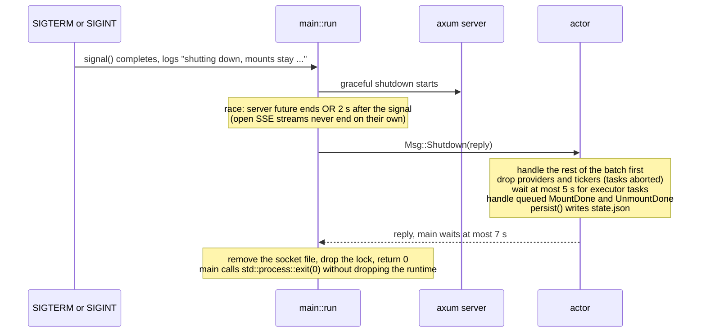
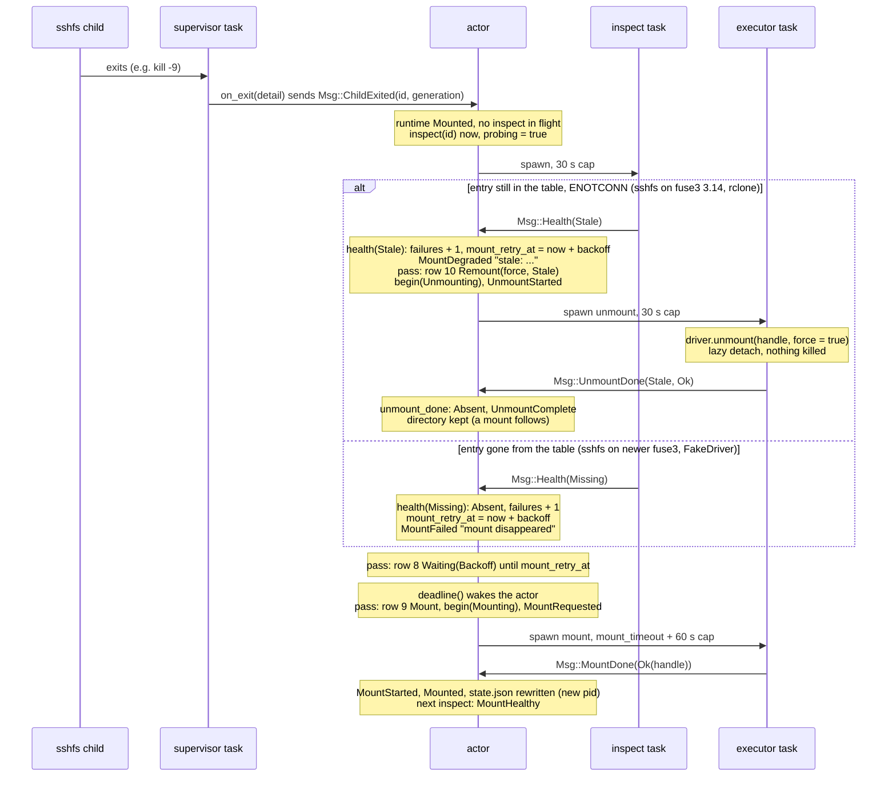
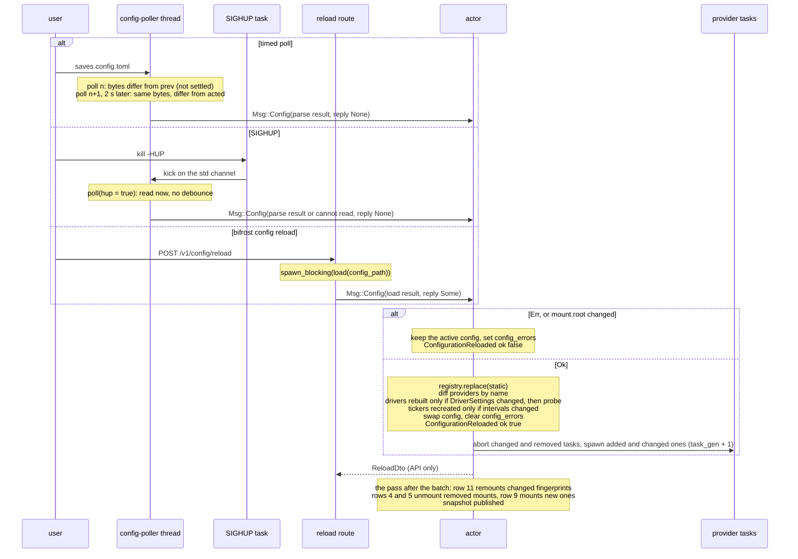

# bifrost-daemon (`bifrostd`)

This guide covers `bifrostd` in depth. It walks through the startup sequence in `main.rs` step by step, with every
failure mode and exit code. It covers the single actor in `actor.rs`: what it owns, how it handles each message,
one reconcile pass, executor tasks and their timeouts, panic catching, tickers, provider tasks, warm-up, holds,
events and the config-apply path. It also covers every HTTP route in `api.rs`, the state.json format in `state.rs`
and the config poller in `reload.rs`, then lists the tests by area. It assumes you have read
[architecture.md](../architecture.md), which gives the system-wide picture (process model, lifecycle, API
summary). This guide is the reference for anyone who changes the daemon. The pure logic the daemon drives
(`decide`, `MountRuntime`, the registry, policy) is documented in [core.md](core.md), and the drivers it calls in
[mount.md](mount.md). The code is the source of truth. Where it departs from `docs/design/contract.md` §5 and §8,
this guide follows the code and says so ([Where the code differs from the contract](#contract-vs-code)).

## Contents

- [At a glance](#at-a-glance)
- [Module map](#module-map)
- [Startup (`main.rs`)](#startup): [invocation](#invocation), [logging](#logging), [the steps in order](#startup-steps), [directories and ownership](#directories), [the lock](#lock), [config at startup](#startup-config), [the socket](#socket), [serving and shutdown](#shutdown)
- [The actor (`actor.rs`)](#actor): [owned state](#owned-state), [`spawn`](#spawn), [the run loop](#run-loop), [messages](#messages), [one pass](#pass), [executor tasks](#executors), [panic catching](#panics), [health and inspect](#health), [tickers](#tickers), [provider tasks and `task_gen`](#providers), [warm-up](#warm-up), [holds](#holds), [events](#events), [config apply](#config-apply), [the snapshot](#snapshot), [persisting state.json](#persist)
- [Sequence: mount, child exit, recovery](#recovery-sequence)
- [The API (`api.rs`)](#api): [routes](#routes), [target resolution](#targets), [the log route](#log-route), [SSE](#sse)
- [state.json (`state.rs`)](#state-json)
- [Config reload (`reload.rs`)](#reload): [the poller](#poller), [`poll` decision table](#poll-table), [SIGHUP](#sighup), [sequence](#reload-sequence)
- [Tracing](#tracing)
- [Deliberate simplifications](#simplifications)
- [Where the code differs from the contract](#contract-vs-code)
- [Changing the daemon](#changing)
- [Tests](#tests)

<a id="at-a-glance"></a>
## At a glance

| | |
|---|---|
| Binary | `bifrostd` (`[[bin]]` in crates/bifrost-daemon/Cargo.toml, `path = "src/main.rs"`); no library target |
| Depends on | `bifrost-core`, `bifrost-config`, `bifrost-discovery`, `bifrost-mount`, axum, tokio, tracing, tracing-subscriber, serde, serde_json, futures-util. Dev-only: `bifrost-client` (tests talk to a real socket). No libc |
| Concurrency | one tokio multi-thread runtime; one actor task owns all domain state; I/O runs in spawned tasks that report through the actor's inbox ([decisions.md#single-actor-daemon](../decisions.md#single-actor-daemon)) |
| Interface | HTTP/1 + JSON over a Unix socket (mode 0600), SSE for events ([decisions.md#http-over-unix-socket](../decisions.md#http-over-unix-socket)) |
| Persistent state | `<state>/state.json` (holds + mount-handle hints; also the transient `state.json.tmp` and any quarantined `state.json.corrupt-<unix>`), `<state>/bifrostd.lock`, `<state>/logs/<id>.log` (written by the drivers), `<state>/rclone/<id>/` (rclone's per-mount VFS cache, written by rclone; may hold writes not yet uploaded, contract A23) |
| Exit codes | 0 clean shutdown; 1 startup failure (runtime, directories, ownership, lock, root, socket); 2 usage or invalid config |
| Tests | 46 unit tests inside the crate (`cargo test -p bifrost-daemon`, about 3 s once built); E2E phases p05, p06, p12, p13a exercise the real binary ([Tests](#tests)) |

<a id="module-map"></a>
## Module map

| File | Owns | Frozen shapes (contract A3, A5) |
|---|---|---|
| crates/bifrost-daemon/src/main.rs | argument handling, the tracing subscriber, `build_provider` (the one place that maps a `ProviderSpec` to a concrete provider), `run`: directories, lock, ownership checks, startup config, root, state.json read, adoption, socket, actor + poller spawn, `axum::serve`, graceful shutdown | the `Deps` construction |
| crates/bifrost-daemon/src/actor.rs | the `Actor`: all mutable domain state, message handling, the reconcile pass, executor/inspect/probe/provider/ticker tasks, the config-apply path, events, the status snapshot, `persist` | `Msg`, `Tick`, `Deps`, `spawn` |
| crates/bifrost-daemon/src/api.rs | `router` and every route handler, `ApiError` → `ErrorDto` mapping, the log tail, the SSE stream | `ApiCmd`, `AppState`, `ApiError` |
| crates/bifrost-daemon/src/state.rs | the `State` type, `read` (with quarantine) and `write` (atomic) | — |
| crates/bifrost-daemon/src/reload.rs | `spawn_poller`: the `config-poller` std::thread, its `Poller` state, the SIGHUP handler | `spawn_poller(path, tx)` |

"Frozen" means the signatures were fixed in stage S0 so that parallel build agents could code against each
other (contract A3). The build is over, so they are no longer locked, but every file still follows the split:
`reload.rs` only *produces* `Msg::Config`, and applying a config is `actor.rs`'s job (contract A4).

`Deps` holds two factories, `drivers: Fn(&DriverSettings) -> Vec<Arc<dyn MountDriver>>` and
`build_provider: Fn(&ProviderConfig) -> Result<Arc<dyn DiscoveryProvider>, String>`. `main` fills them with
`bifrost_mount::drivers` and `main::build_provider`, and the tests fill them with `FakeDriver` and `FakeDiscovery`.
The driver side is a factory rather than a `Vec` (A5) because a reload that changes driver settings rebuilds the
drivers. With a `Vec`, that rebuild would replace the test fakes with real drivers.

<a id="startup"></a>
## Startup (`main.rs`)

<a id="invocation"></a>
### Invocation

| Arguments | Result |
|---|---|
| none | run the daemon |
| `--version` | prints `bifrostd <version>` to stdout, exit 0 |
| `--help` | prints the usage to stdout, exit 0 |
| anything else | prints the usage to stderr, exit 2 |

All other configuration comes from the environment. `BIFROST_CONFIG`, `BIFROST_STATE_DIR` and `BIFROST_SOCKET` are
resolved by `bifrost_config::paths::{config_path, state_dir, socket_path}`
(crates/bifrost-config/src/paths.rs; defaults in [config.md](config.md) and
[architecture.md#filesystem-layout](../architecture.md#filesystem-layout)). `BIFROST_LOG` sets the log level.

<a id="logging"></a>
### Logging

`main` parses `BIFROST_LOG` with tracing's `Level::from_str`, which accepts `error`, `warn`, `info`, `debug` and
`trace` in any case, as well as `1` to `5`. An unset or unparsable value silently means `info`. The subscriber
(`main::subscriber`) writes a `fmt` layer to stderr, with ANSI colours only when stderr is a terminal. Its filter
is `main::log_filter`:

```rust
Targets::new()
    .with_default(level.min(Level::WARN))   // every other crate: capped at warn, lowered further by BIFROST_LOG=error
    .with_target("bifrost", level)          // every bifrost* target (prefix match): exactly BIFROST_LOG
```

**Why an allowlist:** with `BIFROST_LOG=debug`, hickory's debug output would dump raw TXT answers into the daemon
log. Those answers are untrusted and may contain terminal escapes. The allowlist was added in sign-off S3 carry-over
2c and accepted in S4a.2
([decisions.md#log-filter-allowlist](../decisions.md#log-filter-allowlist)). Test: `third_party_debug_logs_capped`.
It checks that a hickory debug line is dropped and a hickory warning is kept, that `BIFROST_LOG=error` lowers
third-party crates to error, and that at `trace` none of hickory, reqwest, hyper_util, rustls, h2 or axum logs at
info.

<a id="startup-steps"></a>
### The steps in order

`main` builds `Deps` and the three paths (`Opts`), creates a `tokio::runtime::Runtime::new()` (multi-thread) and
calls `run(opts, deps, signal())`. Comments in `run` carry the contract §8 step numbers, which are shown in the
last column so you can map them.

| # | Step (function) | On failure: stderr, exit | §8 |
|---|---|---|---|
| 0 | `Runtime::new()` | `bifrostd: runtime: <err>`, 1 | — |
| 1 | `create_dirs(state_dir)`, then `create_dirs(state_dir/logs)` ([directories](#directories)) | `bifrostd: <state_dir>: <err>`, 1 | 2 |
| 2 | `lock(state_dir)`: open `<state>/bifrostd.lock`, `try_lock`, mode check; returns the lock and its owner uid ([the lock](#lock)) | `bifrostd: already running (lock <path>)` or `bifrostd: <path> is writable by group or others` or `bifrostd: <path>: <io err>`, 1 | 3 |
| 3 | `private(state_dir)` and `private(logs)` | `bifrostd: <dir> must be owned by this user and not world-writable`, 1 | 3 |
| 4 | `config(config_path)` ([config at startup](#startup-config)) | each `ConfigError` printed as `error: <path>: <message>` (sorted by `bifrost_config::parse`), 2 | 4 |
| 5 | `create_dirs(cfg.root)`, then `canonicalize()` once | `bifrostd: mount.root <root>: <err>`, 1 | 5 |
| 6 | `private(canonical root)` | `bifrostd: mount.root <root> must be owned by this user and not world-writable`, 1 | 5 |
| 7 | `state::read(state_dir)` ([state.json](#state-json)) | never fails: a bad file is quarantined | 6 |
| 8 | `bifrost_mount::table::read()` then `bifrost_mount::adopt(&table, &root, &st.mounts)` | a table read error is a warning (`mount table: <err>; adopting nothing`) | 7 |
| 9 | `bind_socket(socket, uid)` ([the socket](#socket)) | see the socket table, 1 | 9 |
| 10 | `actor::spawn(cfg, loaded, root, state_dir, socket, st.held, adopted, deps)`: builds and probes the drivers, applies the config, spawns providers and tickers, inspects adopted mounts, runs the first pass ([`spawn`](#spawn)) | — | 8, 10 |
| 11 | `reload::spawn_poller(config_path, tx)`: poller thread, then the SIGHUP handler ([reload](#reload)) | a failed thread spawn only warns | 10 |
| 12 | `axum::serve(listener, api::router(app)).with_graceful_shutdown(…)`; logs `bifrostd <version> listening` with the socket path | — | 10 |

These startup failures were confirmed against the built binary: the usage exit 2, the 103-byte socket message
with exit 1, a relative socket path with exit 1, and an invalid TOML with exit 2 and
`error: <file>:1:7: unclosed table, expected ']'`.

The ordering matters in three places:

- **The lock comes before everything that writes.** Only the directories are created before it, because the lock
  file lives inside the state dir.
- **The config comes before the root.** The root comes from the config. An invalid config therefore exits with
  code 2 before anything touches `mount.root` or the socket.
- **Adoption comes before the socket.** Clients can't observe the daemon until its first snapshot already
  reflects the adopted mounts, because `spawn` runs the first pass before it returns.

A consequence: the SIGTERM/SIGINT handlers are installed only when axum first polls the `stop` future (step 12),
and the SIGHUP handler only in step 11. Until then these signals keep their default action, which terminates the
process. The actor and the probe task already run on the runtime's workers by then, so this is a likely ordering,
not a guarantee: mounts are unlikely to have started yet, and any that have survive (their own process group,
`kill_on_drop(false)`) and are adopted on the next start. So it is harmless.

<a id="directories"></a>
### Directories and ownership

`create_dirs(p)` walks `p`'s ancestors from `/` down to `p` and calls `DirBuilder::new().mode(0o700).create(d)` on
each one:

- It chmods to 0700 **only the components it created**, with `set_permissions`, because the umask may have masked
  the mode. A pre-existing directory is never touched. So `BIFROST_SOCKET=$HOME/b.sock` never chmods `$HOME`
  (contract A21).
- `AlreadyExists`, or any error on a path that `is_dir()`, counts as "existed". macOS `mkdir("/")` returns
  `EISDIR`, not `EEXIST`, which is the same fallback `std::fs::create_dir_all` uses.
- It returns whether `p` itself already existed.

`private(p, uid)` returns true when `p` is owned by `uid` and not world-writable (`mode & 0o002 == 0`). Group-write
is deliberately allowed, because a umask-002 system (user-private groups) creates 0775 directories. Where the check
applies:

| Directory | Checked |
|---|---|
| state dir, `<state>/logs` | always (one the daemon just created passes trivially) |
| canonical `mount.root` | always |
| socket parent | only when it already existed |

**Why:** another local user who can write one of these directories can attack the daemon's user:

- **The root.** They could swap `<root>/<id>` for a symlink between `mkdir` and the mount, or pre-mount
  `<root>/<id>` with our marker (contract §11; sign-off S4a.9, test `world_writable_root_refused`).
- **`logs/`.** They could replace it with a directory of their own holding `<id>.log -> <a file of ours>`. The
  driver opens the child log with create+truncate, so it would clobber that file (sign-off S4a.12, test
  `world_writable_state_dirs_refused`).

**Limit (a `ponytail:` comment in `run`):** ancestors of these directories are not checked, and neither is a group
shared with other users. The upgrade path is to walk the ancestors and also test `0o020`.

The decision, with the alternatives rejected (chmodding every component; checking `0o022`), is
[decisions.md#private-state-and-socket-dirs](../decisions.md#private-state-and-socket-dirs).

<a id="lock"></a>
### The lock

`lock(state_dir)`:

1. Opens `<state>/bifrostd.lock` with `create(true)`, `truncate(false)`, `write(true)` and `mode(0o600)`. The mode
   applies only when the file is created.
2. Calls `File::try_lock()`, an exclusive advisory lock from std, which is why `rust-version = "1.89"` in the
   workspace. `WouldBlock` means `already running (lock <path>)`. The kernel drops the lock with the process,
   crash included, so a stale lock file never blocks a restart. std opens files close-on-exec, so the surviving
   mount children never inherit it.
3. Refuses a lock file that is group- or other-writable (`mode & 0o022 != 0`).
4. Returns `(File, owner uid)`. The owner uid is the reference for every `private` check.

**Where the uid comes from:** the crate has no libc dependency and std has no `getuid()`, so the reference is the
lock file the daemon has just opened. The reasoning in the code comment on `lock`: a file opened for writing that
is not group- or other-writable is owned by this user. Hence step 3: a hostile pre-created
0666 lock file would otherwise make an attacker's uid the reference, and an attacker-owned state dir would pass
the ownership check (commit 6f0411e). Test: `second_instance_lock_refused`.

The lock is **per state dir**. Two daemons with different `BIFROST_STATE_DIR` values can run at once. The socket
check below keeps them from stealing each other's socket.

<a id="startup-config"></a>
### Config at startup

`main::config(path)`:

| File at `path` (`std::fs::metadata`, which follows symlinks) | Result | `cfg_loaded` |
|---|---|---|
| does not exist | warn `no config at <path>: running the empty default until it is written`; `bifrost_config::parse("", path, env)`. This can still fail: with `HOME` unset or empty, the default root `~/machines` can't expand, and the daemon prints `error: mount.root: undefined variable $HOME` and exits 2 | `false` |
| a regular file of 0 bytes | warn `empty config at …`; the same empty default (and the same `HOME` failure) | `false` |
| anything else, including a FIFO such as `BIFROST_CONFIG=<(…)`, which reports length 0 but is not a regular file | `bifrost_config::load(path)`: `Ok` loads it, `Err` exits 2 | `true` |

**Why a missing config is not an error:** a first run should just work, so the daemon runs the empty default,
whose root is `~/machines`. The poller picks up the file once it is written. That default still goes through
`parse`, so a service manager that starts `bifrostd` without `HOME` gets exit 2 (confirmed against the built binary
under `env -i`); by then the state dir, `logs/` and `bifrostd.lock` have already been created. **Why `cfg_loaded` matters:** with
the empty default and `ready` true, every mount adopted from the mount table would be "not desired" and get
unmounted. So `ready` stays false until a file has actually loaded (contract A6, critique A.6; test
`missing_config_never_unmounts_adopted`). **Why a 0-byte file counts as missing:** a save cut short (a crash in the
middle of a `>` redirect) must not make adopted mounts removable (commit 3b903ac; test
`empty_config_file_not_loaded`). **Why an invalid config exits:** a daemon running an empty config would unmount
everything, so it prints the errors and exits 2 instead
([decisions.md#config-deterministic-validation](../decisions.md#config-deterministic-validation)).

**Limit (`ponytail:` on `config`):** a typo in `BIFROST_CONFIG` silently runs with no machines (only a warning is
logged). A file that appears later with a `mount.root` other than `~/machines` is rejected by the root-change rule
([config apply](#config-apply)) and needs a restart. The upgrade path is an opt-in `--require-config`. The decision is
[decisions.md#missing-config-empty-default](../decisions.md#missing-config-empty-default).

<a id="socket"></a>
### The socket

`bind_socket(path, uid)` checks, in order:

| Condition | Result |
|---|---|
| `path` longer than 103 bytes | `socket path is <n> bytes, over the 103-byte limit: <path>` (`sun_path` is 104 bytes on macOS, including the NUL) |
| not absolute, or has no parent | `socket path must be absolute: <path>` |
| parent missing | created with `create_dirs` (0700 for the created components) |
| parent pre-existing and not `private` | `<parent> must be owned by this user and not world-writable` |
| a socket already at `path` and `UnixStream::connect` succeeds | `<path> is in use by another bifrostd` (**not** removed) |
| a socket at `path` that nothing answers | removed (a crashed daemon's leftover) |
| something else at `path` (file, directory, symlink) | `<path> exists and is not a socket` (never removed) |
| — | `UnixListener::bind`, then `set_permissions(0o600)` on the socket, always |

**Why connect before unlinking:** contract §8 argued that the lock guarantees any socket is stale. That holds only
for the same state dir. The lock is per state dir and the socket is per `BIFROST_SOCKET`, so a live socket can
belong to another daemon (commit 6f0411e). **Why 0600:** the socket mode plus the ownership-checked directories
are the API's only access control. The API is for the daemon's own user
([security.md](../security.md)). Tests: `preexisting_parent_dirs_not_chmodded` (A21, a live socket kept, a
non-socket kept, the 103-byte message) and `socket_0600_stale_replaced`.

<a id="shutdown"></a>
### Serving and shutdown



- **Nothing is unmounted.** The children run in their own process group (`process_group(0)`) with
  `kill_on_drop(false)` and write to a log file, so they keep serving, and the next start adopts them. A
  restart and a crash therefore take the same, tested path
  ([decisions.md#no-pid-signalling-lazy-detach](../decisions.md#no-pid-signalling-lazy-detach),
  [decisions.md#adoption-by-marker-and-fingerprint](../decisions.md#adoption-by-marker-and-fingerprint)).
  `ponytail:` on `run`: a stopped daemon leaves its mounts unsupervised until the restart. The upgrade path is
  `bifrost unmount <all>` before stopping. Under systemd, adoption needs `KillMode=process` (README).
- **Why `std::process::exit` without dropping the runtime:** dropping a tokio runtime waits for its blocking-pool
  threads. A liveness probe stuck on a hung FUSE mount would then hold up the exit indefinitely
  ([decisions.md#hung-fuse-guards](../decisions.md#hung-fuse-guards)).
- **Executors past the 5 s wait** are aborted when the actor returns, because dropping a `JoinSet` aborts its
  tasks. A mount child that was already spawned survives. On the next start, step-8 adoption picks up its marker
  mount if it is in the mount table by then (with `pid` unknown when its `MountDone` never reached state.json).
  `mount()` step 2 (adopt or detach) is the fallback for an entry that appears after that table read (contract
  A9, [mount.md](mount.md)).
- If the server future itself ends with an error, `run` logs `api: <err>` and runs the same shutdown, which exits 0.
- Test: `shutdown_writes_state_and_leaves_mounts`. The driver saw only `mount a`, state.json records the handle
  (`sshfs`, `<root>/a`) and the socket is gone. The test waits until `a` is `Mounted` before it stops the daemon,
  so no `MountDone` is in flight.
- A `MountDone` queued behind the `Shutdown` in the same batch still reaches state.json, so the recorded pid
  survives a restart. `Actor::run` handles the whole batch first, and `Actor::shutdown` handles any
  `MountDone`/`UnmountDone` still queued after its wait (commit 73237db). No unit test covers this case.

<a id="actor"></a>
## The actor (`actor.rs`)

One task owns every piece of mutable domain state, so no domain state needs a lock. Everything that waits on the
outside world runs in another task and reports back as a `Msg`. **The actor never awaits I/O and never touches
a mount path.** Two calls do blocking file I/O on the actor anyway
([decisions.md#single-actor-daemon](../decisions.md#single-actor-daemon)):

- `persist` writes state.json synchronously ([persisting state.json](#persist)).
- `start_provider` calls `deps.build_provider` on the actor. For an `http` provider that is `HttpProvider::new`
  (crates/bifrost-discovery/src/http.rs), whose `reqwest::ClientBuilder::build()` loads the system root
  certificates from disk (reqwest's `rustls-tls-native-roots` feature, set in the workspace Cargo.toml). This runs
  whenever an `http` provider is (re)built: the startup apply, a reload that adds, changes or retries it, and a
  fallback-tick retry. A slow disk or certificate store stalls the actor for that long. The other factories do no
  I/O (`SshfsDriver::new`, `RcloneDriver::new`, `TailscaleProvider::new`, `DnsProvider::new`). The upgrade path
  is to build in `spawn_blocking` and send the result back as a message.

The pure decision logic the actor calls (`reconcile::desired`, `plan`, `decide`, the `MountRuntime` transitions,
`next_wakeup`) lives in `bifrost-core`, so it can be tested without a runtime
([decisions.md#pure-planner-decision-table](../decisions.md#pure-planner-decision-table), [core.md](core.md)).

<a id="owned-state"></a>
### Owned state

`struct Actor`:

| Field | Meaning |
|---|---|
| `cfg: Arc<Config>` | the active config; swapped whole by `apply` |
| `cfg_loaded_at: Option<Instant>` | the first successful config load; `None` while the empty default of a missing file runs (A6). Start of the warm-up grace window |
| `ready: bool` | warm-up done; latches ([warm-up](#warm-up)) |
| `root` | the canonical mount root (fixed for the process lifetime) |
| `state_dir`, `socket` | paths, for logs/state.json and `StatusDto.socket` |
| `started` | `uptime_secs` |
| `passed_at` | the `now` of the last pass; `deadline()` measures from it |
| `deps: Deps` | the two factories |
| `tx` | a clone of the inbox sender, handed to every task it spawns (so the inbox never closes while the actor lives) |
| `events: broadcast::Sender<EventRecord>` | capacity 256; the SSE route subscribes |
| `registry: MachineRegistry` | observations by machine id and source ([core.md](core.md)) |
| `runtimes: BTreeMap<MountId, MountRuntime>` | one per mount that exists or has a pending retry |
| `created: u64` | runtimes created by `start_mount` so far (adopted ones excluded); seeds generations |
| `held: BTreeSet<MountId>` | persisted holds (user intent) |
| `drivers: BTreeMap<String, Arc<dyn MountDriver>>` | built by `Deps.drivers`, keyed by `name()` |
| `settings: Option<DriverSettings>` | the settings the drivers were last built with |
| `probes: BTreeMap<String, DriverAvailability>` | the latest probe results |
| `providers: BTreeMap<String, Provider>` | one per configured network provider (below) |
| `tickers: Vec<Task>`, `tick_every` | the health and fallback tickers and the intervals they run at |
| `allowed: BTreeSet<MachineId>` | machines `Allowed` at the previous pass (for `MachineEligible`) |
| `machines`, `candidates`, `conflicts`, `plan` | the last pass's view: API target resolution and the snapshot read it |
| `config_errors: Vec<String>` | the last rejected config's errors; cleared by a successful apply |
| `ring: VecDeque<EventRecord>`, `seq` | the last 200 events (in the snapshot) and the event counter (first event is 1) |
| `execs: JoinSet<()>` | mount and unmount executor tasks |
| `reconciles`, `answer` | `POST /v1/reconcile` replies waiting for a re-probe, then for the pass after it |
| `saved: Option<State>` | what state.json holds now (skip identical writes) |

`struct Provider` holds `cfg: ProviderConfig`, `task_gen: u64` and `task: Option<Task>` (None when the build
failed), plus `notify: Arc<Notify>` (`POST /v1/discover`) and the status fields `refreshes`, `last_ok`,
`last_error` and `reported` (a non-empty `Ok` arrived at least once). `Task(JoinHandle<()>)` aborts its task on
`Drop`, so replacing or dropping a `Provider`, or clearing `tickers`, kills the task. No explicit abort bookkeeping
is needed.

<a id="spawn"></a>
### `spawn`

`actor::spawn(cfg, cfg_loaded, root, state_dir, socket, held, adopted, deps)`, called from inside the runtime:

1. Creates the inbox (`mpsc::unbounded_channel`) and the events broadcast (256).
2. Builds `Actor` with `runtimes` = one `MountRuntime::adopted(handle)` per adopted mount (`Mounted`, health
   `Unknown`, `adopted = true`, generation 0).
3. `apply(Ok(cfg), now, Some(cfg_loaded))`: the **same config-apply path as every reload** (A4). It fills the
   static observations, spawns provider tasks, builds the drivers through the factory, spawns the first probe
   and spawns the tickers ([config apply](#config-apply)).
4. `health_round()`: adopted mounts are inspected at t = 0.
5. `pass(now)`: the first pass. No probe has answered yet, so every new candidate's driver selection fails and it
   waits in row 6. The snapshot shows those mounts as `eligible` with detail `probing drivers`, and every driver
   as `probing` ([the snapshot](#snapshot)). The pass that follows `Msg::Probed` mounts them.
6. Creates the `watch` channel with that first snapshot, so the snapshot is never a placeholder, and spawns
   `Actor::run`.

It returns the inbox sender, the snapshot receiver, the events sender and the actor's `JoinHandle`.

<a id="run-loop"></a>
### The run loop

`Actor::run` loops over a `tokio::select!` with three branches:

| Branch | Effect |
|---|---|
| `rx.recv()` | a message starts a batch |
| `sleep_until(self.deadline())` | a deadline starts an empty batch |
| `Some(r) = self.execs.join_next()` | reaps a finished executor; a `JoinError` (cancellation, or a panic outside `caught`) is logged as `executor task failed`; then `continue` with **no pass** |

For a batch it:

1. drains every queued message with `try_recv`;
2. handles each one with the same `now`, and sets aside a `Msg::Shutdown` until the rest of the batch has been
   handled;
3. on shutdown, runs `shutdown()`, replies and returns. Otherwise it runs exactly one `pass(Instant::now())`;
4. publishes `status.send_replace(Arc::new(self.snapshot(now)))` after **every** batch, whether or not anything
   changed. Tests wait on this with `watch::Receiver::wait_for`;
5. answers every waiting reconcile in `answer` with the plan of that pass, as `Vec<ActionDto>`.

**`deadline()`** is the earliest of `reconcile::next_wakeup(&runtimes, grace, passed_at)` (mount backoff while
`Absent`, unmount backoff or `degraded_since + grace` while `Mounted`) and, while `!ready` and once a config has
loaded, `cfg_loaded_at + grace`. It counts only instants strictly after `passed_at`. A deadline that passed
without its row acting (for example `Absent` but offline, so row 7 wins over the expired backoff) therefore can't
make the actor spin. Every wake runs a pass, which moves `passed_at` past the deadline that woke it (sign-off S1.1;
test `next_wakeup_never_spins`, at most 2 passes in 1 s). There is no registry-expiry deadline (contract E3):
passes run on every provider result and expiry is at least `3 × interval`, so expiry is accurate to one interval.

`ponytail:` on `run`: there is no explicit suspend/wake detector. `Instant` excludes suspend on Linux and macOS,
so grace timers don't count sleep, and after a resume the tickers probe every mount within one interval.

<a id="messages"></a>
### Messages

`Actor::handle(msg, now)`, per variant:

| `Msg` | Sent by | Handling | Gate |
|---|---|---|---|
| `Discovery{provider, task_gen, result}` | provider task | `Actor::discovery`: `refreshes += 1`. `Ok`: `last_ok = now`, `last_error = None`, `reported \|= !obs.is_empty()`, `registry.apply_ok(source, obs, now, floor = 3 × interval)`, then `MachineDiscovered` for new ids. `Err`: `last_error = clean(e, 512)` (a warning is logged only when the text changes), `registry.mark_failed(provider)` (freeze, not drop) | dropped unless a provider of that name exists **and** its `task_gen` matches |
| `MountDone{id, generation, result}` | mount executor | `MountRuntime::mount_done(generation, result, now, timing, random_u64())`; its event is stamped and emitted | inside core: generation equal and phase `Mounting` |
| `UnmountDone{id, generation, why, result}` | unmount executor | `MountRuntime::unmount_done(…)` | generation equal and phase `Unmounting` |
| `Health{id, generation, state}` | inspect task | `rt.probing = false` **first**, then `MountRuntime::health(…)` | generation equal and phase `Mounted` (the in-flight flag is cleared regardless) |
| `ChildExited{id, generation, detail}` | the driver's supervisor through `on_exit` | logs `mount process exited` (info, with `detail`, e.g. `signal: 9 (SIGKILL)`); if the runtime is `Mounted`, `inspect(id)` now. No state change | phase only, **not** generation (below) |
| `Probed(map)` | probe task | `DriverUnavailable` for each driver that goes `Available` → `Unavailable`; `probes = map`; moves `reconciles` into `answer` | — |
| `Config{result, reply}` | poller thread, `POST /v1/config/reload` | `apply(result, now, None)`; replies with the `ReloadDto` if `reply` is `Some` | — |
| `Api(cmd)` | API routes | `Actor::api` ([routes](#routes)) | — |
| `Tick(Health)` | health ticker | `health_round()`: `inspect` every runtime | — |
| `Tick(Fallback)` | fallback ticker | every provider with `task == None` gets `task_gen += 1` and `start_provider` (a build retry); then `probe()` | — |
| `Shutdown(reply)` | `main::run` | taken by `run`, never by `handle` | — |

**Why `ChildExited` is not generation-gated:** the `on_exit` closure captures the generation of the mount that
spawned the child. A failed unmount (busy) calls `begin(Unmounting)` and then returns to `Mounted` at a newer
generation. If the child then dies, a generation check would drop the exit, and the death would wait for the next
health tick. A stale exit costs at most one harmless inspect. While `Unmounting`, the exit is ignored, because
the child exiting is the expected result of our own unmount (commit 6f0411e; tests `exit_after_failed_unmount_probed`,
`exit_during_unmount_ignored`). **Why every other result is generation-gated:** see
[decisions.md#generations-for-stale-results](../decisions.md#generations-for-stale-results) and
[core.md](core.md).

<a id="pass"></a>
### One pass

`Actor::pass(now)`, in order:

1. `passed_at = now`.
2. `registry.expire(now)` → `MachineLost` for every id that is gone. A failing provider's observations never
   expire.
3. `machines = registry.machines(&cfg.policy)`: merged observations plus a verdict per machine
   ([decisions.md#policy-semantics](../decisions.md#policy-semantics)).
4. `MachineEligible{machine, via}` for each machine that is `Allowed` now and was not at the previous pass. Then
   `allowed` is replaced with the new set.
5. `reconcile::desired(&DesiredInput{root, machines, static_mounts: cfg.static_mounts(), templates: cfg.templates(),
   held, auto_order, probes})` → `candidates` and `conflicts`. Policy and templates are read from the active
   config on every pass, so a reload needs no separate "rebuild policy" step.
6. `reconcile::plan(&PlanInput{now, ready: self.ready(now), grace, candidates, runtimes})`. `ready(now)` may latch
   here.
7. Executes each side-effect action: `Mount{driver}` → `start_mount`; `Unmount{force, why}` and
   `Remount{force, why}` → `start_unmount`. A `Remount` executes exactly like an unmount, and the new mount comes
   from row 9 on a later pass, so the offline and backoff gates still apply.
8. Drops runtimes that are `Absent` with no future `mount_retry_at` and no un-held candidate (row 2). A desired
   `Absent` runtime is kept, and so is its `failures` count.
9. `plan` is stored for the snapshot and the reconcile reply, and `persist()` runs.

Every side-effect action calls `MountRuntime::begin` **before** its task is spawned. A pass that runs while the
operation is in flight therefore sees row 1 (`Waiting(InFlight)`), and `plan` stays idempotent (contract §5
"Idempotency argument"; test `mounts_desired_on_startup_and_idempotent`).

<a id="executors"></a>
### Executor tasks and timeouts

| Task | Spawned by | Bound | On timeout | Reports |
|---|---|---|---|---|
| mount | `start_mount`, into `execs` | `mount_timeout + 60s` (A9: covers the 15 s ssh preflight, the `mount_timeout` readiness wait and the driver's own 10 s lazy detach) | `MountError::Failed("timed out after <n>s")` | `Msg::MountDone` |
| unmount / remount | `start_unmount`, into `execs` | 30 s | `MountError::Failed("unmount timed out after 30s")` | `Msg::UnmountDone` |
| inspect | `inspect`, plain `tokio::spawn` | 30 s (drivers answer within about 5 s even on a hung mount; this cap only guards a driver bug) | `MountState::Degraded("inspect timed out")` | `Msg::Health` |
| probe | `probe`, plain `tokio::spawn`; every driver concurrently (`join_all`) | none here; each driver bounds its own probe commands ([mount.md](mount.md)) | — | `Msg::Probed` |
| discovery | `start_provider` → `discover_loop` | 30 s per `discover()` | `DiscoveryError::Failed("timed out after 30s")` | `Msg::Discovery` |

**`start_mount(id, driver)`** returns early unless both a candidate and a driver object exist. It then does the
following:

1. Creates the runtime on first use: `created += 1`, then `generation = created << 32`. The first created runtime
   therefore starts at `1 << 32`, never at 0, which is the seed of adopted runtimes (`MountRuntime::adopted`), and
   `created` counts only runtimes created here. A late result addressed to a dropped runtime can never match a
   later runtime with the same id.
2. `begin(Mounting)`, then emits `MountRequested{driver}`.
3. Builds the `on_exit` callback. It captures `(id, generation)` and does an unbounded `send` of
   `Msg::ChildExited`. It must never block, because the driver's supervisor calls it synchronously.
4. Builds `MountRequest{spec, log_path: <state>/logs/<id>.log, on_exit}`.
5. Spawns the executor inside the `mount_op` span.

If the outer timeout fires while `mount()` is still running, the dropped attempt may leave our marker mount at the
path. The next `mount()` adopts it (same fingerprint) or detaches it (older spec) at step 2, so the path never
stays `Refused` (A9).

**`start_unmount(id, force, why, action)`** needs a runtime with a handle. It calls `begin(Unmounting)` and emits
`UnmountStarted{reason: action.to_string()}` (for example `unmount (not desired)`, `remount (stale, force)`,
`unmount (offline grace, force)`). If the handle's driver has a driver object, it uses that driver's `unmount`.
Otherwise it falls back to `bifrost_mount::unmount_path(local_path, force)`. After a successful unmount whose
`why` is `NotDesired`, `Manual` or `OfflineGrace`, it removes `<root>/<id>` with `std::fs::remove_dir`, which is
never recursive and only removes an empty directory. It does this inside `spawn_blocking`, and only when the mount
table reads fine and shows no mount at that path
([decisions.md#mount-table-not-path-existence](../decisions.md#mount-table-not-path-existence)). It never does
this after `Stale` or `SpecChanged`, because a new mount follows. A busy graceful unmount comes back as
`UnmountDone{Err(Busy)}`: the mount stays `Mounted`, shows `unmount blocked: busy (files open)` and is retried
after a backoff, never forced automatically
([decisions.md#busy-unmount-never-forced](../decisions.md#busy-unmount-never-forced); test
`api_unmount_busy_stays_degraded`).

**Why `OfflineGrace` also removes the directory:** row 7 keeps an offline peer unmounted. If the peer is then
deleted from discovery, nothing else would ever remove `<root>/<id>`. The next mount recreates the directory
(sign-off S4a.9; test `offline_grace_unmount_removes_empty_dir`).

`ponytail:` on `start_mount`: there is no concurrency cap on mount operations. Dozens of simultaneous auto-mounts
each spawn ssh at once. The upgrade path is a tokio `Semaphore` in the executor.

<a id="panics"></a>
### Panic catching

`caught(what, call, on_panic)` wraps the future in `AssertUnwindSafe(...).catch_unwind()`. A panic, whether at
call time or at poll time, becomes `on_panic("<what> panicked: <message>")`, with the message `clean`ed to 512
characters. Each call site maps it to an ordinary outcome:

| Call site | A panic becomes |
|---|---|
| `driver.mount` (executor) | `MountDone{Err(Failed("driver panicked: …"))}` at the executor's generation: backoff, then a retry |
| `driver.unmount` / `unmount_path` (executor) | `UnmountDone{Err(Failed(…))}`: back to `Mounted`, unmount backoff |
| `driver.inspect` | `MountState::Degraded("driver panicked: …")` |
| `driver.probe` | `DriverAvailability::Unavailable("driver panicked: …")` |
| `provider.discover` | `DiscoveryError::Failed("provider panicked: …")` (freeze) |

**Why:** before this change, a panicking executor task never sent its `MountDone`. Its runtime then sat in
`Mounting` (row 1) forever. The release profile keeps unwinding (no `panic = "abort"` in the workspace
Cargo.toml), so catching works (sign-off S2.2 and S3 carry-over 2a, accepted in S4a.3;
[decisions.md#panics-caught-at-driver-boundary](../decisions.md#panics-caught-at-driver-boundary); test
`executor_panic_recovers`, where the mount shows `failed` with `driver panicked: fake: panic_next`, then remounts).
Nothing restarts the actor task itself. A panic in actor code drops the inbox, after which GET routes keep serving
the last snapshot and every POST returns 503.

<a id="health"></a>
### Health and inspect

`inspect(id)` acts only on a runtime that is `Mounted`, has a handle, has no inspect in flight (`probing`) and has
a driver object for `handle.driver`. An adopted handle whose driver is not built can't be inspected. `inspect`
sets `probing = true` and spawns the task inside `debug_span!("health", mount_id)`. The task sends
`Msg::Health{id, generation: rt.generation, state}`. There are three triggers:

- `health_round` on every `Tick::Health`;
- `health_round` once in `spawn`, which inspects adopted mounts at t = 0;
- `ChildExited` for a `Mounted` runtime.

Adopted mounts have no supervisor: the daemon never held their `Child`. The health tick is therefore what notices
their death.

The transitions that follow a `Health` message (`Healthy`, `Degraded`, `Stale`, `Missing`) are core's
`MountRuntime::health` ([core.md](core.md)). The hung-FUSE guarantees behind "an inspect always answers" are
in [mount.md](mount.md) and [decisions.md#hung-fuse-guards](../decisions.md#hung-fuse-guards).

<a id="tickers"></a>
### Tickers

`ticker(tx, every, tick)` spawns a `Task` with `tokio::time::interval_at(now + every, every)` and
`MissedTickBehavior::Delay`. The first tick comes one interval after the ticker (re)starts. Each tick sends
`Msg::Tick`, and the ticker exits when the inbox is closed. `apply` recreates both tickers only when
`(health_interval, reconcile_interval)` changes, so an interval edit takes effect on reload (sign-off S2.1).

| Ticker | Default | Does |
|---|---|---|
| `Tick::Health` | `daemon.health_interval` 15 s | inspect every mounted runtime |
| `Tick::Fallback` | `daemon.reconcile_interval` 60 s | rebuild providers that have no task, re-probe the drivers; the batch's pass follows (and the pass after `Probed` uses the fresh probes) |

`ponytail:` on `probe`: drivers are re-probed only at startup, on every config apply, on the fallback tick and on
`POST /v1/reconcile`. A freshly installed tool is therefore seen within `reconcile_interval`.

<a id="providers"></a>
### Provider tasks and `task_gen`

`discover_loop(provider, name, task_gen, every, notify, tx)` runs the following loop:

```text
loop {
    result = timeout(30s, caught(discover()))   // discover FIRST (A7): the first result doesn't wait an interval
    tx.send(Msg::Discovery{provider, task_gen, result})  // stop when the inbox is closed
    select! { sleep(every) , notify.notified() }        // interval, or POST /v1/discover
}
```

`every` is the provider's own `interval`, which defaults to `daemon.discovery_interval` (30 s). Every config
duration is at least 1 s. Each loop runs inside `info_span!("discovery", provider, kind)`.

**Why discover first:** with `sleep` first, the first result would arrive only after a full interval, which would
also delay warm-up (critique A.7). **`POST /v1/discover`** calls `notify_one()` on every provider's `Notify`. If
the task is in the middle of a refresh, tokio stores one permit, so the next `select!` completes immediately.
The request is not lost, and repeated requests collapse into a single extra refresh.

**`task_gen`:** a provider's task generation. The callers bump it before they call `start_provider`: `apply`
(`p.task_gen += 1` for an added, changed or task-less provider) and the `Tick::Fallback` arm of `handle`.
`start_provider` only reads it and passes it to `discover_loop`. Each `Msg::Discovery` carries the generation of
the task that sent it. `Actor::discovery` drops a result unless the
provider still exists and its `task_gen` matches. This covers results from an aborted task that were already in
the inbox, and results from a removed provider (test `stale_task_gen_dropped`). `abort()` alone can't guarantee
this: a result sent just before the abort is already queued.

**`start_provider(p)`:** sets `p.task = None` (aborting the old task), then calls `deps.build_provider(&p.cfg)`.

- **Ok:** spawns `discover_loop` in its span.
- **Err:** `last_error = clean(e, 512)` and `registry.mark_failed(name)`. No task is spawned, so the provider
  never reports, and warm-up waits for the grace period (B11). The build is retried on the next apply,
  **including an unchanged reload** (`task.is_none() || cfg != new`), and on every fallback tick (sign-off S4a.7
  and S4a.8; tests `reload_retries_failed_provider_build`, `fallback_tick_retries_failed_provider_build`).

A provider's status fields (`refreshes`, `last_ok`, `last_error`, `reported`) survive a respawn, and `start_provider`
does not clear `last_error`. The next `Ok` refresh does. `refreshes` counts every completed refresh, `Ok` or `Err`.
The CLI's `discover` command polls it.

**Frozen providers.** A provider is marked failing, and its observations stop expiring until its next `Ok` (which
`apply_ok` clears), in three cases:

- a failed refresh (`Err` or timeout);
- a panic in `discover`;
- a failed build.

**Why freeze instead of drop:** a flaky inventory or DNS outage must not unmount every machine it reported
(contract §14 risk 5; the `MachineRegistry::mark_failed` comment in crates/bifrost-core/src/registry.rs). **Why a
failed build freezes too:** a changed provider keeps its old observations until they expire. If its rebuild fails
(a URL or header that `config check` accepts but reqwest rejects), no refresh ever runs to mark it failing, and
those observations would age out and unmount its machines. The code comment in `start_provider` cites PRD §27
for this: an invalid new config must not destroy the currently working configuration. Sign-off S4a.9; test
`reload_unbuildable_provider_freezes_observations`. **Limit:** a permanently failing provider freezes
its last view forever (§15 #30, [simplifications.md](../simplifications.md)).

`ponytail:` on `discover_loop`: provider intervals have no jitter, so provider polls are synchronised. The upgrade
path is ±10% jitter. The same comment notes that one `failures` counter covers both mount and unmount.

<a id="warm-up"></a>
### Warm-up and `ready`

```rust
fn ready(&mut self, now) -> bool {
    let all = self.providers.values().all(|p| p.reported);       // vacuously true with no network providers
    self.ready |= self.cfg_loaded_at.is_some_and(|t| all || now >= t + grace);
    self.ready                                                    // latches
}
```

- `false` until a config file has loaded (A6). The empty default of a missing file never sets `cfg_loaded_at`.
- Then `true` once every network provider has returned a **non-empty** `Ok` at least once (A18: an NXDOMAIN on a
  DNS index is `Ok(vec![])` and must not count), **or** once `offline_grace_period` (default 5 min) has passed
  since `cfg_loaded_at`. A static-only config is ready in its first pass.
- `cfg_loaded_at` is the spawn time when a file existed at startup. Otherwise it is the moment the first
  `Msg::Config` with `Ok` is applied (poller, SIGHUP or API). Measuring from the load keeps a late config from
  being ready before any provider has reported.
- `deadline()` wakes the actor at `cfg_loaded_at + grace`, so the grace expiry acts even when nothing else happens.

While `!ready`, `decide` blocks row 4 (removing an un-held, undesired mount) and row 11 (a spec-change remount),
and shows `waiting (warming up)` and `degraded (change pending: warming up)`. Rows 3, 10 and 12 still act, mounting
(row 9) is never blocked, and neither is a held unmount of a mount that has a candidate. A held *adopted* mount
with no candidate yet is not seen as held by `decide`, so its graceful unmount waits for `ready`, while `--force`
still goes through row 3 (sign-off S1.8). **Why:** after a restart the registry is empty, so every
adopted mount looks undesired until discovery has actually worked
([decisions.md#warm-up-readiness](../decisions.md#warm-up-readiness),
[architecture.md#warm-up](../architecture.md#warm-up)). Tests: `warmup_protects_adopted_until_ok`: not ready on an
`Err` or an empty `Ok`, then a non-empty `Ok` makes it ready and the unwanted adopted mount is unmounted
gracefully. And `missing_config_never_unmounts_adopted`: a 1 s grace does not run while unloaded, and it starts
when the file appears.

<a id="holds"></a>
### Holds

A hold is a persisted "keep this unmounted", keyed by mount id.

| Source | Effect |
|---|---|
| startup | `held` comes from state.json and is **authoritative** (user intent), unlike the mount records, which are hints ([decisions.md#state-json-is-a-hint](../decisions.md#state-json-is-a-hint)) |
| `POST …/unmount` | `api_unmount` inserts the ids and sets `force_requested \|= force`. It also clears `unmount_retry_at`, so an explicit request acts on the next pass instead of waiting out a busy backoff (sign-off S4a.10; test `api_force_unmount_skips_busy_backoff`) |
| `POST …/mount` | `api_mount` removes the ids and resets the runtime: both retry timers, `offline`, `failures`, `force_requested` ("retry now") |
| every pass | `reconcile::desired` gives a held id's candidate `held: true`. `decide` treats it as not desired, with reason `Manual`, and not blocked by warm-up. `persist` writes `held` to state.json |

Holds are never pruned. A hold for a machine that is gone stays in state.json, and applies again if the machine
returns. `POST …/mount` can't clear a hold whose id has no candidate (it returns 403 before touching `held`).
Test: `api_unmount_holds_across_restart`. The hold survives a shutdown and a restart with a fresh driver, and a
later mount clears it.

<a id="events"></a>
### Events

`emit(event)` logs the event at info (`info!(?event)`), increments `seq` (the first event is 1), stamps
`ts_unix_ms` from `SystemTime`, pushes it onto the ring (at most 200, oldest dropped) and sends it on the
broadcast channel. The send fails silently when there are no subscribers. `emit_mount(id, ev)` first applies
`stamp(ev, id)`, which overwrites the `mount` field of every mount event with the id the actor keys the runtime
by. `MountRuntime` stores no id, so core's `mount_done(Err)` returns a `MountFailed` with an empty `mount`
(sign-off S1.2; test `event_ids_stamped`).

| Event | Emitted in | When |
|---|---|---|
| `MachineDiscovered{machine, provider}` | `apply` (provider `static`), `discovery` | an id is new to the registry (not already known from any source) |
| `MachineLost{machine}` | `apply` (static machine removed, provider removed), `pass` (expiry) | an id left the registry |
| `MachineEligible{machine, via}` | `pass` | a machine became `Allowed` (`via` is the rule, e.g. `fake.filter.include`); on the first pass after a start, once per allowed machine |
| `MountRequested{mount, driver}` | `start_mount` | before the executor is spawned |
| `MountStarted{mount, driver, pid}` | `mount_done(Ok)` | the mount is up |
| `MountHealthy{mount}` | `health(Healthy)` | health changed to Healthy |
| `MountDegraded{mount, reason}` | `health(Degraded)` on entry; `health(Stale)` on entry (`stale: …`); `unmount_done(Err)` (`unmount blocked: busy (files open)` or `unmount failed: …`) | — |
| `MountFailed{mount, error, attempt, retry_in_ms}` | `mount_done(Err)`; `health(Missing)` (`mount disappeared`) | — |
| `UnmountStarted{mount, reason}` | `start_unmount` | `reason` is the action's Display string |
| `UnmountComplete{mount}` | `unmount_done(Ok)` | — |
| `DriverUnavailable{driver, reason}` | `Msg::Probed` | `Available` → `Unavailable` only; repeated `Unavailable` results are silent |
| `ConfigurationReloaded{ok, errors}` | `apply` | `ok: false` for every rejected config; `ok: true` for every successful **reload**, never for the startup apply |

Events fire only on transitions (B1; contract §14 risk 5). Test:
`events_eligible_and_driver_unavailable_on_transition` (gone, gone, back, gone gives exactly two
`DriverUnavailable`; one `MachineEligible` after a reload adds an include filter; one `ConfigurationReloaded`).
The wire format is in [SSE](#sse). The ring rides along in `StatusDto.events`.

<a id="config-apply"></a>
### Config apply

`Actor::apply(result, now, startup: Option<bool>)` is **the only config-apply path**. It serves the startup config
(`startup = Some(cfg_loaded)`) and every `Msg::Config` (`startup = None`) (contract A4). **Why one path:** the reload
logic touches actor internals (provider tasks, the registry, the drivers) and startup needs exactly the same
steps. Keeping them in one function in `actor.rs` also removed the original design's second apply path
(`reload::apply` in reload.rs) and its `ApiCmd::Reload` actor command (critique A.4). `POST /v1/config/reload`
still exists and sends `Msg::Config` directly.

1. **Root change → rejected.** If `Ok(c)` has `c.root != self.cfg.root`, the result becomes
   `Err("mount.root change requires restart")`. The comparison is the new *expanded* root against the active
   config's expanded root. It is **not** a comparison with the canonical `self.root`. **Why:** the actor does
   no I/O, so it can't create or canonicalize a new root (A22). This also covers a missing-config start. The
   default root `~/machines` is active, so a file that appears with another root is rejected and needs a restart.
   It also means an empty file applied through SIGHUP or the API (the empty default, root `~/machines`) is
   rejected whenever the active root is something else. Test: `reload_root_change_rejected`.
2. **`Err(errors)` → keep everything.** It sets `config_errors` (each `error: <path>: <message>`), logs a warning,
   emits `ConfigurationReloaded{ok: false, errors}` and returns `ReloadDto{ok: false, errors}`. Test:
   `reload_invalid_keeps_old` (still mounted, errors shown, a later valid reload clears them and remounts
   nothing).
3. **Static machines:** `registry.replace(&static_source(), new.static_observations())` → `MachineDiscovered` /
   `MachineLost`. Static discovery has no provider object and no task. `ponytail:` on `apply`: static machines can
   only come from config. The upgrade path is to implement `DiscoveryProvider` if static ever needs another source
   ([decisions.md#static-provider-is-config](../decisions.md#static-provider-is-config)).
4. **Providers, diffed by name:**

   | Case | Action |
   |---|---|
   | added | new `Provider` (`task_gen` 0 → 1), `start_provider` |
   | changed (`ProviderConfig !=`, e.g. `interval`, filter, template, spec) | `cfg` replaced, `task_gen + 1`, `start_provider` (the old task is aborted). The registry keeps its observations until they expire, or freezes them if the build fails |
   | unchanged with a task | kept as is (test `reload_changed_provider_respawns_keeps_observations`: `builds` stays 1) |
   | unchanged without a task | rebuilt (`task_gen + 1`) |
   | removed | `registry.remove_provider(name)` → `MachineLost`; dropping the `Provider` aborts its task |

5. **Drivers:** `DriverSettings{ssh_config, vfs_cache_mode, mount_timeout, state_dir}`. `state_dir` is there for
   rclone's `--cache-dir=<state>/rclone/<id>` (crates/bifrost-mount/src/rclone.rs). The drivers are rebuilt
   through `deps.drivers` only when the settings differ from the ones they were built with (A5). They are
   re-probed on **every** apply. The old `probes` map stays until the new `Msg::Probed` arrives.
6. **Tickers:** recreated only when `(health_interval, reconcile_interval)` changed.
7. **Swap:** `cfg = Arc::new(new)`, then `config_errors.clear()`. `cfg_loaded_at.get_or_insert(now)` unless this
   is a startup with `cfg_loaded == false`. `ConfigurationReloaded{ok: true}` is emitted unless this is the startup
   apply.

`apply` itself runs no pass. At startup `spawn` runs one explicitly. For a `Msg::Config`, the batch's pass follows.
That pass applies every other change: a spec whose fingerprint changed remounts gracefully through row 11 (once
`ready`, the driver is available and the machine is online), a mount that is no longer configured is unmounted
through rows 4 and 5, and a new one mounts through row 9. `vfs_cache_mode` and `ssh_config` are not part of the
fingerprint, so they apply to new mounts only (§15 #16).

<a id="snapshot"></a>
### The snapshot

`snapshot(now) -> StatusDto` is rebuilt after every batch. The GET routes only read it
([decisions.md#sse-events-and-polling-clients](../decisions.md#sse-events-and-polling-clients)). The fields that
need derivation:

| Field | Derivation |
|---|---|
| `mounts` | one `MountDto` per id in `candidates ∪ runtimes`, sorted |
| `MountDto.state` | `reconcile::mount_availability(rt, candidate)`, except that before the first probe result (probes empty, drivers built) a desired `Absent` mount whose driver selection failed is `eligible`, not `failed` |
| `MountDto.detail` | health reason while `Mounted` and Degraded or Stale; `probing drivers` in the case above; else the un-held candidate's driver error, else `last_error`, else empty |
| `MountDto.local_path` | handle's path, else the candidate's, else `<root>/<id>` |
| `machine`, `remote` | from the candidate; empty for an adopted mount with no candidate yet (state `unknown`) |
| `driver` | handle's driver, else the candidate's selected driver |
| `desired` / `held` | candidate exists and is not held / id in `held` |
| `retry_in_secs` | `unmount_retry_at` while `Mounted`, else `mount_retry_at`; remaining whole seconds rounded **up**; `None` once passed |
| `action` | the last pass's plan entry (Display string), `noop` if none |
| `machines` | per machine: first address, tags, metadata, verdict string, `machine_availability` over its mounts, its candidate mount ids |
| `providers` | a `static` row first (kind `static`, `machines` = machines with a static observation, `refreshes` 0, never an error or last-ok time), then one row per network provider (`machines` counts machines with any observation from it, shadowed ones included) |
| `drivers` | every **built** driver: its probe, or `available: false, detail: "probing"` until the first probe answers |
| `auto_driver` | `select_driver(&Auto, auto_order, probes).ok()`: the one source for "the default driver" in status, doctor and the TUI |
| `ready`, `config_errors`, `conflicts` | as held by the actor |
| `ssh_agent` | the **daemon's** `SSH_AUTH_SOCK` is set and non-empty |
| `events` | the ring (≤ 200), oldest first |

**Why `probing`:** right after a start, the driver list was empty and every desired mount read `failed` until the
first probe returned, so `bifrost mount` and `doctor` reported false failures (sign-off S3 carry-over 2b, S4a.4 and
S4a.9; test `drivers_listed_in_first_snapshot`, which reads the first snapshot before the probe task has run on the
current-thread test runtime). **Why a static row:** `status`, `doctor`, `discover` and the TUI show static
discovery like any other provider (§9; sign-off S4a.12; asserted in `mounts_desired_on_startup_and_idempotent`).

`ponytail:` on `snapshot`: provider warnings (skipped records) go only to the log, where the CLI and TUI can't see
them. The upgrade path is a `warnings` field in `ProviderDto`.

<a id="persist"></a>
### Persisting state.json

`persist()` builds `State{version: 1, held, mounts: every runtime that has a handle}`. That covers `Mounted`
runtimes, busy ones included, and `Unmounting` ones. A `Mounting` runtime has no handle yet. `persist` writes only
when the result differs from `saved`. A failed write logs `<state>/state.json: <err>` and leaves `saved` unchanged,
so the next pass retries. It runs at the end of every pass and in `shutdown()`.

`ponytail:` on `persist`: the write is synchronous on the actor, a few hundred bytes to the local state dir
(sign-off S2.1). The upgrade path is `spawn_blocking` with ordered writes, if the state dir is ever slow.

<a id="recovery-sequence"></a>
## Sequence: mount, child exit, recovery

The mount itself is drawn in [architecture.md#message-flow](../architecture.md#message-flow). The recovery depends
on what the child's death leaves in the mount table. **Real sshfs killed with `kill -9`** leaves the entry in place,
and it returns `ENOTCONN`: fuse3 3.14's `auto_unmount` does not remove it (verified on that host, sign-off
S1.4). That gives `Stale`, then row 10. rclone has no `auto_unmount`, so its entry also stays and gives `Stale`
(crates/bifrost-mount/src/rclone.rs). **An entry that is gone from the table** gives `Missing`. The unit test's
`FakeDriver` does this, and so does real sshfs on newer fuse3, whose `auto_unmount` helper does unmount (the doc
comment on the ignored test `sshfs_kill9_auto_unmount_missing` in crates/bifrost-mount/src/sshfs.rs). Either way
the supervisor reports the exit. p06 exercises the real path end to end.



Notes:

- `absent()` does not clear `mount_retry_at`, so the remount waits out the backoff set by the `Stale` or `Missing`
  transition. `backoff(failures, retry_initial, retry_max, rand)` takes `base = min(retry_initial × 2^(failures−1),
  retry_max)` and returns a jittered delay between `base / 2` and `base`. `failures` resets only on a Healthy inspect once the mount has been up for
  `retry_max` (A15), so a mount that dies right after mounting keeps backing off instead of looping.
- If the lazy detach fails, the runtime returns to `Mounted` with an unmount backoff, and row 10 retries after it
  (⊳U).
- **Adopted mounts** have no supervisor, so there is no `ChildExited`. The next `Tick::Health` starts the same
  path from the inspect.
- Tests: `child_exit_triggers_probe_and_remount` (the `Missing` branch: `MountFailed{error: "mount disappeared",
  attempt: 1}`, then `mount a` twice) and `exit_after_failed_unmount_probed` (an exit that arrives a generation
  later is still inspected). E2E p06 covers the real sshfs kill and its recovery by a new pid.

<a id="api"></a>
## The API (`api.rs`)

`router(AppState)` builds an axum 0.8 router (`{param}` path syntax). `AppState` holds the snapshot receiver, the
inbox sender, the events sender, `state_dir` and `config_path`. The rules:

- **GET status routes only read the `watch` channel.** They never wait on the actor, so a busy or stuck actor
  cannot block `status` (C5). The log route reads a file, not the actor.
- **POSTs ask the actor.** `ask(s, cmd)` sends `Msg::Api(cmd(oneshot))` and awaits the reply. A closed inbox or a
  dropped reply becomes **503** `bifrostd is shutting down`.
- **Errors** are `ApiError{status, error}` rendered as `ErrorDto{error}` JSON (`IntoResponse for ApiError`).
  Rejections from axum's own extractors are **not** `ErrorDto`s: on the unmount route's `Json` body, a missing
  or non-JSON `Content-Type` gives 415, a syntax error 400 and a type error 422, all with plain-text bodies (axum
  0.8 `JsonRejection`). An unknown path gives 404 and a known path with the wrong method 405. The client always
  sends `Content-Type: application/json` and a JSON body, `{}` when there is nothing to say (C6).
- **Mount and unmount reply before anything happens.** The actor answers from `handle`, and the action happens
  in the pass that follows the batch. Clients wait by polling `/v1/mounts`.

<a id="routes"></a>
### Routes

| Method and path | Handler | Request | Actor message | Success | Errors |
|---|---|---|---|---|---|
| GET `/v1/status` | closure | — | none (watch) | 200 `StatusDto` | — |
| GET `/v1/machines` | closure | — | none | 200 `Vec<MachineDto>` (there is no `/v1/machines/{id}`, E1) | — |
| GET `/v1/mounts` | closure | — | none | 200 `Vec<MountDto>` | — |
| GET `/v1/drivers` | closure | — | none | 200 `Vec<DriverDto>` | — |
| GET `/v1/mounts/{id}/log` | `log` | — | none | 200 `LogDto{mount, path, lines}` | 400 invalid id (the `Name::parse` error), 404 `no log for mount <id>`, 500 other I/O (`<path>: <err>`) or a blocking-task failure |
| POST `/v1/mounts/{target}/mount` | `mount` | body ignored (no extractor) | `ApiCmd::Mount{target, reply}` | **202** `Vec<String>` mount ids | 404 `unknown target <t>`, **403** `<id>: <verdict>`, 503 |
| POST `/v1/mounts/{target}/unmount` | `unmount` | `Json<UnmountReq>` (`force` defaults to false) | `ApiCmd::Unmount{target, force, reply}` | **202** `Vec<String>` | 404 `unknown target <t>` or `<t>: no mounts`, 503, axum 400/415/422 |
| POST `/v1/discover` | `discover` | ignored | `ApiCmd::Discover` (no reply, E4) | **202** `{}` at once | 503 |
| POST `/v1/reconcile` | `reconcile` | ignored | `ApiCmd::Reconcile{reply}` | 200 `Vec<ActionDto>` after the re-probe and a pass | 503 |
| POST `/v1/config/reload` | `reload` | ignored | none via `ApiCmd`: `spawn_blocking(bifrost_config::load(config_path))`, then `Msg::Config{result, reply: Some}` | 200 `ReloadDto` (`ok: false` with errors when invalid, unreadable or a root change) | 500 blocking-task failure, 503 |
| GET `/v1/events` | `events` | — | none (broadcast) | 200 `text/event-stream` | — |

Behaviour behind the actor messages:

- **`Mount`**: resolves the target ([below](#targets)). Every id must be a candidate, **and** the list must be
  non-empty. Otherwise the reply is 403 with `verdict_of`: the verdict of the machine, or of the static machine
  that owns that mount id, when it is not `Allowed` (e.g. `tail-01: discover-only`), else `not a candidate`.
  Discovery never authorises a mount, and the API cannot override policy
  ([decisions.md#discover-is-not-mount](../decisions.md#discover-is-not-mount)). On success it removes the holds
  and resets `mount_retry_at`, `unmount_retry_at`, `offline`, `failures` and `force_requested`: "retry now".
- **`Unmount`**: resolves the target. An empty list gives 404 `<t>: no mounts`. Otherwise it adds the holds, sets
  `force_requested |= force` (row 3: lazy detach) and clears `unmount_retry_at`.
- **`Reconcile`**: queues the reply in `reconciles` and calls `probe()`. The next `Msg::Probed` (any probe
  result, including one from a fallback tick) moves it to `answer`, and it is answered with the plan of the pass
  that closes that batch. It never clears `mount_retry_at`, so calling it twice has no side effects (A11; test
  `reconcile_endpoint_twice_second_all_noop`). "Retry now" is `POST …/mount`.
- **`Discover`**: `notify_one()` on every provider task. The static provider has none. The CLI then polls
  `refreshes`.
- **Reload**: goes straight to `Msg::Config`, and there is no `ApiCmd::Reload` (A4). `load` runs on the blocking
  pool, because a config on an NFS or sshfs home must not block a tokio worker. A missing file is
  `cannot read: …` and `ok: false`. A 0-byte file is loaded as the empty default, which the root rule then
  accepts only if the active root is `~/machines`.

<a id="targets"></a>
### Target resolution

`Actor::targets(target)`:

1. `Name::parse(target)` fails → 404 `unknown target <clean(target, 128)>`. `Name::parse` lowercases, so the check
   is case-insensitive. It also means `../x`, `""` and `a/b` can never reach a path.
2. The id is a known candidate, a known runtime or a hold → `[id]`. **A mount id wins over a machine id** (B15).
3. The id is a machine in the last pass's `machines` → the ids of all its candidates, possibly empty.
4. Otherwise → 404 `unknown target …`.

Tests: `api_mount_forbidden_for_discover_only` (403 with the verdict; 404 for `ghost`, `../x` and `""`),
`mount_forbidden_maps_403` (the route maps `ApiError` to the status code and body).

<a id="log-route"></a>
### The log route

`GET /v1/mounts/{id}/log` returns the last 64 KiB (`LOG_TAIL`) of `<state>/logs/<id>.log`:

- `id` goes through `Name::parse` (400 on failure), so it is one plain path component, and traversal
  (`..%2Fsecret`, `%2E%2E%2Fsecret`, `a%2Fb`, `.hidden`) is impossible.
- Runs in `spawn_blocking`. It reads `LOG_TAIL + 1` bytes starting at `len − (LOG_TAIL + 1)`.
- When the file is longer than that window, it drops everything up to and including the first `\n`. The extra
  leading byte means a window that starts exactly on a line start keeps that line whole. When the window holds no
  `\n` at all (one huge line still being written), it keeps the fragment instead of returning nothing (commit
  413c870).
- The result is decoded with `from_utf8_lossy` and split into lines, and each line goes through
  `clean(line, 512)`, which strips control characters: ESC becomes `?`, so terminal escapes from a remote host
  can't reach the TUI.

Test: `log_route_rejects_traversal`.

<a id="sse"></a>
### SSE

`GET /v1/events` subscribes to the broadcast channel **at request time**. There is no replay: past events are in
`StatusDto.events`, and `Last-Event-ID` is ignored. The stream is `futures_util::stream::unfold` over the receiver,
with a keep-alive comment every 15 s:

```text
id: 42
event: MountHealthy
data: {"seq":42,"ts_unix_ms":1790000000000,"event":{"type":"MountHealthy","mount":"agent-01"}}

```

The `event:` name is the event's serde tag (`type`). A subscriber that falls more than 256 events behind gets
`event: lagged` with `data: {"skipped":N}` and continues. The stream ends only when the channel closes, which never
happens while the server runs, because `AppState` holds a sender. That is why shutdown gives the API only 2 s. No
in-tree client consumes SSE: the TUI polls status once per second, and the E2E harness uses curl
([decisions.md#sse-events-and-polling-clients](../decisions.md#sse-events-and-polling-clients)). Test:
`sse_frame_format`, which pins the exact bytes, including a `lagged` frame after 18 events into a 16-slot channel.

<a id="state-json"></a>
## state.json (`state.rs`)

```json
{ "version": 1, "held": ["build-artifacts"],
  "mounts": { "agent-01": { "id": "agent-01", "driver": "sshfs", "local_path": "/home/sami/machines/agent-01",
                            "fingerprint": "9f1c2e0a7b3d4c55", "pid": 12345 } } }
```

`State{version: u32, held: BTreeSet<MountId>, mounts: BTreeMap<MountId, MountHandle>}`, pretty-printed JSON. The
BTree types keep the file's content deterministic. `persist` does not compare bytes: it skips the write when the
new `State` equals `saved` (derived `PartialEq`).

| `read(dir)` | Result |
|---|---|
| no `state.json` | `State::default()` (empty) |
| parses, `version == 1` | used |
| unreadable (e.g. `EISDIR`), not JSON, fails a validating newtype (e.g. `"held": ["../x"]`), or `version != 1` | logged as a warning, renamed to `state.json.corrupt-<unix seconds>`, then empty |

**Why quarantine instead of overwrite:** `held` is user intent. The next `write` would otherwise replace the only
copy of it. A file with an unreadable part is quarantined whole, never half-applied, because `MountId` is a
validating newtype (`Name`) and deserialisation fails as a unit
([decisions.md#validated-newtypes-at-trust-boundary](../decisions.md#validated-newtypes-at-trust-boundary)).

The quarantine name is per second, and the `rename` result is ignored (`let _ =`). A second quarantine of a file
in the same second therefore replaces the first quarantined copy, since `rename` overwrites a file. A rename that
fails leaves the entry at `state.json`: if it is a directory (e.g. renamed onto an existing quarantined file,
`ENOTDIR`), every later `write` fails its final rename and `persist` warns on every pass.

`write(dir, state)`: remove any leftover `state.json.tmp` (it could carry another mode) → `create_new` with mode
0600 → write → `sync_all` → `rename` over `state.json`. A crash leaves either the old file or the new one, never
half of one. The directory is not fsynced, so after a power loss the rename itself may be lost, and the old,
whole file remains.

`held` is authoritative. The mount records are only hints: adoption decides from the kernel mount table and our
marker, and takes from the records (matched by `local_path`) only the `pid`, the driver name when the entry's
fstype is neither `fuse.sshfs` nor `fuse.rclone` (macOS fstypes, rclone's NFS mount; `sshfs` when there is no
record) and, on macOS, a marker-less entry at the same path
([decisions.md#state-json-is-a-hint](../decisions.md#state-json-is-a-hint), [mount.md](mount.md)). Test:
`state_json_atomic_corrupt_quarantined` (mode 0600, no leftover tmp, round trip, a traversal id quarantined with
its exact bytes, a directory in the way quarantined).

<a id="reload"></a>
## Config reload (`reload.rs`)

<a id="poller"></a>
### The poller

`spawn_poller(path, tx)` starts a plain `std::thread` named `config-poller`. **Why a std thread:** a config on an
NFS or sshfs home can block `read` indefinitely, and that must never hang a tokio worker (B10). **Why polling
rather than `notify`:** a 2 s `std::fs::read` needs no dependency. It follows symlinks, so dotfile-manager
symlink swaps work, and it handles rename-on-save editors and network filesystems where inotify events never
arrive ([decisions.md#config-polling-not-notify](../decisions.md#config-polling-not-notify)). `ponytail:` on
`spawn_poller`: an edit applies after 2–4 s, while SIGHUP and `POST /v1/config/reload` are instant. The upgrade path
is notify 8.x if latency matters.

The thread runs `while !tx.is_closed() { poll(kicked.recv_timeout(2s).is_ok()) }`. `recv_timeout` is the 2 s
sleep, and a SIGHUP kick cuts it short with `hup = true`. The thread holds its own clone of the kick sender
(`_hold`), so the channel is never `Disconnected`. A disconnected channel would make `recv_timeout` return at
once, and the loop would spin. The thread ends when the actor's inbox closes.

`Poller` keeps two reads, each a `Result<bytes, error string>` so that "unreadable" compares like content:

- `prev`: the previous poll's read. A change counts only when two consecutive polls read the same thing
  (debounce).
- `acted`: the read last acted on (sent, or warned about). The baseline is the first read, taken when the thread
  starts, so the startup file is not sent again.

<a id="poll-table"></a>
### `poll(hup)` decision table

`cur = read(path)`, `settled = (cur == prev)`, then `prev = cur`.

| `hup` | Condition | Action | Returns |
|---|---|---|---|
| false | `!settled` (still changing) or `cur == acted` (nothing new) | nothing | false |
| any | otherwise | `acted = cur`, then the rows below | true |
| false | `cur` is `Err(e)` (missing, unreadable) | warn `config <path>: <e>; keeping the active config` once; **nothing sent** | |
| true | `cur` is `Err(e)` | the same warning, and send `Msg::Config{Err([cannot read: <e>]), reply: None}`, like `POST /v1/config/reload` does | |
| false | `cur` is `Ok(empty)` | warn `config <path>: empty; keeping the active config` once; nothing sent | |
| true | `cur` is `Ok(empty)` | parsed and sent: the empty default | |
| any | `cur` is `Ok(bytes)` | info `config <path> changed\|SIGHUP: reloading`; UTF-8 → `bifrost_config::parse(text, path, env)`; not UTF-8 → `Err([not UTF-8: …])`; send `Msg::Config{result, reply: None}` | |

What follows from it:

| Case | Outcome | Test |
|---|---|---|
| an edit | applied on the second identical read (2–4 s) | `poller_applies_after_two_identical_reads` |
| a save that completes between two polls | the half-written bytes are never parsed | `poller_ignores_half_written_change` |
| broken TOML | sent once as `Err` (the actor shows `config_errors`), not re-sent while the bytes stay the same; restoring the old text is a change and clears the errors | `poller_reports_bad_bytes_once` |
| non-UTF-8 | an invalid config, never applied lossily | `poller_reports_bad_bytes_once` |
| file deleted | one missing read may be a rename-on-save, so it waits for a second; then warns once; the active config stays; recreating the file applies it | `poller_missing_file_keeps_active_and_warns_once` |
| file truncated to 0 bytes | warns once, keeps the active config: a `>` redirect truncates first and its writer may wait seconds (a passphrase prompt), and applying the empty default would drop every machine and unmount every idle mount (commit 3b903ac) | `poller_empty_file_keeps_active_and_warns_once` |
| symlink swapped (new link renamed over the old) | followed | `poller_follows_symlink_swap` |
| SIGHUP | reads at once, skips the debounce, sends even unchanged bytes; a missing file is reported as `cannot read`; afterwards the timed polls don't re-send the same bytes | `sighup_skips_the_debounce` |
| an edit between `main`'s startup read and the poller's first read | becomes the baseline and is **not** applied until the next change, SIGHUP or API reload | — (edge, from the code) |

<a id="sighup"></a>
### SIGHUP

`spawn_poller` spawns the thread first. Only if that succeeds, and only when called inside a tokio runtime
(`Handle::try_current()`), does it install a tokio `signal(SignalKind::hangup())` handler. That task sends one kick
per SIGHUP on a `std::sync::mpsc` channel. The poller thread then reads, parses and sends. **Why the thread does
the reading:** one component owns the poll state (`prev`, `acted`), so the same bytes are never sent twice by two
readers (sign-off S4a.1; contract §8 had a separate `spawn_blocking(load)` task). **Why no handler when the thread
failed:** a handler that kicks a thread that doesn't exist would turn SIGHUP into a silent no-op. Without a handler,
SIGHUP keeps its default action, and a warning tells the user to run `bifrost config reload` instead (commit
de28fe8).

<a id="reload-sequence"></a>
### Sequence



E2E p12 covers the whole path against the real binary: an append, broken TOML, a restore, SIGHUP and the sticky
`auto_order` swap ([e2e-harness.md](../e2e-harness.md)).

<a id="tracing"></a>
## Tracing

| Span | Where | Fields |
|---|---|---|
| `info_span!("mount_op")` | mount executor | `machine_id`, `mount_id`, `provider`, `driver`, `local_path`, `remote_path`, `attempt` (`failures + 1`) |
| `info_span!("mount_op")` | unmount executor | `mount_id`, `driver`, `local_path`, `attempt` |
| `info_span!("discovery")` | provider task | `provider`, `kind` |
| `debug_span!("health")` | inspect task | `mount_id` |

Every emitted event is also logged at info level. Discovery errors are logged at warn only when the error text
changes, so a provider that stays down does not flood the log. Header values are never logged (`Secret` prints `***`
in `Debug`; [config.md](config.md)).

<a id="simplifications"></a>
## Deliberate simplifications

The `ponytail:` comments in this crate, each with its ceiling and upgrade path. The project-wide list is in
[simplifications.md](../simplifications.md).

| Location | Simplification | Ceiling | Upgrade |
|---|---|---|---|
| `main::main` | `bifrostd` and `bifrost-discovery` are never darwin-checked locally (reqwest pulls in ring, which needs an Apple toolchain; B9) | macOS compile errors show only on a Mac or in CI | a macOS runner (CI now builds on `macos-15`, see [release-and-ci.md](../release-and-ci.md)) |
| `main::run` | graceful shutdown doesn't unmount | mounts are unsupervised until the restart adopts them | `bifrost unmount` before stopping |
| `main::run` (root check) | ancestors and group-shared directories aren't checked | a shared group or a writable ancestor isn't caught | walk the ancestors, test `0o020` |
| `main::config` | a missing config runs the empty default | a `BIFROST_CONFIG` typo runs with no machines; a later file with another root needs a restart | `--require-config` |
| `actor::discover_loop` | no jitter; one `failures` counter for mount and unmount | synchronised provider polls | ±10% jitter |
| `Actor::run` | no wake detector | after resume, probes and discovery happen within one interval | compare `SystemTime` and `Instant` elapsed, force ticks |
| `Actor::apply` | static discovery is `registry.replace`, with no provider object or task | static machines only come from config | implement `DiscoveryProvider` |
| `Actor::probe` | re-probe only at startup, reload, fallback tick, reconcile | a new tool is seen within `reconcile_interval` | — |
| `Actor::start_mount` | no concurrency cap on mounts | a mass auto-mount spawns every ssh at once | a tokio `Semaphore` |
| `Actor::persist` | synchronous write on the actor | a slow state dir stalls the actor | `spawn_blocking` with ordered writes |
| `Actor::snapshot` | provider warnings only in the log | invisible to the CLI and TUI | `warnings` in `ProviderDto` |
| `reload::spawn_poller` | 2 s polling instead of notify | 2–4 s edit latency | notify 8.x |

<a id="contract-vs-code"></a>
## Where the code differs from the contract

The SIGHUP wiring and the log filter are listed in
[architecture.md#contract-vs-code](../architecture.md#contract-vs-code). Specific to this crate:

| Topic | Contract text | Code | Source |
|---|---|---|---|
| stale socket | §8 step 9: "the lock guarantees any existing socket file is stale, so remove it" | connects first: a live socket is refused (`in use by another bifrostd`), a non-socket is refused, a relative path is refused; only a socket nothing answers on is removed | commit 6f0411e |
| ownership reference | §8 step 3 and **Directories**: the state or socket dir must have the lock file's owner uid | also refuses a group- or other-writable lock file (else it is no valid uid reference); state dir, `logs/` and root are checked for world-write too (S4a.9, S4a.12) | commit 6f0411e, sign-offs |
| run loop | §5: `select!` over the inbox, `sleep_until(deadline)` and shutdown | the third branch reaps `execs`; shutdown is a message in the inbox (`Msg::Shutdown`), handled after the rest of its batch | commit 73237db |
| `DriverUnavailable` | §5: "after each pass the actor compares … probe results" | compared when `Msg::Probed` is handled, not in the pass; `MachineEligible` is in the pass | code |
| reload "rebuild policy and templates" | §8 lists it as a step | no step: every pass reads `cfg.policy`, `cfg.static_mounts()` and `cfg.templates()` from the active config | code |
| empty file via SIGHUP/API | §8: "SIGHUP and `POST /v1/config/reload` still apply an empty file" | applied only when the active root is the default `~/machines`; with any other root the empty default is a root change and is rejected (A22) | code |
| shutdown | §8: abort providers, wait ≤5 s, write state.json | also drops the tickers, handles `MountDone`/`UnmountDone` that arrived during the wait, and executors still running after 5 s are aborted with the `JoinSet` | code |
| fallback tick | §5: "re-probe drivers, then run a pass" | also rebuilds providers whose build failed | sign-off S4a.8 |

<a id="changing"></a>
## Changing the daemon

The general walkthroughs for adding a provider kind, a driver or a config key are in
[extending.md](../extending.md). Rules that apply inside this crate:

- **New route.** A read-only view reads the snapshot (add a field to `StatusDto` in core if needed) and never
  waits on the actor. A command adds an `ApiCmd` variant, its arm in `Actor::api` and an `ask` handler. Map errors
  through `ApiError` so the body is an `ErrorDto`. Add the client and CLI side ([client.md](client.md),
  [cli.md](cli.md)). Add a route test with the stub actor in the `api.rs` tests, and a behaviour test with the
  `Rig` in the `actor.rs` tests.
- **New message about a mount.** Carry the runtime's `generation` and gate on it (and on the phase) in core, unless
  there is a reason not to, like `ChildExited`'s. Never do I/O in `handle`: spawn a task and send the result back.
- **New event.** Add it to `bifrost_core::events::Event`. If it names a mount, add it to `stamp`. Emit it only on
  a transition.
- **New driver setting.** Add it to `DriverSettings` (`bifrost-mount`) and to the struct built in `apply`, so a
  change rebuilds the drivers. Decide whether it belongs in the mount fingerprint (otherwise it applies to new
  mounts only).
- **New provider kind.** Add an arm in `main::build_provider`. Everything else (diffing, `task_gen`, freezing) is
  generic. The constructor runs on the actor, so keep it free of I/O (the `http` one already loads root
  certificates, see [the actor](#actor)).
- **New `start_provider` call site.** Bump `p.task_gen` first, as `apply` and the fallback-tick arm do.
  `start_provider` only reads it, so a missing bump lets a stale task's queued `Msg::Discovery` pass the gate in
  `Actor::discovery`.
- **Anything that can block** (filesystem, network, a mount path) goes in a task with a timeout, wrapped in
  `caught` if it calls a driver or provider.

<a id="tests"></a>
## Tests

`cargo test -p bifrost-daemon` runs 46 tests: 8 in `main.rs`, 24 in `actor.rs`, 6 in `api.rs`, 1 in `state.rs`
and 7 in `reload.rs`. All pass, taking about 3 s once built. The workspace gate is `scripts/check.sh` (fmt, clippy
`-D warnings`, `cargo test --workspace`; [testing.md](../testing.md)).

**Harness (`actor::tests`, shared with `main::tests`):**

- `rig(name)` creates `std::env::temp_dir()/bf-d-<name>-<pid>/state/logs` and canonicalizes the rig directory,
  because macOS `/var` is a symlink to `/private/var` and the daemon canonicalizes its root (commit 0c7f17a). It
  only names `root` (`<dir>/root`) without creating it: in the `main.rs` tests `run()` creates it,
  `world_writable_root_refused` creates it itself, and the fake driver makes no directories.
- `TestDriver` wraps `FakeDriver` named `sshfs`, so the default auto order picks it. It counts inspects and can
  delay unmounts.
- `Rig::deps()` counts provider builds and can make them fail.
- `Rig::text` sets every interval to 1 h, so nothing ticks unless a test sends `Msg::Tick`. The `RECON` timing
  preset is grace 1 h and retry 1–2 s. `SLOW_RETRY` is retry 1–2 min.
- `H::until(what, pred)` waits up to 5 s on the snapshot `watch`. `H::api`, `mount`, `unmount`, `reconcile`,
  `config`, `reload` and `shutdown` drive the actor directly.
- The `main.rs` tests run the whole `run()` with fake `Deps` and talk to it through `bifrost_client::Client` over a
  real socket.
- The `api.rs` tests serve `router()` against a stub actor and use raw HTTP/1.1 with `Connection: close` to see
  exact status codes.
- The rig directories (`bf-d-*`, `bf-api-*`, `bf-reload-*`, `bf-state-*`) are not all removed after a run.

| Area | Tests |
|---|---|
| startup and directories | `preexisting_parent_dirs_not_chmodded`, `world_writable_root_refused`, `world_writable_state_dirs_refused`, `second_instance_lock_refused`, `empty_config_file_not_loaded` |
| socket and shutdown | `socket_0600_stale_replaced`, `shutdown_writes_state_and_leaves_mounts` |
| logging | `third_party_debug_logs_capped` |
| reconcile loop and idempotency | `mounts_desired_on_startup_and_idempotent`, `reconcile_endpoint_twice_second_all_noop`, `next_wakeup_never_spins` |
| warm-up | `warmup_protects_adopted_until_ok`, `missing_config_never_unmounts_adopted` |
| child exit and recovery | `child_exit_triggers_probe_and_remount`, `exit_during_unmount_ignored`, `exit_after_failed_unmount_probed`, `executor_panic_recovers` |
| unmount, holds, busy | `api_unmount_holds_across_restart`, `api_unmount_busy_stays_degraded`, `api_force_unmount_skips_busy_backoff`, `offline_grace_unmount_removes_empty_dir` |
| policy at the API | `api_mount_forbidden_for_discover_only` |
| events and snapshot | `events_eligible_and_driver_unavailable_on_transition`, `event_ids_stamped`, `drivers_listed_in_first_snapshot` |
| config apply | `reload_invalid_keeps_old`, `reload_root_change_rejected`, `reload_changed_provider_respawns_keeps_observations`, `reload_retries_failed_provider_build`, `reload_unbuildable_provider_freezes_observations`, `fallback_tick_retries_failed_provider_build`, `stale_task_gen_dropped` |
| routes | `routes_roundtrip`, `mount_forbidden_maps_403`, `discover_returns_202_without_waiting`, `reload_route_sends_config_msg`, `log_route_rejects_traversal`, `sse_frame_format` |
| state.json | `state_json_atomic_corrupt_quarantined` |
| config poller | `poller_applies_after_two_identical_reads`, `poller_ignores_half_written_change`, `poller_reports_bad_bytes_once`, `poller_missing_file_keeps_active_and_warns_once`, `poller_empty_file_keeps_active_and_warns_once`, `poller_follows_symlink_swap`, `sighup_skips_the_debounce` |

**E2E phases that exercise the real binary** ([e2e-harness.md](../e2e-harness.md)):

| Phase | Covers |
|---|---|
| p05_api | CLI and API over the socket, socket mode, single instance, exit 3 when not running, SSE |
| p06_recovery | killing a mount's process and recovering with a new pid; `POST /v1/reconcile` twice with no side effects (A11) |
| p12_reload | poller, broken TOML, restore, SIGHUP, the sticky `auto_order` swap |
| p13a_adopt | restart by `kill -9` and by SIGTERM: same pid, no `MountStarted`, no duplicate sshfs (B6) |

Every other phase runs through the daemon too.
