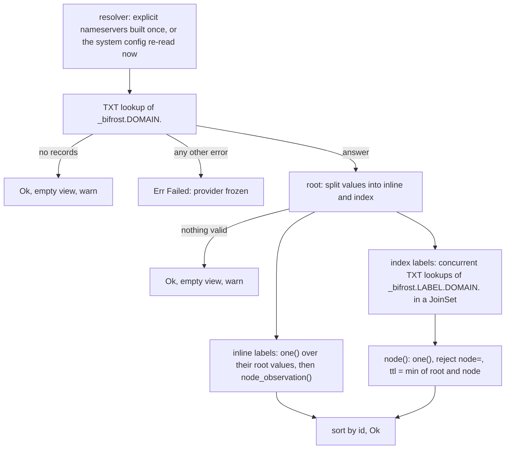

# bifrost-discovery

`bifrost-discovery` holds the three network discovery providers: `tailscale` (runs `tailscale status --json`),
`dns` (reads `bf1` TXT records) and `http` (fetches a JSON inventory). Each one turns an untrusted source into
validated `MachineObservation`s and nothing else. None of them decides whether a machine is mounted: policy in
core decides that, and a discovered machine is discover-only until a rule allows it
([decisions.md#discover-is-not-mount](../decisions.md#discover-is-not-mount)). This guide describes the provider
contract as the code implements it, each provider's parsing and validation rules and the reasons for them, how the
daemon builds and runs providers, how the built-in static source differs, and the tests. Read it before you change
anything under `crates/bifrost-discovery/src/` or add a provider.

## Contents

- [At a glance](#at-a-glance)
- [The provider contract as implemented](#provider-contract)
- [How the daemon builds and runs providers](#daemon-side)
- [The static source is not a provider](#static-source)
- [Observation fields by source](#fields-by-source)
- [tailscale.rs](#tailscale)
- [dns.rs](#dns)
- [http.rs](#http)
- [Deliberate simplifications](#simplifications)
- [Where the code differs from the contract](#contract-vs-code)
- [Tests](#tests)
- [Changing this crate: what else moves](#changing)

<a id="at-a-glance"></a>
## At a glance

| | |
|---|---|
| Path | `crates/bifrost-discovery/` |
| Modules | `tailscale`, `dns`, `http` (all `pub`); `lib.rs` only declares them |
| Dependencies | `bifrost-core`, `serde`, `serde_json`, `tokio` (`process`, `time`, `rt`, `macros`, `io-util`), `hickory-resolver` 0.26.3 (default features: `system-config`, `tokio`; no DNS-over-TLS), `reqwest` 0.12.28 (`default-features = false`, `rustls-tls-native-roots`: rustls, which builds on ring, with the OS root certificates), `tracing` |
| Public API | `tailscale::{TailscaleProvider, parse_status}`, `dns::{DnsProvider, Bf1, dns_label, parse_bf1, node_observation}`, `http::{HttpProvider, parse_inventory}` |
| Linked by | `bifrost-daemon` only (`main.rs`, `build_provider`). The CLI and TUI never link it, so they don't carry hickory, reqwest or rustls. |
| Tests | On Linux 43 unit tests: 41 run by default, 2 are `#[ignore]` (live tailscale, CoreDNS in docker). On macOS the Linux-only `system_resolver_has_tcp_fallback` is compiled out: 40 run, 2 ignored. `cargo test -p bifrost-discovery` |
| Design contract | `docs/design/contract.md` §7, plus amendments A18, A19, A20, B8, B11, C8, D1, E2 and E5, and sign-offs S3.1, S3.2c, S3.2d, S4a.7 and S4a.14 |
| User docs | `site/src/content/docs/guides/discovery.mdx`, `site/src/content/docs/examples/dns-records.mdx` |

Core owns the trait, the validators and the trust ranking. This crate owns the source formats. Core has no list of
provider kinds (B8): the kinds and trust ranks live in `bifrost-config` ([config.md](config.md)), and `dns_label`
lives here in `dns.rs`, not in core.

<a id="provider-contract"></a>
## The provider contract as implemented

`DiscoveryProvider` (in `crates/bifrost-core/src/lib.rs`, [core.md](core.md)) has two methods, `name()` and
`discover() -> BoxFuture<Result<Vec<MachineObservation>, DiscoveryError>>`
([decisions.md#boxfuture-not-async-trait](../decisions.md#boxfuture-not-async-trait)). Every provider here keeps
these rules:

| Rule | How it is kept | Why |
|---|---|---|
| `Ok` is the **complete current view** | Each call reads the whole source again. There is no incremental state and no cache in the provider (the explicit-nameserver DNS resolver caches by TTL). | The registry diffs views. A machine missing from an `Ok` is not removed; it ages out ([core.md](core.md)). |
| `Err` means "could not look" | Only when the source as a whole is unreadable: binary missing, backend stopped, transport error, non-2xx status, body not the expected JSON shape, root DNS lookup failing with anything but "no records" | The daemon freezes the provider's observations (`mark_failed`) instead of dropping them, so an outage never unmounts anything. |
| A bad record never fails the view | Per-peer, per-entry and per-node isolation. A bad record is skipped whole with a `warn!`. | One hostile or broken record must not hide the others, or freeze the whole provider. |
| Every untrusted field is validated | `Name`, `Host`, `User`, `RemotePath`, `tag`, `meta_key`, `native_id` from `core::validate`, plus `dns_label` here; display text goes through `clean` | Discovery data can only become these types or a `u16`, so it can't inject ssh options, traverse paths or put escape sequences on a terminal ([decisions.md#validated-newtypes-at-trust-boundary](../decisions.md#validated-newtypes-at-trust-boundary)). |
| Output sorted by id, ids unique | tailscale and http collect into a `BTreeMap` keyed by id; dns sorts at the end (its labels are unique by construction) | Deterministic output; the registry's "first wins" for a duplicate never has to act. |
| No record is partially applied | Any invalid identity or address field skips the whole peer, entry or node. The exceptions, all for fields that can't redirect a connection or claim an identity: tailscale drops a bad tag or an invalid `ID` (then `native_id` is `None`) and keeps the peer; HTTP without `host` drops invalid `addresses` elements and keeps the first valid one (A20); HTTP ignores `metadata` values that are `null`, arrays or objects. | Attacker data can't be half-trusted. |

`Unavailable` and `Failed` are handled the same way by the daemon: both freeze. The difference shows only in
`ProviderDto.last_error`, because `Unavailable` displays as `unavailable: <reason>`.

**Warnings stay in the log.** Skipped records go to `tracing::warn!` only. They are not visible in the CLI or TUI
(§15 #22, `ponytail:` in every provider). Under `BIFROST_LOG`, `bifrost*` targets log at the configured level,
while hickory, reqwest, hyper and rustls are capped at `warn`, so hickory's debug dump of raw TXT answers never
reaches the log ([decisions.md#log-filter-allowlist](../decisions.md#log-filter-allowlist)).

<a id="daemon-side"></a>
## How the daemon builds and runs providers

`build_provider` in `crates/bifrost-daemon/src/main.rs` is the only place the daemon names a provider type. The
actor calls it through `Deps.build_provider`, so the daemon's tests can substitute `FakeDiscovery`:

```rust
fn build_provider(pc: &ProviderConfig) -> Result<Arc<dyn DiscoveryProvider>, String> {
    Ok(match &pc.spec {
        ProviderSpec::Tailscale => Arc::new(TailscaleProvider::new(pc.name.clone(), None)),
        ProviderSpec::Dns { domain, nameservers } =>
            Arc::new(DnsProvider::new(pc.name.clone(), domain.clone(), nameservers.clone())?),
        ProviderSpec::Http { url, headers } => Arc::new(HttpProvider::new(
            pc.name.clone(), url.clone(), headers.iter().map(|(k, v)| (k.clone(), v.0.clone())).collect())?),
    })
}
```

(Reformatted; the logic is verbatim.) `bifrost-config` has already validated every input: the kind, the DNS
domain (a hostname, not an IP), each nameserver (`ip` or `ip:port`, port 53 by default), the URL (`https://`, or
`http://` only to `127.0.0.1`, `[::1]` or `localhost`), header names (RFC 7230 tokens) and header values (no CR,
LF or NUL), with `$VAR` expansion in the URL and header values ([config.md](config.md)).

| Stage | What happens | Where |
|---|---|---|
| Build | `TailscaleProvider::new` can't fail. `DnsProvider::new` fails only if hickory can't build a resolver for explicit nameservers. `HttpProvider::new` fails on a URL or header that reqwest rejects but config accepted (a non-ASCII header value, for example), or when reqwest can't build the client, for example because the OS root-certificate store holds only unparsable certificates. The roots are always loaded, so that applies to an `http://` loopback provider too. | `main.rs` |
| Build failure | `ProviderDto.last_error = clean(e, 512)`, `registry.mark_failed(name)`, and no task. The provider never reports, so warm-up waits for the grace period (B11). It is rebuilt on every config apply, an unchanged reload included, and on every fallback tick (sign-offs S4a.7, S4a.8, S4a.9). | `Actor::start_provider` |
| Each refresh | `discover()` under `catch_unwind` (a panic becomes `Failed("provider panicked: …")`) and a 30 s timeout (`Failed("timed out after 30s")`), inside `info_span!("discovery", provider, kind)`. Discover first, then wait for `interval` or `POST /v1/discover`. | `discover_loop` |
| `Ok(obs)` | `registry.apply_ok(source, obs, now, 3 × interval)`: each observation lives until `now + max(ttl, 3 × interval)`. A **non-empty** `Ok` marks the provider `reported`, which warm-up needs (A18). | `Actor::discovery` |
| `Err(e)` | `last_error = clean(e, 512)` (logged once per distinct message) and `mark_failed`: nothing it reported expires until its next `Ok`. | `Actor::discovery` |

Details: [daemon.md#providers](daemon.md#providers),
[decisions.md#panics-caught-at-driver-boundary](../decisions.md#panics-caught-at-driver-boundary),
[decisions.md#warm-up-readiness](../decisions.md#warm-up-readiness).

**Consequence for DNS.** An empty `Ok` (no root record) never counts toward `ready`. A daemon whose only network
provider is a DNS zone with no records therefore reaches `ready` only when `offline_grace_period` has passed.

<a id="static-source"></a>
## The static source is not a provider

Static machines (`[[machines]]` in the config) have no `DiscoveryProvider` object and no task (§15 #2). On every
config apply the actor calls `registry.replace(&static_source(), config.static_observations())`
([decisions.md#static-provider-is-config](../decisions.md#static-provider-is-config)).

| | static | tailscale | http | dns |
|---|---|---|---|---|
| Object and task | none: `Config::static_observations()` | `TailscaleProvider` | `HttpProvider` | `DnsProvider` |
| Trust (`bifrost_config::TRUST`) | 0 | 1 | 2 | 3 |
| Refreshed | on every config apply (startup, poller, SIGHUP, `POST /v1/config/reload`) | every `interval` | every `interval` | every `interval` |
| Expiry | never: `replace` is authoritative, so a machine removed from the config disappears at once | `3 × interval` | `3 × interval` | `max(ttl, 3 × interval)` |
| On failure | nothing to fail: an invalid config is rejected whole and the old one kept | freeze | freeze | freeze |
| Default verdict | Allowed, unless a global deny matches | DiscoverOnly until a rule allows it | same | same |
| In `StatusDto.providers` | a `static` row first, with no error and no last-ok time (sign-off S4a.12) | a row | a row | a row |

The trust ranks decide which observation speaks for a machine that several sources report: winner takes all, so a
DNS record can't redirect or deny a machine that a more trusted source reports
([decisions.md#winner-takes-all-trust](../decisions.md#winner-takes-all-trust)).

<a id="fields-by-source"></a>
## Observation fields by source

| Field | static | tailscale | http | dns |
|---|---|---|---|---|
| `id` | config name | first label of `DNSName`, else `HostName` (lowercased) | `name`, else `id` (lowercased) | the node label |
| `name` (display) | the id | `clean(HostName, 128)` | `clean(name or id, 128)`, case kept | the label |
| `native_id` | none | `ID` (dropped if invalid) | `id` | `id=` |
| `addresses` | `[host]` | `[DNSName]` with MagicDNS, else `[first IPv4]`; then every Tailscale IP | exactly one: `[host]`, else the first valid of `addresses` | exactly one: `[host=]`, else `[<label>.<domain>]` |
| `port` | config | none | `port` | `port=` |
| `online` | none | `Some(Online)` | `online` | none |
| `metadata.tags` | config | `Tags` minus `tag:` | `metadata.tags` | `tags=` |
| `metadata.values` | config | `os`, `hostname`, `dns_name` | the other scalar `metadata` keys | none |
| hints `user` / `path` | config user (trusted) / none | none | `user` / `path` | `user=` / `path=` |
| `ttl` | none | none | none | record validity |

`addresses[0]` is the connect target. Hostnames are never resolved, and CIDR rules work differently on the two sides
(`crates/bifrost-core/src/policy.rs`, [decisions.md#policy-semantics](../decisions.md#policy-semantics)):

| Rule | Evaluated by | Matches when |
|---|---|---|
| `include_cidrs`, `policy.allow` cidrs | `Match::all` (`cidr_hit`) | at least one IP-literal address is inside a listed cidr. A hostname never matches. |
| `exclude_cidrs`, `policy.deny` cidrs | `Match::any` | the same, **or** the observation is not static (`trust != 0`) and has no IP-literal address at all: then every cidr entry matches (fail closed, reason `cidrs=… (no IP address)`, test `cidr_deny_fails_closed_without_ip`) |

So a DNS node without `host=` (its address is the default `<label>.<domain>`), a DNS node whose `host=` is a
hostname, or an HTTP entry whose `host` (or first valid `addresses` element) is a hostname is dropped by **any**
`exclude_cidrs` of its provider (an exclude drops only that observation; if every observation of the machine is
excluded, the verdict is `denied (<provider>.filter.exclude cidrs=… (no IP address))`) and denied by **any**
`policy.deny` cidr. Static machines are exempt. The include side is
why HTTP and DNS emit exactly one address ([A20](#a20)). Hints are used only when the provider's
template sets `honor_hints` ([config.md](config.md)). A `native_id` is matched only by its own provider's
`include_ids`/`exclude_ids`, never by the global `ids` rule (A19), so a DNS record that publishes a Tailscale node
ID as `id=` gains nothing ([decisions.md#policy-semantics](../decisions.md#policy-semantics)).

<a id="tailscale"></a>
## tailscale.rs

`TailscaleProvider::new(name, binary)`. `binary` is `None` in production and set only by tests. The provider runs
the Tailscale CLI and parses its JSON; it does not link a Tailscale library or talk to `tailscaled` directly
([decisions.md#tailscale-via-cli-json](../decisions.md#tailscale-via-cli-json)).

<a id="tailscale-invocation"></a>
### Invocation

| Aspect | Behaviour |
|---|---|
| Command | `<bin> status --json`, through `tokio::process::Command` (no shell) |
| stdin | `/dev/null` |
| stdout | piped, read through `take(16 MiB + 1)`. More than 16 MiB is `Failed("tailscale status: output exceeds 16 MiB")`, and dropping the reader gives the child EPIPE instead of filling our heap. |
| stderr | piped, at most 64 KiB read |
| lifetime | `kill_on_drop(true)`; the whole call runs under a 10 s timeout. When it fires, or the 16 MiB cap returns `Err` early, the `Child` is dropped and SIGKILLed |
| exit status | non-zero is `Failed(tail(stderr, 512))`, or `Failed("tailscale status: <status>")` when stderr is empty |

<a id="tailscale-binary"></a>
### Binary lookup

The lookup runs on **every refresh**, so a Tailscale installed after the daemon started is found without a
restart:

1. the constructor's `binary`, if set (tests);
2. `tailscale` in the absolute entries of `$PATH`, then `/usr/local/bin`, `/usr/bin`, `/bin` (+ `/opt/homebrew/bin`
   on macOS). A hit must be a regular file with an execute bit. systemd and launchd start the daemon with a
   minimal `PATH` (S3 sign-off 2d);
3. on macOS only, `/Applications/Tailscale.app/Contents/MacOS/Tailscale` if it is executable (a runtime `cfg!`, so
   Linux compiles the branch too).

Nothing found is `Unavailable("tailscale binary not found")`. A binary that disappears between lookup and spawn
is `Unavailable("<path>: not found")`.

`ponytail:` `which_in` mirrors `bifrost_mount::check::{which_in, search_path}`, because `bifrost-discovery` can't
depend on `bifrost-mount`. The upgrade path is one shared crate if a third copy appears
([mount.md](mount.md#which)).

<a id="tailscale-json"></a>
### JSON fields used

Field names are the JSON keys verbatim (`#[allow(non_snake_case)]` structs). Unknown keys are ignored.

| Level | Field | Type | Missing |
|---|---|---|---|
| top | `BackendState` | string | the document fails: `Failed` |
| top | `CurrentTailnet` | object, optional | `None`: MagicDNS off, no own-suffix ordering |
| `CurrentTailnet` | `MagicDNSEnabled` | bool | the document fails |
| `CurrentTailnet` | `MagicDNSSuffix` | string, default `""` | `""` |
| top | `Peer` | map of key → value, optional | `null` or absent is an empty, complete view |
| top | `Self` | — | **not declared**, so it is ignored: we never discover, or mount, ourselves |
| peer | `ID`, `HostName`, `DNSName` | string | the peer is skipped |
| peer | `OS` | string, default `""` | |
| peer | `TailscaleIPs` | list of `IpAddr`, optional | no IPs |
| peer | `Tags` | list of strings, optional (absent when the peer has none, verified live) | no tags |
| peer | `Online` | bool | the peer is skipped |
| peer | `ShareeNode` | bool, default `false` (omitted upstream when false) | `false` |

`parse_status` first parses the top level (`Peer` as a map of raw `serde_json::Value`s). JSON that doesn't parse is
`Failed(clean("tailscale status: <serde error>", 512))`. It then checks `BackendState`, **before** looking at any
peer. Anything but `"Running"` (for example `Stopped`, `NeedsLogin`, `Starting`) is
`Unavailable("backend state <clean(state, 64)>")`, with no peer warnings: the daemon freezes the last view instead
of treating a stopped Tailscale as "every peer gone".

Only then is each peer deserialized from its own `Value`. A malformed peer (a missing field, `"Online": "yes"`, an
IP literal like `fe80::1%eth0` or `100.64.0` that isn't an `IpAddr`) is skipped alone with a warning, and the rest
of the document is still used.

<a id="tailscale-mapping"></a>
### Peer → observation

`observation(peer, magic)`. Every identity and address field is validated, and any failure skips the whole peer:

| Observation field | Source | If invalid |
|---|---|---|
| `id` | `Host::parse(DNSName)` (strips the trailing dot, lowercases), then `Name::parse` of its first label. If `DNSName` is `""`, or that label isn't a valid `Name` (for example it starts with `_`), `Name::parse(HostName)`, which lowercases first, so `MacBook` becomes `macbook` rather than being skipped (contract change #21). | `DNSName` not a host, or the `HostName` fallback invalid → peer skipped |
| `name` | `clean(HostName, 128)` | — |
| `native_id` | `native_id(ID)` | dropped (`None`); the peer is kept |
| `addresses` | With MagicDNS enabled **and** a non-empty `DNSName`: `[DNSName host]`. Otherwise the first IPv4 in `TailscaleIPs`, if any. Then every Tailscale IP not already listed, in order. An IPv6-only peer without MagicDNS connects to its first IP. | any IP that `Host::parse` rejects (`0.0.0.0`) → peer skipped; no address at all → `no address`, peer skipped |
| `port` | none (ssh default or the template) | |
| `online` | `Some(Online)` | |
| `metadata.tags` | each of `Tags` with a leading `tag:` stripped, through `tag()` (lowercases) | that tag dropped with `warn!("tailscale tag dropped")`; the peer is kept |
| `metadata.values` | `os` = `OS`, `hostname` = `HostName`, `dns_name` = `DNSName` without the trailing dot; empty values omitted; each `clean(v, 256)`. There is no `tailscale_id`, because it would duplicate `native_id` (E5). | |
| hints, `ttl` | none | |

The DNS name is the connect target only when MagicDNS makes it resolvable; otherwise the first IPv4 is. The
other Tailscale IPs follow it, so CIDR rules can match any of the peer's own addresses.

<a id="sharee"></a>
### Sharee nodes

A peer that deserializes with `ShareeNode: true` is skipped **silently**, before sorting and before any
validation (`tailscale status` hides it too, so a warning would only be noise). A sharee whose value fails to
deserialize can't be recognised as one: it is warned like any malformed peer (`tailscale peer skipped`, `record` =
its map key). A sharee is another user's device,
in our netmap only because we shared one of our nodes with its owner. It may connect to us, but it is never ours to
mount, and `tailscale status` hides it too. At trust 1 it would otherwise outrank a DNS or HTTP machine with the
same id and redirect or unmount it (sign-off S4a.7, commit e2284f5).

<a id="tailscale-dedupe"></a>
### Duplicate ids and the sort order

`HostName` repeats in real tailnets (verified live), and a shared-in node can carry a first label that one of our
own nodes also uses. Before building observations, the peers are sorted by this key:

```rust
(p.DNSName.is_empty(), !p.DNSName.ends_with(&own), p.DNSName.clone())
// own = ".<MagicDNSSuffix without trailing dot>."  when CurrentTailnet is present
```

So the order is: our own tailnet's control-assigned names first, then shared-in nodes (a foreign suffix), both in
`DNSName` order, then `HostName`-only peers (`DNSName` `""`). Every `HostName`-only peer has the same key, and
`sort_by_cached_key` is stable, so that group keeps the `Peer` map's key (node key) order from the `BTreeMap`: the
smallest node key wins a `HostName`-only duplicate. The first peer to claim an id wins, and later
ones are skipped with the warning `duplicate id (own tailnet first, then shared-in, then HostName-only)`. A
lower-trust identity therefore never evicts one of our own nodes (commit aa98d2a, review finding sec-S3H-SEC-1).

| `CurrentTailnet` | `own` | Effect |
|---|---|---|
| present, suffix `example.ts.net` | `.example.ts.net.` | our nodes first |
| present, suffix `""` | `..` | matches nothing: plain `DNSName` order, `HostName`-only last |
| absent | `""` | matches everything: plain `DNSName` order, `HostName`-only last |

<a id="tailscale-errors"></a>
### Errors

| Condition | Result |
|---|---|
| no binary | `Unavailable("tailscale binary not found")` |
| spawn `NotFound` | `Unavailable("<path>: not found")` |
| other spawn or read error | `Failed("tailscale status: <error>")` |
| stdout over 16 MiB | `Failed("tailscale status: output exceeds 16 MiB")` |
| 10 s timeout | `Failed("tailscale status: timed out after 10s")` |
| non-zero exit | `Failed(<tail of stderr>)`, for example `failed to connect to local tailscaled` |
| not JSON, or the wrong shape | `Failed("tailscale status: <serde error>")` |
| `BackendState` not `Running` | `Unavailable("backend state <state>")` |
| `Peer` null or absent | `Ok([])` |

Skipped peers log `warn!(record, reason, "tailscale peer skipped")`, where `record` is the cleaned `DNSName` (or
`HostName` when that is empty, or the map key when the peer didn't deserialize).

<a id="dns"></a>
## dns.rs

`DnsProvider::new(name, domain, nameservers)` reads `bf1` TXT records under `_bifrost.<domain>.`. The format is
Bifröst's own. The user-facing description is `site/src/content/docs/examples/dns-records.mdx`, and the design
reasons are in [decisions.md#bf1-dns-format-inline-and-index](../decisions.md#bf1-dns-format-inline-and-index).

<a id="bf1-records"></a>
### Records

The root RRset `_bifrost.<domain>.` holds **inline node records** (`node=`) and **index values** (`nodes=`),
mixed freely (inline records arrived in v0.1.1). An index node publishes its own record one level down:

```dns
_bifrost.infra.example.com.          300 IN TXT "v=bf1 node=agent-01 host=10.0.0.5 user=sami tags=dev,agent"
_bifrost.infra.example.com.          300 IN TXT "v=bf1 node=agent-02 tags=dev"
_bifrost.infra.example.com.          300 IN TXT "v=bf1 nodes=agent-03"
_bifrost.agent-03.infra.example.com. 300 IN TXT "v=bf1 host=10.0.0.7 tags=dev"
```

The inline form needs one lookup for the whole zone. The index form keeps each value small and lets each node's
record have its own TTL and owner. Both can be mixed.

<a id="bf1-grammar"></a>
### `parse_bf1`: the grammar

The character-strings of each TXT RR are concatenated first (`txts`: `txt_data.concat()`, then lossy UTF-8, so a
bad byte fails the value grammar below).

```text
S       := concat(character-strings of one TXT RR)
record  := token *(1*SP token)                ; runs of spaces are fine, a trailing space is an error
token   := key "=" value                      ; split at the FIRST '='
key     := 1*32 [a-z0-9_-]
value   := 1*256 (%x21-7E except '"')         ; printable ASCII, no space, no double quote
first token must be exactly "v=bf1"           ; else Ok(None): not ours, ignored silently
```

| Input | `parse_bf1` result |
|---|---|
| first space-separated token is not exactly `v=bf1` (SPF, `v=bf2`, `v=bf1x`, a leading space, an empty string) | `Ok(None)`, ignored silently, whatever its size |
| longer than 2048 bytes (checked after the `v=bf1` test) | `Err("<n> bytes (max 2048)")` |
| ends with a space | `Err("trailing space")` |
| a token without `=`, a bad key or value, a duplicate key (`v` included) | `Err` |
| a known key whose value fails validation | `Err` |
| `node=` and `nodes=` in one value | `Err("node= and nodes= in one value")` |
| unknown keys, `driver=` included | ignored, but they must still obey the token grammar (E2) |

A duplicate key invalidates the value instead of "first wins" or "last wins", so two parsers can never disagree
about which value is meant.

<a id="bf1-keys"></a>
### Keys

| Key | Validation | Inline value (`node=`) | Index value (`nodes=`) | Node record |
|---|---|---|---|---|
| `node` | `dns_label` | identity (the label) | not allowed with `nodes=` | **rejects the node** (root values only) |
| `nodes` | comma list of `dns_label`, no empty entries | not allowed with `node=` | the labels to look up | validated, unused |
| `host` | `Host::parse` (rejects `-oProxyCommand=…`, `a,b`, `u@h`) | `addresses[0]`; default `<label>.<domain>` | validated, unused | as inline |
| `port` | ASCII digits only, at most 5 of them, 1..=65535 (`u16::from_str` alone would accept `+22`) | `port` | validated, unused | as inline |
| `user` | `User::parse` | hint | validated, unused | as inline |
| `path` | `RemotePath::parse` (`~`, `~/rel`, `/abs`; no `..`, `:` or control characters) | hint | validated, unused | as inline |
| `tags` | comma list of `tag()` (lowercases), at most 32 | `metadata.tags` | validated, unused | as inline |
| `id` | `native_id()` (rejects `../../etc`) | `native_id` only | validated, unused | as inline |

`dns_label(s)` is `^[a-z0-9]([a-z0-9-]{0,61}[a-z0-9])?$`. It has **no dots**, so an index can't make the provider
query a name in another domain (`nodes=zz.evil.com`). It does **not** lowercase: the label is the machine id
verbatim, so `A` is simply invalid. It lives here, not in core (B8).

**Identity is always the node label.** `id=` only fills `native_id`. The label is where the record is published,
so a zone can only name machines by where it puts them, and a record can't claim another source's identity. The
label also becomes a mount path component, which the grammar keeps safe.

<a id="dns-discover"></a>
### `discover()`



1. **Resolver.** See [resolver construction](#dns-resolver).
2. **Root lookup** of `_bifrost.<domain>.`. The name is absolute (it ends in `.`), so resolv.conf search domains
   never apply, and it is built with `Name::from_ascii`, not IDNA, because every label is already validated ASCII.
   - `NetError::is_no_records_found()` gives `Ok(vec![])` plus `warn!("no bf1 root record")`. `coredns_discovery`
     pins this for an NXDOMAIN root. An empty view causes no churn: entries age out after `max(ttl, 3 × interval)`,
     and it doesn't count toward warm-up.
   - Any other error gives `Err(Failed(clean(e, 512)))`, and the provider is frozen. `coredns_discovery` pins
     this for a REFUSED answer from a server that doesn't serve the zone.
3. **`root()`** splits the root RRset:
   - A value that starts with `v=bf1 ` and has a `node=` token is an **inline** value. It is grouped by that
     label **before** it is parsed, so an invalid inline value still rejects its node. A `node=` value that isn't a
     `dns_label` is skipped with a warning and takes no cap slot (commit 9ea7c87).
   - Any other value goes through `parse_bf1`. A valid bf1 value is an **index** value and contributes its
     `nodes=` labels (a value with neither key contributes nothing). An invalid one is skipped with
     `warn!("bf1 index record skipped")`, and its labels are not looked up. Non-bf1 TXT is ignored.
   - The labels are the **sorted** union of the index labels and the inline labels, capped at `MAX_NODES = 256`
     with one warning. Alphabetical order, not record order, decides which labels survive the cap.
   - For each label: not inline → looked up (step 4). Inline **and** in some `nodes=` → skipped as
     `ambiguous: inline and in nodes=`, and not looked up either. Inline only → `one(values)` and
     `node_observation(label, domain, record, root_ttl)`.
   - If there is no label to look up and no inline observation, the result is `Ok(vec![])` plus
     `warn!("no valid bf1 root record")`.
4. **Per-node lookups.** Each index label's `_bifrost.<label>.<domain>.` is queried concurrently in a `JoinSet`, so
   up to 256 queries can be in flight. For each answer, `node()`:
   - a lookup error skips that node with a warning. Its old observation is not refreshed and ages out;
   - `one(txts)` fails → the node is skipped (see the ambiguity rules below);
   - the record carries `node=` → skipped (`node= in a node record (root values only)`). That is stricter than
     ignoring the key;
   - otherwise `node_observation` with `ttl = min(root valid_until, node valid_until) − now`.

   A `JoinError` (a lookup task panicked) is `Err(Failed)`, so the whole provider freezes (S3 sign-off 1).
5. **Output** is sorted by id. Inline and index labels are disjoint by step 3, so the ids are unique.

<a id="dns-ambiguity"></a>
### Ambiguity rules

`one(values)` turns a node's bf1 values (its inline root values, or all TXT at its node name) into one record:

| Values for one node | Result |
|---|---|
| no bf1 value (only SPF or other TXT, or nothing) | skipped: `no bf1 record` |
| the same record more than once (compared as parsed `Bf1` structs, so `"v=bf1  host=x"` equals `"v=bf1 host=x"`) | fine: one record |
| two or more **distinct** valid bf1 records | skipped: `ambiguous: <n> distinct bf1 records` |
| **any** bf1 value that fails `parse_bf1`, even next to a valid one | skipped: the whole node, never partially applied |
| a label both inline and in `nodes=` | skipped: `ambiguous: inline and in nodes=` |

Skipping is fail-safe. Choosing one of two conflicting records would let whoever can add a record pick the host.

<a id="dns-node-observation"></a>
### `node_observation(label, domain, record, ttl)`

This is pure. `id = Name::parse(dns_label(label))`, `name = label`, `native_id = id=`,
`addresses = [host=]` or `[Host::parse("<label>.<domain>")]` (a default name over 253 bytes fails, and the node is
skipped), `port`, `tags`, hints `user`/`path`, `online = None` (DNS can't know), no metadata values,
`ttl = Some(ttl)`.

<a id="dns-limits"></a>
### Caps and limits

| Limit | Value | Why |
|---|---|---|
| bf1 value length | 2048 bytes after concatenation | bounded parsing of untrusted data |
| key / value length | 32 / 256 bytes | |
| labels per root RRset | `MAX_NODES = 256`, inline + index, over the sorted union | bounded lookups and observations per refresh |
| tags per record | 32 | |
| concurrent node lookups | up to 256 (one per index label) | one refresh is one round of lookups, not 256 sequential timeouts |
| resolver timeout | explicit nameservers: hickory's `ResolverOpts::default()`, 5 s × 2 attempts (no `options_mut()`, D1); the system path uses what hickory reads from the system config | |
| whole refresh | the daemon's 30 s timeout | |

<a id="dns-ttl"></a>
### TTL

| Node kind | `ttl` |
|---|---|
| inline | `root.valid_until() − now` |
| index | `min(root.valid_until(), node.valid_until()) − now`: the observation is only as fresh as the index that listed it |

The registry keeps an observation until `now + max(ttl, 3 × interval)` (`apply_ok`; if that sum would overflow
`Instant`, it falls back to `now + 3 × interval` instead of panicking the actor). So a TTL shorter than three
intervals has no effect, and a longer one keeps a machine that vanished from DNS for up to its TTL. hickory clamps
positive TTLs to `MAX_TTL` = 86400 s (`ResponseCache`/`TtlConfig` in hickory-resolver 0.26.3, and `valid_until()`
comes from the clamped value), so a DNS observation's `ttl` is at most about 24 h (read from the hickory source,
not checked with a live lookup). Record changes show up on the first refresh after the TTL
expires: from hickory's cache with explicit nameservers, from the system stub or upstream otherwise.

<a id="dns-resolver"></a>
### Resolver construction

| `nameservers` in config | Built | Cache |
|---|---|---|
| set | once, in `new()`: `NameServerConfig::udp_and_tcp(ip)` per server with every connection's port set to the configured one, `Resolver::builder_with_config(ResolverConfig::from_name_servers(ns), TokioRuntimeProvider::default()).build()`; a hickory error becomes a `String` (C8) | hickory's cache, kept across refreshes, honours record TTLs |
| empty | `resolver: None`: nothing is read at build time. **Every refresh** runs `TokioResolver::builder_tokio()?.build()`, which reads resolv.conf (SCDynamicStore on macOS); a failure is `Failed(clean(e, 512))` and the provider freezes | none across refreshes |

**Why the system config is re-read every refresh** (sign-off S4a.7, commit e2284f5): a resolver built once at
startup keeps querying the old servers after a DHCP or VPN change, and one built while offline (no `nameserver`
line yet) would leave the provider dead until a restart. `ponytail:` the system resolver is rebuilt every refresh,
so hickory's cache never outlives one refresh (the registry does expiry; the stub or upstream still caches). The
upgrade is to reuse it while the config is unchanged, if the extra queries ever matter. Test:
`system_resolver_read_per_refresh`.

<a id="dns-tcp"></a>
### TCP fallback and the 512-byte Linux caveat

A root RRset with many inline values outgrows a UDP reply. hickory retries a truncated UDP answer (TC bit) over TCP,
but only on a name server that has a TCP connection config. Both paths have one, with no resolver option set:

- explicit nameservers use `udp_and_tcp`;
- hickory's system config builds the same UDP + TCP pair for each resolv.conf server. `system_resolver_has_tcp_fallback`
  (Linux only) pins it by parsing `nameserver 192.0.2.1` with `hickory_resolver::system_conf::parse_resolv_conf`.

How big a UDP answer can be depends on the path:

| Path | EDNS | UDP reply limit | Truncation starts at about |
|---|---|---|---|
| explicit nameservers; macOS or Windows system config | yes, hickory's default payload | 1232 bytes | 12–15 inline values |
| Linux system config | only if resolv.conf has `options edns0` | 512 bytes otherwise | 5 inline values |

(Contract §7 "Big answers", commit 9ea7c87.) A big root RRset therefore needs a nameserver that answers over TCP.
When TCP fails, the lookup fails, which is `Failed` and a freeze; per contract §7 there is never a partial view.
E2E p08 publishes 20 extra inline `bulk-NN` nodes to push the root past a 1232-byte UDP reply, then asserts all 20
are discovered and that CoreDNS logged the daemon's TCP root query
([decisions.md#dns-tcp-fallback](../decisions.md#dns-tcp-fallback)).

<a id="dns-warnings"></a>
### Warnings

| Message | Fields | When |
|---|---|---|
| `no bf1 root record` | `provider`, `record` | the root lookup found no records |
| `no valid bf1 root record` | `provider`, `record` | nothing to look up and no valid inline node |
| `bf1 index record skipped` | `provider`, `record`, `reason` | an index value failed `parse_bf1` |
| `more than 256 bf1 nodes, the rest ignored` | `provider`, `record`, `count` | the cap |
| `bf1 node skipped` | `provider`, `record` (the root name), `node`, `reason` | an inline label that isn't a `dns_label`, an invalid or ambiguous inline node, a label both inline and indexed |
| `bf1 node skipped` | `provider`, `record` (the node's name), `reason` | a per-node lookup error, or an invalid, ambiguous or `node=`-carrying node record |

Every reason and label goes through `clean`: 128 characters for labels, 512 for reasons.

<a id="dnssec"></a>
### DNSSEC

DNSSEC is not validated (`ponytail:` on `root()`, §15 #21). A spoofed or on-path answer is trusted, but it still
has to pass every bf1 validator, and the machine it describes is discover-only by default. The upgrade path is
hickory's `dnssec` feature plus `validate`.

<a id="http"></a>
## http.rs

`HttpProvider::new(name, url, headers)` fetches a JSON inventory with one `GET` per refresh.

<a id="http-client"></a>
### Client

| Setting | Value | Why |
|---|---|---|
| timeout | 10 s total (`ClientBuilder::timeout`) | §15 #8 |
| redirects | `Policy::none()` | Auth headers never follow a redirect to another origin. A 3xx is returned as the response, so it is `Failed("HTTP 302")` (test `redirect_not_followed` checks that the target is never contacted). |
| user agent | `bifrost/<crate version>` | |
| default headers | `Accept: application/json`, then the configured headers; a configured `Accept` replaces ours | |
| header values | each marked `set_sensitive(true)` | keeps them out of `Debug` output |
| proxy | `http://` URLs (loopback only, by config) get `no_proxy()`. `https://` keeps reqwest's default proxy handling. | An environment `HTTP_PROXY`/`ALL_PROXY` would otherwise receive the credentials in plaintext (commit d911f9a). |
| TLS | rustls (on ring) with the OS root certificates (`rustls-tls-native-roots`); no OpenSSL | — |

Construction errors name a header key at most, never its value: `url: <parse error>`,
`header "<key>": invalid name`, `header "<key>": invalid value` (the text reaches `last_error`). A failing
`ClientBuilder::build()` (for example an OS root store with no parsable certificate) is `e.to_string()`, which for a
reqwest builder error is only `builder error`: unlike `failed()` below, it doesn't append the `source()` chain, so
the cause isn't in `last_error`.

<a id="http-discover"></a>
### `discover()`

| Step | Result |
|---|---|
| transport error (connect, TLS, timeout) | `Failed(clean(<error chain>, 512))`. `failed()` calls `without_url()`, because a query string may carry a token, and appends every `source()`, because reqwest's own message hides the cause (`… Connection refused`). |
| status not 2xx | `Failed("HTTP <code>")`; the body is never read |
| body | read with `chunk()` and capped at 1 MiB (`BODY_CAP`). Exactly 1 MiB parses; one byte more is `Failed("inventory body exceeds 1 MiB")`. The cap doesn't trust `Content-Length`. |
| parse | `parse_inventory(body)` |

<a id="http-inventory"></a>
### `parse_inventory`: the inventory format

```json
{ "machines": [ {
    "name": "agent-01", "id": "i-0abc", "host": "agent-01.corp", "addresses": ["10.20.0.4"],
    "port": 22, "online": true, "user": "sami", "path": "/home/sami",
    "metadata": { "tags": ["dev", "agent"], "env": "dev", "rack": 4 }
} ] }
```

The body must be a JSON object with a `machines` array; other top-level keys are ignored. Invalid JSON, `{}`,
`{"machines": 1}` or `[]` is `Failed(clean("inventory: <error>", 512))`. One quirk: `Top` is a plain derived
`Deserialize` struct, and serde's derive also accepts a struct in positional (sequence) form, so a one-element
top-level array `[[ … ]]` parses as `{"machines": [ … ]}`. Only `[]` is tested (`invalid_entries_isolated`). Only the first 1000 entries
are used (`MAX_ENTRIES`), with one warning when there are more.

Each entry is converted on its own. A failing entry is skipped with `warn!("machines[<i>]: skipped: <reason>")`.
A duplicate id is skipped with `warn!("machines[<i>]: skipped: duplicate id <id> (first wins)")`, so the earlier
entry in the array wins. The output is sorted by id.

| Key | Type | Rule | Goes to | Invalid |
|---|---|---|---|---|
| `name` | string | `Name::parse` (lowercases); the display name is `clean(name, 128)` with its case kept | `id`, `name` | entry skipped. `""` is invalid, with no fallback to `id` (S3 sign-off 1). |
| `id` | string | `native_id` | `native_id`; also the id source when `name` is absent | entry skipped. `i:colon` is a valid native id but not a valid `Name`, so without a `name` the entry is skipped. |
| neither `name` nor `id` | | | | `no name and no id` |
| `host` | string | `Host::parse` | `addresses = [host]`; `addresses` is then ignored entirely, even when it is garbage | entry skipped; no fallback to `addresses` |
| `addresses` | array | only without `host`. The first 32 elements are read; the **first** string that passes `Host::parse` is kept and the loop stops. Invalid elements before it are dropped with one warning per entry (`address dropped: <first reason> (<n> in total)`). | `addresses = [first valid]` | not an array → skipped; no valid element among the first 32 → `no valid host or address` |
| `port` | integer | 1..=65535 (`NonZeroU16`) | `port` | entry skipped |
| `online` | bool | | `online` | entry skipped |
| `user` | string | `User::parse` | hint | entry skipped |
| `path` | string | `RemotePath::parse` | hint | entry skipped |
| `metadata.tags` | array of strings | each `tag()` (lowercased; duplicates merge in a set) | `metadata.tags` | not an array, a non-string element or a bad tag → entry skipped |
| other `metadata` keys | string, number, bool | key through `meta_key` (`^[a-z0-9_.-]{1,64}$`, so an uppercase key is invalid); a string value becomes `clean(v, 256)`, a number or bool its JSON text | `metadata.values` | a bad key skips the entry only when its value is a string, number or bool. A key whose value is `null`, an array or an object is ignored silently, without validating the key. |
| anything else, `driver` included | | ignored (E2) | | |

<a id="a20"></a>
### Why `host` overrides `addresses` (A20)

This argument is about the include side (`include_cidrs`, `policy.allow` cidrs, evaluated by `Match::all`): there
a CIDR rule matches when any IP-literal address of the observation is inside it (`cidr_hit` in
`crates/bifrost-core/src/policy.rs`), and `addresses[0]` is where Bifröst connects. (Exclude and deny cidrs fail
closed on an observation with no IP literal; see [fields by source](#fields-by-source).) If an entry could carry
`"host": "evil.example"` together with `"addresses": ["10.20.0.4"]`, the in-range IP would carry a different
connect target past `include_cidrs`. The same holds for a list like `["evil.example", "10.20.0.4"]`. So an HTTP observation always has exactly one
address, and it is the one we connect to: `host` when present, else the first valid element of `addresses`
(commit d911f9a). The 32-element read limit means an untrusted list can't buy unbounded work or unbounded
warnings.

<a id="http-secrets"></a>
### Secrets never logged

| Secret | Protection |
|---|---|
| header values (tokens) | config holds them as `Secret` (its `Debug` prints `***`) and config errors never echo them; `HttpProvider::new` errors name the key only; each value is `set_sensitive`; tests assert that a bad value is not echoed (`auth_header_sent_non2xx_failed`) |
| a token in the URL query | config errors never echo the URL; transport errors drop it (`without_url`, test `transport_error_names_cause_not_url`); a non-2xx error is only `HTTP <code>` |
| credentials in transit | `http://` only to loopback (config) and never through a proxy; no redirect is followed, so `Authorization` never reaches another origin |
| third-party logs | reqwest, hyper and rustls are capped at `warn` by the daemon's log filter |

<a id="simplifications"></a>
## Deliberate simplifications

Every `ponytail:` comment in the crate. The full list is in [simplifications.md](../simplifications.md).

| Where | Ceiling | Upgrade path |
|---|---|---|
| `tailscale.rs` `which_in` | duplicates `bifrost_mount::check::{which_in, search_path}` | one shared crate if a third copy appears |
| `tailscale.rs`, `dns.rs`, `http.rs` (§15 #22) | skipped records are only logged, invisible from the CLI and TUI | `warnings` in `ProviderDto` |
| `dns.rs` `discover` | the system resolver is rebuilt every refresh, so hickory's cache never outlives one | reuse it while the system config is unchanged |
| `dns.rs` `root` (§15 #21) | DNSSEC is not validated | hickory's `dnssec` feature + `validate` |
| `http.rs` (§15 #8) | 10 s timeout, 1 MiB body, 1000 entries, no ETag or Cache-Control: an expensive inventory is fetched in full every interval | `ETag` / `If-None-Match` |

<a id="contract-vs-code"></a>
## Where the code differs from the contract

| Topic | Contract text | Code | Source of the change |
|---|---|---|---|
| Tailscale peer order | §7: "Peers are processed sorted by DNSName" | sorted by (`HostName`-only last, foreign suffix after our own, then `DNSName`) so our own nodes win duplicate ids; parses `CurrentTailnet.MagicDNSSuffix` for this | commit aa98d2a. Its message says the change needed an orchestrator sign-off; §7 was not updated. |
| Tailscale binary lookup | §7: the constructor's binary, `PATH`, the macOS app | also `/usr/local/bin:/usr/bin:/bin` (+ `/opt/homebrew/bin` on macOS) | S3 sign-off 2d, commit 36dc831 |
| Tailscale invalid fields | §7 table: an invalid id skips the peer; "peer skipped if none" for addresses | any invalid `DNSName` or IP skips the whole peer; empty metadata values are omitted | S3 sign-off 1 |
| HTTP `addresses` without `host` | §7: each `Host::parse`, invalid ones dropped, ≥1 needed | only the first valid element of the first 32 is kept | commit d911f9a (A20 applied to `addresses` too) |
| HTTP `"name": ""` | §7: `name` required, else `id` | invalid, entry skipped | S3 sign-off 1 |
| Skip-warning fields | §7: `warn!(provider, record, reason = clean(value, 512))` | tailscale: `record`, `reason` (the provider comes from the daemon's `discovery` span); http: a formatted `machines[<i>]: skipped: …` message; dns: `provider`, `record`, `node`, `reason` | the code |

<a id="tests"></a>
## Tests

On Linux `cargo test -p bifrost-discovery` runs 41 tests and skips 2 `#[ignore]` ones (macOS: 40 run and 2
ignored, because `system_resolver_has_tcp_fallback` is Linux-only). The default tests use no network
beyond `127.0.0.1`. The HTTP tests run a one-shot HTTP/1.1 responder on `127.0.0.1:0` (`serve`), and the
transport-error test targets port 1, which no parallel test can own. The tailscale process tests write fake
`tailscale` scripts to a temp dir and sleep 200 ms before running them (ETXTBSY: another test's fork may still hold
the write fd).

| Test | File | Pins |
|---|---|---|
| `tailscale_fixture_parse` | `tailscale.rs` | the fixture `tests/fixtures/tailscale_status.json` (synthetic; no real tailnet data): `Self` excluded, `tag:` stripped and lowercased, a bad tag dropped, absent `Tags`, trailing dots trimmed, a duplicate `HostName` resolved through `DNSName`, a capitalised `HostName` fallback kept, the sharee node skipped, own tailnet winning a duplicate id, MagicDNS off → first IPv4, no `CurrentTailnet`, `Peer: null` or absent |
| `tailscale_backend_stopped_unavailable` | `tailscale.rs` | `Stopped`, `NeedsLogin`, `Starting` → `Unavailable`; not JSON → `Failed` |
| `hostile_peer_fields_rejected` | `tailscale.rs` | ssh-option and traversal names, control characters, bad IPs, no address, a bad `ID`, a non-bool `Online`: each peer skipped alone; display text cleaned; no address starts with `-` |
| `tailscale_new_peer_appears` | `tailscale.rs` | a fake binary whose fixture changes between two `discover()` calls: new peers appear without a restart; the argv is exactly `status --json` |
| `tailscale_invocation_errors` | `tailscale.rs` | missing binary → `Unavailable`; a non-zero exit → the stderr tail; a flood (`yes`) is cut at 16 MiB well before the 10 s timeout |
| `tailscale_which_falls_back_to_fixed_dirs` | `tailscale.rs` | an empty `PATH` still finds `/usr/local/bin`, `/usr/bin` or `/bin`; `$PATH` first; relative, missing and non-executable entries skipped |
| `bf1_v_first_required`, `bf1_other_txt_ignored`, `bf1_unknown_keys_ignored`, `bf1_duplicate_key_invalid`, `bf1_size_limit`, `bf1_char_strings_concatenated` | `dns.rs` | the grammar |
| `bf1_host_injection_rejected`, `bf1_bad_id_rejects_node`, `bf1_nodes_no_dots_capped` | `dns.rs` | validators per key; dotted, empty or uppercase labels; the index union deduplicated, sorted and capped at 256 |
| `node_default_host`, `node_id_pinned_to_label`, `ambiguous_node_skipped`, `ttl_min_of_index_and_node`, `node_key_only_valid_at_root` | `dns.rs` | per-node assembly |
| `inline_node_records_discovered`, `inline_and_index_mixed`, `inline_node_also_in_index_is_ambiguous`, `two_distinct_inline_values_same_node_ambiguous`, `identical_inline_duplicates_ok`, `value_with_node_and_nodes_rejected`, `inline_invalid_key_rejects_whole_node`, `inline_ttl_is_root_validity`, `max_nodes_caps_inline_plus_index` | `dns.rs` | inline records (v0.1.1, sign-off S4a.14) |
| `system_resolver_has_tcp_fallback` (Linux), `system_resolver_read_per_refresh` | `dns.rs` | a TCP connection config exists for each resolv.conf server (the precondition for hickory's TC retry). The retry itself runs only in `coredns_discovery` and E2E p08, both with explicit nameservers, so the system path's retry is never exercised; nothing read at build time without nameservers |
| `inventory_prd_example`, `invalid_entries_isolated`, `entries_capped_at_1000`, `name_falls_back_to_id`, `metadata_tags_merged_scalars_flattened`, `host_overrides_addresses` | `http.rs` | `parse_inventory` (pure) |
| `body_cap_enforced`, `auth_header_sent_non2xx_failed`, `transport_error_names_cause_not_url`, `redirect_not_followed` | `http.rs` | the client, against the local responder |

<a id="ignored-tests"></a>
### The `#[ignore]` tests

**`coredns_discovery`** needs the p08 CoreDNS container on `127.0.0.1:5353` (UDP and TCP) with the p08 zone, which
needs docker and `dig` on the host (`setup_p08` ends with `wait_until 20 p08_dig`). It
checks the inline and index paths, that the hostile `bad-node` and `evil` are skipped, that all 20 `bulk-NN` nodes
arrive (only possible over TCP), the hints and TTL, NXDOMAIN → `Ok([])` and REFUSED → `Failed`:

```bash
T=$(mktemp -d)
source tests/e2e/lib.sh; source tests/e2e/p08_dns.sh
setup_p08                      # coredns/coredns:1.11.3 as bf-e2e-dns, zone rendered into $T/dns
cargo test -p bifrost-discovery -- --ignored coredns_discovery
docker rm -f bf-e2e-dns; rm -rf "$T"
```

Don't run it during an E2E run: both use the container name `bf-e2e-dns` and port 5353
([e2e-harness.md](../e2e-harness.md)).

**`tailscale_live_status`** runs the real `tailscale status --json` (`binary: None`) and needs a running
Tailscale (`BackendState` `Running`). It asserts that every id round-trips through `Name::parse` and that every
peer has an address. It prints only counts, so tailnet data never lands in logs or commits:

```bash
cargo test -p bifrost-discovery -- --ignored tailscale_live_status --nocapture
```

The E2E harness covers the providers end to end: p07 (tailscale, opt-in with `E2E_TAILSCALE=1`, zero mounts), p08
(dns), p10 (http, including a 401 that leaves the machine mounted from the frozen view) and p13 (duplicate
discovery, IP change, rename) ([e2e-harness.md](../e2e-harness.md), [testing.md](../testing.md)).

<a id="changing"></a>
## Changing this crate: what else moves

| Change | Also update |
|---|---|
| Add a provider kind | `bifrost-config`: the kind list, `TRUST`, the per-type keys and `ProviderSpec` ([config.md](config.md)); `build_provider` in `crates/bifrost-daemon/src/main.rs`; a module here that validates every field with `core::validate`, skips bad records whole and returns `Err` only when the source can't be read; unit tests with hostile records; an E2E phase; the site's discovery guide. Core does not change (B8). See [extending.md](../extending.md). |
| The tailscale id rule or the dedupe order | Machine ids become mount ids and `<root>/<id>` paths: a change renames mounts, which means unmount and remount for users. Update `tailscale_fixture_parse` and E2E p07's expected ids. |
| The bf1 grammar or keys | bf1 is a published format (`site/src/content/docs/examples/dns-records.mdx`). Keep old records valid; a breaking change needs `v=bf2`, which old daemons already ignore. Update the p08 and p13 zones. |
| The HTTP inventory format | Published in the site's discovery guide; p10's `inventory.py`; the A20 rule must hold. |
| Limits (2048 bytes, 256 nodes, 1 MiB, 1000 entries, 16 MiB, timeouts) | [decisions.md#http-inventory-limits](../decisions.md#http-inventory-limits), [security.md](../security.md), the tests that pin them |
| Anything that logs record content | It must go through `clean`, and it must never include a header value or the URL |

Related decisions: [tailscale-via-cli-json](../decisions.md#tailscale-via-cli-json),
[bf1-dns-format-inline-and-index](../decisions.md#bf1-dns-format-inline-and-index),
[dns-tcp-fallback](../decisions.md#dns-tcp-fallback),
[http-inventory-limits](../decisions.md#http-inventory-limits),
[static-provider-is-config](../decisions.md#static-provider-is-config),
[winner-takes-all-trust](../decisions.md#winner-takes-all-trust),
[discover-is-not-mount](../decisions.md#discover-is-not-mount),
[validated-newtypes-at-trust-boundary](../decisions.md#validated-newtypes-at-trust-boundary),
[ponytail-style](../decisions.md#ponytail-style). Security view: [security.md](../security.md). Terms:
[glossary.md#discovery](../glossary.md#discovery), [glossary.md#bf1](../glossary.md#bf1).
