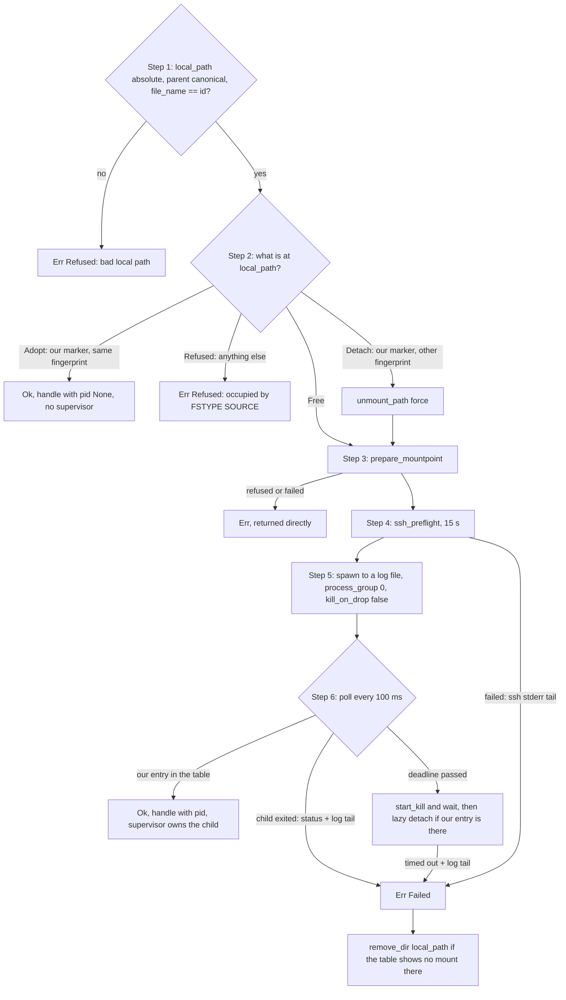

# bifrost-mount

`bifrost-mount` holds all process, FUSE and OS-specific code in Bifröst. It provides the three `MountDriver`s
(`sshfs`, `rclone`, `rclone-nfs`), the shared mount, inspect and unmount sequence they all use, the mount-table
reader, the timed filesystem checks that keep a hung FUSE mount from blocking the daemon, the SSH preflight, and
the startup adoption function. This guide covers what each module does, which rules it enforces, the reason for
each rule, and which external-tool behaviour the code relies on (verified or not). Read it before you change
anything under `crates/bifrost-mount/src/`, before you add a driver, or before you touch an ssh option.

## Contents

- [At a glance](#at-a-glance)
- [Who uses it](#who-uses-it)
- [Module map](#module-map)
- [The driver contract as implemented](#driver-contract)
- [SSH options: `SSH_OPTS` and `SSH_CLI_HARDENING`](#ssh-options)
- [`DriverSettings`](#driver-settings)
- [`Flavor` and `flavor()`](#flavor)
- [`mount_with`: mount steps 1–6](#mount-with)
- [`inspect_path`](#inspect)
- [`unmount_path`](#unmount)
- [`adopt`](#adopt)
- [table.rs: the mount table](#table)
- [check.rs: timed checks, binary lookup, helpers, preflight](#check)
- [sshfs.rs](#sshfs)
- [rclone.rs](#rclone)
- [Verified external-tool facts](#tool-facts)
- [macOS status](#macos)
- [Deliberate simplifications](#simplifications)
- [Where the code differs from the contract](#contract-vs-code)
- [Tests](#tests)
- [Changing this crate: what else moves](#changing)

<a id="at-a-glance"></a>
## At a glance

| | |
|---|---|
| Path | `crates/bifrost-mount/` |
| Dependencies | `bifrost-core`; `tokio` (features `process`, `time`, `rt`, `sync`, `fs`, `macros`, `io-util`); `libc` on macOS only (for `getmntinfo`). `tracing` is declared in `Cargo.toml`, but no source file uses it: the crate never logs. It returns every failure as a value, and the daemon logs it. |
| Public API | `DriverSettings`, `drivers`, `SshfsDriver`, `RcloneDriver`, `SSH_OPTS`, `SSH_CLI_HARDENING`, `Flavor`, `sshfs_argv`, `rclone_argv`, `preflight_argv`, `unmount_path`, `adopt`, `table::{MountEntry, read, parse_mountinfo, find}`, `check::{timed, liveness, which_in, which, run, ssh_preflight}` |
| Crate-internal | `flavor`, `Step2`/`step2`, `prepare_mountpoint`, `mount_with`, `inspect_path`, `log_tail`, `with_hint`, `busy`, `check::search_path`, `sshfs::probe_with`, `rclone::{probe_with, sftp_ssh_check}` |
| Tests | 39 unit tests: 34 run by default, 5 are `#[ignore]` docker tests. `cargo test -p bifrost-mount` |
| Design contract | `docs/design/contract.md` §6, plus amendments A8, A9, A10, A13, A17, A23, B7, B13, B14 and B15, and sign-offs S1.4, S2.3, S3.1, S3.2e, S4a.6 and S4a.11 |
| External tools | `sshfs` (3.x), `fusermount3`/`fusermount`, OpenSSH `ssh`, `rclone` (≥ the first version with `--sftp-ssh`); on macOS `/sbin/umount`, `/usr/sbin/diskutil`, `/sbin/mount_nfs`, macFUSE or FUSE-T |

The crate never decides *whether* to mount or unmount. The reconciler in core decides that, and the daemon's
executor tasks call these functions ([core.md](core.md), [daemon.md](daemon.md#executors)). What this crate owns
is *how*: the argv, the order of checks, what counts as mounted and what counts as healthy.

<a id="who-uses-it"></a>
## Who uses it

| Caller | What it uses | Why |
|---|---|---|
| `bifrost-daemon` `main.rs` | `table::read`, `adopt`, `DriverSettings`, `drivers` (through `Deps.drivers`) | Startup adoption of our marker mounts directly under the canonical root ([architecture.md#adoption](../architecture.md#adoption)). |
| `bifrost-daemon` `actor.rs` | `DriverSettings` (rebuilt from config on every apply), the `MountDriver` objects, `unmount_path` (only when no driver object of the handle's driver name exists), `table::{read, find}` (before `remove_dir` after an unmount) | Executor tasks and health probes ([daemon.md#executors](daemon.md#executors)). |
| `bifrost-cli` `doctor.rs` | `drivers` with placeholder `DriverSettings`, `check::which` (for `ssh`, `fusermount3`, `fusermount`) | `bifrost drivers` and `bifrost doctor` probe locally when the daemon is down ([cli.md](cli.md)). |

`bifrost-tui` and `bifrost-client` do not depend on it.

<a id="module-map"></a>
## Module map

| File | Responsibility | Main items |
|---|---|---|
| `lib.rs` | Driver settings and factory, ssh option constants, the FUSE flavour, preflight argv, the shared mount/inspect/unmount code, adoption | `DriverSettings`, `drivers`, `SSH_OPTS`, `SSH_CLI_HARDENING`, `Flavor`, `flavor`, `preflight_argv`, `unmount_path`, `busy`, `adopt`, `Step2`, `step2`, `prepare_mountpoint`, `with_hint`, `log_tail`, `mount_with`, `inspect_path`; the shared test helpers (`tmpdir`, `spec`, `static1`, `e2e`, `req`, `tidy`, `in_table`) |
| `table.rs` | Read the OS mount table without touching any FUSE filesystem | `MountEntry`, `read` (Linux and macOS variants), `parse_mountinfo`, `unescape`, `find` |
| `check.rs` | Timed blocking calls with an in-flight guard, the liveness probe, binary lookup, helper commands, the SSH preflight | `INFLIGHT`, `timed`, `liveness`, `which_in`, `search_path`, `which`, `run`, `ssh_preflight` |
| `sshfs.rs` | The `sshfs` driver | `SshfsDriver`, `sshfs_argv`, `probe_with` |
| `rclone.rs` | The `rclone` (FUSE `rclone mount`) and `rclone-nfs` (`rclone nfsmount`) drivers | `RcloneDriver`, `rclone_argv`, `sftp_ssh_check`, `probe_with` |

`drivers(s)` returns all three drivers on every OS, in the order sshfs, rclone, rclone-nfs. `rclone-nfs` probes
`Unavailable("macOS only")` on Linux instead of being left out. That keeps the driver list, `bifrost drivers`
output and the config's `DRIVER_NAMES` identical everywhere.

<a id="driver-contract"></a>
## The driver contract as implemented

`MountDriver` is defined in `crates/bifrost-core/src/lib.rs` ([core.md](core.md)); its methods return `BoxFuture`, so
each implementation wraps its future in `Box::pin(…)`: an `async move { … }` block, or a shared async fn from
`lib.rs` such as `inspect_path` ([decisions.md#boxfuture-not-async-trait](../decisions.md#boxfuture-not-async-trait)).
Both driver structs are thin:
each resolves its binaries, builds its argv and calls the shared code in `lib.rs`.

| Trait method | sshfs | rclone / rclone-nfs | Guarantee | How it is kept |
|---|---|---|---|---|
| `name()` | `"sshfs"` | `"rclone"` / `"rclone-nfs"` | Matches `bifrost_config::DRIVER_NAMES` | Constant strings |
| `probe()` | `sshfs::probe_with(&search_path())` | `rclone::probe_with(&search_path(), nfs)` | Looks only at binaries, version text, flags and FUSE; never at `DriverSettings` (S2 sign-off 3: `doctor` probes with placeholder settings) | Each external command runs through `check::run` with a 5 s timeout |
| `mount(req)` | `which("sshfs")`, `which("ssh")`, `flavor()`, then `mount_with` | macOS check for nfs, `which("rclone")`, `which("ssh")`, `flavor()`, `sftp_ssh_check`, then `mount_with` | `Ok` only once the mount table shows our entry. On `Err` from the driver's own deadline the spawned FUSE process has been SIGKILLed and reaped and any entry it made lazily detached; its ssh child can linger until `ConnectTimeout` (10 s). If the daemon's outer timeout drops the attempt instead, the child keeps running (`kill_on_drop(false)`) and may still mount; the next `mount()` adopts that mount ([step 2](#step-2)) | [`mount_with`](#mount-with) |
| `inspect(h)` | `inspect_path(h)` | `inspect_path(h)` | Answers within about 5 s even on a hung FUSE mount; errors fold into `Degraded` | Table read, then one `check::liveness` under `check::timed` |
| `unmount(h, force)` | `unmount_path(&h.local_path, force)` | same | Idempotent; `force=false` never detaches a busy mount; `force=true` never kills a process | The mount table decides success |

The daemon adds its own guards around every call ([daemon.md#executors](daemon.md#executors)):

| Call | Outer timeout in the daemon | Panic |
|---|---|---|
| `mount` | `mount_timeout + 60 s` (A9) | caught, becomes `Err(Failed("driver panicked: …"))` |
| `unmount` | 30 s | caught, becomes `Err(Failed(…))` |
| `inspect` | 30 s (only guards a driver bug; the driver answers in about 5 s) | caught, becomes `Degraded(…)` |
| `probe` | none (each command inside is bounded) | caught, becomes `Unavailable(…)` |

See [decisions.md#panics-caught-at-driver-boundary](../decisions.md#panics-caught-at-driver-boundary).

**Why the `mount` budget is `mount_timeout + 60 s`.** The code comment at the call site (`actor.rs`) says the
budget "covers the 15s preflight, mount_timeout and the driver's own 10s lazy detach" (A9). Adding a step 2 lazy
detach (10 s) gives a derived worst case of about `mount_timeout + 35 s` on Linux. On macOS each force unmount can
run two 10 s commands, which brings the same sum to about `mount_timeout + 55 s`, still inside the budget. An outer
timeout shorter than the driver's worst case would drop a child that is still mounting. The next `mount()` would then see
our entry at the path, and before amendment A9 it would have refused it until a restart.

<a id="ssh-options"></a>
## SSH options: `SSH_OPTS` and `SSH_CLI_HARDENING`

Both are constants in `lib.rs`. Together they are the **only** ssh options Bifröst ever passes. There is no config
knob for either ([decisions.md#host-keys-never-weakened](../decisions.md#host-keys-never-weakened)).

| `SSH_OPTS` entry | Why |
|---|---|
| `BatchMode=yes` | ssh never prompts. A password prompt, a passphrase prompt or a host-key "ask" becomes a failure (security checklist #2; child stdin is `/dev/null` anyway). |
| `ConnectTimeout=10` | Bounds the connect and the initial handshake, so a dead host fails within 10 s instead of the system TCP timeout. |
| `ServerAliveInterval=15`, `ServerAliveCountMax=3` | ssh detects a dead link after about 45 s and exits. sshfs then reconnects (`reconnect`), or the mount returns ENOTCONN and becomes `Stale`. |
| `ControlMaster=no`, `ControlPath=none` | The mount's ssh never joins or becomes a multiplexing master, so the mount's lifetime is tied to our child process rather than to a master the user started. |

Host-key options are deliberately absent. `SSH_OPTS` never contains StrictHostKeyChecking, UserKnownHostsFile,
GlobalKnownHostsFile, ProxyCommand or IdentityFile. The user's ssh_config (or the `-F` file from `mount.ssh_config`)
decides trust, and `BatchMode=yes` turns its "ask" into "fail". The test `argv_never_weakens_host_keys` scans
every argv builder for these names plus `ssh_command`, `directport`, `passive` and `sftp_server`.

**Ceiling** (`ponytail:` on `SSH_OPTS`, §15 #5). Command-line options win over ssh_config, so users can't tune
these values. The upgrade path is an `[ssh]` config section.

| `SSH_CLI_HARDENING` | Why |
|---|---|
| `-a` | No agent forwarding to a mounted host. |
| `-x` | No X11 forwarding. |
| `-o ClearAllForwardings=yes` | Drops any `LocalForward`/`RemoteForward`/`DynamicForward` from ssh_config. |
| `-o PermitLocalCommand=no` | Never runs a `LocalCommand` from ssh_config. |

These are the flags OpenSSH's own `sftp` and `scp` pass. They go first in the preflight argv and in rclone's
`--sftp-ssh` (final review r1, commit 2e09dce; test `ssh_never_forwards_agent_x11_or_ports`). They stay out of
`SSH_OPTS`, which also goes to sshfs, for this reason: sshfs forwards to its ssh only the `-o` names on a built-in
list (visible with `strings /usr/bin/sshfs`, sshfs 3.7.3). `ClearAllForwardings` is not on that list, and `-a`/`-x`
are not `-o` options, so none of the three can be passed through; sshfs adds `-x -a -oClearAllForwardings=yes` to
its ssh itself.

**Gap: `PermitLocalCommand` under sshfs.** `PermitLocalCommand` *is* on sshfs's list, so `-o PermitLocalCommand=no`
could be forwarded, but `sshfs_argv` doesn't pass it. sshfs's ssh therefore keeps whatever ssh_config (or the `-F`
file) says. ssh's default is `no`, so this matters only when the user's own ssh_config sets
`PermitLocalCommand yes` with a `LocalCommand`: a defence-in-depth gap, not an injection path. The doc comment on
`SSH_CLI_HARDENING` in `lib.rs` and contract §6 say sshfs's passthrough "rejects these"; that holds for `-a`, `-x`
and `ClearAllForwardings` only. The fix would be adding `PermitLocalCommand=no` to the sshfs `-o` value (and its
goldens).

| argv | `SSH_CLI_HARDENING` | `SSH_OPTS` | ssh binary |
|---|---|---|---|
| preflight (`preflight_argv`) | yes, first | yes, as `-o X` pairs | absolute, from `which("ssh")` |
| sshfs (`sshfs_argv`) | sshfs adds `-x -a -oClearAllForwardings=yes` itself; no `PermitLocalCommand=no` (the gap above) | yes, as one comma-joined `-o` value | sshfs starts `ssh` itself. `sshfs_argv` never passes `ssh_command`, so the preflight's absolute path is not the one sshfs uses (how sshfs locates `ssh` was not checked here) |
| rclone (`--sftp-ssh`) | yes, first | yes, as `-o X` pairs | absolute, first token of `--sftp-ssh` |

<a id="driver-settings"></a>
## `DriverSettings`

The daemon builds `DriverSettings` from the config on every apply, and rebuilds the drivers through `drivers()`
only when the settings change ([daemon.md#config-apply](daemon.md#config-apply)). `doctor` passes placeholder
values, which is safe because probes never read them.

| Field | Config key | Used by |
|---|---|---|
| `ssh_config: Option<PathBuf>` | `mount.ssh_config` | `-F <path>` in the preflight, in `sshfs_argv` and (quoted) in `--sftp-ssh` |
| `vfs_cache_mode: String` | `mount.vfs_cache_mode` (off, minimal, writes, full; default `writes`) | rclone only: `--vfs-cache-mode` (raised to `writes` for nfsmount) |
| `mount_timeout: Duration` | `daemon.mount_timeout` (default 30 s, at most 5 min) | the step 6 readiness deadline |
| `state_dir: PathBuf` | the daemon's state dir | rclone only: `--cache-dir=<state_dir>/rclone/<id>` (A23) |

`vfs_cache_mode` and `ssh_config` are not part of the spec fingerprint, so a change applies to new mounts only;
existing mounts are not remounted (`ponytail:` on `MountSpec::fingerprint`, §15 #16, [core.md](core.md)).

<a id="flavor"></a>
## `Flavor` and `flavor()`

`Flavor` is `Linux`, `MacFuse` or `FuseT`. It is a parameter of the pure argv builders, so the macOS argv is
golden-tested on Linux. `flavor()` (crate-internal) picks the one for the running host:

| OS | Result |
|---|---|
| not macOS | always `Some(Flavor::Linux)` |
| macOS | `MacFuse` if `/Library/Filesystems/macfuse.fs` exists; else `FuseT` if `/Library/Application Support/fuse-t` or `/usr/local/lib/libfuse-t.dylib` exists; else `None` |

`None` makes `sshfs` and `rclone` return `Unavailable("no macFUSE or FUSE-T")` from `mount`. `rclone-nfs` needs no
FUSE: with `None` it passes `Flavor::MacFuse` as a placeholder, which its argv ignores. `flavor()` used to be
duplicated in `sshfs.rs` and `rclone.rs`; it lives once in `lib.rs` since S3 sign-off 2e.

<a id="mount-with"></a>
## `mount_with`: mount steps 1–6

`mount_with(driver, bin, ssh, argv, req, settings)` is the whole mount sequence for every driver. The caller
passes absolute binaries (from `check::which`) and its own argv. The driver's `mount()` has already returned
`Unavailable` if a binary or the FUSE flavour is missing.



<a id="step-1"></a>
### Step 1: the request

`local_path` must be absolute, its parent must canonicalize to itself (the root is canonical, with no symlink
anywhere in it), and its file name must equal `spec.id`. Otherwise the result is
`Refused("bad local path …")`. `reconcile::desired` is the only place that builds `local_path`
(`canonical_root.join(id)`), so this check is a second line of defence against a path traversal or a mount
outside the root ([decisions.md#validated-newtypes-at-trust-boundary](../decisions.md#validated-newtypes-at-trust-boundary)).

<a id="step-2"></a>
### Step 2: what is already mounted there (A9)

`step2(entries, spec)` looks only at the **topmost** entry at `local_path` (`table::find`), and classifies it with
`parse_marker(source)`:

| Entry at `local_path` | `Step2` | `mount_with` then |
|---|---|---|
| none | `Free` | continues |
| our marker for this `id` with the same fingerprint | `Adopt` | returns `Ok(MountHandle{pid: None, …})` at once. This is a leftover of an attempt the daemon dropped or timed out, and it already serves exactly this spec. No process is spawned and there is no supervisor. |
| our marker for this `id` with another fingerprint | `Detach` | `unmount_path(local_path, true)` (lazy detach), then continues. A leftover of an older spec would otherwise serve the wrong host. |
| anything else: no marker, another id's marker, a longer string | `Refused` | `Err(Refused(clean("occupied by <fstype> <source>", 512)))`. Foreign mounts are never touched. |

The whole refusal text goes through `clean`, fstype included, because the FUSE subtype is chosen by whoever
mounted there (commit e914166). The `Adopt` row is why the daemon's outer timeout can safely drop a mount future:
the next attempt finds the child's finished mount and adopts it instead of refusing it
([decisions.md#adoption-by-marker-and-fingerprint](../decisions.md#adoption-by-marker-and-fingerprint)).

The contract's A10 fallback (treat an entry with the driver's own fstype as ours when sshfs ignores `fsname=`) is
**not implemented**. S1 verified that sshfs honours the user `fsname=` ([tool facts](#tool-facts)).

<a id="step-3"></a>
### Step 3: `prepare_mountpoint`

This step runs only after the table says the path is not a mountpoint (hung-FUSE guard 3). A `stat` on a hung
mountpoint would block.

| `symlink_metadata(local_path)` | Result |
|---|---|
| NotFound | `DirBuilder::new().mode(0o700).create(p)`. Not recursive: the root must exist. |
| other error | `Failed("<path>: <error>")` |
| a symlink | `Refused("<path> is a symlink")`. A symlink could redirect the mount outside the root. |
| not a directory | `Refused("<path> is not a directory")` |
| a directory with any entry, dotfiles included | `Refused("<path> is not empty")`. fuse3 would mount over the files and hide them. |
| an empty directory | Ok (a user-created or leftover empty dir is fine) |

A step 3 failure returns straight away. It skips the cleanup below, because a refused path belongs to someone
else.

<a id="step-4"></a>
### Step 4: the SSH preflight

`check::ssh_preflight(ssh, spec, settings.ssh_config)`: see [check.rs](#preflight). It runs before every spawn,
for both drivers. rclone swallows ssh's stderr, and a failing sshfs only fails after it has been spawned, so this
is where "Host key verification failed." or "Permission denied (publickey)." reaches `last_error` verbatim
([decisions.md#ssh-preflight](../decisions.md#ssh-preflight)).

<a id="step-5"></a>
### Step 5: spawn

| Rule | Code | Why |
|---|---|---|
| Absolute binary, `Command::new(bin).args(argv)` | the caller resolves `bin` through `check::which` | No `PATH` lookup at exec time and **never `sh -c`**: no argv value is ever parsed by a shell. |
| stdin `/dev/null` | `Stdio::null()` | Nothing can prompt; `BatchMode=yes` as well. |
| stdout and stderr go to the child log file, **never a pipe** | `OpenOptions` create + truncate + write, `mode(0o600)`; stdout gets `try_clone()` of the same file | A full pipe can stall the FUSE server, and a pipe whose reader died (daemon crash) would SIGPIPE the orphaned child. |
| First log line is `LOG_HEADER` + the argv (lossy UTF-8, space-joined) | `writeln!(f, "{LOG_HEADER}…")` | Shows what ran; `core::validate::tail` skips this line when building error text (A8). |
| `process_group(0)` | tokio `Command::process_group` | The child is in its own process group, so a terminal ^C or the daemon's death never signals it. It does not protect against a service manager that kills the whole cgroup: systemd's default `KillMode=control-group` signals every process in the unit on stop or restart, whatever its group, so the unit needs `KillMode=process` (README "Running under systemd", [daemon.md#shutdown](daemon.md#shutdown)). |
| `kill_on_drop(false)` | | Dropping the `Child` (daemon exit, the actor's outer timeout dropping the future) never kills a mount. |
| Environment inherited | default | `SSH_AUTH_SOCK` reaches ssh; that is how agent keys work under a service manager. |

The log path comes from the daemon: `<state>/logs/<id>.log`. `mode(0o600)` applies only when the file is
created. The daemon creates `<state>/logs` with mode 0700, and refuses to start when a pre-existing state or log
dir is not owned by its user or is world-writable ([daemon.md#directories](daemon.md#directories)). See
[decisions.md#sshfs-foreground-child](../decisions.md#sshfs-foreground-child) for why the child is kept in the
foreground and owned by the daemon.

<a id="step-6"></a>
### Step 6: readiness, supervisor and timeout

Every 100 ms until `settings.mount_timeout` (config `daemon.mount_timeout`: default 30 s, at most 5 min):

1. **Our entry is in the table** (`ours()`). On Linux this means the topmost entry at `local_path` has
   `source == marker(id, fingerprint)`. On macOS any entry at the path counts, because FUSE-T and NFS may not show
   the marker, and step 2 made sure nothing else was there. A table read error counts as "not yet".
   The call returns `Ok(MountHandle{pid: child.id(), …})` and spawns the **supervisor**:
   `tokio::spawn(async move { let st = child.wait().await; on_exit(<status or error text>) })`. The supervisor
   reaps the child and reports its exit exactly once. It has no kill channel. The daemon's `on_exit` sends
   `Msg::ChildExited`, which triggers an immediate inspect.
2. **The child has exited** (`try_wait`). The result is `Err(Failed("<driver> <exit status>: <log tail>"))`.
3. **The deadline has passed.** `start_kill()` (SIGKILL) and `wait()`. This is the only signal Bifröst ever sends
   to a mount process, and it goes to our own child, which never finished mounting. It reaches that pid only, not
   its process group, so an ssh grandchild stuck in connect lives until `ConnectTimeout` (10 s; the `ponytail:` on
   this branch). If our entry appeared in the meantime, `unmount_path(local_path, true)` lazily detaches it. The
   result is `Err(Failed("timed out after <mount_timeout>s: <log tail>"))`.

   Short-lived helpers are a different case: they are spawned with `kill_on_drop(true)`, so a timed-out helper is
   SIGKILLed when its `Child` is dropped. That covers `check::run` (`fusermount3`, `umount`, `diskutil`,
   `sshfs --version`, `rclone version`, `rclone help flags sftp`), `check::ssh_preflight`, and `tailscale status` in
   bifrost-discovery ([discovery.md](discovery.md#tailscale-invocation)).

   If the daemon's outer `mount_timeout + 60 s` drops the whole future instead, none of this runs: the child is
   left running (`kill_on_drop(false)`), and the next attempt adopts or detaches whatever it mounted
   ([step 2](#step-2)).

**Cleanup.** Any failure in steps 4–6 is followed by `remove_dir(local_path)`, but only if the mount table then
shows no mount there. `remove_dir` removes only an empty directory and never recurses. So a failed attempt leaves
no directory behind, including a user-created empty one (sign-off S4a.6; test `failed_mount_leaves_no_mountpoint`).

**Error text.** `log_tail(log_path)` seeks to the last 2 KiB of the child log (the peer controls how big it gets,
sign-off S4a.11) and runs `tail(…, 512)`. `tail` skips blank lines and `LOG_HEADER` lines, keeps the last lines
that fit in 512 characters, cleans each one and joins them with ` | `. Then `with_hint` (B7) appends
` (macOS: allow the macFUSE system extension in System Settings → Privacy & Security)` when the host is macOS and
the text contains `kernel extension`, `System Extension` or `not permitted`. `bifrost doctor` looks for that
suffix in `last_error` ([cli.md](cli.md)).

<a id="inspect"></a>
## `inspect_path`

`inspect_path(h)` is `inspect()` for every driver:

| Situation | Result |
|---|---|
| `table::read()` fails | `Degraded("mount table: <error>")` |
| The topmost entry at `h.local_path` is ours (Linux: `source == marker(h.id, h.fingerprint)`; macOS: any entry) | `check::liveness(&h.local_path, &key)` |
| No entry, or a foreign entry on top | `Missing` |

The in-flight key is `<local_path>/.pid-<pid>`, or the plain `local_path` when the handle has no pid (an adopted
mount without a state record). The key is only a string and never touched on disk. It names the **mount
instance**, not the path: a lazy detach does not abort the FUSE connection, so a probe stuck on a detached hung
instance used to hold the path, and every later mount there read `Degraded("unresponsive")` and was force-detached
each grace period (sign-off S4a.11; test `liveness_keyed_per_instance`). `ponytail:` two pid-less adoptions at one
path share a key; mountinfo field 1 (the mount ID) would separate them.

<a id="unmount"></a>
## `unmount_path`

`unmount_path(path, force)` is `unmount()` for every driver. The daemon also calls it directly for an adopted
handle whose driver has no driver object.

1. A relative path gives `Refused("not absolute: …")`.
2. If the table shows nothing at `path`, the result is `Ok(())` at once. That is the idempotence rule: a
   `Missing` mount or a repeated unmount is fine.
3. It runs the commands for the OS and mode, each through `check::run` with a 10 s timeout. After **each** command
   it re-reads the table and returns `Ok(())` as soon as the path is gone. The helper's exit code and stdout are
   ignored.
4. If the path is still mounted after the last command: a **graceful** unmount whose last stderr tail matches
   `busy()` returns `Err(Busy)`; anything else returns `Err(Failed("still mounted: <stderr tail or io error>"))`.

| | Linux | macOS |
|---|---|---|
| graceful | `fusermount3 -u <p>` (falls back to `fusermount`; neither found → `Unavailable("fusermount3 not found")`) | `/sbin/umount <p>` |
| force | `fusermount3 -u -z <p>`: lazy detach | `/usr/sbin/diskutil unmount force <p>`, then `/sbin/umount -f <p>` if still mounted |

**Force is never a kill.** A lazy detach frees the path at once. Processes with open files keep using them, and
the FUSE child exits by itself when the last reference closes
([decisions.md#no-pid-signalling-lazy-detach](../decisions.md#no-pid-signalling-lazy-detach)). **A busy graceful
unmount is never escalated** by this crate. The reconciler keeps the mount Degraded with
`unmount blocked: busy (files open)` and retries with backoff; only Stale, hung-past-grace or an explicit
`--force` use force ([decisions.md#busy-unmount-never-forced](../decisions.md#busy-unmount-never-forced)).

`busy(why)` matches the errno text `resource busy`, case-insensitively: "Device or resource busy" from
fusermount3, "Resource busy" from macOS umount. It never matches the bare word "busy", because stderr carries the
path and a root or id may contain "busy" (`/home/busybee/machines/busy-box`; commit e914166, test
`busy_matches_the_errno_text_not_the_path`).

**Why the table decides, not the helper.** The helper's exit code is ambiguous: `fusermount3 -u` exits 1 both for
a busy mount and for a path that is not mounted. The mount table is the one truth about what is mounted
([decisions.md#mount-table-not-path-existence](../decisions.md#mount-table-not-path-existence)).

Removing the empty directory after a successful unmount is the daemon's job, not this function's: it does it only
for `NotDesired`, `Manual` and `OfflineGrace` unmounts ([daemon.md#executors](daemon.md#executors)).

<a id="adopt"></a>
## `adopt`

`adopt(entries, root, records)` is pure. The daemon calls it once at startup with the mount table, the canonical
root and the `state.json` mount records. It returns the handles to seed as adopted runtimes
([architecture.md#adoption](../architecture.md#adoption)).

1. Keep only entries whose `mount_point.parent() == root`. Nested mounts, the root itself and mounts elsewhere are
   ignored. For each mount point keep the **topmost** entry (later entries overwrite earlier ones).
2. Look up the state record with the same `local_path` (`rec`).
3. **The source carries a marker** (`parse_marker`):
   - the directory name must equal the marker's id, otherwise the entry is skipped;
   - driver: `fuse.sshfs` gives `"sshfs"`, `fuse.rclone` gives `"rclone"`, anything else gives `rec`'s driver,
     else `"sshfs"`;
   - fingerprint: from the **marker**, not from state.json, so a spec change made while the daemon was down shows
     up as a fingerprint mismatch (row 11 remount);
   - pid: `rec`'s pid, else `None` (B15).
4. **No marker:** on macOS, adopt `rec` as it is if one exists (NFS mounts show no marker). On Linux the entry is
   foreign, even with a record, because Linux fsname markers always work (commit e914166).

A foreign overmount on top of our marker entry hides it: nothing is adopted there. State records whose path is not
mounted are simply not returned, and no recorded pid is ever signalled
([decisions.md#state-json-is-a-hint](../decisions.md#state-json-is-a-hint)). Test:
`adopt_marker_record_foreign_outside_root`.

`ponytail:` only mounts directly under the current root are adopted, so after a root change old-root mounts are
left alone (§15 #19). On macOS an unmarked entry is trusted on a state.json record, and an unknown fstype guesses
`"sshfs"`; inspect and unmount are shared, so the guess is harmless (§15 #23).

<a id="table"></a>
## table.rs: the mount table

Reading the mount table never touches a FUSE filesystem (hung-FUSE guard 1). It is the only way the crate decides
whether something is mounted ([decisions.md#mount-table-not-path-existence](../decisions.md#mount-table-not-path-existence),
[decisions.md#hung-fuse-guards](../decisions.md#hung-fuse-guards)).

`MountEntry { mount_point: PathBuf, fstype: String, source: String }`.

| OS | `read()` |
|---|---|
| Linux (every non-macOS target) | `std::fs::read("/proc/self/mountinfo")` → `parse_mountinfo`. This is procfs: the daemon's own mount namespace, and no filesystem is asked anything. |
| macOS | `libc::getmntinfo(&mut p, MNT_NOWAIT)` under a static `Mutex` (the function returns one per-process buffer that the next call overwrites), then each `statfs`'s `f_mntonname`, `f_fstypename` and `f_mntfromname` is copied out. `MNT_NOWAIT` returns cached data without asking each filesystem for fresh statistics, so a hung FUSE or NFS mount can't block it. |

**`parse_mountinfo(bytes)`** (pure):

- Split into lines on `\n`, fields on single spaces.
- Find the lone `-` separator after the 6 fixed fields (the optional fields `shared:N`, `master:N`,
  `propagate_from:N` come before it). The field after it is the fstype, the one after that is the source.
- `mount_point` is field 5 (index 4), unescaped **as bytes** into an `OsString`, so a non-UTF-8 path survives.
  fstype and source are unescaped and then decoded as lossy UTF-8.
- Lines without a separator, or too short after it, are skipped.

**`unescape`**: `\NNN`, three octal digits with the first one at most `3` (so ≤ `\377`), becomes that byte. The
kernel writes `\040` (space), `\011` (tab), `\012` (newline) and `\134` (backslash) this way. Anything else (`\9x`,
a short `\04`, `\400`) is kept byte for byte.

**`find(entries, p)`** returns the **last** entry whose mount point equals `p`. An overmount is listed after the
mount it hides, so this is the topmost one, the one a path lookup would reach.

`ponytail:` the mountinfo parser is hand-rolled and reads only three fields (§15 #4); use a crate if more fields
are ever needed. The `ponytail:` on the macOS `read` says, verbatim: "macOS code is compile-checked only, runtime
behaviour of macFUSE/FUSE-T/nfsmount is unproven; a macOS runner for the E2E" (§15 #25). The "compile-checked
only" part is outdated: the CI `macos` job now builds and unit-tests the workspace on macos-15. The rest still
holds: nothing has ever mounted on macOS ([macOS status](#macos)).

<a id="check"></a>
## check.rs: timed checks, binary lookup, helpers, preflight

<a id="timed"></a>
### `timed(key, dur, f)`

This is the only way the crate makes a blocking filesystem call on a path that may be a live FUSE mount
(hung-FUSE guard 2):

1. Insert `key` into the static `INFLIGHT: Mutex<BTreeSet<PathBuf>>`. If it is already there, return `None`
   **immediately** without running `f` or spawning anything.
2. Run `f` on tokio's blocking pool (`spawn_blocking`). A `Release(key)` guard, moved into the closure, removes the
   key when `f` returns or panics. It is not removed when the caller gives up.
3. Wait at most `dur`. The results: `Some(result)`; `Some(Err(other))` if the closure panicked; `None` on timeout.

A syscall stuck on a hung FUSE mount can't be cancelled. The thread leaks until the kernel returns, and the key
stays in the set until then, so each key leaks at most one thread. While it is stuck, every later probe for that
key answers `None` at once. Test: `timed_guard_single_thread`.

<a id="liveness"></a>
### `liveness(path, key)`

`symlink_metadata(<path>/.bifrost-probe-<16 hex random_u64>)` under `timed(key, 5 s)`:

| Outcome | `MountState` | Why |
|---|---|---|
| `Ok`, `NotFound`, `PermissionDenied` | `Healthy` | Any reply from the server means the round trip worked. An unsearchable remote root is not a fault (A17). |
| `NotConnected` (ENOTCONN), or on macOS raw errno 6 (ENXIO) | `Stale(e)` | The FUSE server is gone: the process died or the connection was aborted. |
| any other error | `Degraded(e)` | |
| `None` (timed out, or a probe for this key is still stuck) | `Degraded("unresponsive")` | |

**Why a unique nonexistent name.** A `stat` of the mount root can be answered from the kernel's and sshfs's
caches, so a dead remote would look healthy (contract "Changes from B" #4). A fresh random name has no dentry,
positive or negative, anywhere, so the lookup must reach the server. rclone may still answer a negative lookup from
its directory cache, which is why its argv sets `--dir-cache-time=15s` as the ceiling.

`ponytail:` the 5 s probe timeout is a constant (§15 #7). On a slow link under load it can read Degraded, which
is harmless because nothing acts on Degraded until the grace period.

<a id="which"></a>
### `which_in`, `search_path`, `which`

| Function | Behaviour |
|---|---|
| `which_in(name, path)` | Searches **only** the given PATH-style list. Relative entries (`""`, `.`) are skipped, because spawned binaries are always absolute. A hit must be a regular file with an execute bit (`mode & 0o111`). |
| `search_path()` (crate) | `$PATH` + `:/usr/local/bin:/usr/bin:/bin`, + `:/opt/homebrew/bin` on macOS. systemd and launchd start the daemon with a minimal `PATH`. |
| `which(name)` | `which_in(name, &search_path())` |

Tests pass their own `path` and never call `set_var`, which is `unsafe` in edition 2024 and racy across test
threads (B14). That is why each driver's `probe()` is a thin wrapper around a crate-internal `probe_with(path)`.
The tailscale provider carries a copy of this lookup, because `bifrost-discovery` can't depend on this crate
([discovery.md](discovery.md#tailscale-binary)).

<a id="run"></a>
### `run(bin, args, t)`

This runs a helper with stdin `/dev/null`, stdout and stderr piped, `kill_on_drop(true)`, under
`timeout(t)`. On timeout the child is dropped, which kills it, and the error is `TimedOut("timed out after …")`. It
buffers all output, so it is used only for local, trusted helpers: `fusermount3`, `umount`, `diskutil`,
`sshfs --version`, `rclone version`, `rclone help flags sftp`. Output that comes from the peer goes through
`ssh_preflight` instead.

<a id="preflight"></a>
### `ssh_preflight(ssh, spec, ssh_config)`

```text
<ssh> -a -x -o ClearAllForwardings=yes -o PermitLocalCommand=no
      -o BatchMode=yes -o ConnectTimeout=10 -o ServerAliveInterval=15 -o ServerAliveCountMax=3
      -o ControlMaster=no -o ControlPath=none [-F <ssh_config>] [-p <port>] [-l <user>] -s -- <host> sftp
```

| Aspect | Behaviour |
|---|---|
| argv | `preflight_argv(spec, ssh_config)` (pure, golden test `preflight_argv_golden`). `--` before the host; the host grammar forbids a leading `-` anyway. |
| stdin | `/dev/null`. sftp-server reads EOF and exits, so ssh exits 0. |
| stdout | `/dev/null`. It is channel data from the peer. |
| stderr | Piped and read up to 64 KiB. At the cap the reader is dropped, so a flooding peer gets EPIPE instead of growing our heap. |
| time | One 15 s timeout covers the read and the wait; `kill_on_drop(true)` kills ssh when it fires. |
| exit 0 | `Ok(())`: host key, authentication and the sftp subsystem all work (verified, S1.4). |
| non-zero | `Err(Failed(tail(stderr, 512)))`, or `Failed("ssh preflight: <status>")` when stderr is empty. |
| spawn error or timeout | `Failed("ssh preflight: <error>")` / `Failed("ssh preflight: timed out")` |

The cost is one extra ssh connection per mount attempt. In exchange, the exact ssh error reaches `last_error` and
no FUSE child is spawned for a host that can't work. Tests: `preflight_stdout_ignored_stderr_capped`,
`preflight_exit0_and_hostkey_failure` (ignored, docker).

<a id="sshfs"></a>
## sshfs.rs

<a id="sshfs-argv"></a>
### `sshfs_argv(spec, ssh_config, flavor)`

Options come first and the validated positionals last:

```text
<sshfs> -f
  -o fsname=bifrost:<id>@<fp16>,reconnect,idmap=user,transform_symlinks
  -o BatchMode=yes,ConnectTimeout=10,ServerAliveInterval=15,ServerAliveCountMax=3,ControlMaster=no,ControlPath=none
  -o auto_unmount                    (Linux)
  -o volname=<id>,noappledouble      (macFUSE)
  -o volname=<id>                    (FUSE-T)
  [-o ro] [-p <port>] [-F <ssh_config>]
  [<user>@]<host | [v6]>:<sftp_path>  <local_path>
```

| Option | Why |
|---|---|
| `-f` | Foreground: the process we spawn is the FUSE server itself, so its pid is meaningful, its exit reaches the supervisor, and it never daemonizes away from us ([decisions.md#sshfs-foreground-child](../decisions.md#sshfs-foreground-child)). |
| `fsname=bifrost:<id>@<fp16>` | The marker (`core::marker`). It becomes the `fuse.sshfs` source in mountinfo, which readiness, inspect, step 2 and adoption read. |
| `reconnect` | sshfs re-establishes a dropped ssh connection itself. Bifröst leaves a Degraded mount to it until the grace period instead of fighting it (contract §14 risk 6). |
| `idmap=user` | sshfs translates the connecting user's remote UID/GID to the local user. |
| `transform_symlinks` | sshfs rewrites absolute symlinks to relative ones, so they resolve inside the mount. |
| the `SSH_OPTS` value | sshfs forwards these known ssh options to its ssh. |
| `auto_unmount` (Linux) | Meant to unmount the mount when sshfs dies. With fuse3 3.14.0 on this host it does **not** fire after SIGKILL: the mount stays and returns ENOTCONN, so recovery is Stale → row 10 lazy detach → row 9 remount (S1.4). |
| `volname=<id>`, `noappledouble` (macOS) | Finder volume name. macFUSE's `noappledouble` keeps Finder's `._*` AppleDouble files off the remote. |
| `ro` | `read_only = true` in the spec. |
| `-p`, `-F` | Port from the spec; `-F` only when `mount.ssh_config` is set. |
| source | `spec.source()`: `[user@]<host.for_colon()>:<remote.sftp_path()>`. A v6 host is bracketed; `~` maps to the empty sftp path, which is the login directory. |

**Why positionals can't be options.** Neither positional can start with `-`. The source starts with the user
when there is one, else with the host, and the `User` and `Host` grammars both forbid a leading `-`. The local
path is absolute. Test:
`positionals_never_start_with_dash`. Remote paths may contain spaces; they are always a single argv element.

<a id="sshfs-probe"></a>
### `sshfs::probe_with(path)`

In this order, with the first failure winning:

1. `which_in("sshfs", path)`, else `Unavailable("sshfs not found")`.
2. `sshfs --version` through `run` (5 s); stdout and stderr are concatenated. A run error gives
   `"sshfs --version: <error>"`, not "not SSHFS" (commit e914166). If no line contains `SSHFS version`, the result
   is `"sshfs --version: not SSHFS"`.
3. `which_in("ssh", path)`, else `"ssh not found"`.
4. FUSE. On macOS `flavor()` gives `"macFUSE"`/`"FUSE-T"`, else `"neither macFUSE nor FUSE-T is installed"`. On
   Linux `fusermount3` or `fusermount` must be in `path` (else `"fusermount3 not found"`) and `/dev/fuse` must
   exist (else `"/dev/fuse missing"`).

`Available { binary, detail: "<version line>, <fuse>" }`, for example `SSHFS version 3.7.3, fusermount3`.

<a id="rclone"></a>
## rclone.rs

`RcloneDriver::new(settings, nfs)`: `nfs = false` is `"rclone"` (`rclone mount`, FUSE) and `nfs = true` is
`"rclone-nfs"` (`rclone nfsmount`, macOS only). rclone's internal SSH library is **never** used: it skips host-key
checks unless `known_hosts_file` is set. `--sftp-ssh` hands every connection to the system OpenSSH, with the same
`SSH_OPTS`, ssh_config, known_hosts, agent and ProxyJump setup as sshfs
([decisions.md#rclone-via-system-ssh](../decisions.md#rclone-via-system-ssh)).

<a id="rclone-mount"></a>
### `mount()`

1. `nfs` on a non-macOS host gives `Unavailable("macOS only")`.
2. `which("rclone")` and `which("ssh")`, else `Unavailable("rclone or ssh not found")`.
3. `flavor()`. `None` is `Unavailable("no macFUSE or FUSE-T")` for FUSE, and a placeholder for nfs.
4. `sftp_ssh_check` (below), else `Refused`.
5. `argv(spec, ssh, flavor)`, which is `rclone_argv` with `cache_dir = <state_dir>/rclone/<id>`, then `mount_with`.

<a id="rclone-argv"></a>
### `rclone_argv(spec, ssh, ssh_config, vfs, cache_dir, nfs, flavor)`

Always `--flag=value`, with the positionals first:

```text
<rclone> mount|nfsmount :sftp:<sftp_path> <local_path>
  --config=/dev/null
  --sftp-host=<host>
  --sftp-ssh=<ssh> -a -x -o ClearAllForwardings=yes -o PermitLocalCommand=no -o BatchMode=yes -o ConnectTimeout=10
             -o ServerAliveInterval=15 -o ServerAliveCountMax=3 -o ControlMaster=no -o ControlPath=none
             [-F "<ssh_config>"] [-p <port>] [-l <user>] <host>
  --sftp-shell-type=none --sftp-disable-hashcheck
  --devname=bifrost:<id>@<fp16>
  --cache-dir=<state>/rclone/<id>
  --vfs-cache-mode=<mode>
  --dir-cache-time=15s --log-level=NOTICE
  [--read-only] [--volname=<id>  (macOS FUSE mount only)]
```

| Flag | Why |
|---|---|
| `:sftp:<sftp_path>` | An on-the-fly sftp remote, so no rclone config file is needed. `~` gives `:sftp:`, the login directory. |
| `--config=/dev/null` | Never reads the user's `rclone.conf`, so no stored remote or password can change what we connect to. |
| `--sftp-host=<host>` | Harmless next to `--sftp-ssh`; passed so rclone can't complain "host not set" (unverified when the contract was written; p09 has passed with it since, S3.1). The host is bare, v6 without brackets. |
| `--sftp-ssh=…` | Every connection goes through the system ssh with our options. |
| `--sftp-shell-type=none`, `--sftp-disable-hashcheck` | rclone never runs remote shell commands (shell-type detection, `md5sum`/`sha1sum`). |
| `--devname=<marker>` | The marker; it becomes the `fuse.rclone` mountinfo source (verified by `rclone_mount_write_roundtrip`). |
| `--cache-dir=<state>/rclone/<id>` | One VFS cache per mount, so pending writes resume on the next mount of that id and never cross to another host (A23). |
| `--vfs-cache-mode=<mode>` | From `mount.vfs_cache_mode` (off, minimal, writes or full; default `writes`). For `nfsmount`, `off` and `minimal` become `writes`, because nfsmount is read-only below `writes`. |
| `--dir-cache-time=15s` | The ceiling on how long a dead remote can look healthy to the liveness probe (§15 #6). |
| `--log-level=NOTICE` | rclone's notices land in the child log, and so in the error tail. |
| `--read-only` | `read_only = true`. |
| `--volname=<id>` | Finder volume name; only for a FUSE `mount` on macOS (`!nfs && flavor != Linux`). |

**No `--` in `--sftp-ssh`.** rclone appends `-s sftp` right after our last token, and a `--` would turn those two
into a remote command. The host is the last token.

<a id="sftp-ssh-tokens"></a>
### `--sftp-ssh` tokenisation safety

rclone splits the `--sftp-ssh` value on spaces and honours `"…"` quoting (verified with rclone 1.75.1). A token
containing a space or a quote would therefore be split or mangled into a different ssh command line. The rules:

| Token | Allowed | Where it comes from |
|---|---|---|
| ssh binary path | non-empty, no whitespace, no `"`, no control character, valid UTF-8 | `which("ssh")`: a `PATH` entry like `/opt/my bin` is refused |
| ssh_config path | no `"`, no control character, valid UTF-8; spaces are fine because it is wrapped in `"…"` | `mount.ssh_config`; config already rejects a `"` (`ssh_config_with_quote_rejected`) |
| host, user | non-empty, no whitespace, no `"`, no control character | `Host` and `User` grammars already guarantee this |
| port and the constants | digits and fixed strings | |

`sftp_ssh_check(spec, ssh, cfg)` enforces the first three rows at mount time and returns
`Refused("--sftp-ssh: whitespace, '\"' or a control character in the ssh, ssh_config, host or user")`. It catches
a slip, since host, user and port are already clean by grammar. Test: `rclone_sftp_ssh_tokens_clean_cfg_quoted`.

<a id="rclone-probe"></a>
### `rclone::probe_with(path, nfs)`

1. `nfs` on a non-macOS host gives `Unavailable("macOS only")`, before any binary lookup.
2. `which_in("rclone", path)`, else `"rclone not found"`.
3. `rclone version` (5 s): its first line, trimmed, must start with `rclone v`, else
   `"rclone version: not rclone"`.
4. `rclone help flags sftp` (5 s) must contain `--sftp-ssh `, else `"<version> has no --sftp-ssh"`. This is feature
   detection: without the flag only rclone's internal SSH (no host-key check) would be left, so an old rclone is
   unavailable rather than insecure.
5. `which_in("ssh", path)`, else `"ssh not found"`.
6. `nfs`: `/sbin/mount_nfs` must exist, detail `nfsmount`. FUSE on macOS: `flavor()`. FUSE on Linux:
   `fusermount3`/`fusermount` in `path` and `/dev/fuse`.

`Available { binary, detail: "<version line>, <what>" }`, for example `rclone v1.75.1, fusermount3`. The probe
never reads the driver's settings (S2 sign-off 3).

<a id="rclone-limits"></a>
### rclone-specific limits

These are recorded as `ponytail:` comments in `rclone.rs`; see [simplifications.md](../simplifications.md).

- A lazily detached rclone with open files can outlive its mount while row 9 starts a new one on the same
  `--cache-dir` (rclone warns this "can potentially cause data corruption").
- rclone keys the VFS cache inside `--cache-dir` by a hash of the `--sftp-*` flags. Pending writes resume only while
  the ssh path, ssh_config path, host, port and user are unchanged.
- A graceful unmount does not wait for VFS write-back. Writes closed less than about 5 s earlier stay in
  `<state>/rclone/<id>` until this id mounts again with the same flags.
- `rclone nfsmount` serves the remote on an unauthenticated random `127.0.0.1` NFS port that any local user can
  reach. That is acceptable on a single-user Mac; the upgrade is to prefer FUSE `rclone` when macFUSE or FUSE-T is
  installed.
- rclone has no `auto_unmount`. After `kill -9` the entry stays and returns ENOTCONN, which is `Stale`, and row 10
  lazily detaches it (test `rclone_kill9_stale_then_lazy`).

<a id="tool-facts"></a>
## Verified external-tool facts

Versions on the build host (re-checked 2026-09-27): sshfs 3.7.3, FUSE library and fusermount3 3.14.0,
OpenSSH_9.6p1, rclone v1.75.1.

| Fact | Evidence | Code that relies on it |
|---|---|---|
| sshfs inserts `-osubtype=sshfs,fsname=%s` at argv[1], so a later user `-o fsname=bifrost:<id>@<fp>` wins and becomes the `fuse.sshfs` mountinfo source | Sign-off S1.4; the format string is visible with `strings /usr/bin/sshfs`; asserted by `sshfs_mount_inspect_unmount` and E2E p04 | Linux readiness and inspect (exact source match), step 2, `adopt`. This is why the A10 fallback was not built. |
| After `kill -9 sshfs`, fuse3 3.14.0's `auto_unmount` does **not** unmount: the mount stays and returns ENOTCONN | Sign-off S1.4; the doc comment on `sshfs_kill9_auto_unmount_missing` (the setuid helper's `open(mnt)` as root gets EACCES, not ENOTCONN). Newer fuse3 does unmount (then `Missing`); the test accepts both | Stale → row 10 → row 9. E2E p06's 20 s budget relies on its `health_interval = 2s` |
| `fusermount3 -u` on a busy mount prints "Device or resource busy" and exits 1 | Sign-off S1.4; `sshfs_mount_inspect_unmount` | `busy()` |
| `fusermount3 -u` on a path that isn't mounted prints "entry for … not found in /etc/mtab" and exits 1 | Sign-off S1.4; re-run on the build host 2026-09-27 | Nothing relies on it: `unmount_path` reads the table first. It is why the exit code can't tell busy from absent. |
| `ssh … -s -- <host> sftp` with stdin `/dev/null` exits 0 against a working server | Sign-off S1.4 (OpenSSH 9.6 → Alpine sshd); `preflight_exit0_and_hostkey_failure` | The preflight exists (the contract's stated fallback was to drop it) |
| An unknown host key with `StrictHostKeyChecking yes` + `BatchMode=yes` fails with "Host key verification failed" | `preflight_exit0_and_hostkey_failure`; E2E `psec_hostkey` (sshfs) and p09 (rclone) | Surfacing host-key failures verbatim |
| rclone 1.75.1 splits `--sftp-ssh` on spaces, honours `"…"`, appends `-s sftp`, and ignores its internal SSH settings when the flag is set | Contract "Verified facts"; `rclone_sftp_ssh_tokens_clean_cfg_quoted` | `rclone_argv`, `sftp_ssh_check` |
| `rclone help flags sftp` lists `--sftp-ssh` | Critique verification; re-run on the build host 2026-09-27 | `rclone::probe_with` feature detection |
| rclone accepts `--sftp-host` next to `--sftp-ssh` | Unverified in the contract; E2E p09 mounts and round-trips with it (S3 and S4a gates) | `rclone_argv` |
| `--devname` becomes the `fuse.rclone` mountinfo source | `rclone_mount_write_roundtrip` | Linux readiness, inspect, adopt |
| rclone exits by itself once unmounted | `rclone_mount_write_roundtrip` (the supervisor reports the exit) | Nothing lingers after a graceful unmount |
| rclone 1.75.1 logs a NOTICE "No host key validation is being performed" | Contract §6 | Expected noise in rclone child logs. It refers to the unused internal library. |

<a id="macos"></a>
## macOS status

All macOS paths are **compile-checked and CI-built, but never field-tested**:

- The CI job `macos` in `.github/workflows/ci.yml` (`macos-15`) runs `cargo build --workspace --all-targets` and
  `cargo test --workspace`. So `table::read` through `getmntinfo` runs for real (`find_takes_topmost_and_read_sees_root`
  finds `/`), the macOS branch of `adopt_marker_record_foreign_outside_root` runs, and
  `unmount_idempotent_when_absent` reads the real macOS table. The Linux-only tests (`#[cfg(target_os = "linux")]`) are compiled out there.
- `release.yml` builds `x86_64-apple-darwin` and `aarch64-apple-darwin` binaries
  ([release-and-ci.md](../release-and-ci.md)).
- **Never exercised:** an actual mount with macFUSE, FUSE-T or `nfsmount`; `diskutil unmount force`; the ENXIO →
  `Stale` mapping; whether FUSE-T or NFS entries show the marker; whether `nfsmount` needs root; the B7 hint text
  against a real kext-approval failure. `ponytail:` on `table::read` (§15 #25): the upgrade is a macOS runner for
  the E2E.

Two macOS-only behaviours follow from "the marker may be missing", and the third row is a consequence of them:

| Where | macOS behaviour | Consequence |
|---|---|---|
| readiness (`ours()`), `inspect_path` | any entry at the path counts as ours | Relies on step 2 having found the path free |
| `adopt` | an unmarked entry is adopted when state.json has a record for the path | state.json is trusted as a hint only on macOS |
| `step2` | uses `parse_marker` on every OS | An unmarked leftover of our own (a FUSE-T or NFS mount a dropped attempt finished) is `Refused` at mount time, although startup adoption would have accepted it. Untested. |

<a id="simplifications"></a>
## Deliberate simplifications

Every `ponytail:` comment in the crate. The full list is in [simplifications.md](../simplifications.md).

| Where | Ceiling | Upgrade path |
|---|---|---|
| `lib.rs` `SSH_OPTS` (§15 #5) | SSH timings are constants; a dead link takes ≥ 45 s to detect, and ssh_config can't override them | an `[ssh]` config section |
| `lib.rs` `adopt` (§15 #19) | only mounts directly under the current root are adopted | unmount any marker mount outside the root at startup |
| `lib.rs` `adopt` (§15 #23) | macOS: an unmarked entry is trusted on a state.json record; an unknown fstype guesses `sshfs` | read the NFS source to tell drivers apart |
| `lib.rs` `mount_with` | an attempt dropped whole by the actor's outer timeout keeps its empty dir until the next attempt for that id | a Drop guard once a dropped attempt's child can no longer mount there |
| `lib.rs` `mount_with` (§15 #13) | the child log is truncated at each spawn, with no rotation or size cap | cap it on the health tick |
| `lib.rs` `mount_with` (§15 #15) | our own timed-out spawn is the only mount process ever signalled; no orphan scan (an ssh grandchild stuck in connect lives until `ConnectTimeout`) | none: killing loses data |
| `lib.rs` `inspect_path` | the instance key is path + pid; two pid-less adoptions at one path share it | mountinfo field 1 |
| `check.rs` `liveness` (§15 #7) | probe timeout fixed at 5 s | a config key if false Degraded reports annoy |
| `table.rs` (§15 #4) | hand-rolled mountinfo parser, three fields | a crate if more fields are needed |
| `table.rs` (§15 #25) | the comment says "compile-checked only", which is stale (CI builds and unit-tests on macos-15); still true: macFUSE, FUSE-T and nfsmount runtime behaviour is unproven | a macOS E2E runner |
| `rclone.rs` `RcloneDriver` | a lazily detached rclone can share `--cache-dir` with its replacement | scan `/proc/*/cmdline` for the same `--cache-dir=` and return `Failed` so backoff waits |
| `rclone.rs` `RcloneDriver` | pending VFS writes resume only while the `--sftp-*` flags are unchanged | warn when `vfs/` holds another `:sftp{…}` dir |
| `rclone.rs` `unmount` | a graceful unmount doesn't wait for VFS write-back | `rclone rc vfs/stats` over a 0600 socket, `Busy` while uploads are pending |
| `rclone.rs` `rclone_argv` | `nfsmount` serves an unauthenticated 127.0.0.1 NFS port | order FUSE `rclone` before `rclone-nfs` on macOS when FUSE is installed |
| `rclone.rs` `rclone_argv` (§15 #6) | `--dir-cache-time=15s` constant | a config key if listing traffic matters |

<a id="contract-vs-code"></a>
## Where the code differs from the contract

| Topic | Contract text | Code | Source of the change |
|---|---|---|---|
| `check::liveness` signature | §6: `liveness(path)` | `liveness(path, key)`, keyed per mount instance | sign-off S4a.11, commit 374fcb3 |
| A10 fsname fallback | §6 describes path + fstype matching | not implemented | sign-off S1.4 (fsname verified) |
| sshfs after SIGKILL | §6 sshfs argv comment and "Stale-mount recovery": `auto_unmount` unmounts → `Missing` | the mount stays, ENOTCONN → `Stale` → row 10 | sign-off S1.4; comment in `sshfs_argv` |
| Unmount success | §6 table: "not mounted", "not found", "entry for … not found" or the table → Ok | only the table decides, read before the first command and after each one; helper exit codes and text are ignored except for `busy()` on a graceful unmount | `unmount_path` |
| Busy detection | §6 unmount table: graceful "stderr contains 'busy' / 'Resource busy'" → `Err(Busy)` | `busy()` matches only `resource busy`, case-insensitively; the bare word "busy" can be in the path | commit e914166 (review R1) |
| `--sftp-ssh` config path | §6 rclone notes: "The ssh binary path and the config path are checked for whitespace and `"`" | `sftp_ssh_check` allows spaces in the ssh_config path, because `rclone_argv` wraps it in `"…"`; only `"` and control characters are refused there | S3 sign-off 1 (accepted interpretations, rclone) |
| Unmarked entry with a state record | §6 `adopt` doc: adopt it (macOS NFS fallback) | macOS only; on Linux it is foreign | commit e914166 (review SEC-1) |
| Timeout error text | §6 step 6: `"timed out after 30s: <tail>"` | the configured `mount_timeout` in seconds | `mount_with` |
| Probe details | §6: rclone `"v1.75.1, fuse3"`, rclone-nfs `"nfsmount"` | `"rclone v1.75.1, fusermount3"`, `"rclone vX, nfsmount"` (the full first line of `rclone version`) | `rclone::probe_with` |

<a id="tests"></a>
## Tests

`cargo test -p bifrost-mount` runs 34 tests and skips 5 `#[ignore]` docker tests. The default tests need no
network and no root. They do need `sh`, `echo`, `sleep`, `false` and `yes` on the host (`yes` is the stderr flood
in `preflight_stdout_ignored_stderr_capped`). Three Linux-only fake-tool tests need `/dev/fuse`, because they expect
the FUSE driver's probe to report `Available`: `probe_fake_sshfs_in_path`, `probe_fake_rclone_in_path` and
`rclone_nfs_unavailable_on_linux`. Test scripts are written to a fresh temp dir. Only two tests sleep 200 ms between writing
their scripts and running them, `failed_mount_leaves_no_mountpoint` and `preflight_stdout_ignored_stderr_capped`,
because a child forked by another test thread may still hold the write fd (ETXTBSY). The `script()` helpers in
`sshfs.rs` and `rclone.rs` don't sleep, although the probe tests run those scripts at once (`sshfs --version`,
`rclone version`), so they could in principle hit ETXTBSY.

| Test | File | Pins |
|---|---|---|
| `mountinfo_octal_escapes`, `mountinfo_optional_fields`, `mountinfo_malformed_skipped` | `table.rs` | the parser: escapes, the separator after optional fields, skipped lines |
| `find_takes_topmost_and_read_sees_root` | `table.rs` | the topmost entry wins; the real `read()` sees `/` (Linux and macOS) |
| `which_respects_exec_bit` | `check.rs` | exec bit, directories skipped, later PATH entries, relative entries never resolve |
| `timed_guard_single_thread` | `check.rs` | a second call for a stuck key returns `None` at once without running; keys are independent; the key frees when the closure ends |
| `liveness_local_dir_healthy`, `liveness_keyed_per_instance` | `check.rs` | NotFound is Healthy (A17); a stuck probe on one instance doesn't mark the next one unresponsive |
| `preflight_stdout_ignored_stderr_capped`, `run_times_out_and_captures` | `check.rs` | exit 0 with stdout noise is Ok; the stderr tail becomes the error; a stderr flood is cut at 64 KiB well before 15 s; `run` times out |
| `preflight_argv_golden` | `lib.rs` | the exact preflight argv, with and without port, user and `-F` |
| `argv_never_weakens_host_keys` | `lib.rs` | no host-key, ProxyCommand, IdentityFile, `ssh_command`, `directport`, `passive` or `sftp_server` in any argv (every spec, config, flavour, nfs); rclone's argv is the real one (B13) |
| `ssh_never_forwards_agent_x11_or_ports` | `lib.rs` | `SSH_CLI_HARDENING` in the preflight and `--sftp-ssh` |
| `positionals_never_start_with_dash` | `lib.rs` | sshfs source and local path; preflight `-- <host> sftp` |
| `adopt_marker_record_foreign_outside_root` | `lib.rs` | adoption rules, including the macOS-only record branch and a foreign overmount |
| `mount_step2_own_marker_adopt_or_detach_foreign_refused` | `lib.rs` | the `Step2` table, the cleaned refusal, the topmost entry |
| `prepare_mountpoint_creates_rejects_symlink_file_nonempty` | `lib.rs` | 0700 creation; symlink, file and non-empty refusals; nothing deleted |
| `failed_mount_leaves_no_mountpoint` | `lib.rs` | a failing preflight, and a child that exits before mounting, leave no `<root>/<id>` |
| `log_tail_reads_only_the_tail` | `lib.rs` | a 64 GiB sparse log: only the last 2 KiB is read |
| `busy_matches_the_errno_text_not_the_path` | `lib.rs` | `busy()` |
| `unmount_idempotent_when_absent` | `lib.rs` | Ok for an unmounted or missing path in both modes; a relative path is refused |
| `sshfs_argv_linux_golden`, `sshfs_argv_macfuse_golden`, `sshfs_argv_fuset_golden`, `sshfs_argv_ipv6_home_port_ro_cfg` | `sshfs.rs` | exact sshfs argv per flavour; v6 brackets, `~` mapping, `ro`, a config path with a space |
| `probe_fake_sshfs_in_path` (Linux), `probe_missing_binary_unavailable` | `sshfs.rs` | probe order and messages with fake tools in a temp dir |
| `rclone_argv_mount_golden`, `rclone_argv_nfsmount_forces_writes` | `rclone.rs` | exact rclone argv; the nfsmount vfs floor; `--volname` only for macOS FUSE |
| `rclone_sftp_ssh_tokens_clean_cfg_quoted` | `rclone.rs` | every `--sftp-ssh` token is clean; the config is quoted; no `--`; the host is last; `sftp_ssh_check` refusals |
| `rclone_never_uses_internal_ssh` | `rclone.rs` | positional layout; only four `--sftp-*` flags; exactly one `--config=/dev/null` |
| `rclone_cache_dir_per_mount` | `rclone.rs` | A23 |
| `rclone_nfs_unavailable_on_linux` (Linux), `probe_fake_rclone_in_path` (Linux) | `rclone.rs` | `macOS only` from probe and mount; version and `--sftp-ssh` feature detection |

<a id="ignored-tests"></a>
### The `#[ignore]` docker tests

| Test | Proves |
|---|---|
| `preflight_exit0_and_hostkey_failure` | the preflight exits 0 against the docker sshd; `localhost` (not in the scratch known_hosts) fails with "Host key verification failed", and `SshfsDriver::mount` surfaces that and mounts nothing |
| `sshfs_mount_inspect_unmount` | probe Available; mount with a pid; the marker is the `fuse.sshfs` source; the file is readable; Healthy; the log starts with `LOG_HEADER` and is 0600; a second `mount()` adopts (pid `None`); an open file makes the graceful unmount `Busy` and leaves it mounted; unmount, `Missing`, idempotent graceful and force |
| `sshfs_kill9_auto_unmount_missing` | SIGKILL by the handle's pid: the supervisor reports the signal; the state becomes `Missing` or `Stale`; force unmount leaves nothing mounted |
| `rclone_mount_write_roundtrip` | probe Available; `fuse.rclone` source is the marker; a write through the mount reaches the server (read back with `ssh … cat`, VFS write-back takes about 5 s); `<state>/rclone/<id>` exists; adoption on a second `mount()`; unmount; rclone exits by itself |
| `rclone_kill9_stale_then_lazy` | SIGKILL: `Stale` with the entry still in the table; force unmount → `Missing` |

They need docker, `ssh`, `ssh-keygen`, `ssh-keyscan`, sshfs with `fusermount3` and `/dev/fuse`, and rclone for
the two rclone tests. `tests/e2e/lib.sh`'s `start_sshd` starts the throwaway `bf-e2e-sshd` container on
`127.0.0.1:2222` and `127.0.0.2:2222`, writes a scratch key, `known_hosts` and `ssh_config` with strict host-key
checking into `$T`, and exports `BIFROST_E2E_SSH=host:port:user:ssh_config`:

```bash
T=$(mktemp -d)
source tests/e2e/lib.sh      # from the repo root, in bash
start_sshd
cargo test -p bifrost-mount -- --ignored
stop_sshd
rm -rf "$T"
```

- Without `BIFROST_E2E_SSH` the helper `e2e()` panics with the expected format.
- Don't run them while `tests/e2e/run.sh` is running: both use the container name `bf-e2e-sshd` and port 2222,
  and these tests don't take the harness's `flock` ([e2e-harness.md](../e2e-harness.md)).
- Each test mounts under a fresh `$TMPDIR/bifrost-mount-e2e-<id>-<hex>` root. `tidy` removes it
  **non-recursively**, so it fails rather than ever deleting through a leftover mount. A failed run can leave a
  mount behind: check `/proc/self/mountinfo` for `bifrost:` sources and `fusermount3 -u -z` them.
- The kill tests signal the child by `MountHandle.pid`, never with `pkill -f fsname=`, which would also kill the
  fusermount3 `auto_unmount` helper (A13).

The same behaviours are covered end to end by E2E phases p04, p06, p09, psec_hostkey and p13a
([e2e-harness.md](../e2e-harness.md), [testing.md](../testing.md)).

<a id="changing"></a>
## Changing this crate: what else moves

| Change | Also update |
|---|---|
| Add a driver | `bifrost_config::DRIVER_NAMES` and possibly `default_auto_order` ([config.md](config.md)); `drivers()`; a pure argv builder with golden tests; add it to `argv_never_weakens_host_keys`, `ssh_never_forwards_agent_x11_or_ports` and `positionals_never_start_with_dash`; a `probe_with(path)` that reads only binaries; reuse `mount_with`, `inspect_path` and `unmount_path`; map its fstype in `adopt`; an E2E phase; the site's mount-drivers guide. See [extending.md](../extending.md). |
| Any ssh option | The ssh option decision first ([decisions.md#host-keys-never-weakened](../decisions.md#host-keys-never-weakened)); `preflight_argv_golden`, the sshfs goldens and the `SSH` constants in both test modules; the forbidden list if it is a weakening option. |
| The marker or the fingerprint | Frozen: live mounts in kernel tables and state.json carry them ([core.md](core.md)). |
| `mount_with` step order | The hung-FUSE guards (nothing may touch the path before the table says it is free), A9 adoption, and the daemon's `mount_timeout + 60 s` budget ([daemon.md#executors](daemon.md#executors)). |
| `unmount_path` semantics | Core's reconciler assumes idempotence and that force never kills ([core.md](core.md)); E2E p06 and p13a. |
| `table.rs` | Both OS variants; `find` must keep returning the topmost entry. |
| Anything macOS | It can't be tested here; say so in the PR and in [architecture.md#platforms](../architecture.md#platforms). |

Related decisions: [sshfs-foreground-child](../decisions.md#sshfs-foreground-child),
[no-pid-signalling-lazy-detach](../decisions.md#no-pid-signalling-lazy-detach),
[adoption-by-marker-and-fingerprint](../decisions.md#adoption-by-marker-and-fingerprint),
[rclone-via-system-ssh](../decisions.md#rclone-via-system-ssh),
[mount-table-not-path-existence](../decisions.md#mount-table-not-path-existence),
[hung-fuse-guards](../decisions.md#hung-fuse-guards),
[busy-unmount-never-forced](../decisions.md#busy-unmount-never-forced),
[ssh-preflight](../decisions.md#ssh-preflight),
[host-keys-never-weakened](../decisions.md#host-keys-never-weakened),
[state-json-is-a-hint](../decisions.md#state-json-is-a-hint),
[e2e-docker-harness](../decisions.md#e2e-docker-harness),
[ponytail-style](../decisions.md#ponytail-style). Security view: [security.md](../security.md).
