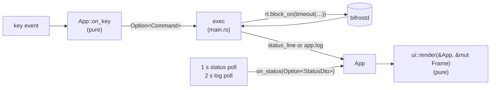

# bifrost-tui (`bifrost-tui`)

`bifrost-tui` is the terminal UI: seven views over the daemon's state, and keys that ask the daemon to mount, unmount, reconcile, discover or reload. Like the CLI it is only a client of the daemon API. It splits into a pure state machine (`App`, which turns a key into an optional `Command`), a pure renderer (`ui::render`), and a small synchronous loop in `main.rs` that polls the daemon inline once a second and runs commands. That split is what lets every key and every screen be tested without a terminal. This guide covers the architecture, the polling model and why it was chosen, the views and keys, the palette and `NO_COLOR`, the unreachable banner, terminal restore, and the tests.

## Contents

- [At a glance](#at-a-glance)
- [Source map](#source-map)
- [Architecture](#architecture)
- [The loop: inline polling (E6)](#the-loop-inline-polling-e6)
- [Commands and routes](#commands-and-routes)
- [Views](#views)
- [Keys](#keys)
- [Selection, filter and targets](#selection-filter-and-targets)
- [Popups](#popups)
- [Rendering: layout, palette, glyphs, `NO_COLOR`](#rendering-layout-palette-glyphs-no_color)
- [When the daemon is unreachable](#when-the-daemon-is-unreachable)
- [Terminal setup and panic-safe restore](#terminal-setup-and-panic-safe-restore)
- [Command-line arguments](#command-line-arguments)
- [Tests](#tests)
- [Where the code differs from the contract](#where-the-code-differs-from-the-contract)
- [Changing the TUI](#changing-the-tui)
- [Deliberate simplifications](#deliberate-simplifications)

## At a glance

| | |
|---|---|
| Path | `crates/bifrost-tui/` (package and binary `bifrost-tui`) |
| Files | `src/main.rs` (arguments, runtime, terminal, loop, command execution), `src/app.rs` (`App`, `View`, `Command`, `Popup`, text helpers), `src/ui.rs` (`render`, palette, popups) |
| Dependencies | `bifrost-core` (DTOs, `Name`, `clean`, events), `bifrost-config` (only `paths::socket_path`), `bifrost-client`, `ratatui` (with its bundled crossterm), `tokio` (`rt-multi-thread`, `time`) |
| Not a dependency | `crossterm` directly: the code uses `ratatui::crossterm` (C1). No clap: two arguments are parsed by hand |
| Tests | 16: 9 key and state tests in `app.rs`, 7 rendering tests in `ui.rs` on ratatui's `TestBackend`: `cargo test -p bifrost-tui` |
| Decisions | [tui-inline-polling](../decisions.md#tui-inline-polling), [http-over-unix-socket](../decisions.md#http-over-unix-socket), [sse-events-and-polling-clients](../decisions.md#sse-events-and-polling-clients), [busy-unmount-never-forced](../decisions.md#busy-unmount-never-forced), [validated-newtypes-at-trust-boundary](../decisions.md#validated-newtypes-at-trust-boundary) |

## Source map

| Item | File | Purpose |
|---|---|---|
| `View`, `VIEWS` | `app.rs` | the seven views, in tab order |
| `Command` | `app.rs` | `Mount(String)`, `Unmount(String, bool)`, `Reconcile`, `Discover`, `Reload`, `FetchLog(String)`, `Quit` |
| `Popup` | `app.rs` | `Help`, `Details(id)`, `ConfirmForce(id)`, `Filter(text)` |
| `App` | `app.rs` | all UI state; `new`, `rows`, `on_status`, `on_key`, `log_cmd`, `mounts_of` |
| `c`, `state_name`, `glyph`, `dur`, `hms`, `event_text` | `app.rs` | re-clean, state word, state glyph, `12m`/`3h12m`, `HH:MM:SS` UTC, one line per event |
| `fixture()` | `app.rs` (`#[cfg(test)]`) | a `StatusDto` shared by both test modules |
| `render`, `details`, `mark_color` | `ui.rs` | draw a frame from `&App` |
| `NIGHT`, `FROST`, `TEAL`, `BLUE`, `STONE`, `AMBER`, `ROSE` | `ui.rs` | the palette |
| `main`, `socket_arg`, `run`, `exec`, `call`, `each_mount`, `id` | `main.rs` | the impure shell |
| `CMD_TIMEOUT` (5 s), `POLL_TIMEOUT` (500 ms) | `main.rs` | bounds on every daemon call |

## Architecture

| Part | Does | Never does |
|---|---|---|
| `App` (`app.rs`) | holds the last `StatusDto`, the view, the selection, the filter, the popup, the status line, `unreachable`, `no_color`, the log and the socket string; turns a key into state changes and at most one `Command`; builds the rows of the current view | I/O, clocks, drawing |
| `ui::render` (`ui.rs`) | draws one frame from `&App` | mutate state, call the daemon |
| `main.rs` | owns the terminal, the tokio runtime and the `Client`; polls; runs `Command`s | decide what a key means |

`App` is pure data with a pure `on_key(KeyEvent) -> Option<Command>`, so tests drive it with plain `KeyEvent`s and inspect the result. `render` takes `&App` and a `Frame`, so tests draw into ratatui's `TestBackend` and inspect the buffer. Everything that touches the socket or the terminal is in `main.rs`, which has no tests of its own; the scripted tmux session run during the build (81/81 checks, orchestrator sign-off after S3) is not in the repository.

`App::rows()` re-cleans every daemon string (`clean(s, 512)`) as it builds the cells, and `render` cleans what it reads directly, so no raw daemon string reaches the terminal ([security.md](../security.md)).

## The loop: inline polling (E6)

`main.rs` `run`, one iteration:

1. If the status is due: `rt.block_on(async { timeout(500 ms, client.get("/v1/status")).await })`, then `app.on_status(Some(dto))` or `on_status(None)` on error, timeout or undecodable body. Next due in 1 s.
2. If the log is due and the Logs view is showing: run `app.log_cmd()` (a `FetchLog`). Next due in 2 s.
3. `term.draw(|f| ui::render(app, f))`.
4. `event::poll(100 ms)`. No event: next iteration. A key: `app.on_key(k)`:
   - `Quit`: return.
   - `FetchLog`: run it now and push the next log poll 2 s out.
   - any other command: run it, then make the status poll due at once so its effect shows immediately.

So the screen redraws about ten times a second, the status is at most about a second old, and a key is handled within 100 ms of being pressed, except while a daemon call is in flight.

**Why poll inline.** There is no poller task, no channel and no shared state between threads: the loop itself makes the call, bounded by a timeout (amendment E6; critique E.6: "the TUI poller task plus channel could be one `rt.block_on(timeout(500ms, get("/v1/status")))` per second in the UI loop"). The daemon serves the full snapshot, including the last 200 events, from a `watch` channel without asking its actor, so a status call is cheap. The accepted ceiling is an event latency of up to one second ([tui-inline-polling](../decisions.md#tui-inline-polling)).

**Why not the SSE stream.** `GET /v1/events` exists, but consuming it needs a long-lived connection, reconnects and a stream parser in the client, for no visible gain at one-second latency. It is recorded as a simplification with an upgrade path: `Client::events()` plus a `bifrost events` command (contract §15 #12; `ponytail:` comment in `run`; [sse-events-and-polling-clients](../decisions.md#sse-events-and-polling-clients)).

**Consequences.**

| Situation | Effect |
|---|---|
| a wedged daemon | each status poll blocks keys for at most 500 ms (`POLL_TIMEOUT`), so the UI stays usable; a command blocks for at most 5 s (`CMD_TIMEOUT`) and shows `timed out after 5s` |
| a machine row with N mounts | `m`/`u` post N requests one after the other; a slow daemon can add up to N × 5 s |
| a status that doesn't decode (a TUI and daemon of different versions) | treated as unreachable: banner, last snapshot kept |
| fast changes between polls | only the latest state is shown; the Events view still lists every event from the snapshot's last 200 |

**Runtime.** `main` builds a tokio multi-thread runtime with one worker thread, as contract §10 specifies; `bifrost-client` spawns each connection's task onto it ([client.md](client.md)). The contract doesn't record why multi-thread with one worker rather than a current-thread runtime. `timeout(…)` is created inside `rt.block_on(async { … })` because tokio's `timeout` registers its timer when it is constructed, which needs a runtime context (comment in `run`).

## Commands and routes

`exec` in `main.rs` runs a `Command` and turns the result, or the error, into the status line (cleaned). Every body-less POST sends `{}` (an empty `BTreeMap`), and unmount always sends `UnmountReq { force }` (C6, [client.md](client.md)).

| Command | From key | Request (timeout) | Status line on success |
|---|---|---|---|
| `Mount(t)` | `m` | `POST /v1/mounts/<id>/mount` `{}`, once per id of `mounts_of(t)` (5 s each) | `mount requested: a, b` |
| `Unmount(t, false)` | `u` | `POST /v1/mounts/<id>/unmount` `{"force":false}` per id (5 s each) | `unmount requested: …` |
| `Unmount(t, true)` | `U`, then `y` | the same with `{"force":true}` | `force unmount requested: …` |
| `Reconcile` | `r` | `POST /v1/reconcile` `{}` (5 s) | `reconcile: nothing to do`, or `reconcile: <mount> <action>, …` listing the non-`noop` actions |
| `Discover` | `s` | `POST /v1/discover` `{}` (5 s) | `discovery requested` |
| `Reload` | `c` | `POST /v1/config/reload` `{}` (5 s) | `config reloaded`, or `config reload failed: e1; e2` |
| `FetchLog(m)` | entering Logs, `j`/`k` in Logs, `l`, every 2 s in Logs | `GET /v1/mounts/<m>/log` (500 ms) | none: the result goes to `app.log` |
| `Quit` | `q`, Ctrl-C | none | |

Every id goes through `Name::parse` (`id()` in `main.rs`) before it is put into a route path, so only a valid name reaches the request line ([validated-newtypes-at-trust-boundary](../decisions.md#validated-newtypes-at-trust-boundary)). `each_mount` stops at the first error and shows it.

Unlike `bifrost mount`, the TUI does not wait for the mount to settle. The next status poll, due at once after a command, shows the new state. A log fetch error (for example the 404 `no log for mount x` before a mount has ever started) is shown inside the Logs pane rather than in the status line, so it doesn't flash every 2 s; the log fetch uses the short poll timeout, not the command one (commit fdc5e00).

## Views

Switch with `1`–`7`, Tab and Shift-Tab. Switching resets the selection to the first row.

| # | View | Content |
|---|---|---|
| 1 | Overview | the wordmark `Bifröst` and the tagline `Remote worlds. Local files.`; daemon version, pid, uptime, socket, `(warming up)`; machine and mount counts; Providers with ✓/✗ and `ok (N, 12s ago)` or `error: … (last ok …)`; Config with ✓ or ✗ and the config errors; the last 5 events, newest first |
| 2 | Machines | `MACHINE SOURCE STATE DRIVER`: glyph and id, source provider, state, the distinct drivers of its mounts |
| 3 | Mounts | `MOUNT MACHINE DRIVER STATE LOCAL REMOTE ERROR`; ERROR is `last_error`, else `detail` (B15) |
| 4 | Discovery | `PROVIDER KIND STATUS MACHINES LAST OK`, with ✓/✗ |
| 5 | Drivers | `DRIVER BINARY DETAIL`, with ✓/✗, and `(default)` on `StatusDto.auto_driver` (E5) |
| 6 | Events | `TIME (UTC) EVENT`, newest first, from `StatusDto.events` (at most 200) |
| 7 | Logs | the selected mount's log: the log file path, then its lines (the daemon sends the last 64 KiB, cleaned); `j`/`k` switch mounts |

Views 2–6 are tables. Each column except the last is as wide as its widest cell or header, capped at 48; the last column fills the rest. The selected row is highlighted and marked `› `; `HighlightSpacing::Always` keeps the columns from shifting when the selection appears.

The Logs view hard-wraps each line to the pane width itself (by characters) and then scrolls so the last line is always visible. Wrapping before scrolling keeps the scroll exact; with `Paragraph`'s own wrapping the tail would be miscounted, and before commit a5d7c4c the ends of long lines (sshfs and rclone argv, rclone notices) were clipped.

`event_text` turns each `Event` into one line, for example `discovered agent-01 via tailscale`, `mount started agent-01 (sshfs, pid 4242)`, `failed build (attempt 1, retry in 4s): connection refused`, `config reload failed: e1; e2`.

## Keys

| Key | Action | Notes |
|---|---|---|
| `↑`/`↓`, `k`/`j` | move the selection | clamped at both ends; in Logs, also fetches the newly selected mount's log |
| `1`–`7`, Tab, Shift-Tab | switch view | entering Logs fetches the selected log |
| `m` | mount the selection | a machine row means all its mounts |
| `u` | unmount the selection (and hold it) | |
| `U` | force unmount: opens a y/n confirmation | lazy detach, never kills a process |
| `r` | reconcile now | |
| `s` | discover now | |
| `c` | reload the config | |
| `d`, Enter | details popup for the selection | Machines and Mounts views |
| `l` | jump to the Logs view on the selection | a machine jumps to its first mount |
| `/` | type a filter | starts from the current filter |
| Esc | clear the filter | |
| `?` | help popup | |
| `q`, Ctrl-C | quit | Ctrl-C works everywhere, even while typing a filter |

Rules in `on_key`, in order:
1. Only key presses count. Release and repeat events, which some terminals report, are ignored, so one keystroke is one action.
2. Ctrl-C quits, before any popup handling. In raw mode the terminal doesn't turn Ctrl-C into SIGINT; it arrives as a key.
3. An open popup takes the key (see [Popups](#popups)).
4. Otherwise the table above applies. `m`, `u`, `U`, `d`/Enter and `l` need a selected row in the Machines or Mounts view; anywhere else they set the hint `select a machine (view 2) or a mount (view 3) first`.

The bottom line shows the common keys. `U` appears only in the help popup (orchestrator sign-off after S3), so the destructive-sounding key isn't advertised next to `u`.

## Selection, filter and targets

**Selection follows the id.** `on_status` remembers the id of the selected row, swaps in the new snapshot, and puts the selection back on that id, or clamps it if the id is gone. Rows appearing or disappearing above the cursor never make a key act on a row the user didn't pick (test `selection_follows_id_across_snapshots`; commit fdc5e00).

**Filter.** A case-sensitive substring match over each row's cells joined with spaces (glyph included). Enter applies it, Esc while typing or in normal mode clears it, and either resets the selection. While typing, every character goes into the filter, so `q` or `m` never trigger a command (test `filter_narrows_rows`). The status line shows `/text▏` while typing and `filter: text (Esc clears)` while active.

**Targets.** `target()` is the selected row's id in the Machines or Mounts view. `mounts_of(t)` turns it into mount ids:
- Machines view, machine with mounts: all of its mount ids;
- otherwise: `t` itself.

The TUI expands a machine to its mounts itself because the daemon resolves an id that is both a mount id and a machine id to the mount alone (B15). A static machine `build` with mounts `build` and `build-artifacts` would otherwise only reach `build` (commit fdc5e00; test `machine_row_means_all_its_mounts`). The CLI sends the id as typed, so `bifrost mount build` affects only the mount `build` in that case ([cli.md](cli.md)).

## Popups

| Popup | Opens with | Shows | Closes / answers |
|---|---|---|---|
| `Help` | `?` | every key with its meaning | Esc, Enter, `q`, `d`, `?`; other keys are swallowed |
| `Details(id)` | `d`, Enter | Machines view: name, verdict, state, source, address:port and online, shadowed sources, tags, metadata; then per mount: mount id, state with driver and pid, local, remote, planned action, error (`last_error`, else `detail`, B15), next retry, failures and the flags held/adopted/not desired. Mounts view: the same per-mount block plus the owning machine's verdict | as Help. In the Machines view a machine that vanished shows `gone` |
| `ConfirmForce(id)` | `U` | `Force unmount <id>?` and "A lazy detach: no process is killed." | `y` sends `Unmount(id, true)`; any other key cancels |
| `Filter(text)` | `/` | nothing extra: the text shows in the status line | Enter applies, Esc clears |

Popups are drawn centred over the main area (Help 72 wide, Confirm 50, Details 90, height to fit) after clearing it; the main border turns Stone while a popup is open. Force is always confirmed because a lazy detach leaves the driver serving open files until they close ([busy-unmount-never-forced](../decisions.md#busy-unmount-never-forced), [no-pid-signalling-lazy-detach](../decisions.md#no-pid-signalling-lazy-detach)).

## Rendering: layout, palette, glyphs, `NO_COLOR`

**Layout** (top to bottom): the tab bar (1 line), the unreachable banner (1 line, or 0 when reachable), the main area, the status line (1), the key hints (1). Before the first successful poll the main area reads `connecting to bifrostd at <socket> …`.

**Palette** (`Color::Rgb`, from the brand; contract §10):

| Constant | Colour | Used for |
|---|---|---|
| `NIGHT` | Nordic Night `#0B1220` | background; text on the selected row and on the banner |
| `FROST` | Frost Glass `#E5F0FF` | primary text |
| `TEAL` | Aurora Teal `#2DD4BF` | active tab, selected row background, ● mounted, ✓, the wordmark |
| `BLUE` | Glacial Blue `#60A5FA` | focused border, headers, ◌ connecting/unmounting, key hints, the filter text |
| `STONE` | Stone `#94A3B8` | secondary text, timestamps, tagline, inactive tabs, ○ states, the border behind a popup |
| `AMBER` | `#FBBF24` | ◐ degraded |
| `ROSE` | `#F87171` | ✕ failed, ✗, config errors, the unreachable banner background |

Amber and rose are additions: the brand has no warning or error colour.

**Glyphs** (`glyph`, cell 0 of the Machines, Mounts and Logs rows; ✓/✗ for Discovery and Drivers):

| State | Glyph | Colour |
|---|---|---|
| mounted | ● | Teal |
| connecting, unmounting | ◌ | Blue |
| degraded | ◐ | Amber |
| failed | ✕ | Rose |
| unknown, discovered, eligible, offline | ○ | Stone |

**`NO_COLOR`.** When `NO_COLOR` is set to a non-empty value (the no-color.org convention), `App.no_color` is true and every style in `render` goes through one closure, `st`, which then returns the empty style. No colour, background or modifier survives anywhere, popups and banner included (test `no_color_disables_styles` checks every cell of all 7 views × 5 popup states). Meaning never depends on colour alone: the glyphs, the ✓/✗ marks, the `[2 Machines]` brackets on the active tab and the `› ` selection marker all remain.

## When the daemon is unreachable

A failed status poll (connection error, 500 ms timeout, or an undecodable body) calls `on_status(None)`: `unreachable` becomes true and the last snapshot stays. `render` then shows a one-line banner, `bifrostd not reachable at <socket> — retrying`, Nordic Night on Rose, above the unchanged main area (tests `unreachable_banner`, `unreachable_keeps_last_snapshot`). The TUI keeps polling every second and clears the banner on the first good poll. It never exits because the daemon went away, so the last known state stays readable while the daemon restarts (contract §10).

Commands sent while the daemon is down fail at once and show `bifrostd is not running (socket …)` in the status line; against a wedged daemon they give up after 5 s.

## Terminal setup and panic-safe restore

| Step | Code | Why |
|---|---|---|
| init | `ratatui::try_init()` | enters raw mode and the alternate screen, and installs a panic hook that restores the terminal before the previous hook prints the panic. `try_init` instead of `init` so a failure is an error message, not a panic (sign-off after S3) |
| init fails | `ratatui::try_restore()`, then `fail(e)` (exit 1) | `try_init` can fail after raw mode is on; `std::process::exit` runs no panic hook and no destructors, so the restore must be explicit (commit fdc5e00) |
| normal exit | `run` returns, `ratatui::restore()`, then `fail(e)` if `run` returned an I/O error | restore always happens before any message is printed |
| panic | the hook restores, then the panic message prints on a sane terminal | the release profile keeps unwinding (no `panic = "abort"`), and the hook runs either way |

## Command-line arguments

Parsed by hand in `socket_arg` (the crate has no clap dependency, contract §1):

| Argument | Effect |
|---|---|
| `--socket PATH`, `--socket=PATH` | the daemon socket; an empty value means the default |
| `-h`, `--help` | print usage, exit 0 |
| anything else, or `--socket` without a value | print the error and usage to stderr, exit 2 |

The default is `paths::socket_path()`: `$BIFROST_SOCKET`, else `$XDG_RUNTIME_DIR/bifrost/bifrost.sock`, else `~/.cache/bifrost/bifrost.sock`; macOS `~/Library/Caches/bifrost/bifrost.sock` ([config.md](config.md#paths-default-locations)). The TUI never reads the config file; everything it shows comes from the daemon.

## Tests

`app.rs` (pure `on_key` and `on_status` calls on `App` loaded with `fixture()`):

| Test | Pins |
|---|---|
| `key_m_emits_mount_for_selection` | `m`/`u` on the selection in Machines and Mounts; clamping; the hint outside those views |
| `shift_u_asks_confirmation` | `U` opens `ConfirmForce`; `n` cancels; `y` emits `Unmount(id, true)` |
| `filter_narrows_rows` | typing never runs a command; Backspace, Enter, Esc; the selection is the filtered row |
| `tab_cycles_views` | Tab order, Shift-Tab, digit keys |
| `simple_keys` | `r`, `s`, `c`, `q`, Ctrl-C; a popup swallows keys; Esc closes it |
| `details_and_logs_follow_selection` | Enter opens details for the selection; `l` jumps to the first mount's log; `k` in Logs fetches another mount |
| `machine_row_means_all_its_mounts` | `mounts_of` expands in Machines, not in Mounts |
| `selection_follows_id_across_snapshots` | a row inserted above keeps the selection on the same id |
| `unreachable_keeps_last_snapshot` | `on_status(None)` sets `unreachable` and keeps the rows |

`ui.rs` (`Terminal::new(TestBackend::new(100, 30))`, then assertions on buffer symbols and `fg`/`bg`):

| Test | Pins |
|---|---|
| `renders_machines_with_glyphs_and_teal` | a Machines row's text; ● in Teal; Frost on Night text; the selected row Night on Teal; the active tab in Teal |
| `unreachable_banner` | the banner text on Rose; the last snapshot still drawn |
| `no_color_disables_styles` | no styled cell in any view × popup with `no_color`; glyphs remain |
| `events_timestamps_are_stone` | Events timestamps in Stone |
| `mount_details_show_verdict` | the Mounts details popup shows the machine's verdict |
| `logs_wrap_long_lines_and_follow_tail` | a 150-char line keeps its end; the last line stays in view |
| `overview_shows_wordmark_and_tagline` | wordmark in Teal, tagline in Stone, counts, provider health, an event |

## Where the code differs from the contract

| Contract §10 says | Code does | Why |
|---|---|---|
| `App` fields: status, view, selected, filter, popup, status_line, unreachable, no_color, log | also `socket` (cleaned) | the banner and the connecting line name it |
| `ratatui::init()` | `ratatui::try_init()` with an explicit restore on failure | sign-off after S3; commit fdc5e00 |
| `m`: "a machine means all its mounts" | expanded to mount ids in the TUI, one POST per mount | the daemon's B15 resolution would reach only a same-named mount |
| commands use `rt.block_on(timeout(…))`; "the routes return at once" | commands use `CMD_TIMEOUT` = 5 s, a value §10 leaves open. `reconcile` and `config reload` do not return at once (they wait on actor work), and the 5 s bound covers them | the key loop must never block for long on a wedged daemon. The log fetch uses the 500 ms `POLL_TIMEOUT`, as §10's "the same way" already implies; commit fdc5e00 fixed an earlier 5 s log timeout |
| key hints | `U` only in the help popup | sign-off after S3 |
| details popup: "observations" | the selected observation's fields plus the list of shadowed sources | `MachineDto` carries only the selected observation |
| Overview: provider health | still prints `none (static machines only)` when `providers` is empty | since review r3 the daemon's snapshot always puts a `static` row first (`crates/bifrost-daemon/src/actor.rs`), so that line no longer appears against a current daemon |

## Changing the TUI

- **A new key.** Add it to `App::on_key` (returning a `Command` if it needs the daemon), to `HELP` in `ui.rs`, and to the hints bar if it is common. Add an `on_key` test.
- **A new command.** Add a `Command` variant, handle it in `exec` with `call(rt, CMD_TIMEOUT, …)` and a status line, and pass every id through `id()`.
- **A new view.** Add it to `View`, `VIEWS` and `TITLES`, and update the `% 7` and `'1'..='7'` arithmetic in `on_key`. Give it rows in `App::rows` (clean every daemon string there) and headers in `render`. The `no_color_disables_styles` test lists views explicitly: add it there.
- **A new colour or style.** Route it through `st`/`fg` in `render`, or `NO_COLOR` breaks.
- **A new field shown from the daemon.** It arrives through `StatusDto`; change the DTO in core and the daemon's snapshot first ([core.md](core.md), [daemon.md](daemon.md)).

## Deliberate simplifications

The `ponytail:` comments in this crate ([ponytail-style](../decisions.md#ponytail-style), [simplifications.md](../simplifications.md)):

| Where | Simplification | Ceiling | Upgrade |
|---|---|---|---|
| `run` in `main.rs` (§15 #12, E6) | no SSE consumer; status polled inline every 1 s | event latency up to 1 s | `Client::events()` plus a `bifrost events` command |
| palette constants in `ui.rs` (§15 #24) | truecolor only | Terminal.app renders the RGB colours approximately | map to 256-colour indices when `COLORTERM` isn't truecolor |
| the Logs wrap in `render` | wraps by characters, not display width | a line of wide glyphs may still clip | split by display width if it shows up |
