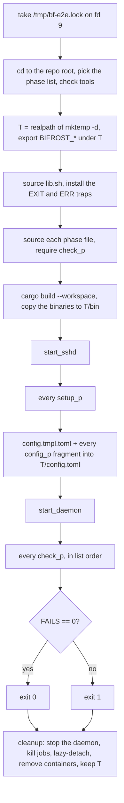

# E2E harness

This guide covers `tests/e2e/` in depth: how `run.sh` builds a throwaway world (an OpenSSH container, CoreDNS, an
HTTP inventory, one isolated `bifrostd`), how phase files plug into it, what every phase proves, and how to add a
phase or debug a failing one. It is the last line of defence for behaviour that unit tests can't reach: real FUSE
mounts, signals, adoption across restarts, hot reload by file edit, DNS over UDP and TCP. Why the harness is bash plus
Docker is recorded in [decisions.md#e2e-docker-harness](decisions.md#e2e-docker-harness); the other test layers are
in [testing.md](testing.md).

## Contents

- [Quick start](#quick-start)
- [Modes and exit codes](#modes)
- [What run.sh does](#flow)
- [The lock](#lock)
- [The scratch directory](#scratch)
- [Binaries snapshot](#snapshot)
- [Cleanup, and why scratch is never deleted](#cleanup)
- [Fixtures](#fixtures)
- [config.tmpl.toml](#template)
- [lib.sh helpers](#helpers)
- [The phase-file convention](#convention)
- [Phases](#phases)
- [How phases share one daemon](#sharing)
- [Adding a phase](#adding)
- [Debugging a failing phase](#debugging)
- [Limits](#limits)

<a id="quick-start"></a>
## Quick start

```bash
unset TMPDIR                                            # the socket path must fit in 103 bytes
export CARGO_TARGET_DIR=/path/to/target                 # optional; lib.sh falls back to ./target
tests/e2e/run.sh m1                                     # milestone 1: p04 p05 p06 psec p13a
tests/e2e/run.sh all                                    # + p07 p08 p09 p10 p12 p13
tests/e2e/run.sh p08_dns p10_http p13_hardening         # only these phase files, in this order
E2E_TAILSCALE=1 tests/e2e/run.sh p07_tailscale          # opt-in: discovery against your live tailnet
```

Requirements (checked by `run.sh`, exit 2 if one is missing): `docker jq curl pgrep fusermount3 sshfs ssh-keygen
ssh-keyscan`, plus `python3` (p10) and `dig` (p08) for anything but `m1`. p09 and p12 also need `rclone` on the host
(not checked up front; the phases fail without it). The host must have `/dev/fuse`. Linux only.

The harness never touches `~/.ssh` or `~/machines`: every key, known_hosts, config, state, socket and mount lives in a
fresh `mktemp -d` directory, and `start_daemon` refuses to start unless all of them are under it.

<a id="modes"></a>
## Modes and exit codes

| Argument | Phases |
|---|---|
| none or `m1` | `p04_sshfs p05_api p06_recovery psec_hostkey p13a_adopt` |
| `all` | the m1 list, then `p07_tailscale p08_dns p09_rclone p10_http p12_reload p13_hardening` |
| `p<digits>_* …` or `psec_* …` | exactly the phase files named, in that order |

The lists are written out in `run.sh`, not globbed (C7): collation could sort `p13_hardening` before or after
`p13a_adopt` depending on the locale, and the order matters (below). `run.sh` also sets `LC_ALL=C`.

| Exit | Meaning |
|---|---|
| 0 | every check passed (`all checks passed (<phases>)`) |
| 2 | usage error, a missing tool, or the lock is held by another run |
| other non-zero | failed checks (`N check(s) failed`), a listed phase file missing, or a phase with no `check_<p>` (all exit 1); or an abort outside `ok` under `set -e`: the ERR trap prints `FAIL: aborted at <file>:<line>: <command>` and the run exits with the failing command's status (often 1, e.g. `start_daemon`'s `wait_until`; 101 for a failed `cargo build`) |

The usage, tool and lock exits happen before the traps are installed. After that, any non-zero exit makes the cleanup
print the last 60 lines of the daemon log.

<a id="flow"></a>
## What run.sh does



The environment every phase sees (exported by `run.sh`):

| Variable | Value | Used by |
|---|---|---|
| `T`, `E2E` | the scratch dir | phases (`$T`); the config template (`$E2E`, expanded by bifrost-config) |
| `BIFROST_SOCKET` | `$T/bf.sock` | daemon and CLI |
| `BIFROST_STATE_DIR` | `$T/state` | daemon |
| `BIFROST_CONFIG` | `$T/config.toml` | daemon and CLI |
| `BIFROST_LOG` | `debug` | daemon (only `bifrost*` targets; see [decisions.md#log-filter-allowlist](decisions.md#log-filter-allowlist)) |
| `BF_TOKEN` | `s3cret` | p10's inventory server and the provider's `Authorization` header (`${BF_TOKEN}` in the fragment) |
| `BIFROST_E2E_SSH` | `127.0.0.1:2222:bf:$T/ssh_config` | exported by `start_sshd` for the ignored mount tests |
| `PATH` | `$T/bin:…` | the snapshot binaries come first |

<a id="lock"></a>
## The lock

```bash
exec 9>/tmp/bf-e2e.lock
flock -n 9 || { echo "another e2e run is active (or its leftovers hold /tmp/bf-e2e.lock)" >&2; exit 2; }
```

- **Why a host-wide lock:** the fixtures use fixed names and ports (`bf-e2e-sshd` on `127.0.0.1:2222` and
  `127.0.0.2:2222`, `bf-e2e-dns` on `127.0.0.1:5353`, the inventory on `127.0.0.1:18080`). Two runs would replace each
  other's containers. During the build, several agents ran on one machine at once (S2 sign-off 4).
- **Why it is taken before the EXIT trap:** a refused second run must exit without running `cleanup`, which would
  `docker rm -f` the active run's containers.
- **Why `9>&-`:** a child inherits fd 9 and with it the lock. `start_daemon` starts `bifrostd` with `9>&-`, and
  `p10_serve` does the same for `inventory.py`, so the daemon, its sshfs/rclone children and the inventory server
  never inherit it. Short-lived helpers do (p05's `timeout 8 curl` SSE reader, its `timeout 10 bifrostd` second
  instance), but only for seconds. Close fd 9 on anything long-lived. A leftover of a SIGKILLed run that still held fd 9 would block every later run.
- **Never delete the lock file.** Deleting it doesn't release a held lock; the next run would lock a new inode while
  the old holder still runs. Wait and retry, or find the holder with `fuser -v /tmp/bf-e2e.lock`.

<a id="scratch"></a>
## The scratch directory

`T=$(realpath "$(mktemp -d)")`. The `realpath` matters: the daemon canonicalizes `mount.root`, and the phases compare
mount paths as text (`$T/machines/<id>` against `/proc/self/mountinfo`).

| Path | Written by | Contents |
|---|---|---|
| `$T/bin/` | run.sh | `bifrost`, `bifrostd`, `bifrost-tui` copied after the build |
| `$T/id`, `$T/id.pub` | `start_sshd` | the scratch ed25519 key (no passphrase) |
| `$T/known_hosts` | `start_sshd` | `ssh-keyscan -p 2222 127.0.0.1 127.0.0.2` |
| `$T/ssh_config` | `start_sshd` | strict host-key checking (below) |
| `$T/config.toml` | run.sh | the template plus every `config_<p>` fragment |
| `$T/state/` | bifrostd | `state.json`, `bifrostd.lock`, `logs/<id>.log` (each mount's sshfs/rclone output), `rclone/<id>/` caches |
| `$T/bf.sock` | bifrostd | the API socket |
| `$T/machines/<id>` | bifrostd | the mount points |
| `$T/d.log` | `start_daemon` | the daemon's stderr, appended across restarts |
| `$T/dns/` | p08 (p13 rewrites `db`) | `Corefile`, `db` |
| `$T/inv.json`, `$T/inv.log` | p10 | the inventory and the server's output |
| `$T/sse.txt`, `$T/second.log` | p05 | the SSE capture; the second daemon's output |
| `$T/p12.*` | p12 | config copies (`orig`, `good`, `rc`, `away`) |

**TMPDIR must be unset** (S2 sign-off 4). `mktemp -d` honours `TMPDIR`, and `$T/bf.sock` must fit in the 103 bytes of
`sun_path`; `bind_socket` refuses a longer path and the daemon exits 1 ("socket path is N bytes, over the 103-byte
limit").

<a id="snapshot"></a>
## Binaries snapshot

After `cargo build --workspace`, `run.sh` copies the three binaries from `$BF_BIN` (default
`${CARGO_TARGET_DIR:-$PWD/target}/debug`) into `$T/bin` and puts that first on `PATH`. The build agents shared one
`CARGO_TARGET_DIR` across worktrees ([decisions.md#shared-target-dir-and-worktrees](decisions.md#shared-target-dir-and-worktrees));
without the snapshot, a `cargo build` in another worktree could replace `target/debug/bifrostd` in the middle of a
run, and p13a's restart would start a different binary.

<a id="cleanup"></a>
## Cleanup, and why scratch is never deleted

`cleanup` runs on every exit (EXIT trap), with `set +e`:

1. `stop_daemon`: SIGTERM, wait up to 20 s, then SIGKILL. The daemon leaves mounts in place on SIGTERM
   ([decisions.md#no-pid-signalling-lazy-detach](decisions.md#no-pid-signalling-lazy-detach)).
2. `kill $(jobs -p)`: the shell's background jobs (the SSE `curl`, `inventory.py`). sshfs and rclone children are never
   signalled.
3. Every mount point under `$T/machines/`, read from `/proc/self/mountinfo` and sorted in reverse (nested first), is
   detached with `fusermount3 -uz`. It never runs `stat` or `readdir` on them: a dead FUSE mount could hang the
   cleanup.
4. `docker rm -f` every container whose name starts with `bf-e2e-`.
5. On failure, the last 60 lines of `$T/d.log`.
6. `scratch kept: $T`. The directory is never `rm -rf`'d: a mount that failed to detach would make `rm -rf` recurse
   into the remote machine's files.

The scratch directories accumulate in `/tmp`, one per run. Delete them yourself once
`grep " $T/" /proc/self/mountinfo` shows nothing. A p07 scratch directory holds real tailnet names in `d.log` and
`state.json`: delete it, and never paste from it into commits, issues or fixtures (S3 sign-off 3).

<a id="fixtures"></a>
## Fixtures

### sshd: `tests/e2e/sshd/Dockerfile`

| Property | Why |
|---|---|
| `alpine:3.20` with `openssh-server` and `openssh-sftp-server` | small, and sftp is what sshfs and rclone use |
| `ssh-keygen -A` at **build** time | host keys live in the image, so `docker stop`/`docker start` (p06) keeps the same keys and the scratch `known_hosts` stays valid |
| user `bf` with the password locked (`echo 'bf:*' \| chpasswd -e`) | key auth only; the daemon runs with `BatchMode=yes` and could not answer a prompt anyway |
| `/home/bf/hello.txt` (`hello`) and `/home/bf/data/w.txt` (`w`) | the files the phases look for through the mounts |
| `CMD` writes `$PUBKEY` to `authorized_keys` (0600) and runs `sshd -D -e` | the run's scratch key is the only authorized key; logs go to `docker logs` |

`start_sshd` builds the image (`docker build -q -t bifrost-e2e-sshd`, cached after the first run), creates the key,
replaces any old `bf-e2e-sshd` container and publishes port 22 on **two** loopback addresses, `127.0.0.1:2222` and
`127.0.0.2:2222`. The second address lets p13 move a machine to a new IP whose host key is still known.

The generated `$T/ssh_config`:

```text
Host *
  IdentityFile $T/id
  IdentitiesOnly yes
  UserKnownHostsFile $T/known_hosts
  GlobalKnownHostsFile /dev/null
  StrictHostKeyChecking yes
  CheckHostIP no
```

`known_hosts` has entries for `[127.0.0.1]:2222` and `[127.0.0.2]:2222` only. With `GlobalKnownHostsFile /dev/null`
the system file can't vouch for anything, and with `CheckHostIP no` ssh doesn't match `localhost` through its
address. So a machine with `host = "localhost"` reaches the same server but fails with "Host key verification
failed": that is the host-key negative in psec and p09. Bifröst itself never sets a host-key option
([decisions.md#host-keys-never-weakened](decisions.md#host-keys-never-weakened)); the strictness here comes from the
user-side `ssh_config`, which the template passes as `mount.ssh_config` (`-F` for ssh, sshfs and rclone's
`--sftp-ssh`).

### CoreDNS: `tests/e2e/dns/`

`setup_p08` copies `Corefile` into `$T/dns` (0755 directory, 0644 files: the `coredns/coredns:1.11.3` image runs as
a non-root user and reads the bind mount through the "other" bits), renders the zone and starts `bf-e2e-dns` on
`127.0.0.1:5353` for UDP and TCP.

```text
test.bifrost:53 {
    log
    file /zones/db {
        reload 1s
    }
}
```

- `log` records every query with its transport; p08 greps it to prove the daemon retried the root over TCP.
- `reload 1s` re-reads the zone when its SOA serial increases. Every rewrite (`p08_zone`, `p13_zone`) writes
  `db.tmp`, sets 0644 and renames it over `db`, so CoreDNS never reads half a file; `p13_serial` waits until the new
  serial is served.

`zone.tmpl` has three placeholders that `p08_zone SERIAL TAGS` fills with `sed`: `@SERIAL@`, `@TAGS@` (`" tags=dev"`
or `""`) and `@T@` (the scratch dir, for the canary path). The records:

| Record | Form | Role |
|---|---|---|
| `_bifrost` `"v=bf1 nodes=other-01,evil"` | index | lists the two index nodes |
| `_bifrost` `"v=bf1 node=agent-dns host=127.0.0.1 port=2222 user=bf@TAGS@ path=/home/bf/data"` | inline | the machine that mounts (with `tags=dev`) |
| `_bifrost` `"v=bf1 node=bad-node host=-oProxyCommand=touch${IFS}@T@/pwned"` | inline, hostile | an ssh option as the host; must be skipped, and the canary `$T/pwned` must never exist |
| `_bifrost.other-01` `"v=bf1 host=127.0.0.1 port=2222 tags=misc"` | per-node | allowed by nothing, denied by the global `tags=["misc"]` |
| `_bifrost.evil` `"v=bf1 host=127.0.0.1 id=../../etc"` | per-node, hostile | a path-traversal native id; the whole node is skipped |
| 20 × `_bifrost` `"v=bf1 node=bulk-NN host=192.0.2.N port=22 user=bulk tags=bulk path=/srv/bulk"` | inline, appended by `p08_zone` | push the root answer past a 1232-byte UDP reply, so it is only complete over TCP |

Hostile data sits on both paths, inline (bad-node) and index (evil) (v0.1.1 sign-off 14). The bulk nodes use
TEST-NET-1 addresses and are discover-only, so nothing ever connects to them.

Port 5353 is also the mDNS port. On a desktop where avahi (or, on macOS, mDNSResponder) holds `0.0.0.0:5353`, the
container fails with "address already in use". The user docs moved their try-it example to 10053 for that reason
(commit 25af2e2); the harness still uses 5353, hard-coded in `setup_p08`, `config_p08`, `p08_udp`, `p08_tcp_bulk`,
`p13_serial` and the ignored `coredns_discovery` test.

### HTTP inventory: `tests/e2e/inventory.py`

`inventory.py HOST:PORT FILE` serves FILE as JSON for any `GET` path, re-reading it on every request, and answers
401 unless `Authorization: Bearer $BF_TOKEN`. Request logging is off (one request per `discovery_interval`). p10 flips
the token on the **server** side by restarting it with `BF_TOKEN=wrong`, so the daemon's configured header becomes the
wrong one without a config change.

<a id="template"></a>
## config.tmpl.toml

```toml
[mount]
root = "$E2E/machines"
ssh_config = "$E2E/ssh_config"

[daemon]
discovery_interval = "3s"
health_interval = "2s"
reconcile_interval = "5s"
mount_timeout = "15s"

[reconciliation]
offline_grace_period = "20s"
retry_initial = "1s"
retry_max = "4s"
```

`$E2E` is expanded by bifrost-config's `$VAR` expansion. The short timings are what the phase budgets are built on:

| Value | What depends on it |
|---|---|
| `health_interval = "2s"` | kill -9 recovery within 20 s: the mount stays behind as ENOTCONN, and only a health probe finds it Stale (S1 sign-off 4) |
| `discovery_interval = "3s"` | removal hysteresis is 3 × 3 s = 9 s: p10 sleeps 10 s to prove a failing provider's view is frozen, and p13's rename timing |
| `offline_grace_period = "20s"` | p06's "offline and detached within 45 s" |
| `retry_initial`/`retry_max` = 1 s / 4 s | quick remounts after p06's sshd restarts |
| `mount_timeout = "15s"` | a spawn that isn't in the mount table within 15 s is killed (`mount_with`'s readiness deadline; the default is 30 s), shorter than the 20–45 s state waits of the phases. No reason is recorded for the value |

The template holds no `[[machines]]` (static1 is p04's, B4) and no `[policy.*]` tables (only p08 may add them, B5).

<a id="helpers"></a>
## lib.sh helpers

`lib.sh` is sourced by `run.sh` and by anyone driving the ignored tests by hand. It needs `$T`.

| Helper | Does |
|---|---|
| `bifrost …` | a shell function wrapping the binary in `timeout 75` (mount/unmount poll for up to 60 s), so a wedged daemon gives a FAIL, not a hung run. Prefix assignments and exit codes pass through |
| `wait_until SECS CMD…` | runs CMD every 0.5 s until it succeeds; returns 1 with `timeout: CMD` after SECS |
| `ok DESC CMD…` | runs CMD **in a subshell** (`$(…)`), prints `PASS: DESC` or `FAIL: DESC` plus CMD's last 5 output lines, counts failures and carries on |
| `not CMD…` | inverts CMD |
| `mstate ID`, `state_is ID STATE` | the mount's `state` from `bifrost --json mounts` |
| `mpid ID` | the mount's child pid: the only way a test picks a process to kill (A13) |
| `mjq ID FILTER` | a jq filter over the mount's `MountDto` is true (`mjq static1 .held`) |
| `events SEQ FILTER CMP` | the number of ring events with `seq > SEQ` whose `.event` matches FILTER satisfies CMP (`'> 0'`, `'== 0'`); the ring is the running instance's last 200 |
| `last_seq` | the highest event seq, to scope a later `events` check |
| `is_mounted PATH` | exact match on the mount-point field of `/proc/self/mountinfo` |
| `mnt_src PATH` | `<fstype> <source>` of that mount (`fuse.sshfs bifrost:static1@<fp>`) |
| `gone PATH` | not a mount point and the directory is removed |
| `sig SIG PID` | `kill -SIG PID` only for a plain positive pid, so an empty `mpid` never becomes a bare `kill` |
| `on_fuse CMD…` | CMD under `timeout -s KILL 5`, so a hung FUSE path can't hang the run |
| `start_daemon` | refuses unless config, state and socket are under `$T` and the config exists (a missing config would run the default root `~/machines`); starts `bifrostd >>$T/d.log 2>&1 9>&-`, sets `DPID`, waits up to 10 s for `bifrost daemon status` |
| `stop_daemon` | SIGTERM, up to 20 s, then SIGKILL; reaps and clears `DPID` |
| `start_sshd`, `stop_sshd` | the fixture above; `stop_sshd` removes the container |

Two shell traps shape how phases are written:

- `ok` runs its command in a subshell, so the command can't change the phase's state. p13a kills the daemon inside
  `ok` but does `wait "$DPID"; DPID=` outside it. Reads are unaffected: the subshell inherits every variable, and
  bash's dynamic scoping makes a caller's `local` visible to the functions it calls. (p09's comment says
  `P09_FILE`/`P09_DATA` are globals so the `p09_*` helpers can read them; `local` would work too, so that is style.)
- A background process must be a job of the main shell, or `cleanup`'s `kill $(jobs -p)` won't see it. Start it
  outside `ok`, with `9>&-` (see `p10_serve`).

Under `pipefail`, `grep -q` as the reader of a pipe exits at the first match, and the writer can die of SIGPIPE,
failing the pipeline. `p10_warned` uses `awk` on the file instead, and `p08_tcp_log` uses `grep` without `-q` on
`docker logs`.

<a id="convention"></a>
## The phase-file convention

A phase file `tests/e2e/<stem>.sh` only defines functions. `<p>` is the stem before its first `_`
(`p04_sshfs.sh` → `p04`, `p13a_adopt.sh` → `p13a`, `psec_hostkey.sh` → `psec`).

| Function | Required | When it runs | What it does |
|---|---|---|---|
| `setup_<p>` | no | after the sshd is up, before the config is written | fixtures: containers, servers, files under `$T` |
| `config_<p>` | no | while the config is assembled | prints a TOML fragment, appended to `config.tmpl.toml` after a blank line |
| `check_<p>` | yes | after the daemon is up, in list order | assertions through `ok` |

All `setup_*` run before all `config_*`, and all `check_*` run against **one** daemon started from the combined
config. A listed file that doesn't exist is fatal (S4a sign-off 5; the contract's original "skip it" rule was for the
build stages when p12 and p13 didn't exist yet).

<a id="phases"></a>
## Phases

### m1

| Phase | Fragment | Proves |
|---|---|---|
| `p04_sshfs` | `static1` in the shorthand shape (`name/host/port/user/remote`, B4) | mounted within 20 s; `hello.txt` visible; mountinfo is `fuse.sshfs` with source `bifrost:static1@…`; `bifrost unmount` removes it from mountinfo and removes the directory; a `reconcile` leaves it unmounted and `held`; `bifrost mount` brings it back |
| `p05_api` | none | `status`, `machines`, `mounts`, `drivers` exit 0 and their `--json` parses; the socket is mode 600; a second `bifrostd` exits non-zero with "already running"; `BIFROST_SOCKET=$T/nope bifrost status` exits 3; an SSE capture (`curl --unix-socket … /v1/events`) during an unmount/mount of static1 has an `event: UnmountStarted` frame whose data is the static1 record |
| `p06_recovery` | none | `kill -TERM` of static1's pid → remounted with a new pid within 20 s; `kill -KILL` → remounted, `ls` works (no ENOTCONN), and a `MountDegraded` with reason `stale…` shows the Stale path; the second `bifrost --json reconcile` plans `noop` for static1 (A11); `docker stop` → degraded within 30 s with the daemon alive; `docker start` → mounted within 40 s; stop again → offline and detached within 45 s (grace 20 s); start → mounted |
| `psec_hostkey` | `unknown-key` with `host = "localhost"` | failed; `last_error` contains "Host key verification failed"; never in mountinfo; never a `MountStarted` |
| `p13a_adopt` | none | `kill -9 bifrostd` leaves static1 working; after a restart it is `adopted`, mounted, with the **same pid**, no `MountStarted` for static1 and an unchanged sshfs process count (B6); then the same after a SIGTERM restart |

### all (after m1)

| Phase | Needs | Proves |
|---|---|---|
| `p07_tailscale` | `E2E_TAILSCALE=1`, a logged-in `tailscale`; otherwise prints `skip: p07` and adds no fragment | a `tailscale` provider with **no filter**: at least one machine with source tailscale, every one `discovered`, **zero** mounts, and the ids equal the distinct first `DNSName` labels from `tailscale status --json` (sharee nodes excluded). Never runs `tailscale up/down/set`; FAIL lines print counts only |
| `p08_dns` | `dig`, the CoreDNS container | agent-dns mounted within 40 s with verdict `allowed (dns.filter.include)` and the `path=/home/bf/data` hint in effect (`w.txt`); other-01 `denied (policy.deny tags=misc)` and not mounted; bad-node and evil absent, with `bf1 node skipped` warnings in `d.log`; the canary never created; all 20 bulk nodes discover-only; the daemon's root query reached CoreDNS over TCP; a UDP-only `dig +bufsize=1232` sees `tc`; `dig +tcp` sees all 20. Then removing `tags=dev` and bumping the serial unmounts agent-dns within 30 s and makes it discover-only |
| `p09_rclone` | `rclone` | `static2-rc` (`driver = "rclone"`) mounted within 40 s; `bifrost drivers` shows `✓ sshfs` and `✓ rclone`; mountinfo `fuse.rclone` with source `bifrost:static2-rc@…`; a write through the mount reads back and reaches the sshd within 20 s (VFS write-back); kill -9 → Stale → a new pid, the file still readable. The rclone host-key negative `unknown-key-rc` fails with "Host key verification failed" and never mounts (A12) |
| `p10_http` | `python3`, `inventory.py` on `127.0.0.1:18080` | inv-01 mounted within 40 s with its fields and `honor_hints` user/path from the inventory; the provider row shows exactly 1 machine; `inv-bad` (ssh option as its only address), `inv-host` (ssh option as `host` next to a valid address, A20) and `../x` are skipped with the expected warnings; with the token flipped the provider shows `HTTP 401` and, after 10 s (past the 9 s hysteresis), inv-01 is still listed and mounted; restoring the token recovers the provider; the token never appears in `d.log` |
| `p12_reload` | `rclone` | appending `box2` mounts it within 10 s with `ConfigurationReloaded{ok:true}`; broken TOML reports `config_errors`, emits `ok:false` and touches no mount (same pids, no `UnmountStarted`); restoring clears it; a SIGHUP applies an `auto_order = ["rclone", "sshfs"]` edit within 1.5 s, remounts nothing (`auto` is sticky) and a new `box3` mounts with rclone; restoring the original unmounts box2 and box3 and remounts nothing else; SIGHUP on a missing config reports "cannot read" within 2 s and touches no mount |
| `p13_hardening` | p08 and p10 earlier in the same run | IP change: agent-dns moved to `127.0.0.2` is remounted with a new fingerprint within 30 s; duplicate: inv-01 also published in DNS with another host stays **one** machine from the inventory (trust http < dns), with `dns` shadowed, same pid, same remote; rename: agent-dns → agent-dns2, the old one is still mounted when the new one is first listed (removal hysteresis), then unmounted and removed within 25 s, and agent-dns2 mounts |

History: the M1 gate passed 63/63 (359db31); S3's `all` 116/116 before p12 and p13 existed; S4a's `all` 164/164 twice
in a row (b46b8d8).

<a id="sharing"></a>
## How phases share one daemon

Every fragment is in the config from the start and every check runs against the same daemon, so phases affect each
other. The known couplings:

| Coupling | Consequence in the code |
|---|---|
| psec's `unknown-key` fails for good | p06's "second reconcile is noop" filters to static1 (A11) |
| p06 stops and restarts the sshd under **every** mount, and p13a restarts the daemon | p09 and p12 wait up to 40 s for their first mount |
| p08 and p10 leave their providers running | p13 builds on them and guards with `declare -F check_p08 check_p10`; alone it fails with "needs p08_dns and p10_http earlier in the run" |
| p12 edits `$BIFROST_CONFIG` | it saves `$T/p12.orig` and restores it before returning, so p13 sees the machines it expects |
| p13 rewrites the zone | it is last in `all`, so the zone is not restored |
| the fragments are concatenated into one TOML file | only one fragment may define `[policy.*]` (p08, B5): a second `[policy.deny]` is a duplicate table and the whole config fails to parse. For the same reason p12 inserts `auto_order` into the template's `[mount]` table with `sed` instead of adding a `[mount]` table |
| the event ring is per daemon instance (200 events) | p13a's `events -1 … == 0` means "never since this restart"; `last_seq` scopes checks inside a phase |

<a id="adding"></a>
## Adding a phase

1. Pick a stem whose `<p>` (before the first `_`) is unique: `p14_<what>.sh`.
2. Write the functions: `check_p14` (required), and `setup_p14` / `config_p14` if needed. Use `$T` for every file
   and `$E2E` inside TOML; machines go under the template's root automatically.
3. Assert only through `ok`, and bound every wait: `wait_until SECS …` for state, `on_fuse` for any access to a mount
   path, the `bifrost` wrapper for the CLI.
4. Kill processes only by `$(mpid <id>)` through `sig`; never `pkill -f`.
5. Start any server or other long-lived process as a background job of the main shell, outside `ok`, with `9>&-`; name any container `bf-e2e-*`
   so `cleanup` removes it.
6. Don't add `[policy.*]`, `[mount]`, `[daemon]` or `[reconciliation]` tables; if the phase needs a policy rule,
   discuss extending p08's. If the phase edits the config, restore it before `check_p14` returns.
7. Add the file to the `all` list in `run.sh` (or `m1` if it must gate milestone 1). Place it with the couplings above
   in mind; `all` currently ends with p13, which leaves the zone rewritten.
8. Run it alone first (`tests/e2e/run.sh p14_<what>`), then `tests/e2e/run.sh all` twice in a row, as the S4 gate did.
9. Update the phase lists in `README.md` ("Development") and `site/src/content/docs/contributing.mdx`, and this guide.

<a id="debugging"></a>
## Debugging a failing phase

1. **Read the FAIL line.** Each `FAIL: <desc>` is followed by up to 5 lines of the command's output (indented with
   `  | `); a `wait_until` timeout prints `timeout: <command>`. An `aborted at` line means a command outside `ok`
   failed.
2. **Read the daemon log.** Its last 60 lines are printed on failure; the whole of it is `$T/d.log` (the path is on
   the `scratch kept:` line). `BIFROST_LOG=debug` is on.
3. **Read the child log.** `$T/state/logs/<id>.log` holds the sshfs or rclone output for the mount, starting with the
   exact argv line.
4. **Re-run only that phase** (plus what it needs): `tests/e2e/run.sh p09_rclone`, or `p08_dns p10_http p13_hardening`.
   A phase that passes alone but fails in `all` usually hits one of the couplings above.
5. **Poke at a live run.** Put a temporary `echo "T=$T"; sleep 600` in the body of `check_<p>` at the failing point
   (not inside a helper run through `ok`, which captures output and prints it only on failure), then in another
   terminal:

   ```bash
   T=/tmp/tmp.XXXXXXXXXX                                       # the path the phase printed
   export BIFROST_SOCKET=$T/bf.sock BIFROST_CONFIG=$T/config.toml
   $T/bin/bifrost status; $T/bin/bifrost --json mounts | jq .
   curl -sN --unix-socket "$BIFROST_SOCKET" http://bifrost/v1/events      # live events
   ssh -F "$T/ssh_config" -p 2222 bf@127.0.0.1 ls                          # the fixture's view
   docker logs bf-e2e-sshd; docker logs bf-e2e-dns
   ```

   Take the `sleep` out again before committing.

| Symptom | Cause | Fix |
|---|---|---|
| `another e2e run is active` (exit 2) | a run holds the lock, or a leftover process inherited fd 9 | wait; `fuser -v /tmp/bf-e2e.lock` shows the holder |
| daemon never answers; `d.log` says the socket path is over 103 bytes | `TMPDIR` is set | `unset TMPDIR` |
| `docker run` fails with "address already in use" | something holds 2222 (`start_sshd`) or 5353 (`setup_p08`); on 5353 usually avahi | stop it, or free the port for the run |
| p10 fails, with "Address already in use" in `$T/inv.log`, or its checks fail against unexpected responses | something holds 18080: `inventory.py` runs on the host (no Docker), dies, and `p10_serve`'s `curl` probe may succeed against the other server | free the port |
| `missing tool: …` (exit 2) | a required tool isn't installed | install it; `all` also needs `python3` and `dig` |
| p09/p12 fail at the first mount | `rclone` missing or without `--sftp-ssh` | `bifrost drivers` shows why |
| every first-mount check times out | no `/dev/fuse` or `fusermount3`: the drivers probe unavailable | `$T/bin/bifrost doctor`, or the `drivers` line of `bifrost status` |
| p13 fails at once | run without p08 and p10 before it | include them |
| `skip: p07` | `E2E_TAILSCALE` isn't 1 | expected; p07 is opt-in |

<a id="limits"></a>
## Limits

- Linux only (FUSE, `/proc/self/mountinfo`, `stat -c`, Docker). macOS has never been run end to end (contract §15
  #25).
- CI doesn't run it ([release-and-ci.md](release-and-ci.md#ci)): it needs Docker, FUSE, sshfs and rclone on the
  runner. Run it locally before merging behaviour changes.
- One run per host at a time, and fixed ports.
- Scratch directories accumulate and must be removed by hand.
- p07 depends on the state of your real tailnet and is opt-in.
